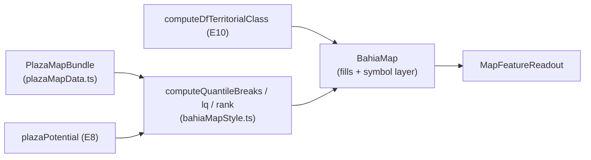

# B13 — Escala relativa no Mapa das Praças (quantis/LQ/rank + símbolo proporcional)

Status: rascunho
Atualizado em: 2026-07-21
Item do roadmap: [docs/roadmap.md](../roadmap.md) (seção "Inteligência de campanha", B13; plano-mestre [inteligencia-campanha.md](inteligencia-campanha.md))
Impeccable: B — estende `PlazaMapPanel`/`BahiaMap` existentes (seletor de escala, camada de símbolos); sem rota nova
Appetite: ~2 dias eng; sem migration
Responsável: —

## Design (Impeccable)

Âncoras: `PRODUCT.md` (princípio 5; anti-goal cartograma) / `DESIGN.md` (register `product`) · precedentes B10/B11/B12/B6 (`BahiaMap`, `bahiaMapStyle.ts`, `MapFeatureReadout`).

Na implementação: craft compacto → critique → polish.

- **Persona / contexto:** coordenador em reunião projetando o mapa; "o mapa serve ao padrão espacial" (relatório D3).
- **Job principal:** o mapa discrimina onde antes tudo era a mesma cor — leitura relativa ao próprio candidato, com o peso do eleitorado visível.
- **Estratégia de cor:** sequencial de 5 classes (quantis) na paleta existente do tema; diverging continua exclusivo do compare (R4); bolhas com stroke branco (padrão choropleth da skill Mapbox).
- **Edit where you see:** não (superfície de leitura).
- **Anti-goals:** cartograma/geometria distorcida (anti-goal 4); rampa contínua 0–100% como única leitura; legenda com >7 classes; segundo componente de mapa.

## Contexto

B11 entregou a escala "% dos válidos" com domínio fixo 0–100% — tecnicamente honesta e informacionalmente vazia para DF (topo estadual 4,71%; relatório D2). A cartografia manda: classes discretas (3–7), **quantis para leitura e comparação em série** (Brewer & Pickle), transformações relativas ao próprio candidato (quantis/LQ/rank), e peso visual por eleitorado ("land doesn't vote": interior gigante × Salvador com ~1/5 do eleitorado). A persona recomendou símbolo proporcional (bolha = votos em jogo, cor = classe) como o formato que "funciona em campo", descartando cartograma e tratando value-by-alpha como teste, não default (D3). `BahiaMap` já tem: layer estável + `setStyle` incremental (B6), `scaleMax` (B11), `fitToKeys`/`interactiveKeys` (B12), readout (B10).

## Objetivos

- Seletor de escala ganha modos relativos: **Quantis (5)** — default novo para métrica de candidato; **LQ** (diverging em torno de 1); **Rank na praça** (1º / 2º–3º / 4º+); mantém **Total (votos)** e **% dos válidos** (B11).
- Camada opcional de **símbolos proporcionais** (bolha por votos em jogo — válidos projetados E8; cor da bolha = classe E10) sobre o coropleto neutro; toggle no painel.
- Legenda por classes com rótulos de faixa reais (quantis do conjunto filtrado atual, coerente com B7/B12).
- Readout (`MapFeatureReadout`) mostra o valor bruto + a leitura relativa ("Q5 de 5 · LQ 2,8").
- Compare mode (R4) continua absoluto/diverging — modos relativos desabilitados no compare (mesma regra do B11 com %).
- Zonas SSA/CMS: agregação municipal atual permanece (B8 F2 é outro item); bolha usa o agregado municipal com `zoneBreakdown` no readout.

## Decisões travadas

- **Quantis do conjunto filtrado como default relativo** (discriminam por construção; recomendação clássica para séries). **Rejeitado:** Jenks como default (menos estável entre filtros/anos — quebra a comparabilidade; pode entrar depois como opção); domínio dinâmico min–max contínuo (melhora pouco e perde classes nomeáveis).
- **Símbolo proporcional em vez de cartograma/value-by-alpha como peso de eleitorado.** Operador navega pela geografia real; bolha codifica volume+status em 2 canais legíveis (relatório D3). **Rejeitado:** cartograma (anti-goal travado); value-by-alpha como default (canal sutil para decisão rápida — pode virar teste A/B futuro).
- **Nenhum componente de mapa novo** — tudo entra por `BahiaMap`/`bahiaMapStyle.ts` (B6 manteve o layer estável exatamente para isso). **Rejeitado:** fork do painel para "mapa estratégico" separado.
- **i18n e naming:** `scaleMode` estendido (`absolute | percentValid | quantile | lq | rank`), `symbolLayer`, `computeQuantileBreaks`; labels pt-BR ("Quantis", "Padrão próprio (LQ)", "Posição na praça", "Bolhas por votos em jogo").

## Questões em aberto

- **Bolha dimensiona por válidos projetados ou por votos em jogo da meta (E8)?** Opções: válidos projetados | meta | eleitorado. **Recomendação:** válidos projetados (estável, independe de meta editada; a meta já aparece na fila E9).
- **Quantis calculados sobre o conjunto filtrado ou o estado inteiro?** **Recomendação:** conjunto filtrado (coerente com B7/B12 — o mapa acompanha a lista); nota na legenda quando filtrado.

## Abordagem proposta

Componentes:

- **`src/lib/bahiaMapStyle.ts`**: breaks de quantis/LQ/rank puros (unit-testáveis); paleta de 5 classes do tema.
- **`src/components/campaign/BahiaMap.tsx`**: camada `L.circleMarker` por praça (raio ∝ √votos, padrão cartográfico), regida pelo mesmo `pathByKeyRef`/restyle incremental de B6; hover/tap integram o readout existente.
- **`src/components/campaign/PlazaMapPanel.tsx`**: seletor de escala estendido + toggle de bolhas; regras de compare inalteradas.
- **`src/utilities/plazaMapData.ts`**: expõe métricas relativas no bundle (LQ, rank, classe) — deriva de E8/E10 sem query nova.
- **Sem migration.**

## Dependências

- Duras: **E8** (válidos projetados/LQ), **E10** (classe para a cor da bolha). Suaves: E14 (bolha pode encodar nível no futuro), B8 F2 (polígonos de zona — independente).
- Reusa: B6/B10/B11/B12 inteiros; `plazasByIbgeCode`; `canonicalMapKeysKey`.

## Não escopo

- Rollup/mapa por TI (E12); polígonos das Praças-zona (B8 F2); export/print do mapa; value-by-alpha (adiado abaixo).

## Rabbit holes

- **Perf com 417 bolhas + hover.** B6 resolveu para fills; markers precisam do mesmo tratamento incremental — se o frame cair, bolhas só a partir de zoom N ou top-K por votos. Não otimizar antes de medir.
- **Legenda de quantis com faixas confusas quando o filtro retorna <10 praças.** Degradar para 3 classes ou valores diretos; não inventar interpolação.
- **Rank exigir todos os candidatos por praça em memória.** `plazaCandidateComparison.ts` já pagina/limita; rank v1 = posição do Solla entre os top-N carregados, documentado.

## Adiado com gatilho

- **Value-by-alpha (opacidade ∝ eleitorado).** Gatilho: teste com o time em reunião real pedir alternativa às bolhas.
- **Roll-off como métrica de mapa.** Gatilho: I-A entrar no motor (E11 fase 2) e o time pedir a leitura espacial.

## Referências

- `docs/roadmap.md` (Inteligência de campanha, B13) · [plano-mestre](inteligencia-campanha.md)
- `docs/research/relatorio-entrevista-persona-campanha.md` D2/D3 (escalas, símbolo proporcional, "não vá" do cartograma) · compêndio §8.2
- `docs/plans/escala-percentual-mapa-pracas.md` (B11), `docs/plans/escala-dry-pos-b3.md` (B6), `docs/plans/aproximar-mapa-pracas.md` (B12), `docs/plans/hover-mapa-pracas.md` (B10)
- `src/components/campaign/BahiaMap.tsx`, `src/components/campaign/PlazaMapPanel.tsx`, `src/lib/bahiaMapStyle.ts`, `src/utilities/plazaMapData.ts`
- AGENTS.md — mapa (B6/B11/B12 as-built), naming
