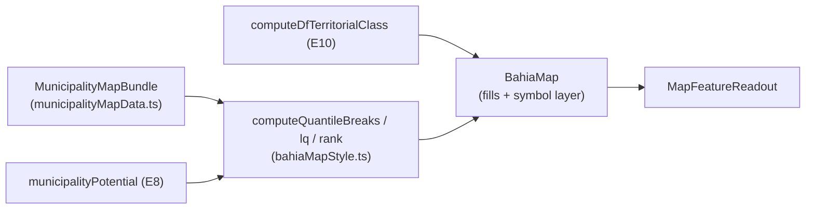

# B13 — Escala relativa no mapa dos Municípios (quantis/LQ/rank + símbolo proporcional)

Status: entregue (2026-07-26)
Atualizado em: 2026-07-26 (as-built da entrega; auditoria do plano aplicada)
Item do roadmap: [docs/roadmap.md](../roadmap.md) (seção "Inteligência de campanha", B13; plano-mestre [inteligencia-campanha.md](inteligencia-campanha.md))
Impeccable: B — estende `MunicipalityMapPanel`/`BahiaMap` existentes (seletor de escala, camada de símbolos); sem rota nova
Appetite: ~2 dias eng; sem migration
Responsável: —

## Revisão na entrega (2026-07-26)

Três correções do plano original, encontradas ao auditá-lo contra o repositório antes de codar:

1. **Caminhos e nomes defasados.** `BahiaMap.tsx`/`MunicipalityMapPanel.tsx` moraram em `src/components/campaign/` até o Pass 2 W2 e hoje estão em `src/components/campaign/map/`; o classificador do E10 chama-se `computeMunicipalityTerritorialClass`, não `computeDfTerritorialClass`. Os diagramas e a lista de componentes abaixo ficaram como estavam para preservar o registro do que foi planejado — leia-os com esta errata.
2. **"O mapa acompanha a lista" deixou de ser verdade.** Desde a remodelagem dos Municípios o mapa só existe no Início (`/campanha`) e recebe apenas `compare`; `/campanha/municipios` é lista/overview. A questão em aberto "quantis sobre o conjunto filtrado ou o estado inteiro" foi resolvida como **escopo de acesso do usuário** (435 municípios para coordenador/candidato, a carteira para o assessor), que é o análogo do "conjunto filtrado" na única superfície que o mapa tem.
3. **LQ como classes, não diverging.** Os Objetivos pediam "LQ diverging em torno de 1" e as Decisões travadas, três linhas abaixo, reservavam diverging exclusivamente ao compare. Resolvido a favor das decisões travadas: LQ virou **5 classes nomeadas** cortadas nas âncoras que o E10 já usa (`TERRITORIAL_CLASS_ANCHORS.weakLq` 0,5 / `strongLq` 2 mais a banda `AT_STANDARD_LQ` 0,95–1,15), na rampa sequencial do tema. Vermelho × azul continua significando "Solla × adversário" e só aparece no compare.

Uma decisão cara que o plano não previa: **"Posição no município" não existia em lugar nenhum** — nem no artefato, nem em query reaproveitável (`municipalityCandidateComparison.ts` é por município × candidatos escolhidos). Construí-la em request significaria varrer ~100 mil linhas por ano para um dado que nunca muda, então o ranking foi para o **artefato TSE commitado** (regra 3 da escada de cache), como o E8 fez na v2. O rabbit hole "rank v1 = posição entre os top-N carregados, documentado" desapareceu junto: o rank do artefato é sobre **todos** os candidatos com votos na geografia.

## Design (Impeccable)

Âncoras: `PRODUCT.md` (princípio 5; anti-goal cartograma) / `DESIGN.md` (register `product`) · precedentes B10/B11/B12/B6 (`BahiaMap`, `bahiaMapStyle.ts`, `MapFeatureReadout`).

Na implementação: craft compacto → critique → polish.

- **Persona / contexto:** coordenador em reunião projetando o mapa; "o mapa serve ao padrão espacial" (relatório D3).
- **Job principal:** o mapa discrimina onde antes tudo era a mesma cor — leitura relativa ao próprio candidato, com o peso do eleitorado visível.
- **Estratégia de cor:** sequencial de 5 classes (quantis) na paleta existente do tema; diverging continua exclusivo do compare (R4); bolhas com stroke branco (padrão choropleth da skill Mapbox).
- **Edit where you see:** não (superfície de leitura).
- **Anti-goals:** cartograma/geometria distorcida (anti-goal 4); rampa contínua 0–100% como única leitura; legenda com >7 classes; segundo componente de mapa.

## Contexto

B11 entregou a escala "% dos válidos" com domínio fixo 0–100% — tecnicamente honesta e informacionalmente vazia para DF (topo estadual 4,71%; relatório D2). A cartografia manda: classes discretas (3–7), **quantis para leitura e comparação em série** (Brewer & Pickle), transformações relativas ao próprio candidato (quantis/LQ/rank), e peso visual por eleitorado ("land doesn't vote": interior gigante × Salvador com ~1/5 do eleitorado). A persona recomendou símbolo proporcional (bolha = votos em jogo, cor = classe) como o formato que "funciona em campo", descartando cartograma e tratando value-by-alpha como teste, não default (D3). `BahiaMap` já tem: layer estável + `setStyle` incremental (B6), `scaleMax` (B11), `fitToKeys`/`interactiveKeys` (B12), readout (B10).

## Objetivos

- Seletor de escala ganha modos relativos: **Quantis (5)** — default novo para métrica de candidato; **LQ** (diverging em torno de 1); **Rank no município** (1º / 2º–3º / 4º+); mantém **Total (votos)** e **% dos válidos** (B11).
- Camada opcional de **símbolos proporcionais** (bolha por votos em jogo — válidos projetados E8; cor da bolha = classe E10) sobre o coropleto neutro; toggle no painel.
- Legenda por classes com rótulos de faixa reais (quantis do conjunto filtrado atual, coerente com B7/B12).
- Readout (`MapFeatureReadout`) mostra o valor bruto + a leitura relativa ("Q5 de 5 · LQ 2,8").
- Compare mode (R4) continua absoluto/diverging — modos relativos desabilitados no compare (mesma regra do B11 com %).
- Zonas SSA/CMS: agregação municipal atual permanece (B8 F2 é outro item); bolha usa o agregado municipal com `zoneBreakdown` no readout.

## Decisões travadas

- **Quantis do conjunto filtrado como default relativo** (discriminam por construção; recomendação clássica para séries). **Rejeitado:** Jenks como default (menos estável entre filtros/anos — quebra a comparabilidade; pode entrar depois como opção); domínio dinâmico min–max contínuo (melhora pouco e perde classes nomeáveis).
- **Símbolo proporcional em vez de cartograma/value-by-alpha como peso de eleitorado.** Operador navega pela geografia real; bolha codifica volume+status em 2 canais legíveis (relatório D3). **Rejeitado:** cartograma (anti-goal travado); value-by-alpha como default (canal sutil para decisão rápida — pode virar teste A/B futuro).
- **Nenhum componente de mapa novo** — tudo entra por `BahiaMap`/`bahiaMapStyle.ts` (B6 manteve o layer estável exatamente para isso). **Rejeitado:** fork do painel para "mapa estratégico" separado.
- **i18n e naming:** `scaleMode` estendido (`absolute | percentValid | quantile | lq | rank`), `symbolLayer`, `computeQuantileBreaks`; labels pt-BR ("Quantis", "Padrão próprio (LQ)", "Posição no município", "Bolhas por votos em jogo").

## Questões em aberto

- **Bolha dimensiona por válidos projetados ou por votos em jogo da meta (E8)?** Opções: válidos projetados | meta | eleitorado. **Recomendação:** válidos projetados (estável, independe de meta editada; a meta já aparece na fila E9).
- **Quantis calculados sobre o conjunto filtrado ou o estado inteiro?** **Recomendação:** conjunto filtrado (coerente com B7/B12 — o mapa acompanha a lista); nota na legenda quando filtrado.

## Abordagem proposta

Componentes:

- **`src/lib/bahiaMapStyle.ts`**: breaks de quantis/LQ/rank puros (unit-testáveis); paleta de 5 classes do tema.
- **`src/components/campaign/BahiaMap.tsx`**: camada `L.circleMarker` por município (raio ∝ √votos, padrão cartográfico), regida pelo mesmo `pathByKeyRef`/restyle incremental de B6; hover/tap integram o readout existente.
- **`src/components/campaign/MunicipalityMapPanel.tsx`**: seletor de escala estendido + toggle de bolhas; regras de compare inalteradas.
- **`src/utilities/municipalityMapData.ts`**: expõe métricas relativas no bundle (LQ, rank, classe) — deriva de E8/E10 sem query nova. Desde o hardening 2026-07-23, o TIPO do bundle vive em `municipalityMapContract.ts` (módulo client-safe; `municipalityMapData.ts` é o loader server-only que o re-exporta) — estender o bundle = editar os dois; anos históricos vêm do artefato `bahiaElectionAggregates.ts`.
- **Sem migration.**

## Dependências

- Duras: **E8** (válidos projetados/LQ), **E10** (classe para a cor da bolha). Suaves: E14 (bolha pode encodar nível no futuro), B8 F2 (polígonos de zona — independente).
- Reusa: B6/B10/B11/B12 inteiros; `municipalitiesByIbgeCode`; `canonicalMapKeysKey`.

## Não escopo

- Rollup/mapa por TI (E12); polígonos das Municípios-zona (B8 F2); export/print do mapa; value-by-alpha (adiado abaixo).

## Rabbit holes

- **Perf com 417 bolhas + hover.** B6 resolveu para fills; markers precisam do mesmo tratamento incremental — se o frame cair, bolhas só a partir de zoom N ou top-K por votos. Não otimizar antes de medir.
- **Legenda de quantis com faixas confusas quando o filtro retorna <10 municípios.** Degradar para 3 classes ou valores diretos; não inventar interpolação.
- **Rank exigir todos os candidatos por município em memória.** `municipalityCandidateComparison.ts` já pagina/limita; rank v1 = posição do Solla entre os top-N carregados, documentado.

## Adiado com gatilho

- **Value-by-alpha (opacidade ∝ eleitorado).** Gatilho: teste com o time em reunião real pedir alternativa às bolhas.
- **Roll-off como métrica de mapa.** Gatilho: I-A entrar no motor (E11 fase 2) e o time pedir a leitura espacial.

## As-built (2026-07-26)

**Artefato v3.** `pnpm build:election-aggregates` passou a emitir `federalRankByIbgeCode: Record<codarea, Record<year, { rank, candidates }>>` — a colocação do candidato entre **todos** os candidatos a deputado federal com votos > 0 naquela geografia, em 2014/2018/2022. Chaveado por `ibgeCode` (417 códigos) e não por slug porque é o que o mapa desenha: as 19 zonas de Salvador somam a cidade inteira. Geografia sem votos dele não recebe entrada (nunca `rank: 0`). O insumo é `loadFederalVotesByCityZoneAndCandidate` em `municipalityElectoralBaseline.ts` — irmão de `loadCampoFederalVotesByCityZone`, mesma varredura estadual, CLI/build-time only. O arquivo foi de 534 KB para 623 KB, dentro do orçamento de 700 KB que o E8 já tinha fixado.

**Escalas.** A matemática pura vive em `src/lib/mapScaleClasses.ts` (arquivo novo — `bahiaMapStyle.ts` já carregava estilo de path e teria virado duas responsabilidades): quantis sobre os valores > 0 do escopo renderizado, **degradando para 3 classes com menos de 10 municípios** e devolvendo a contagem efetiva para a legenda não mentir; faixas de LQ nas âncoras do E10; buckets de rank (1º · 2º–3º · 4º+). `resolvePathStyle` ganhou um caminho de fill discreto por chave (`fillByKey`) que **substitui** a rampa contínua quando presente — chave ausente é "sem dado", que não é a mesma coisa que valor zero.

As âncoras saíram de `municipalityTerritorialClass.ts` para `src/lib/territorialClassAnchors.ts` porque o painel do mapa é client component: importar o classificador lá arrastaria o artefato TSE inteiro para o bundle do navegador. Só números, sem dados nem lógica; classificador e copy leem do mesmo lugar, então recalibrar (E15) continua sendo um diff de uma linha em um arquivo.

**Bundle.** `computeAggregateTerritorialClass(slugs)` classifica um grupo de slugs como um território só — soma os insumos e roda o **mesmo** `classifyMunicipalityTerritory`, nunca a média das classes por slug (LQ é razão, e a média de razões não é a razão das somas). O E12 herda o helper para o rollup por TI. O loader do mapa preenche `statewideShareByYear`, `territorialClassByCode`, `competitiveRankByYear` e `projectedValidVotesByCode`, todos puros sobre o artefato: **nenhuma query nova em request**. Rank fica indisponível em 2026 (dado TSE), mesmo precedente do compare; LQ em 2026 reusa o padrão estadual de 2022, como `percentValid` já fazia.

**UI.** Default passou a ser **quantis**. A legenda discreta (`MapScaleLegend`) mostra um swatch por classe com a faixa real, do mais fraco para o mais forte, e a nota abaixo dela é ligada ao seletor por `aria-describedby` — inclusive a nota que declara a degradação ("cerca de um quinto dos N municípios com votos no seu escopo"). O readout nunca mostra a classe sozinha: soletra o porquê em texto real ("4ª de 5 faixas", "1,8× o padrão estadual do candidato", "12º entre 663 candidatos votados aqui"). Duas entradas novas em `/campanha/conceitos` (Quantis e Posição no município) e um "Saiba mais" inline na nota da legenda; LQ já estava coberto por `dominancia-relativa`.

**Bolhas.** `L.circleMarker` no centro dos bounds de cada feature, raio ∝ √(válidos projetados) — a **área** carrega o valor. Fill pela classe do E10, `interactive: false` (a bolha fica em cima do próprio município, então deixar o ponteiro atravessar mantém um alvo de hover e um readout, não dois empilhados), desenhadas da menor para a maior para que os prêmios grandes não fiquem cobertos. Toggle desligado por default, com legenda de tamanho + cor que só aparece com a camada. Medido antes de otimizar, como o plano mandava: 417 marcadores não derrubaram o frame, então o corte para top-K **não** foi feito.

**Sem migration, sem collection, sem server action.** O bundle client de `/campanha` ficou byte a byte igual (9,46 kB / 265 kB) — o painel do mapa já carrega em chunk próprio.

## Referências

- `docs/roadmap.md` (Inteligência de campanha, B13) · [plano-mestre](inteligencia-campanha.md)
- `docs/research/relatorio-entrevista-persona-campanha.md` D2/D3 (escalas, símbolo proporcional, "não vá" do cartograma) · compêndio §8.2
- `docs/plans/escala-percentual-mapa-pracas.md` (B11), `docs/plans/escala-dry-pos-b3.md` (B6), `docs/plans/aproximar-mapa-pracas.md` (B12), `docs/plans/hover-mapa-pracas.md` (B10)
- `src/components/campaign/BahiaMap.tsx`, `src/components/campaign/MunicipalityMapPanel.tsx`, `src/lib/bahiaMapStyle.ts`, `src/utilities/municipalityMapData.ts`
- AGENTS.md — mapa (B6/B11/B12 as-built), naming
