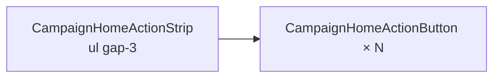

# Apertar mais o espaçamento da strip de ações do Início

Status: rascunho
Atualizado em: 2026-07-30
Item do roadmap: [docs/roadmap.md](../roadmap.md) (Trilha B — **B74**; chassis UX-1 / pós-B72)
Impeccable: B — uma linha de layout em `CampaignHomeActionStrip`
Appetite: ~0,25d eng; token Tailwind; sem migration
Responsável: —

## Design (Impeccable)

Âncoras: `PRODUCT.md` / `DESIGN.md` · tema `campaign`.

Na implementação: craft compacto → critique → polish (6 ícones staff no iPhone estreito + pan B67 ✓; labels de duas linhas em `w-[4.75rem]`).

Brief compacto:

- **Persona:** assessor/CG na faixa horizontal do Início.
- **Job principal:** caber mais ações por viewport sem colisão de rótulo.
- **Estratégia de cor:** inalterada.
- **Edit where you see:** não.
- **Anti-goals:** encolher o círculo abaixo de 44 px; mexer no pan (B67); reabrir labels do B58.

## Dados → decisão → apresentação

Dados: N/A — atalhos, sem métricas.

## Contexto

**B72 ✓** baixou `gap-6` → `gap-4` em `CampaignHomeActionStrip` (`<ul className="… gap-4 …">`). Feedback de produto (2026-07-30): ainda **grande demais** — a strip continua esparça no mobile.

B72 havia listado `gap-3` como opção A e escolhido `gap-4` por cautela com labels de duas linhas; o campo agora pede o próximo degrau.

## Objetivos

- Reduzir o `gap` horizontal da lista (recomendação: `gap-4` → **`gap-3`**; critique pode ir a `gap-2` se ainda parecer largo e os rótulos não colidirem).
- Manter: `snap-x`, pan touch + drag fine (B67), scrollbar oculta, `w-[4.75rem]` / círculo 48 px (B58).
- Sem migration, collection, server action ou mudança de catálogo.

## Decisões travadas

- **Só `gap`, não largura do botão.** **Rejeitado:** `w` menor ou círculo &lt;44 px (SC 2.5.5 / B72).
- **Um valor único em coarse e fine.** **Rejeitado:** `gap-2 md:gap-4` (inconsistência sem evidência).
- **Item novo (B74), não reabrir B72 entregue.** O as-built de B72 fica histórico; este é o ajuste fino pedido após uso. **Rejeitado:** editar só o plano B72 sem ID (some do grafo UX-1).

## Questões em aberto

- **`gap-3` ou `gap-2`?** **Opções:** A `gap-3` (12 px) | B `gap-2` (8 px). **Recomendação:** **A** no craft; critique sobe para B se o viewport de 6 ações staff ainda exigir pan excessivo e o truncamento de label continuar legível. _(assumido — validar no craft)_

## Abordagem proposta

Componentes:

- **`src/components/campaign/dashboard/CampaignHomeActionStrip.tsx`**: `gap-4` → `gap-3` (ou `gap-2` pós-critique).
- **Migration:** Sem migration.

## Dependências

- Dura: **B72 ✓** (ponto de partida). Soft: B67 ✓ (pan continua após o aperto).

## Não escopo

- Chrome do wizard mobile → **B75**. Remoção da bottom nav → **B73**. Rótulos/animação → B58 ✓.

## Rabbit holes

- **Comprimir o botão “porque o gap sozinho não basta”.** Mitigação: só gap neste item; se ainda faltar viewport, novo pedido de produto (não misturar).

## Adiado com gatilho

Nenhum neste item.

## Referências

- `src/components/campaign/dashboard/CampaignHomeActionStrip.tsx`
- [espacamento-strip-acoes-inicio.md](espacamento-strip-acoes-inicio.md) (B72 ✓)
- [restaurar-pan-strip-acoes-inicio.md](restaurar-pan-strip-acoes-inicio.md) (B67 ✓)

Qualidade de decisão: 5/5
