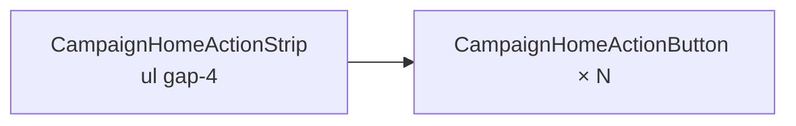

# Reduzir espaçamento horizontal da strip de ações do Início

Status: entregue (2026-07-29)
Atualizado em: 2026-07-29 — as-built: `gap-6` → `gap-4` no `<ul>` de `CampaignHomeActionStrip`; botões/círculos/pan B67 inalterados.
Item do roadmap: [docs/roadmap.md](../roadmap.md) (Trilha B — **B72**; chassis UX-1 / pós-B58)
Impeccable: B — uma linha de layout em `CampaignHomeActionStrip`
Appetite: ~0,25 dia eng (token Tailwind; sem migration, action ou URL)
Responsável: —

## Design (Impeccable)

Âncoras: `PRODUCT.md` / `DESIGN.md` · tema `campaign`.

Na implementação: craft compacto → critique → polish (checar 6 ícones staff no iPhone estreito + pan B67 ✓).

Brief compacto:

- **Persona:** assessor/CG escolhendo ação rápida na faixa horizontal.
- **Job principal:** ver mais ações por viewport sem perder alvo de toque.
- **Estratégia de cor:** inalterada (B58 ✓).
- **Anti-goals:** comprimir até labels de duas linhas colidirem; remover `snap-x` ou pan.

## Dados → decisão → apresentação

Dados: N/A — superfície de atalhos, sem métricas.

## Contexto

**B45 ✓** + **B58 ✓** + **B67 ✓** montaram `CampaignHomeActionStrip` com `gap-6` entre itens do `<ul>` (`src/components/campaign/dashboard/CampaignHomeActionStrip.tsx`, linha ~141). Feedback 2026-07-29: distância horizontal entre botões de ação **grande demais** no mobile — a strip parece esparça e exige mais pan para ver as seis ações staff.

## Objetivos

- Reduzir `gap` horizontal da lista (recomendação inicial: `gap-6` → `gap-3` ou `gap-4`; validar no critique que rótulos de duas linhas em `w-[4.75rem]` não colidem).
- Manter: `snap-x`, `[touch-action:pan-x]`, scrollbar oculta, drag fine-pointer (B67), escala no círculo (B58).
- Atualizar e2e `campaignHomeActions.e2e.spec.ts` só se assertar distância/posição (improvável).
- Sem migration, collection, server action ou mudança de catálogo `campaignHomeActions.ts`.

## Decisões travadas

- **Só `gap`, não largura do botão.** `CampaignHomeActionButton` mantém `w-[4.75rem]` e círculo 48px. **Rejeitado:** encolher círculo abaixo de 44px (SC 2.5.5).
- **Mesmo gap em coarse e fine.** **Rejeitado:** `gap-3` só no mobile — inconsistência visual desktop/mobile sem ganho claro.

## Questões em aberto

- **Valor final do gap?** **Opções:** A `gap-3` (12px) | B `gap-4` (16px). **Recomendação:** **B** — metade do atual sem apertar demais labels de duas linhas; critique pode ajustar para A se ainda parecer largo.

## Abordagem proposta

Componentes:

- **`CampaignHomeActionStrip.tsx`**: alterar classe `gap-6` → `gap-4` (ou valor escolhido no critique).
- **Migration:** Sem migration.

## Dependências

- Soft: **B44 ✓**, **B58 ✓**, **B67 ✓** (strip estável). Nenhuma dura.

## Não escopo

- Novos rótulos, animação, thumb-zone (**B65**), resultados de busca (**B71**).

## Rabbit holes

- **Responsivo `gap-3 md:gap-6`.** Mitigação: um valor único salvo pedido explícito pós-critique.

## Adiado com gatilho

Nenhum neste item.

## Referências

- `src/components/campaign/dashboard/CampaignHomeActionStrip.tsx`
- `src/components/campaign/dashboard/CampaignHomeActionButton.tsx`
- `docs/plans/polimento-strip-acoes-inicio.md` (B58)
- `docs/plans/restaurar-pan-strip-acoes-inicio.md` (B67)
- `tests/e2e/campaignHomeActions.e2e.spec.ts`

Qualidade de decisão: 5/5
