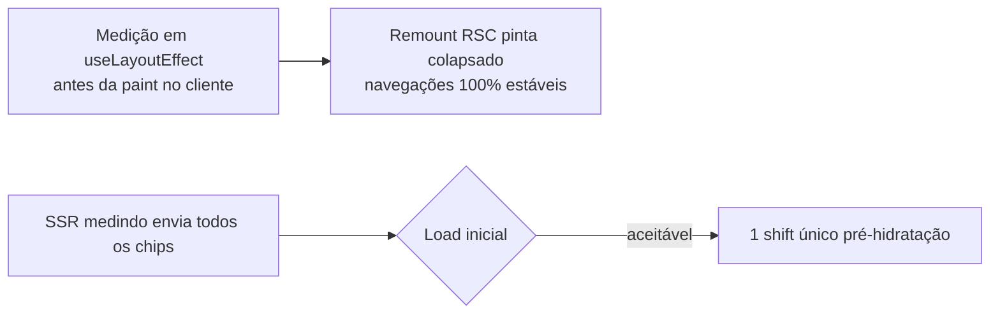

# Impl: Estabilizar a lista de Dobradinhas (parar o flicker de linhas/colunas)

Status: aprovado
Atualizado em: 2026-08-08
Issue: #425
Intenção: docs/plans/estabilizar-lista-dobradinhas-flicker.md
Appetite restante: ~0,5–1 dia eng (herdado)

## Leitura da intenção

- **Outcome:** a lista de Doradrinhas (`/campanha/dobradinhas`) deixa de "piscar": linhas (e a sensação de colunas) mudam de tamanho em onda após a primeira pintura, a cada carga, paginação, ordenação ou filtro. A tabela deve aparecer já no tamanho final; "Ver mais…" mantém o recolhimento/expansão sob demanda.
- **O que NÃO negociar:** não redesenhar as células de chips; não mudar a regra de recolher em 3 linhas; não mexer em dados/permissões/URLs/schema; corrigir no dono compartilhado das células de chips (`RelationChipCell`) para valer nas demais listas (Municípios, Lideranças, Assessores) sem regressão.
- **O que reavaliar:** a intenção assumia que o ciclo "medir → recolher" era o culpado e que a forma de corrigir estava "no dono compartilhado". Investigação confirmou a causa raiz empírica — mas a correção tem um resíduo no load SSR que a intenção não previu (ver "Abordagem recomendada" e "Riscos").

## Causa raiz (confirmada por medição no browser, porto 3269 / DB `teqo_wt169`)

`RelationChipCell` (src/components/campaign/shared/RelationChipCell.tsx) resolve o overflow fazendo a **mediação num `useEffect` (pós-pintura)**:

1. Estado inicial/SSR: `visibleChipCount === null` → `measuring = true` → monta **TODOS os chips** (até 192 no seed sintético) com `max-h-18 overflow-hidden` (clamp de 72px). A linha nasce com ~98px e a tabela com ~1122px.
2. `useEffect` roda **depois da paint** → mede quantos cabem em 3 linhas → `setVisibleChipCount`.
3. Re-render: `visibleChips = chips.slice(0, visibleChipCount)`, `clamping = false` → linha colapsa para ~58px, tabela para ~682px. **Reflow + LayoutShift real.**

Medições (PerformanceObserver `layout-shift`, `hadRecentInput=false`):

- **Load original:** shifts `[0.139, 0.215, 0.129, 0.021×6]`; tabela `1122→682px`; linhas `98→58px`; 192 chips montados no estado medindo.
- **Navegação original (ordenar por partido):** shifts `[0.215, 0.128, 0.021×6]` — a "fila" de 0.021 é **uma onda por célula** ajeitando a altura.
- **Probe `useLayoutEffect` (navegação):** a fila `0.021×6` **some**; frames da tabela ficam estáveis em `682px`/`58px` — nenhum frame intermediário de 1122px. (Os shifts residuais 0.193/0.043/0.021 são do shell, não da tabela.)
- **Probe `useLayoutEffect` (load/reload):** ainda `1122→682px` — porque o **SSR envia o HTML no estado medindo** (todos os chips) e o browser pinta isso antes da hidratação; o `useLayoutEffect` só roda após.

Conclusões:

- **Navegações client-side (paginação, ordenação, filtros)** — o sintoma que "se repete a cada…" — são 100% resolvidas movendo a mediação para `useLayoutEffect` (medição síncrona antes da paint no remount RSC).
- **Load SSR inicial** ainda produz um único shift da paint pré-hidratação com o fix apenas de `useLayoutEffect`.

## Abordagem recomendada

**Opções consideradas:**

- **A — `useLayoutEffect` no ciclo de mediação** (os efeitos de measurar/invalidar de `RelationChipCell`). Simples, dono compartilhado, resolve o caso dominante (paginação/ordenação/filtro) por completo.
- **B — `useLayoutEffect` + pré-render do estado colapsado no servidor** (estimativa determinística do número de chips que cabem em 3 linhas, usando a largura máxima conhecida das colunas `max-w-64/72` e comprimento dos labels). Zeraria também a paint SSR, mas reintroduz **exatamente** a estimativa por largura que o código deliberadamente evita ("read from the real layout instead of estimated from label lengths") — risco de divergência visual na última linha.
- **C — reserva de altura estável no estado medindo** (clamp igual ao colapsado). Testada empiricamente como variação de probe (`clamping` persistente com `hasHiddenChips`): **não** estabilizou o load (o `max-h` é teto, não piso — o slice colapsado é naturalmente mais baixo).

**Recomendação: A**, com o resíduo do load SSR documentado e tratado pelo `useLayoutEffect` + a medição já existente no `ResizeObserver` cobrindo ajustes pós-layout. A se o produto exigir (ver "Riscos") pode ir como follow-up, **não** nesta entrega (appetite).

**Rejeitadas:** B (estimativa de texto), C (empiricamente falhou), e qualquer mudança de layout/regra de colapso (anti-goal da intenção).

### Componentes / mudanças

- **`RelationChipCell`** (src/components/campaign/shared/RelationChipCell.tsx): trocar os `useEffect` de medição e invalidação (chipsKey, measuring, ResizeObserver de largura) por `useLayoutEffect`, para que a mediação aconteça **antes** da primeira paint do componente no cliente. Mantém-se `useEffect` para effects não-layout (blur debounce, reconciliações de estado puro). Adição mínima: import `useLayoutEffect`; troca de `useEffect` → `useLayoutEffect` nos 3 effects de medição (385–403 e 410–449, linhas de referência atuais).
  - Detalhe de correção: como hoje o `useEffect` de `invalidateMeasurement` (chipsKey) roda pós-paint, mover para layout effect garante que a re-medida provocada por mudança de conteúdo também aconteça antes da paint no remount.
- **Migration:** sem migration (nenhuma mudança de schema/dados).
- **Access / Consent:** toca nenhum.
- **UI:** Impeccable B — estabilidade de lista existente; estados visuais e copy preservados; shells de lista (`CampaignTable`) intocados.

### Dados → forma

- N/A — não há dados novos; aceite mensurável por observação (CLS da carga/navegação ≈ 0 atribuível às células, validado via PerformanceObserver no browser durante a execução).

## Fases verificáveis

1. **Tracer / server+UI** — mudança pontual em `RelationChipCell` (useLayoutEffect na medição). Quota do appetite: ~30 min.
2. **Verificação no browser** — dev server do worktree; logar como coordenador seed; `PerformanceObserver('layout-shift')` em `/campanha/dobradinhas`:
   - Navegação client-side (ordenar por partido, paginar, filtrar): nenhuma mudança de altura da tabela (frames estáveis 682px/58px) — **é o gate principal**.
   - Load/reload: shift residual documentado (único, pré-hidratação).
   - Confirmar nas outras listas que usam as células (Municípios, Lideranças, Assessores) sem regressão visual.
3. **Gates** — `pnpm gate:fast`; `pnpm test` (unitários das células não devem quebrar: `measureOverflow` já é stubável); `pnpm exec tsc --noEmit`, `pnpm lint`, `pnpm format:check`, `pnpm exec knip`, `pnpm check:cycles`; `pnpm build` local. Push via `pnpm push`.

## Rabbit holes / Não escopo (engenharia)

- Zerar a paint SSR inicial com estimativa de largura (opção B) — postergado como follow-up; o `useLayoutEffect` + `ResizeObserver` existente já cobrem o layout real.
- Ajustar `COLLAPSED_CHIP_ROWS` / `max-h-18` — não muda a regra de colapso (anti-goal).
- Tratar fonts-cls / sidebar / Sollinha — outras fontes de shift de layout, fora do escopo (o plano de intenção já as separa).

## Riscos e mitigação

- **`useLayoutEffect` em SSR:** é inofensivo (não roda no servidor); o componente já é `'use client'`. Os testes unitários existentes (`municipalityPortfolioCell`, `leadershipStateDeputyRelationCell`, `stateDeputyAdvisorRelationCell`) stubbam `ResizeObserver` e não medem layout real — não devem quebrar; confirmar no gate.
- **Medição antes da paint pode custar um layout sync em massa** (centenas de chips) no primeiro render. O código atual já mede com `getBoundingClientRect` de todos os chips igualmente; a mudança só move o _timing_ — sem custo novo.
- **Divergência da intenção:** a intenção assumia que o ciclo medir→recolher "acontecia depois da primeira pintura" e que resolver no dono bastaria para tudo; a medição mostrou que no **load SSR** há uma pintura do estado medindo antes da hidratação que `useLayoutEffect` não alcança. Mantemos a correção no dono (cobre o que se repete) e documentamos o resíduo do load; não inventamos produto novo.

## Aceite de engenharia

- [ ] Aceite de produto da intenção ainda coberto (onda de linhas/colunas em paginação/ordenação/filtro eliminada; "Ver mais…" intacto; demais listas sem regressão)
- [ ] Invariantes AGENTS/engineering-standards (nada de schema/access/URLs; identificadores em inglês)
- [ ] Testes de domínio previstos: unitários das células continuam verdes; verificação CLS por PerformanceObserver no browser registrada no diff/entrega
- [ ] Cobertura multi-lista validada (Municípios, Lideranças, Assessores) no browser
