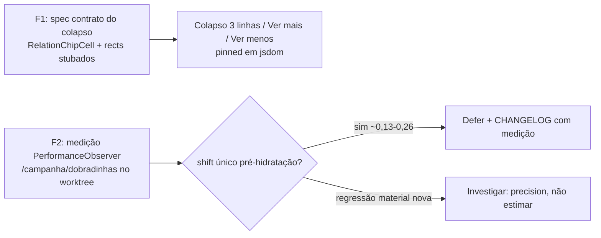

# Impl: B170 — Follow-up B169: contrato do colapso de chips (spec) + shift único no load SSR

Status: aprovado
Atualizado em: 2026-08-09
Issue: #441
Intenção: docs/plans/estabilizar-lista-dobradinhas-followup.md
Appetite restante: ~0,5–1 dia eng (herdado)

## Leitura da intenção

- **Outcome:** (F1) um spec unitário pinando o contrato do colapso de chips (recolher para o slice de 3 linhas medido, "Ver mais…" expande, "Ver menos" recolhe) com `getBoundingClientRect` stubado para múltiplos chips — cobrindo exatamente a lacuna que o B169 deixou (`measureOverflow: false` ou colapso para 1 chip nos specs atuais); (F2) avaliar o shift único do load SSR, com medição no browser, e deferi-lo documentado se aceitável — nunca reintroduzindo a estimativa de largura por label (anti-goal).
- **O que NÃO negociar:** sem mudança de layout, regra de colapso (3 linhas), dados, access ou schema; sem estimativa de largura por label; F1 não deve quebrar os specs existentes das células (`relation*`, `municipalityPortfolioCell`).
- **O que reavaliar:** a intenção deixa F2 condicionada à evidência ("sem evidência de impacto, F2 é defer"). A medição do B169 já registra os números (0,13–0,26, único, pré-hidratação); este impl **reproduz** a medição no worktree e confirma ou refuta antes de deferir.

## Abordagem recomendada

**Opções consideradas:**

- **F1-A — renderizar `RelationChipCell` diretamente com fixture mínima** (ownerId/ownerName/ids/buildChips/buildFormData/commitAction/copy) e stub global de `Element.prototype.getBoundingClientRect` (mesmo padrão de `scrollIntoView`/`ResizeObserver`). Pina o contrato no **dono** do colapso, sem a indireção do wrapper.
- **F1-B — renderizar um wrapper (`LeadershipStateDeputyRelationCell` / `StateDeputyAdvisorRelationCell`) com `measureOverflow` default true.** Props mais curtas, mas o contrato vive no `RelationChipCell` embutido — o spec passaria por um nível a mais e os fixtures dos wrappers já existem.
- **F2-A — medição no browser + defer documentado.** Reproduz a medição `layout-shift` no worktree (porta 3270, DB `teqo_wt170`), confirma o shift único pré-hidratação (~0,13–0,26) e registra em `docs/CHANGELOG-AGENTS.md` com os números; F2 vira "documentado".
- **F2-B — eliminar via estimativa de largura no servidor** — reintroduz exatamente o que o dono evita; rejeitada pela intenção e pelo B169.
- **F2-C — reserva de altura estável no estado medindo** — já testada empiricamente no B169 (opção C: `max-h` é teto, não piso; o slice colapsado é naturalmente mais baixo); não funciona. Rejeitada.

**Recomendação: F1-A + F2-A.**

- F1 no dono compartilhado, porque a lacuna é "nenhum spec cobra o colapso com layout real" no nível onde o colapso acontece.
- F2 mede e defer com documentação — a eliminação honesta não existe sem violar anti-goals (estimativa de largura ou mudança de layout/regra), e o segredo do useLayoutEffect já é "a primeira pintura chega colapsada" nas navegações; o resíduo é só a paint pré-hidratação do primeiro load.

### Componentes / mudanças

- **`tests/unit/relationChipCellCollapse.unit.spec.tsx`** (novo): renderiza `RelationChipCell` direto com `measureOverflow: true` (default), stub de `ResizeObserver` e de `Element.prototype.getBoundingClientRect` devolvendo geometria determinística (4 chips/linha, 20px, gap 6 → `COLLAPSED_CHIP_ROWS=3` ⇒ 12 chips no slice; 16 no total ⇒ 4 ocultos). Asserções: 12 `[data-relation-chip]` no DOM colapsado; "Ver mais…" presente; clique → 16 chips + "Ver menos"; clique → volta a 12 + "Ver mais…"; caso tudo-cabe (8 chips) → sem toggle, todos visíveis. Reset do stub via `Reflect.deleteProperty` no `afterAll` (precedente `municipalityStateDeputyRelationCell.unit.spec.tsx`). Sem migration, sem production code.
- **F2 (medição + documentação):** sem migração; registra entrada em `docs/CHANGELOG-AGENTS.md` (B170) com os números medidos e a decisão de defer.
- **Access / Consent:** toca nenhum.
- **UI:** Impeccable A — engenharia, sem mudança de superfície (intenção).

### Dados → forma

- N/A — nenhum dado novo. Aceite F1 = spec verde; aceite F2 = medição registrada + decisão documentada no CHANGELOG.

## Fases verificáveis

1. **F1 — spec** — `tests/unit/relationChipCellCollapse.unit.spec.tsx`; rodar `pnpm test:unit` (target do arquivo) até verde, e a suíte de células inteira (`relation*`, `municipalityPortfolioCell`) para provar que não regride. **FEITO** (4/4 verde; suíte completa 1451 verde).
2. **F2 — medição** — dev server do worktree (porta 3270, `teqo_wt170`); login coordenador seed; `PerformanceObserver('layout-shift')` em `/campanha/dobradinhas` (load/reload, `hadRecentInput=false`); comparar com a linha de base do B169 (0,13–0,26 único). **FEITO** — mesmo worktree provisionado + dobradinhas sintética com 40 lideranças (célula colapsa). Resultados: load SSR→hidratação com shifts únicos `0.139/0.043/0.257` (fontes `hadRecentInput:false` do shell — sidebar/Drawer/main/col-resize — nenhuma célula de chips); linha da célula `97px/42chips → 57px/0chips` numa única transição pré-hidratação; **ordenação client-side (RSC) → zero shifts novos** (a única fila era replay buffer do load). **Decisão: defer, conforme a intenção** — sem evidência de regressão material; eliminar a paint pré-hidratação exigiria estimativa de largura por label (rejeitada) ou mudança de layout/regra (anti-goal); registrado no CHANGELOG.
3. **Gates** — `pnpm gate:fast`; `pnpm exec tsc --noEmit`; `pnpm lint`; `pnpm format:check`; `pnpm exec knip`; `pnpm check:cycles`; `pnpm test`; `pnpm build` local. Push via `pnpm push`.

## Rabbit holes / Não escopo (engenharia)

- Tentativa de eliminar o shift SSR com estimativa de largura (F2-B) ou reserva de altura (F2-C).
- Redesign das células/da tabela; outras fontes de CLS (sidebar, Sollinha, agenda).
- Migration, schema, access, dados.
- Mudança de `COLLAPSED_CHIP_ROWS`, `max-h-18` ou qualquer regra de colapso.

## Riscos e mitigação

- **Stub global de `getBoundingClientRect` vaza para outros renders do spec:** reset via `beforeAll`/`afterAll` com `Reflect.deleteProperty`; fixtures isoladas por `it`.
- **O stub é frágil à geometria interna da medição** (`lastVisibleTop`, trailing `toggleWidth`+`inputWidth`): manter `rowRect.right` folgado (ex. 500) para o loop trailing não encolher abaixo do slice esperado, e comentar a matemática no spec.
- **`useLayoutEffect` em jsdom:** roda sincronamente dentro do `act` do RTL (`render`), então o estado colapsado já está no DOM após `render()`; asserções diretas, sem `waitFor` (se precisar, `waitFor` como rede de segurança).
- **F2 sem dados de dobradinhas no worktree:** se o seed local não tiver células com overflow, semear um dobradinha sintética com várias lideranças antes de medir; se a medição não reproduzir (regressão material), **parar e investigar** antes de deferir.
- **Divergência da intenção:** a intenção assume F2 defer com medição; se a medição mostrar shift materialmente maior que o registrado (nova fonte), tratar como correção, não como defer.

## Aceite de engenharia

- [ ] Aceite de produto da intenção ainda coberto: F1 pina o contrato; F2 (se deferido) documentado com medição no CHANGELOG
- [ ] Invariantes AGENTS/engineering-standards: nada de schema/access/URLs; identificadores em inglês; pt-BR só em copy de teste
- [ ] Specs das células existentes continuam verdes (`relation*`, `municipalityPortfolioCell`)
- [ ] Testes de domínio previstos: novo spec verde + medição registrada no diff/entrega
