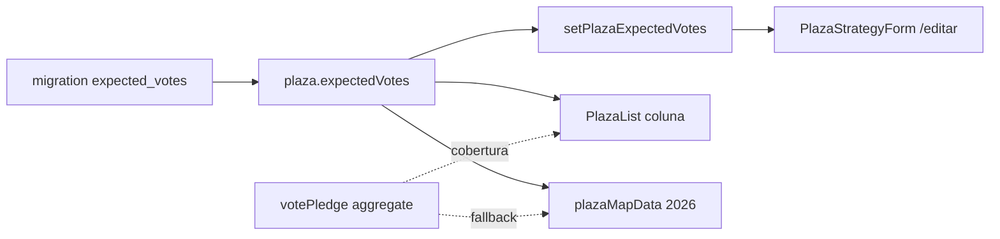

# Estimativa de votos da Praça (total esperado)

Status: entregue 2026-07-21 (branch; deploy pendente com remodelagem)
Atualizado em: 2026-07-21
Item do roadmap: [docs/roadmap.md](../roadmap.md) (Trilha A, item A9)
Impeccable: B — campo + migration + action + encaixe em `/editar` / detalhe / lista (leitura); edição inline na lista = B9
Appetite: ~1–1,5 dia eng; migration + 1 action + wire view models/mapa/overview + form no `/editar`
Responsável: —

## Design (Impeccable)

Âncoras: `PRODUCT.md` / `DESIGN.md` (register product — Field Desk) · tema `data-theme='campaign'` · `PlazaStrategyForm` / `PlazaStrategyCard` / `PlazaList`.

Na implementação (`implement-roadmap-item`): craft compacto → critique → polish (campo + rótulos; sem redesign de lista — B9).

Brief compacto:

- **Persona / contexto:** Assessor/Coordenador Geral cobre Praças **sem liderança** (ou com lideranças que não mapeiam o total esperado) e precisa lançar o total da Praça sem inventar `Contact`/`votePledge` fantasma.
- **Job principal:** gravar e ler o **total esperado da Praça** como número staff-only, distinto da soma das declarações/estimativas por liderança e das metas Bom/Regular/Mínimo.
- **Estratégia de cor:** Restrained.
- **Anti-goals:** fundir com `voteGoals`; substituir `votePledge`; expor o número a `leader`; auto-preencher a partir dos pledges (opt-in depois, se pedido).

## Contexto

Hoje existem **dois** conceitos de votos na vertical, e a UI da lista usa o nome errado para o segundo:

| Conceito                              | Onde vive                                     | Quem vê                             | Papel                                                                        |
| ------------------------------------- | --------------------------------------------- | ----------------------------------- | ---------------------------------------------------------------------------- |
| Declaração × estimativa por liderança | `votePledge.declaredVotes` / `estimatedVotes` | líder só o declarado; staff os dois | CRM de campo pessoa a pessoa                                                 |
| Metas de cenário 2026                 | `plaza.voteGoals` (Bom / Regular / Mínimo)    | staff                               | Planejamento / projeção                                                      |
| **Total esperado da Praça**           | **ausente**                                   | —                                   | O que a coluna “Votos estimados” da lista e o mapa 2026 deveriam representar |

A lista e o mapa 2026 usam `aggregatePledgesByPlaza` → `effectiveTotal` (`estimatedVotes ?? declaredVotes`). Isso **zera** Praças sem liderança e **subestima** Praças em que a estrutura nominal não cobre o território. Pedido de produto (2026-07-21): o total esperado deve ser lançável manualmente por assessor/coordenador; a soma das lideranças permanece como cobertura distinta. B9 (edição rápida na lista) depende deste campo para a coluna ser editável de verdade.

A remodelagem rejeitou o fluxo antigo sugerir→confirmar **por Praça** como substituto do pledge ([remodelagem-pracas.md](remodelagem-pracas.md)) — isso **não** invalida um total staff-only **coexistindo** com pledges. São jobs diferentes.

## Objetivos

- Campo staff-only na `plaza` para o total esperado (nullable, inteiro ≥ 0), editável por `coordinator` e `advisor` no escopo de access.
- Superfície mínima de escrita no `/campanha/pracas/[slug]/editar` (e leitura no cartão de estratégia do detalhe) **antes** de B9.
- Lista staff: coluna “Votos estimados” passa a mostrar o total da Praça; a soma de pledges aparece como cobertura secundária (rótulo distinto, ex. “Nas lideranças”).
- Mapa ano 2026 e overview/dashboard que hoje usam só pledges como “estimativas” passam a usar o total da Praça quando preenchido (ver decisão abaixo).
- `leader` nunca lê o campo (field access + view models).
- Guardrails: **uma migration**; sem Consent; sem collection nova; sem apagar/alterar semântica de `votePledge` nem de `voteGoals`.

## Decisões travadas

- **Item A9 próprio (trilha A), dependência dura de B9 — não absorver em B9 nem em `voteGoals`.** Schema + semântica de agregação são caros de reverter e merecem ID/plano; B9 fica só UI rápida. (Usuário + classificação roadmap-item, 2026-07-21.) **Rejeitado:** só B9 com Sheet de pledges (estado anterior do plano B9); reusar `voteGoals.good` como “o” estimado (metas ≠ total operacional); volta do fluxo sugerir→confirmar de núcleo.
- **Campo `expectedVotes` (number, nullable) em `plaza`, label admin/UI “Votos estimados”.** Identificador inglês distinto de `votePledge.estimatedVotes` evita colisão mental/código. **Rejeitado:** `estimatedVotes` na Praça (homônimo perigoso); grupo com nota/autor na v1 (appetite — ver Adiado).
- **Dois números convivem na UI staff.** Total da Praça = `expectedVotes`; cobertura = agregado de pledges (`effectiveTotal`). Nunca sobrescrever um com o outro automaticamente na v1. **Rejeitado:** `expectedVotes` derivado = max(pledges, manual); esconder pledges da lista.
- **Mapa 2026 / overview KPI: `expectedVotes ?? effectiveTotal` (por Praça, depois agrega município).** Praças com total lançado pintam certo; sem total, fallback nos pledges (não apaga o que já existe). **Rejeitado:** mapa só `expectedVotes` (buracos em massa no dia 1); mapa só pledges (ignora o pedido).
- **Access:** leitura/escrita staff (`canReadCampaignStaffField` / `canManageCampaignStaffField`); mesma regra de escopo de Praça do assessor. **Rejeitado:** só `coordinator`; exposição a `leader`.
- **i18n e naming** (AGENTS.md): `expectedVotes`, `setPlazaExpectedVotes`, `PlazaExpectedVotesField`; strings “Votos estimados” / “Nas lideranças” em pt-BR.

## Questões em aberto

- **Validar `expectedVotes` vs metas (`voteGoals`)?** **Opções:** A) sem relação | B) aviso se estimado &lt; mínimo | C) hard reject. **Recomendação:** A na v1; aviso soft só se feedback de campo pedir.
- **Nota/autor no total?** **Opções:** A) só número | B) group com note + recordedBy. **Recomendação:** A; B no Adiado.
- **Backfill na migration?** **Opções:** A) null | B) copiar `effectiveTotal` atual. **Recomendação:** A — pledges mudam; copiar congela um snapshot sem dono. Fallback de leitura cobre o buraco.

## Abordagem proposta

Componentes:

- **`Plaza` collection** (`src/collections/Plaza.ts`): campo `expectedVotes` (number, min 0, index opcional se filtrarem depois, staff access). Admin description: total esperado da Praça; distinto das metas e das lideranças.
- **Migration** `pnpm migrate:create add_plaza_expected_votes`: `ALTER TABLE` nullable; sem backfill.
- **Schema Zod** (`src/lib/schemas/plaza.ts`): `plazaExpectedVotesSchema` `{ plaza, expectedVotes: z.number().int().min(0).max(1_000_000).nullable() }`.
- **`setPlazaExpectedVotesRecord`** em `src/app/(campaign)/campanha/actions/plaza.ts`: parse + `payload.update` com `user` + `overrideAccess: false` (padrão `updatePlazaStrategyRecord`).
- **`plazaViewModels` / `plazaListSelect`**: incluir `expectedVotes`; list VM expõe `expectedVotes` + mantém `pledges` para cobertura.
- **`PlazaStrategyForm` + formAction `/editar`**: input numérico “Votos estimados”; `PlazaStrategyCard` no detalhe mostra o valor.
- **`PlazaList`**: coluna principal = `expectedVotes` (ou “—”); linha/badge secundária com soma das lideranças quando `pledgeCount > 0`.
- **`plazaMapData` / `loadPlazaListOverviewData` / dashboard**: métrica 2026 / totais usam `expectedVotes ?? effectiveTotal` por Praça.
- **Depth check:** não criar collection `plazaVoteEstimate`; não reintroduzir versionamento UUID do núcleo; helper fino em `votePledgeData` ou `plazaVotes.ts` se o fallback se repetir ≥2 call sites.
- **Testes:** int access (leader redacted; advisor scoped); unit do fallback mapa/lista; int create/update `expectedVotes`.

## Dependências

- **Dura:** R2 (collection `plaza` + superfícies) — entregue.
- **Dependentes:** **B9** (edição rápida da coluna) — seta dura A9 → B9.
- **Suave:** B7 (mapa filtrado) — A9 muda a métrica 2026; B7 só o where.

## Não escopo

- Edição inline na lista → [B9](edicao-rapida-lista-pracas.md).
- Alterar assimetria `declaredVotes`/`estimatedVotes` do pledge; import CSV de totais.
- Histórico auditável do total; alertas vs `voteGoals`; filtro `?expectedVotes=` na lista.
- B8 polígonos; Pixel Meta.

## Rabbit holes

- **Reintroduzir estimativa versionada de núcleo (sugerir→confirmar + UUID).** Explode escopo e conflita com a remodelagem. **Mitigação:** um number nullable + action simples.
- **“Fonte da verdade única” fundindo pledges e total.** Apaga o pedido de dois conceitos. **Mitigação:** labels distintos; fallback só na leitura agregada.
- **Layers/DDD cerimônia** (`PlazaVoteEstimateService`). **Mitigação:** campo + action no módulo `plaza` existente.

## Adiado com gatilho

- **Nota + recordedBy no total.** Revisitar quando assessores pedirem justificar mudança sem abrir intel longa.
- **Aviso vs `voteGoals.minimum`.** Revisitar após primeiras semanas com totais preenchidos.
- **Auto-sugerir `expectedVotes` a partir dos pledges (opt-in chip).** Revisitar se muitos totais ≈ soma das lideranças.

## Pós-entrega (`/simplify`)

Fill-in **A9+** entregue 2026-07-21 — [escala-dry-pos-a9.md](escala-dry-pos-a9.md) (`loadPlazaListPageBundle`, 1× `aggregatePledgesByPlaza`, `plazaRevalidation.ts`). Débito restante: twin `listFormActions` ↔ `/editar` → **C8** F4.

**Já resolvido no simplify (não reabrir):** form `expectedVotes`; `rollupPlazaStaffVotes` / `sumStaffPledgeEffectiveTotal`; `StaffPlazaVotesDisplay`; remoção de `hasStaffVoteData`; testes unit do rollup.

## Referências

- `docs/roadmap.md` (Trilha A / A9 → B9)
- `docs/plans/escala-dry-pos-a9.md` — A9+ entregue (loader lista + revalidate escopada)
- `src/collections/Plaza.ts` — `voteGoals`, access staff
- `src/utilities/votePledgeData.ts` — `effectiveTotal`
- `src/utilities/plazaMapData.ts` — métrica 2026
- `src/components/campaign/PlazaList.tsx` — coluna atual
- `src/app/(campaign)/campanha/actions/plaza.ts` — padrão de update staff
- `docs/plans/edicao-rapida-lista-pracas.md` — consumidor B9
- `docs/plans/remodelagem-pracas.md` — assimetria pledge; rejeição do fluxo antigo por Praça
- AGENTS.md — staff-only estimates, naming, migrations
- `PRODUCT.md` / `DESIGN.md` — Field Desk
