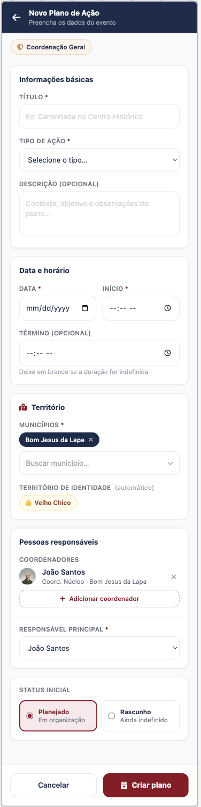
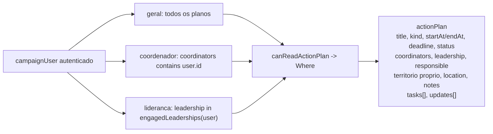

# Eventos / presença e agenda de mobilização

Status: rascunho
Atualizado em: 2026-07-17
Item do roadmap: [docs/roadmap.md](../roadmap.md) (seção "Campanha → Próximos ciclos", linha 54)
Responsável: —

## Referência visual (UX Pilot)

Dois designs cobrem este plano:

| Tela                                 | Arquivos                                                                                                                                              |
| ------------------------------------ | ----------------------------------------------------------------------------------------------------------------------------------------------------- |
| Lista de planos (`/campanha/planos`) | [`Planos-de-Acao.png`](../design-refs/latest/Planos-de-Acao.png) · [`Planos-de-Acao.html`](../design-refs/latest/Planos-de-Acao.html)                 |
| Form novo plano                      | [`Novo-Plano-de-Acao.png`](../design-refs/latest/Novo-Plano-de-Acao.png) · [`Novo-Plano-de-Acao.html`](../design-refs/latest/Novo-Plano-de-Acao.html) |

Como usar:

- **Lista — adotar:** tabs de janela/status ("Próximos" default, "Todos", "Realizados", "Rascunhos"), filtros "Tipo de ação" e "Território", cards com badge de `kind` (Caminhada, Reunião de apoio, Porta a porta, Comício, Panfletagem — cada tipo com cor própria clara), badge de `status` (Confirmado verde, Planejado azul, Rascunho outline, Realizado cinza), data/hora + município, chip do Território de Identidade, "Resp: {nome}" e barra de progresso de tarefas ("2/5 tarefas"). O card de rascunho com "Data a definir" esmaecido é um bom estado para `startAt` pendente em rascunho — mas atenção: o plano define `startAt` obrigatório; se rascunho puder ficar sem data, registrar em "Questões em aberto".
- **Form — adotar:** seções "Informações básicas" (título, tipo, descrição opcional), "Data e horário" (data + início obrigatórios, término opcional com helper "Deixe em branco se a duração for indefinida"), "Território" (municípios multi-chip + território derivado automático — mesmo padrão de [`Formulario-Territorio.png`](../design-refs/latest/Formulario-Territorio.png), confirmando que o bloco nasce no modelo multi-município), "Pessoas responsáveis" (coordenadores com "+ Adicionar", responsável principal) e "Status inicial" (Planejado | Rascunho como radio cards).
- **Falta desenhar (não bloqueia):** o detalhe do plano com tabs "Visão geral / Tarefas / Atualizações" não veio nesta leva — seguir o padrão `NucleusTabNav` do detalhe do núcleo; o checklist de tarefas pode reusar o formato de linhas do design da lista.
- **Ajustar cores:** paleta antiga no HTML/PNG; implementar com tokens do tema `campaign`. A entrada "Agenda" do bottom nav só entra quando este domínio existir.

## Contexto

O roadmap lista "Eventos / presença e agenda de mobilização" como próximo ciclo da vertical `/campanha` (plano-arquitetura §4). Hoje a campanha só modela território (núcleo) e reporte (atualização); não há como planejar, escalar e acompanhar ações de campo — caminhadas, comícios, carreatas, panfletagens, reuniões de apoio, lançamentos, convenções, atos, entrevistas — nem ver o que vem a seguir.

A pesquisa de jargão de marketing político brasileiro separa três conceitos que o item do roadmap agrupa:

1. **Gestão de agenda do candidato** — o tempo do candidato é o recurso mais escasso; a agenda aloca esse tempo entre eventos de mobilização, mídia, encontros com lideranças, gravações e descanso. Agenda é instrumento estratégico, não lista de compromissos.
2. **Tipos de ação de mobilização** — caminhadas, carreatas, comícios, panfletagens, porta a porta, reuniões de apoio (lideranças/categorias profissionais/grupos religiosos/sindicais), eventos programados (lançamentos, convenções, atos), entrevistas/aparições. Distinção entre alta intensidade (rua) e baixa intensidade (digital/WhatsApp).
3. **Plano de ação de mobilização** — planejamento antecipado, coordenação centralizada, divisão clara de tarefas com responsáveis, prazos e KPIs, supervisor monitorando execução e conformidade eleitoral.

A decisão de produto (2026-07-17) é modelar isso como **uma única entidade "Plano de Ação"** (`actionPlan`), onde cada documento é uma ação/evento calendarizável, com checklist de tarefas e feed de atualizações — enxuto o suficiente para um MVP e compatível com o bloco "Próximos eventos" já reservado no overview da lista de núcleos ([overview-lista-nucleos.md](overview-lista-nucleos.md)).

## Decisões travadas

- **Granularidade: entidade única `actionPlan`.** Cada documento É uma ação/evento (caminhada, comício, etc.), não um guarda-chuva de várias ocorrências. Isso mantém o MVP enxuto (uma collection, uma migration, um CRUD) e torna a entidade calendar-addressable via `startAt`. (Decisão de produto 2026-07-17.)
- **Território próprio, sem link a `electoralNucleus`.** O plano carrega seu próprio bloco de território, reusando as mesmas validações Bahia do núcleo. O escopo de acesso vem dos campos explícitos (`coordinators`, `leadership`), não de um núcleo vinculado. (Decisão de produto 2026-07-17.) Planos podem cobrir um território sem ser de um núcleo específico.
- **O bloco de território nasce no modelo vigente do núcleo** (nota de sequenciamento 2026-07-17). Se [`territorio-multi-municipio-bairro.md`](territorio-multi-municipio-bairro.md) já tiver sido implementado (ordem recomendada no roadmap), `actionPlan` nasce com `regions[]`/`cities[]`/`neighborhoods[]` e as mesmas 6 regras de validação — nunca com o modelo single antigo, que criaria migração dupla. O bloco "Próximos eventos" no overview filtra por território com a mesma semântica da lista de núcleos (`contains` sobre arrays).
- **`startAt` obrigatório + `endAt` opcional.** Sem data/hora de início não há agenda nem bloco "Próximos eventos". `deadline` (prazo de conclusão do plano) é distinto e opcional.
- **Pessoas = `Contact` + `campaignUser`, nunca cadastro paralelo.** `coordinators` → `campaignUser` (hasMany, só `geral`/`coordenador`, mesmo `filterOptions` do núcleo). `responsible` → `Contact` (pessoa responsável em campo, não precisa ser usuário nem liderança). `leadership` → `leadership` (relação opcional à junção `Contact`↔núcleo, para marcar a liderança que conduz a ação). Honra os três campos propostos pelo produto sem inventar "pessoa" paralela (convenção AGENTS.md).
- **`kind` como enum de tipos de mobilização.** `caminhada`, `comicio`, `carreatas`, `panfletagem`, `porta_a_porta`, `reuniao_apoio`, `lancamento`, `convencao`, `ato`, `entrevista`, `producao_conteudo`, `digital`, `outro`. Valores em pt-BR (são dados/labels, não identificadores).
- **`status` como enum de ciclo de vida.** `rascunho`, `planejado`, `confirmado`, `realizado`, `cancelado`. Transições para `cancelado`/`realizado` restritas a `geral` ou coordenador atribuído (espelha `canManageNucleusLifecycle`).
- **`slug` canônico imutável após criação.** Mesmo padrão de `setCanonicalNucleusSlug`: derivado de `title`, único, indexado, readOnly. Rotas em `/campanha/planos/[slug]` (segmento `planos` é dado/SEO em pt-BR, não identificador).
- **`tasks` e `updates` como arrays no MVP.** `tasks`: `{ title, responsible→Contact, due, done, doneAt }`. `updates`: append-only `{ author→campaignUser, body, createdAt }`, com `author`/`createdAt`/`doneAt` derivados no servidor. Uma collection dedicada `actionUpdate` (espelhando `nucleusUpdate`, feed imutável paginado) fica como follow-up.
- **Access control por campos explícitos.** `geral` vê/edita tudo; `coordenador` vê planos onde está em `coordinators`; `lideranca` vê planos onde `leadership` é uma das suas lideranças engajadas (IDs calculados e cacheados em `req.context`, mesmo padrão de `getAccessibleNucleusIds`). Escrita de `lideranca` restrita a toggle de `tasks.done` e append de `updates` no próprio plano (escopo estreito).
- **Sem `Consent` para o plano.** Plano é dado interno de staff, não coleta de PII pública. Captura nominal de presentes/apoiadores (tocaria `Contact` + `Consent`) fica fora do MVP.
- **i18n e naming** seguem o AGENTS.md: identificadores em inglês (`actionPlan`, `ActionPlan`, `ActionPlanForm`, `loadActionPlanListPageData`), labels admin e strings visíveis em pt-BR.

## Questões em aberto

- **`lideranca` edita tarefas?** Recomendação: sim, só toggle `done` (e append de `update`), sem editar título/datas/responsáveis. Confirmar com produto.
- **`tasks.responsible` aceita qualquer `Contact` ou só acessíveis?** Recomendação: só contatos no escopo do ator (`getAccessibleContactIds`), espelhando o contato principal do núcleo. Definir com produto.
- **Filtro de janela de data na lista.** Recomendação: filtro de "próximos" (`startAt >= now`), "passados" (`startAt < now`) e intervalo livre. Default: próximos, ordenado por `startAt` asc.
- **Bloco "Próximos eventos" no dashboard `/campanha`.** O overview de `/campanha/nucleos` já reserva o bloco; o dashboard geral também ganha? Recomendação: sim, mesmo recorte (todos os planos não cancelados com `startAt >= now`), sem filtros de lista.
- **Repetição/recorrência.** Eventos recorrentes (ex.: panfletagem toda sábado) ficam fora do MVP — cada ocorrência é um plano. Reavaliar quando o volume justificar.
- **`actionUpdate` dedicado.** Migrar o array `updates` para collection separada (imutável, paginada, autor derivado) em follow-up se o feed crescer.

## Abordagem proposta

Componentes:

- **`src/collections/ActionPlan.ts`** (novo): collection em admin group `Campanha`, `useAsTitle: title`. Campos conforme "Decisões travadas". Hooks `beforeValidate` (slug canonico + validação de territorio Bahia + `startAt < endAt`) e `beforeChange` (derivar `createdBy`, `tasks.doneAt`, `updates.author/createdAt`).
- **`src/utilities/campaignAccess.ts`** (extensão): `canCreateActionPlan`, `canReadActionPlan` (retorna `Where` por papel), `canUpdateActionPlan`, `canDeleteActionPlan`, `canSetActionPlanSystemField`, `canSetActionPlanStatus`, e `getAccessibleLeadershipIds` (cache em `req.context`, espelha `getAccessibleNucleusIds`).
- **`src/app/(campaign)/campanha/(app)/planos/page.tsx`**: lista paginada com filtros (kind, status, territorio, janela `startAt`), reusando `NucleusFilters`/`NucleusList`/`NucleusPagination` como referência de layout e `components/ui/*`.
- **`src/app/(campaign)/campanha/(app)/planos/[slug]/page.tsx`**: detalhe com `NucleusTabNav`-style (Visão geral, Tarefas, Atualizações).
- **`src/app/(campaign)/campanha/(app)/planos/novo/page.tsx`** e **`planos/[slug]/editar/page.tsx`**: form reusando `NucleusForm`/`NucleusTerritoryFields` como referência.
- **`planos/formActions.ts`**, **`planos/[slug]/actionPlanFormActions.ts`**: server actions; escritas multi-collection (criar plano + update inicial; toggle tarefa + append update) envolvem `payload.db.beginTransaction/commitTransaction/rollbackTransaction` com `req: { transactionID }` (padrão AGENTS.md).
- **`src/components/campaign/CampaignBottomNav.tsx`**: adicionar entrada "Planos".
- **Bloco "Próximos eventos"**: ativar no overview de `/campanha/nucleos` (já desenhado em [overview-lista-nucleos.md](overview-lista-nucleos.md)) e no dashboard `/campanha`, consumindo `actionPlan` com `startAt >= now`, `status in [planejado, confirmado]`, ordenado por `startAt` asc, respeitando os mesmos filtros de territorio da página.

## Ondas (lean, espelhando o ciclo de Núcleos)

1. Domínio: collection `ActionPlan.ts`, hooks, access control em `campaignAccess.ts`, migration `add_action_plan`, `pnpm generate:types`, `pnpm generate:importmap`, `tsc --noEmit`, lint.
2. Lista `/campanha/planos` + filtros + ativação do bloco "Próximos eventos" no overview de `/campanha/nucleos`.
3. Detalhe `/campanha/planos/[slug]` com tabs (Visão geral, Tarefas, Atualizações).
4. Forms novo/editar + server actions transacionais + toggle de tarefa + append de update.
5. Dashboard "Próximos eventos" + E2E por papel + responsividade 360/390/768/1440 + hardening + Aikido por arquivo editado.

## Dependências

- **[`territorio-multi-municipio-bairro.md`](territorio-multi-municipio-bairro.md) — pré-requisito de sequenciamento** (2026-07-17): o bloco de território de `actionPlan` nasce no modelo de arrays. Ver "Decisões travadas".
- Fora isso, nenhuma de outro plano. Reusa validações Bahia (`src/lib/bahiaTerritories.ts`, `src/lib/cities.ts`), access control existente (`src/utilities/campaignAccess.ts`), `slugify` (`src/utilities/slug.ts`), UI `components/ui/*` e padrões de `NucleusForm`/`NucleusFilters`/`NucleusList`/`NucleusTabNav`.
- O bloco "Próximos eventos" do overview de `/campanha/nucleos` ([overview-lista-nucleos.md](overview-lista-nucleos.md)) é consumidor direto e só ganha UI quando esta collection existir.

## Não escopo

- Collection dedicada `actionUpdate` (feed imutável paginado) — follow-up; MVP usa array.
- Captura nominal de presentes/apoiadores (tocaria `Contact` + `Consent`) — fora do MVP.
- Visão de calendário/mapa (depende do item mapa/PostGIS do roadmap).
- Link a `electoralNucleus` (decisão: território próprio).
- Recorrência de eventos — cada ocorrência é um plano no MVP.
- Estimativa estatística de votos em eventos.
- Notificações/lembretes de evento (item separado do roadmap, [notifications.md](notifications.md)).

## Referências

- `docs/roadmap.md` (linha 54)
- `docs/plans/overview-lista-nucleos.md` — bloco "Próximos eventos" já desenhado
- `src/collections/ElectoralNucleus.ts` — padrão de collection, hooks de slug/território, campos derivados
- `src/utilities/campaignAccess.ts` — `getAccessibleNucleusIds`, `getFreshCampaignUser`, padrões de access por papel
- `src/lib/bahiaTerritories.ts`, `src/lib/cities.ts` — validação de território Bahia
- `src/utilities/slug.ts` — `slugify`
- AGENTS.md — Campaign auth, naming conventions, transações multi-collection, workflow de migrations
