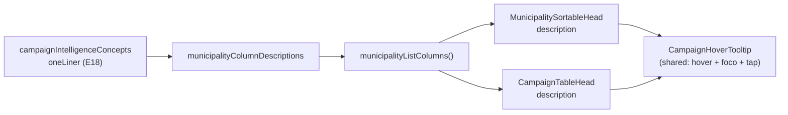

# Explicação por coluna no header das listas

Status: rascunho
Atualizado em: 2026-07-25
Item do roadmap: [docs/roadmap.md](../roadmap.md) (Trilha B, item **B22**)
Impeccable: B — encaixe no header já existente da lista de municípios (`MunicipalitySortableHead`) + capacidade promovida para o sistema de listas compartilhado
Appetite: ~0,5 dia eng; promover 1 componente de domínio para `shared/`, 1 prop em 2 heads, copy das colunas de `/campanha/municipios`; sem migration
Responsável: —

## Design (Impeccable)

Âncoras: `PRODUCT.md` (princípio 2 — clareza sob pressão; anti-goal spreadsheet/data-grid) / `DESIGN.md` (register `product`, Field Desk) · tema `data-theme='campaign'` · shells existentes: `CampaignTable` / `CampaignTableHead` (`src/components/campaign/shared/CampaignTable.tsx`), `MunicipalitySortableHead`, `MunicipalityHoverTooltip`, `CampaignInfoHint`.

Na implementação (`implement-roadmap-item`): craft compacto → critique → polish. `harden`/`optimize` só sob gatilho do Passo 8 (não há dado novo, escrita nem PII neste item).

Brief compacto:

- **Persona / contexto:** Alex (Coordenador Geral) e o assessor no desktop, varrendo a tabela de 435 municípios com 9 colunas — várias delas nomes curtos de métrica derivada ("Cobertura da meta", "Último sinal", "Votos estimados", "Tendência") cujo significado hoje só existe na cabeça de quem implementou.
- **Job principal:** entender, sem sair da lista, o que uma coluna mede antes de ordenar/filtrar por ela.
- **Estratégia de cor:** Restrained — a explicação não introduz cor nova; a afford­ance é tipográfica (sublinhado pontilhado no label).
- **Edit where you see:** não se aplica — superfície é leitura/orientação; nenhum campo é editado a partir do header.
- **Anti-goals:** um "?" `CircleHelp` por coluna (9 ícones = ruído num header já denso com sort + funil do B16); tooltip cobrindo a célula inteira ou o link do nome; segunda página de glossário concorrendo com `/campanha/conceitos` (E18); parágrafos longos dentro do tooltip.

## Dados → decisão → apresentação

- **Vou apresentar dados?** Não — nenhum número novo, agregado ou série. O item apresenta **copy sobre dados já exibidos**. `Dados: N/A` quanto a novas métricas; a ressalva abaixo existe porque a copy nomeia semântica de métrica.
- **Decisões desbloqueadas:** Coordenador/assessor: "ordeno por esta coluna ou por outra?" — hoje `deficit` (default do staff) e `frescor` só são legíveis para quem leu o plano do E9.
- **Forma escolhida:** texto curto (1–2 frases) em tooltip de hover/foco no próprio header. **Rejeitado:** legenda fixa abaixo da tabela (rouba altura da lista densa); modal/drawer de ajuda (fora de contexto); repetir o conteúdo do `/campanha/conceitos` inline (duplica fonte).
- **Anti-goals de dado:** nenhuma definição inventada aqui — para colunas cobertas pelo E18, a frase vem do `oneLiner` do conceito (fonte única); para as demais, a frase descreve o campo tal como o loader o calcula.

## Contexto

`/campanha/municipios` é a superfície mais densa do produto: tabela de 435 municípios com até 9 colunas no papel staff (Município, Território, Tipo, 2022, Assessores, Tendência, Votos estimados, Último sinal, Cobertura da meta), header já carregado de sort (**B15**) e funil de filtro (**B16**). Várias colunas são métricas derivadas do E8/E9 cujo nome curto não se explica sozinho.

A capacidade **existe pela metade**: `MunicipalitySortableHead` (`src/components/campaign/municipality/MunicipalitySortableHead.tsx`) já aceita `tooltip?: ReactNode` e o envolve em `MunicipalityHoverTooltip` — mas só **3** colunas passam a prop (`votos`, `frescor`, `deficit`, com as frases montadas ad hoc em `MunicipalityList.tsx:410–415`). As outras seis ficam mudas, e as demais listas do produto (lideranças, organizações, dobradinhas, demandas, apoiadores e a futura **B21** territórios) usam `CampaignTableHead`, que não tem prop nenhuma de explicação. O primitivo de tooltip (hover + foco + tap em touch, com dismiss por `pointerdown`) também mora no domínio `municipality`, apesar de não ter nada de municipal.

Pedido de produto (2026-07-25): tooltip no hover de cada header de coluna em `/campanha/municipios`, **implementado no componente de header** para ser reaproveitado em outras páginas. Isso também dá evidência datada para o débito **O3** ("jargão") / glossário inline do **R6** — que estava em _A validar_ por falta de pedido concreto.

## Objetivos

- Toda coluna do header de `/campanha/municipios` (papel staff e papel assessor) expõe uma explicação curta em hover, foco de teclado e tap (touch), sem `?` por coluna.
- A capacidade é do **sistema de listas compartilhado**: `CampaignTableHead` (heads simples) e `MunicipalitySortableHead` (head rico) aceitam a mesma prop e usam o mesmo primitivo, disponível para qualquer superfície que use `CampaignTable`.
- O primitivo de tooltip deixa de ser de domínio: `MunicipalityHoverTooltip` → `src/components/campaign/shared/CampaignHoverTooltip.tsx`, com os call sites atuais (cards de baseline e conta da cadeira) atualizados no mesmo commit — knip fica em zero.
- Para colunas cobertas por um conceito do **E18**, a frase vem do `oneLiner` de `campaignIntelligenceConcepts` (fonte única), não de string paralela.
- Sem migration, sem collection, sem server action, sem mudança de contrato de URL. Nada muda para o papel `leader` (a lista não é acessível a ele).

## Decisões travadas

- **A explicação é prop dos componentes de header, não campo de `CampaignTableColumn`.** `CampaignTable` recebe `head` como `ReactNode` opaco (por design — heads ricos são ilhas cliente que possuem `aria-sort` e o Popover de filtro); injetar tooltip a partir da tabela exigiria `cloneElement` sobre um nó arbitrário. **Rejeitado:** `description` em `CampaignTableColumn` (a tabela teria que saber montar heads, quebrando a separação que o Pass 2 W1 estabeleceu); `title=` nativo do HTML (sem touch, sem estilo, inconsistente com o resto do produto).
- **Um único primitivo compartilhado (`CampaignHoverTooltip`), movido de `municipality/` para `shared/`.** O componente já resolve os três modos (hover, foco, tap com dismiss por `pointerdown`) e trata o próprio conteúdo como "dentro" — comportamento conquistado num critique do E18 que não deve ser reimplementado. **Rejeitado:** segundo componente de tooltip no `shared/` (duas versões divergindo em touch); usar `CampaignInfoHint` (Popover "?") por coluna — 9 gatilhos de 44px num header que já tem sort + funil.
- **Copy curta e sem link dentro do tooltip de header.** Conteúdo de Tooltip do Radix não entra na ordem de tabulação; um "Saiba mais" ali seria inalcançável por teclado (o E18 resolveu isso com Popover, que aqui custaria o "?" por coluna). Quem quiser aprofundar tem `/campanha/conceitos` na sidebar. **Rejeitado:** repetir o padrão `MetricExplanation` + link do card de conta da cadeira no header da lista.
- **Fonte única para conceitos do E18.** Novo helper `campaignConceptOneLiner(id)` ao lado de `campaignConceptHref` em `src/lib/campaignIntelligenceConcepts.ts`; a coluna "Cobertura da meta" passa a ler dele em vez da frase própria de hoje. **Rejeitado:** duplicar o texto no `MunicipalityList` (definição de métrica divergindo entre glossário e lista é exatamente o defeito que o E18 nasceu para fechar).
- **i18n e naming** seguem o AGENTS.md: identificadores em inglês (`CampaignHoverTooltip`, `description`, `campaignConceptOneLiner`), strings visíveis em pt-BR.

## Questões em aberto

- **A prop se chama `description` ou continua `tooltip`?** **Opções:** A) `description` nos dois heads (rename do atual) | B) manter `tooltip` | C) `hint`. **Recomendação:** **A** — `tooltip` nomeia o mecanismo, `description` nomeia o conteúdo e sobrevive se o mecanismo mudar (ex.: Popover no mobile). São 3 call sites; rename barato agora, caro depois que 6 listas adotarem. _(assumido)_
- **As outras listas (lideranças, organizações, dobradinhas, demandas, apoiadores) ganham copy neste item?** **Opções:** A) só a capacidade, copy quando cada superfície for tocada | B) copy em todas agora. **Recomendação:** **A** — as colunas delas são substantivos concretos ("Partido", "Telefone", "Aberta em") que não pedem glosa; escrever 30 frases defensivas viola "build less" e estoura o appetite. B21 (territórios) nasce com copy porque suas colunas são derivadas.
- **Afford­ance visual do que tem explicação?** **Opções:** A) sublinhado pontilhado no label | B) nada (descoberta por hover) | C) ícone. **Recomendação:** **A** — barato, sem chrome novo, e evita que a explicação só exista para quem passa o mouse por acaso. Validar no critique do R6.

## Abordagem proposta

Componentes:

- **`CampaignHoverTooltip`** (move de `src/components/campaign/municipality/MunicipalityHoverTooltip.tsx` para `src/components/campaign/shared/CampaignHoverTooltip.tsx`): mesmo comportamento, mesma assinatura; atualizar os imports de `MunicipalityBaselineCard.tsx` e `MunicipalityGoalAccountCard.tsx` e o comentário de cabeçalho (deixa de citar "município").
- **`CampaignTableHead`** (`src/components/campaign/shared/CampaignTable.tsx`): nova prop `description?: ReactNode`. Quando presente, envolve o label num `` com `focus-visible:ring` e `underline decoration-dotted underline-offset-4` dentro do `CampaignHoverTooltip` — o `<th>` em si continua não interativo. Sem `description`, o render é byte a byte o de hoje.
- **`MunicipalitySortableHead`** (`src/components/campaign/municipality/…`): `tooltip` → `description`, apontando para o primitivo compartilhado; o gatilho continua sendo o próprio `CampaignTransitionAnchor` de sort (já focável, então o teclado já funciona) e ganha o mesmo sublinhado pontilhado.
- **`municipalityColumnDescriptions`** (novo, em `src/utilities/municipalityLabels.ts` — onde os labels da lista já moram): mapa `columnId → string` em pt-BR com as 9 colunas do staff + a coluna `lastUpdateAt` do papel assessor. `goalCoverage` lê `campaignConceptOneLiner('cobertura-da-meta')` e acrescenta a nota de cenário que hoje está no `deficitHint`; `frescor` reaproveita a frase atual com `MUNICIPALITY_COLD_SIGNAL_DAYS`; `votos` reaproveita `formatMunicipalityConcentrationHint()`.
- **`campaignConceptOneLiner`** (`src/lib/campaignIntelligenceConcepts.ts`): lookup por `CampaignConceptId` ao lado do `campaignConceptHref` existente; mantém o teste unitário do glossário como pino.
- **`MunicipalityList.tsx`**: as três `const *Hint` locais somem em favor do mapa; `municipalityListColumns` passa `description={municipalityColumnDescriptions[id]}`.
- **Teste**: unit pin de que todo `id` de coluna da lista de municípios tem entrada no mapa (mesma família do teste que guarda os conceitos do E18) — impede que **B17** (seletor de colunas) ou **E10** adicionem coluna muda.
- **Sem migration, sem collection, sem server action.**

## Dependências

- Nenhuma dura. Suaves, todas já entregues: **B15** (contrato de sort no header), **B16** (funil no mesmo `<th>` — o layout precisa continuar cabendo), **E18** (`campaignIntelligenceConcepts` como fonte da copy de métrica), Pass 2 W1 (colunas como dado em `CampaignTable`).
- Consumidores futuros da capacidade: **B21** (colunas derivadas dos TIs), **B17** (o seletor de colunas passa a listar colunas que já sabem se explicar), **E10**/**E14** (cada métrica nova nasce com sua frase).

## Não escopo

- Copy das colunas das outras 5 listas — cada superfície escreve a sua quando for tocada (ver Questões em aberto); a capacidade já estará lá.
- Explicação nos **cards mobile** de `/campanha/municipios` (não há header lá; o card já rotula cada valor por extenso). Se o critique do R6 mostrar necessidade, entra como fill-in.
- Novos conceitos em `/campanha/conceitos` — o E18 é o dono; este item só consome `oneLiner`.
- Glossário inline em badges/estimativas (FD2 / **R6**) — este item cobre header de tabela apenas.

## Rabbit holes

- **Transformar a copy num "sistema de glossário".** Se alguém "só completar", vira collection Payload de termos, admin de edição e i18n de glossário para 10 frases. **Mitigação neste item:** copy é conteúdo curado em código, ao lado da definição da coluna — mesma decisão já travada no E18.
- **Tornar o tooltip navegável por teclado com links dentro.** Explode em Popover por coluna, foco preso e redesign do header denso do B16. **Mitigação:** copy sem link; caminho de aprofundamento é a página do E18 pela sidebar.
- **Refatorar `CampaignTable` para renderizar heads a partir de dados.** Parece "a coisa certa" ao adicionar `description`, mas desfaz a separação head-como-ilha do Pass 2 W1 e briga com o Popover de filtro do B16. **Mitigação:** decisão travada acima; a prop fica nos heads.

## Adiado com gatilho

- **Copy de coluna nas listas de lideranças/organizações/dobradinhas/demandas/apoiadores.** Revisitar quando: alguém do time perguntar o que uma coluna dessas significa em sessão/R6, ou quando a superfície ganhar coluna derivada.
- **Variante Popover (com link) no mobile.** Revisitar quando: o critique do R6 registrar falha de descoberta em touch — o tap já abre o tooltip hoje.

## Referências

- `docs/roadmap.md` (Trilha B — "Demais itens abertos", grafo, Janela 1–2, Cortes seguros)
- `src/components/campaign/shared/CampaignTable.tsx` — `CampaignTableHead`, contrato `CampaignTableColumn` (seams do B17)
- `src/components/campaign/municipality/MunicipalitySortableHead.tsx` — prop `tooltip` atual + composição com `MunicipalityHeaderFilter`
- `src/components/campaign/municipality/MunicipalityHoverTooltip.tsx` — primitivo a mover (comportamento touch conquistado em critique)
- `src/components/campaign/municipality/MunicipalityList.tsx` (~200–420) — definições de coluna e os três `*Hint` de hoje
- `src/lib/campaignIntelligenceConcepts.ts` — `oneLiner`, `campaignConceptHref`, teste-pino do glossário
- `src/utilities/municipalityLabels.ts` — casa dos labels da lista (destino do mapa de descrições)
- `docs/plans/documentacao-conceitos-campanha.md` (E18) — por que o Popover foi o caminho de teclado lá e por que aqui não
- `docs/plans/filtros-no-header-lista-municipios.md` (B16) — densidade atual do `<th>`
- AGENTS.md — naming (identificadores em inglês / copy pt-BR), client boundary (`'use client'` só nas ilhas), knip zero após o move
- `PRODUCT.md` / `DESIGN.md` — Field Desk, clareza sob pressão, anti-goal data-grid
