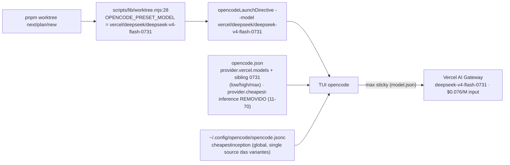

# Impl: Default de launch do worktree passa a usar o DeepSeek V4 Flash 0731 (mais barato) + limpeza de duplicatas do Cheapest Inference

Status: aprovado
Atualizado em: 2026-08-23
Issue: #817
Intenção: docs/plans/expor-variantes-deepseek-v4-flash-0731.md
Appetite restante: ~0,5–1 dia (config-only; sem migration, sem code além da constante e do bloco de config)

## Leitura da intenção

- **Outcome:** (1) a variante `max` do DeepSeek V4 Flash 0731 fica selecionável no TUI; (2) o preset de launch do worktree emite `--model vercel/deepseek/deepseek-v4-flash-0731` (input $0.076/M vs $0.13/M do `-flash`); (3) o TUI mostra um único DeepSeek e um único MiMo no Cheapest Inference (sem duplicatas). Verificável por `opencode debug config` (override com variantes no model key 0731), pela linha de launch emitida + literais/pin dos testes unit, e abrindo o seletor de modelo no TUI.
- **O que NÃO negociar:** anti-goals da intenção — NÃO mudar o cardápio de execução de Issues (`work-issue.md`/`plan-issue.md` nem o pin de `opencodeCommands.unit.spec.ts`); NÃO tocar no `~/.config/opencode/opencode.jsonc` global do humano (o provider `cheapestinception` global, sem hífen, é a fonte dele e carrega os models); NÃO editar docs históricos (`docs/plans`, `docs/CHANGELOG-AGENTS.md`, `docs/changelog/*`). Não tocar nos usos diretos do provider `deepseek/deepseek-v4-flash` fora do launch do worktree (`src/utilities/ai/campaignDemandTitle.ts`, `src/app/(campaign)/campanha/api/ai-chat/route.ts` — uso direto legítimo, fora de escopo).
- **O que reavaliar:** a hipótese de "Direção no codebase" da intenção estava errada em um ponto verificado ao vivo: o bloco `cheapest-inference` (com hífen) do `opencode.json` do repo ocupa as linhas **11–70** (fecha em `},` na 70), e não 11–33 como o plano dizia — e hoje ele **já define variantes** low/high/max nos models. O bloco inteiro (11–70) é o que sai. Reavaliado também: o default dentro do bloco repo é `deepseek-v4-flash` (sem namespace) e o `vercel.models` atual vive nas linhas 71–87; o sibling 0731 entra ao lado do `deepseek/deepseek-v4-flash` existente (73–85). O restante da direção da intenção confirmou-se exato após leitura dos arquivos.

## Abordagem recomendada



**Opções consideradas (Parte 1 — variantes do 0731):** A | B | C
**Recomendação:** A — expor as **três** variantes low/high/max no override `provider.vercel.models["deepseek/deepseek-v4-flash-0731"]`, espelhando exatamente o bloco do sibling `deepseek/deepseek-v4-flash` (OPS78). O model key existe no catálogo cache (input $0.076/M) mas com `reasoning_options` vazio — sem o override as variantes não ficam selecionáveis no TUI. Espelhar o bloco mantém o mecanismo uniforme entre os dois keys Vercel, sem custo extra e sem inventar formato.
**Rejeitadas:**

- **B — expor só `max`:** assimétrico com o sibling `-flash` que já expõe low/high/max; o custo de listar as três no mesmo bloco é zero, e só-`max` quebra a uniformidade do mecanismo de variantes que a OPS78 estabeleceu.
- **C — não fazer override (confiar no catálogo):** o `reasoning_options` do 0731 no cache é vazio — as variantes simplesmente não aparecem no TUI; falha o outcome 1.

**Opções consideradas (Parte 3 — remoção do duplicado):** A | B | C
**Recomendação:** A — remover o bloco `cheapest-inference` inteiro (linhas 11–70) do `opencode.json` do repo. O global `~/.config/opencode/opencode.jsonc` já define `cheapestinception` (sem hífen) com os mesmos `deepseek-v4-flash` + `mimo-v2.5` **e com variantes** — é o owner da preocupação e fica como fonte única; o bloco repo é um twin com variantes redundantes. Depois da remoção, `provider` do repo fica só com `vercel`.
**Rejeitadas:**

- **B — remover o global e manter o do repo:** anti-goal explícito da intenção; o global do humano é intocado (carrega a config de auth do provider).
- **C — manter ambos, sincronizando variantes:** viola engineering-standards ("edit the owner, don't twin") e mantém os dois DeepSeek + dois MiMo no TUI — falha o outcome 3.

**Decisão única (Parte 2 — swap do preset), textos inclusos:** A) trocar a constante `OPENCODE_PRESET_MODEL` E todos os pontos que duplicam o literal (lista verificada abaixo) na mesma mudança | B) trocar só a constante e deixar os textos. **Recomendação: A** — o literal duplicado em `scripts/worktree.mjs`, `.agents/shell/worktree.sh` e `.agents/skills/worktree-next-issue/SKILL.md` descreve o modelo de launch; ficarem desatualizados mentem pro dev e para a documentação do skill. **Rejeitada: B** porque deixa o repo inconsistentemente apontando para o modelo caro em 4 lugares.

### Componentes / mudanças

- **`opencode.json`** (`:11-70`): **remover inteiro** o bloco `provider.cheapest-inference` (com hífen): `deepseek-v4-flash` + `mimo-v2.5`. **`opencode.json`** (`:71-87`, dentro de `provider.vercel.models`): adicionar como sibling após `deepseek/deepseek-v4-flash` (73–85):
  ```json
  "deepseek/deepseek-v4-flash-0731": {
    "variants": {
      "low":  { "reasoningEffort": "low" },
      "high": { "reasoningEffort": "high" },
      "max":  { "reasoningEffort": "max" }
    }
  }
  ```
  (mesmo formato exato do fix de variantes da OPS78; o provider `vercel` é built-in/models.dev — sem npm/options adicionais.)
- **`OPENCODE_PRESET_MODEL`** (`scripts/lib/worktree.mjs:28`): valor → `'vercel/deepseek/deepseek-v4-flash-0731'`; atualizar o comentário `:22-27` (mencionar que o preset é o 0731, variante mais barata no gateway, variantes low/high/max no override). É a fonte única da string (OPS26), emitida em `opencodeLaunchDirective` — nenhum outro código lê o literal.
- **`tests/unit/worktree.unit.spec.ts`** (`:151,159,165,171,177,180,185,196`): atualizar os 8 literais da linha de launch para `vercel/deepseek/deepseek-v4-flash-0731`; `:185` pina a própria constante (`expect(OPENCODE_PRESET_MODEL).toBe(...)`) — trocar o literal esperado. **NÃO** mexer em `tests/unit/opencodeCommands.unit.spec.ts` (pina o frontmatter dos comandos de execução — anti-goal).
- **Textos (string atualizada, sentido OPS26 preservado):**
  - `scripts/worktree.mjs:27` (docblock) e `:779` (help `console.log`)
  - `.agents/shell/worktree.sh:10` (comentário header)
  - `.agents/skills/worktree-next-issue/SKILL.md:34` (prosa do skill sobre a diretiva de launch)
- **Migration:** sem migration — configuração/tooling apenas; nenhum schema de Payload muda.
- **Access / Consent:** N/A — não há collection nem dado de cidadão envolvido; não afeta login de campanha nem LGPD.
- **UI:** N/A — TUI do opencode é consumidor, não produto deste plano.

### Dados → forma (se aplicável)

N/A — tooling. Não há dado de negócio sendo modelado: são uma constante de config + remoção/acréscimo de bloco no `opencode.json`. (Perguntas de data-presentation não se aplicam.)

## Fases verificáveis

1. **Config (`opencode.json`)** — remover `provider.cheapest-inference` (11–70); adicionar o sibling 0731 com variantes em `provider.vercel.models`. Verificar: `node -e` para garantir JSON válido e `opencode debug config` mostrando SO o provider `vercel` (repo) + override de variantes no model key 0731. Quota: meia fase.
2. **Preset + literais + testes** — `scripts/lib/worktree.mjs:22-28` (constante + comentário); `tests/unit/worktree.unit.spec.ts` (8 literais: `:151,159,165,171,177,180,185,196`); textos `scripts/worktree.mjs:27,:779`, `.agents/shell/worktree.sh:10`, `.agents/skills/worktree-next-issue/SKILL.md:34`. Quota: meia fase.
3. **Gates** — `pnpm test:unit` (foco em `worktree.unit.spec.ts`); `pnpm gate:fast` (guards → lint → format → typecheck → knip → cycles → test:unit) verde; validação manual: `opencode run --model vercel/deepseek/deepseek-v4-flash-0731 --variant max` responde; launch real de teste (`pnpm worktree next` em branch descartável) emite `--model vercel/deepseek/deepseek-v4-flash-0731`; push via `pnpm push` → CI PR (checks).

## Rabbit holes / Não escopo (engenharia)

- NÃO mudar `.opencode/commands/work-issue.md` / `plan-issue.md` (frontmatter `model:`) nem o pin `tests/unit/opencodeCommands.unit.spec.ts` — cardápio de execução de Issues intacto (anti-goal).
- NÃO tocar no `~/.config/opencode/opencode.jsonc` do humano — o provider `cheapestinception` global é fonte de auth e models; a remoção é só no repo.
- NÃO editar `docs/CHANGELOG-AGENTS.md`, `docs/changelog/*` nem planos históricos — congelados (a entrada de changelog desta entrega é criada depois, no fluxo padrão `docs/changelog/<data>-<id>.md` + `pnpm changelog:build`).
- NÃO renomear o provider global nem "unify" os dois `cheapestinception`/`cheapest-inference` fora da remoção do bloco repo — o gap de nome é de produto e já está resolvido pela remoção.
- NÃO forçar a variante via `model.agent`/default (mesma rejeição da OPS78): variante fica selecionável e sticky no TUI, não imposta.
- NÃO inventar flag `--variant` na linha de launch nem sufixo `:max` no `--model` (TUI não suporta; formato estritamente `provider/model`).
- Não escopo: outros model keys de outros providers, inventário de catálogo, usos diretos de `deepseek/deepseek-v4-flash` no app (`campaignDemandTitle.ts`, `ai-chat/route.ts`).

## Riscos e mitigação

- **`opencode.json` inválido após a edição (hard-fail config do opencode)** → mitigação: paridade tipo JSON checada com `node -e "JSON.parse(...)"` antes de commit, e `opencode debug config` rodado na Fase 1; se o loader validar o bloco de models, a dúvida morre ali antes da Fase 3.
- **Sticky variant preso ao model key antigo (`~/.local/state/opencode/model.json`)** → trocar o preset para o 0731: a variante persistida por model key não migra sozinha; na primeira sessão o dev cicla a variante uma vez (keybind variant_cycle) e ela fica sticky no novo key. Não é ação do plano (comportamento upstream), só documentar no PR.
- **Duplicate literais fora da lista verificada** → mitigação: o swap de Fase 2 cobre o conjunto verificado (8 testes + 4 textos + constante); testes unit pínam a linha de launch e `:185` pina a constante — deriva volta na CI. Rodar `rg "vercel/deepseek/deepseek-v4-flash-0731"` pós-mudança para conferir o agreeing, e `rg "deepseek-v4-flash"` para confirmar que só ficaram os usos diretos intencionais (frontmatter dos comandos + app).
- **Remover `cheapest-inference` e o global não cobrir algo (ex.: npm do provider)** → caminho do explorer verificado: o global já define `cheapestinception` com os mesmos `deepseek-v4-flash` + `mimo-v2.5` com variantes. Mitigação: confirmar no `opencode debug config` que os models globais continuam listados depois da remoção; reverter a remoção é um `git checkout` de um bloco isolado.

## Aceite de engenharia

- [ ] Aceite de produto da intenção coberto: variante `max` (e low/high) do 0731 selecionável no TUI via override; preset emite `--model vercel/deepseek/deepseek-v4-flash-0731`; TUI mostra um único DeepSeek e um único MiMo no Cheapest Inference após remoção do bloco repo; verificável por `opencode debug config`, linha de launch + testes unit atualizados.
- [ ] Anti-goals preservados: `work-issue.md`/`plan-issue.md` e `opencodeCommands.unit.spec.ts` intactos; `~/.config/opencode/opencode.jsonc` intacto; docs históricos intactos; usos diretos `deepseek-v4-flash` do app intactos; config-only (sem migration, sem code além da constante).
- [ ] Invariantes AGENTS/engineering-standards: constante single-source mantida (OPS26), provider duplicado removido (owner global fica como fonte única — sem twin), testes de domínio atualizados onde o literal muda.
- [ ] `pnpm test:unit` verde (spec `worktree.unit.spec.ts`) e `pnpm gate:fast` verde; `opencode debug config` validado antes de marcar aprovado/executar.

## Self-score decision-quality

1. **Decisões caras têm rejeitadas?** Sim — Parte 1 (A/B/C com C falhando o outcome) e Parte 3 (A/B/C, com B sendo anti-goal), Parte 2 decidida em A vs B com rejeitada registrada.
2. **Abordagem cabe no appetite da intenção?** Sim — config-only, duas edições em `opencode.json` + swap mecânico de literais; ~0,5–1 dia mantido.
3. **Rabbit holes nomeados?** Sim — cardápio de execução, global do humano, docs históricos, renome/unificação de providers, variante forçada, flag inexistente.
4. **Depth check: reusa shells/helpers existentes?** Sim — nenhum helper novo; espelha o override da OPS78 e reusa a constante single-source OPS26 + os pins de teste existentes.
5. **Intenção (aceite de produto) permanece satisfeita?** Sim — a engenharia não reescreveu o outcome; a única divergência da intenção (extensão real do bloco 11–70 vs 11–33) não muda o resultado, só o escopo exato da remoção.

**Score: 5/5**
