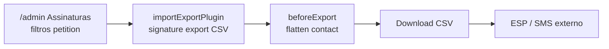

# Exportar CSV das assinaturas e contatos (admin Payload)

Status: entregue 2026-07-23
Atualizado em: 2026-07-23
Item do roadmap: [docs/roadmap.md](../roadmap.md) (Admin Payload — export CSV de `signature` e `contact`)
Impeccable: B — encaixe na list view admin via plugin oficial (sem rota `/campanha` nova)
Appetite: ~0,5–1 dia eng; plugin `@3.82.0` alinhado ao core (sem bump) + flatten de `contact`/`petition` em `signature` + migration das collections do plugin
Responsável: —

_Revisão 2026-07-23: implementação com `@payloadcms/plugin-import-export@3.82.0` (peer dep bate com Payload 3.82 — bump desnecessário). API 3.82 usa `toCSV` nos campos (não `hooks.beforeExport` da doc ≥3.85). Migration `20260723_025513_add_import_export_plugin`; helpers em `src/utilities/signatureExport.ts`. Pós-entrega: export CSV também em `contact` (campos nativos, sem flatten) via `adminCsvExportCollection()` em `payload.config.ts`._

## Design (Impeccable)

Âncoras: admin Payload nativo (grupo `Abaixo-assinados`); **não** Field Desk / `data-theme='campaign'`. Labels pt-BR nas strings visíveis do plugin quando configuráveis.

Na implementação (`implement-roadmap-item`): craft compacto → critique → polish (smoke no `/admin/collections/signature`: filtrar petição → Exportar → CSV abrível). Sem shape longo.

Brief compacto:

- **Persona / contexto:** operação/marketing no `/admin` precisa da lista de assinantes (e-mail/celular) para disparo externo sobre o abaixo-assinado.
- **Job principal:** baixar um CSV filtrável das assinaturas com PII de contato já achatada, sem sair do Payload.
- **Estratégia de cor:** Restrained (chrome do admin Payload; sem paleta nova).
- **Edit where you see:** N/A (só leitura/export; mutação de assinaturas não é o job).
- **Anti-goals:** import em massa de assinaturas; botão custom fora do plugin; disparo de e-mail/SMS **dentro** do Teqo; segundo design system.

## Dados → decisão → apresentação

- **Vou apresentar dados?** Sim, superfície neste item (arquivo CSV baixado no admin).
- **Decisões desbloqueadas:**
  - Operação/marketing: “estes assinantes entram no disparo de e-mail/SMS desta petição?”
  - Operação: “filtro por abaixo-assinado X antes de exportar — conjunto certo?”
- **Forma escolhida:** tabela CSV (degrau tabela/lista) — **por quê:** ferramentas externas de e-mail/SMS consomem CSV/planilha; é o contrato operacional. **Rejeitado:** dashboard/KPI de assinaturas nesta fatia; chart; export só JSON; página pública de download.
- **Profile:** categórico + PII textual; granularidade = 1 linha por `signature`; tamanho típico = milhares (não centenas de mil); absoluto (lista nominal, não %).
- **Anti-goals de dado:** sem vanity “total de leads” como substituto do CSV; sem incluir campos internos irrelevantes ao disparo (`consent` richText, locks); sem vazar para quem não é `users` admin.

## Contexto

Assinaturas de abaixo-assinados vivem na collection `signature` (`src/collections/Signature.ts`): join `contact` + `petition` + `consent` (+ `comment` opcional). O PII útil para disparo (nome, e-mail, celular, UF/cidade) está em `contact` (`src/collections/Contact.ts`), não nas colunas da assinatura. Hoje o admin lista relacionamentos por ID/título, **sem** botão de export.

O time pediu (2026-07-22) um botão no admin Payload para exportar CSV das assinaturas, a ser usado em disparos de e-mail e SMS **fora** deste app. O usuário suspeitou corretamente de feature nativa: Payload oferece [`@payloadcms/plugin-import-export`](https://payloadcms.com/docs/plugins/import-export) (CSV/JSON na list view; saiu de beta no release 3.85). O app está em Payload `3.82.0` — a implementação deve alinhar a versão do plugin ao core (preferir bump ≥3.85 se o pacote estável exigir).

Este app **não** dispara e-mail/SMS em massa (roadmap: fora de escopo WhatsApp Business / disparo em massa; Res. TSE 23.610). O produto só entrega o arquivo; o canal externo fica com a operação.

## Objetivos

- Na list view de **Assinaturas** (`/admin/collections/signature`): controles de export CSV (download direto).
- Na list view de **Contatos** (`/admin/collections/contact`): export CSV com campos nativos (`name`, `email`, `phone`, `gender`, `state`, `city`, `postalCode`, `createdAt`) — sem flatten.
- CSV de assinaturas com colunas achatadas de `contact` úteis a ESP/SMS (no mínimo nome, e-mail, telefone; preferir também UF/cidade, id/título da petição, `createdAt`, comentário).
- Respeitar filtros da list view (exportar só o conjunto filtrado — tipicamente um `petition` em assinaturas).
- **Só export** em `signature` e `contact` (`import: false`); não habilitar o plugin em collections irrelevantes.
- Guardrails: access só para sessão `users` do admin; migration para collections `exports`/`imports` que o plugin cria; `push: false`; sem novo `Consent` key (titular já consentiu na assinatura); sem jobs queue nesta fatia se evitável (`disableJobsQueue: true`).

## Decisões travadas

- **Usar o plugin oficial `@payloadcms/plugin-import-export`, não endpoint/botão caseiro.** Já resolve UI admin, preview, CSV, depth de relationships e (opcional) fila. **Rejeitado:** custom `admin.components` + route handler CSV (duplica o que o plugin faz); CLI-only (`pnpm` script) — fora do fluxo “botão no admin”; plugin community antigo `madaxen86/payload-plugin-import-export` — preferir o oficial alinhado ao core.
- **Escopo v1 = `signature` + `contact`, com `import: false` e `export.format: 'csv'`.** Import de assinaturas reinventaria opt-in/Consent e risco de duplicata Contact. `contact` exporta campos planos; `signature` achata relationships via `toCSV`. **Rejeitado:** plugin em todas as collections; import habilitado “por se”; JSON como formato default (CSV é o pedido operacional).
- **Achatamento de `contact`/`petition` em `signature` via `toCSV` do plugin** (relationship → colunas `contact_name`, `contact_email`, `contact_phone`, …). **Rejeitado:** exportar só IDs de relacionamento (inútil para ESP); denormalizar PII na row `signature` (migration cara, duplicação).
- **v1 síncrono (`disableJobsQueue: true`)** — o projeto ainda não tem `jobs.autoRun`/runner; fila deixaria exports em “pending”. **Rejeitado:** montar cron/jobs só para este botão nesta fatia. Gatilho para fila: volume que estoure timeout de request ou pedido explícito de save-to-`exports`.
- **Sem disparo in-app.** CSV é handoff para ferramenta externa. **Rejeitado:** Resend em massa no Teqo; integração Twilio/SMS; “campanha” de e-mail no Payload.
- **i18n e naming:** identificadores em inglês (`importExportPlugin`, hooks `beforeExport`); labels admin em pt-BR (“Assinaturas”, “Exportar”).

## Questões em aberto

- **Bump de Payload 3.82 → ≥3.85 junto com o plugin?** **Resolvido 2026-07-23:** `@payloadcms/plugin-import-export@3.82.0` instalado sem bump — peer dep `payload@3.82.0` confirmado no npm.
- **Conjunto exato de colunas do CSV?** **Opções:** mínimo (nome/e-mail/telefone) | operacional (mínimo + petition id/title + createdAt + city/state + comment). **Recomendação:** operacional — um export serve e-mail e SMS sem segundo passo. Confirmar com quem dispara se e-mail vazio deve aparecer como linha (telefone é required no Contact; e-mail é opcional).
- **Visibilidade das collections `exports`/`imports` no sidebar?** **Opções:** ocultas (default do plugin) | grupo admin “Abaixo-assinados” / “Ferramentas”. **Recomendação:** manter ocultas no v1 (`disableSave: true` se só download direto); abrir sidebar só se operação pedir histórico de arquivos salvos.

## Abordagem proposta

Componentes:

- **`importExportPlugin`** em `src/payload.config.ts`: `adminCsvExportCollection('signature' | 'contact')` com `export: { format: 'csv', disableJobsQueue: true, disableSave: true }`, `import: false`. Access nas collections geradas via `overrideExportCollection` restrito a `users` autenticados (espelhar padrão admin).
- **Hooks de campo / collection** em `src/collections/Signature.ts` (ou helper `src/utilities/signatureExport.ts` se o arquivo da collection ficar gordo): `custom['plugin-import-export'].hooks.beforeExport` no relationship `contact` (e, se útil, `petition`) para colunas planas; `consent` com `disabled: true` no custom do plugin (não exportar texto jurídico versionado).
- **Depth / populate:** garantir que o export carregue `contact` e `petition` populados o suficiente para o flatten (seguir default do plugin; ajustar se IDs crus aparecerem no preview).
- **Bump de pacotes** (se necessário): `payload` + `@payloadcms/*` alinhados; `pnpm generate:types` / `generate:importmap`.
- **Migration:** o plugin adiciona collections `exports` / `imports` (uploads) — `pnpm migrate:create add_import_export_plugin` (nome final na implementação) e `pnpm migrate` local. Sem alterar schema de `signature`/`contact`.
- **Testes:** unit do flatten (dado `contact` populado → colunas esperadas); smoke manual admin (filtro por petição → CSV). Int opcional se houver harness de plugin; não bloquear appetite com e2e Playwright do admin.

## Dependências

- Nenhuma dura de outro plano de trilha A/B/C/D.
- Suave: RBAC em `users` (bloqueador AGENTS #1) — hoje todo admin `users` já tem acesso pleno; quando houver roles, reaplicar access no override das collections do plugin.
- Suave: textos finais de Consent / privacidade (Onda 0) — não bloqueiam o botão; o titular já optou na assinatura. Operação deve usar o CSV só para fins compatíveis com o consentimento coletado _(assumido — validar com jurídico se o texto atual cobre comunicação sobre o abaixo-assinado)_.

## Não escopo

- Disparo de e-mail/SMS dentro do Teqo (fora de escopo do roadmap / Res. TSE).
- Export de `subscription`, `supporter`, `leadership` (itens separados se pedido).
- Import CSV de assinaturas / reimport.
- CAPI / Pixel (já em [pixel-meta-abaixo-assinado.md](pixel-meta-abaixo-assinado.md)).
- Jobs queue / cron / save histórico em `exports` com blob (adiado abaixo).
- UI em `/campanha` para assinaturas públicas.

## Rabbit holes

- **Habilitar `import: true` “só para reprocessar”.** Explode Consent, dedup de telefone e joins. **Mitigação:** `import: false` travado neste plano.
- **Plugin em todas as collections “já que instalou”.** Expõe PII de campanha sem pedido. **Mitigação:** whitelist só `signature` e `contact`.
- **Montar `jobs.autoRun` + runner Vercel só para export.** Fora do appetite. **Mitigação:** `disableJobsQueue: true`; gatilho abaixo.
- **Planilha tipo CRM no admin (colunas editáveis, bulk).** Não é export. **Mitigação:** CSV download only.

## Adiado com gatilho

- **Jobs queue + save em `exports` (Vercel Blob).** Revisitar quando: export síncrono estourar timeout / operação pedir arquivo versionado no admin.
- **Access fino por role de `users`.** Revisitar quando: item “RBAC em `users`” do Admin Payload for implementado.
- **Export de `subscription` (base WhatsApp/site).** Revisitar quando: operação pedir lista transversal fora de petição específica.
- **`defaultPopulate` nas collections relacionadas (`contact`, `petition`, `consent`).** Revisitar quando: export síncrono ficar lento ou estourar timeout — evitar carregar `petition.body` / `consent.text` no `depth:1` default do plugin.
- **`contactFromRelationship` compartilhado com `supporterViewModels`.** Revisitar quando: 3º call site de “contact populado de relationship”.
- **Constante `importExportConsentDisabled` para fields `consent`.** Revisitar quando: export de `subscription` (2º campo `consent` com `disabled: true`).

## Já resolvido no simplify (não reabrir)

- Consolidar flatten em `signatureContactToCSV` / `signaturePetitionToCSV` (sem wrappers `flatten*` exportados).
- Testes via `runToCSV` nos handlers `toCSV` de produção.
- Nullable consistente (`?? ''`) nos campos de contato do export de assinaturas.
- `withImportExportAdminAccess` + `importExportAdminOnly` (access DRY nas collections `exports`/`imports`).
- `adminCsvExportCollection()` (config DRY entre `signature` e `contact`).
- `isPopulatedRelationship<Contact>` direto (sem `isPopulatedContact` redundante).

## Explicitamente fora (triage pós-entrega 2026-07-23)

- **`export.limit` no plugin** — sem evidência de abuso em v1; reabrir com profiling.
- **Populate de `consent` no depth do plugin** — excluído do CSV; custo marginal do batch do plugin.
- **Factory genérica `plugin-import-export` nos 3 fields de `Signature`** — YAGNI (1 collection).
- **Módulo `importExportPlugin.ts` separado do `payload.config`** — organizacional; parcialmente coberto por `adminCsvExportCollection`.
- **Variante `isPopulatedRelationship` para id string (`Petition`)** — 1 consumidor; guard local em `signatureExport.ts` suficiente.
- **Colunas `contact_*` compartilhadas entre export de `contact` e `signature`** — schemas intencionalmente diferentes (`name` vs `contact_name`).
- **Usar `canManageContacts` no access do plugin** — semântica errada; manteve `isPayloadAdmin`.

## Referências

- `docs/roadmap.md` (Admin Payload; Site público — abaixo-assinados)
- [Payload Import Export Plugin](https://payloadcms.com/docs/plugins/import-export) — config `export`/`import`, `disableJobsQueue`, `beforeExport`
- `src/collections/Signature.ts` — collection alvo
- `src/collections/Contact.ts` — campos a achatar
- `src/app/(frontend)/actions/submitPetitionSignature.ts` — origem dos dados (Contact + Signature + Subscription na mesma TX)
- `src/payload.config.ts` — registro do plugin
- `docs/plans/pixel-meta-abaixo-assinado.md` — precedente recente da vertical abaixo-assinados no admin
- AGENTS.md — naming; `push: false` + migrations; LGPD/Consent (sem nova key); Known Gap #1 RBAC admin
