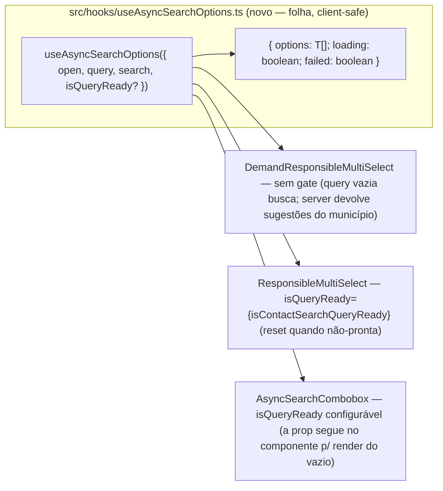

# Impl: Extrair hook compartilhado de busca assíncrona com debounce (3ª cópia)

Status: rascunho
Atualizado em: 2026-08-23
Issue: #765
Intenção: body é spec (E1 — não há link de plano; a spec é a própria intenção citada)
Appetite restante: fix pontual P2 — sem appetite declarado no body; tratado como fix pontual (refactor estrutural sem schema/server/migration)

## Leitura da intenção

- **Outcome:** a 3ª cópia do efeito de busca assíncrona com debounce (requestId + `setTimeout` 250ms + loading/failed) desaparece: um hook compartilhado `useAsyncSearchOptions({ open, query, search }) → { options, loading, failed }` é consumido por `DemandResponsibleMultiSelect` (C143), `ResponsibleMultiSelect` (C90) e `AsyncSearchCombobox`; cada componente mantém só o que é seu (grupos, avatar, sugestões, caps).
- **O que NÃO negociar:** comportamento idêntico nos 3 call sites (fix pontual — nenhuma mudança de UX); a semântica de query vazia **difere** entre os 3 e o hook não pode unificá-la; padrão `searchRef`/`isQueryReadyRef` preservado; server actions intocadas (continuam como props); `WizardMunicipalitySearchStep` (4ª variante, AbortController/requestSeq) fica fora; copy pt-BR e identificadores em inglês.
- **O que reavaliar:** a intenção propõe `T extends { id: string }` — **errado contra o código**: os três tipos reais (`RelationOption`, `ResponsibleOption`, `AsyncSearchOption`) usam `id: number` (D2). A intenção não fixa onde o hook mora — a exploração mostra que `src/hooks/` tem só `use-mobile.ts` (viewport), hooks de campanha hoje colacam no domínio (`useMicTranscript` em `shell/ai/`, `useHomeSearchQuery` em `dashboard/`) e `src/lib/campaignLongPress.ts` já hospeda um hook; a fronteira é deliberada em D1.

## Abordagem recomendada

**Opções consideradas:** D1–D5 abaixo (fronteira de módulo, API/generics, gate, fronteira hook×componente, exports/teste).

**Recomendação:** novo módulo `src/hooks/useAsyncSearchOptions.ts` exportando `useAsyncSearchOptions<T extends { id: number }>` + `ASYNC_SEARCH_DEBOUNCE_MS` (250) + o tipo do resultado; os 3 componentes trocam o efeito duplicado por uma chamada ao hook, passando `search` (server action já recebida por prop — o hook fica client-safe por injeção) e, onde existem, seus gates (`isContactSearchQueryReady` no `ResponsibleMultiSelect`, gate configurável no `AsyncSearchCombobox`, nenhum no `DemandResponsibleMultiSelect`). Teste unitário do hook com `renderHook` + fake timers (padrão `campaignHomeSearchQuery.unit.spec.ts`). Nada de schema/server/access/Consent; sem migration.

**Rejeitadas:** ver D1–D5.

### Decisões de engenharia

**D1 — Onde mora o hook (fronteira de módulo; caro de reverter).**
Opções: A) `src/hooks/useAsyncSearchOptions.ts` (novo, junto a `use-mobile.ts`) | B) `src/lib/useAsyncSearchOptions.ts` | C) `src/components/campaign/shared/useAsyncSearchOptions.ts`.
Recomendação: **A** — (1) `src/hooks/` é o home designado de hooks React do repo e **não é pinado**: o pin de top-level de `codebaseConventions.unit.spec.ts` (L389) cobre só `src/utilities/` — um módulo novo em `src/hooks/` não exige registro nem atualização de spec; (2) direção de dependência: `src/hooks/` é folha do DAG (importa só `react`), importável de `components/` sem ciclo (madge confirma) — a cadeia `lib/ → utilities/ → components/ → app/` não é violada; (3) o hook é deliberadamente genérico (não conhece vocabulário de campanha: `T` e gate são injetados), então uma localização em path de campanha superestimaria a posse do domínio; (4) sem diretiva `'use client'` (módulo client-safe folha consumido só por client components, como `use-mobile.ts`).
Alternativas rejeitadas: B — o único hook em `lib/` (`useCampaignLongPress` em `campaignLongPress.ts`) está colocado ali por coesão de módulo (hook + constante `CAMPAIGN_LONG_PRESS_MS` + handlers próprios no mesmo arquivo); `useAsyncSearchOptions` não tem lógica lib-side para colocar junto (`isContactSearchQueryReady` fica no módulo lib existente, injetado como prop — depth check), então em `lib/` o hook alargaria a exceção "React em lib" sem payoff de coesão e borraria "lib = helpers puros" para leitores futuros; C — os precedentes de colação (`useMicTranscript`, `useHomeSearchQuery`) são hooks **privados de feature** com estado acoplado à feature; este hook atravessa `demand/` + `shared/` e sua API não referencia tipos de campanha, e `shared/` comunica "componente compartilhado de campanha" — localização enganosa para um consumidor genérico futuro.

**D2 — API do hook e debounce.**
Opções: A) `T extends { id: string }` (como sugerido na intenção) | B) `T extends { id: number }` | C) `T` sem constraint | D) debounce como prop opcional com default 250.
Recomendação: **B + debounce fixo** — os três call sites reais têm `id: number` (`RelationOption`, `ResponsibleOption`, `AsyncSearchOption`); a constraint documenta o shape e rejeita consumidor divergente sem custo (o hook não inspeciona `id` — filtragem fica nos componentes). Debounce fixo: os 3 usam 250ms hoje; prop é especulação (YAGNI). A constante é **exportada** (`ASYNC_SEARCH_DEBOUNCE_MS`), espelhando os precedentes do repo (`HOME_SEARCH_DEBOUNCE_MS` em `campaignHomeSearchContract.ts`, `CAMPAIGN_LONG_PRESS_MS` em `campaignLongPress.ts`) — é o que permite o teste com fake timers sem hardcode.
Alternativas rejeitadas: A — nenhum call site usa `id: string`; constraint errada contra o código; C — perde a documentação do shape mínimo e permite uso divergente; D — barato de adicionar depois (gatilho: 4º consumidor com debounce ≠ 250ms); não decidir agora é a decisão.

**D3 — Gate de query mínima (muda API pública do hook — registrar).**
Opções: A) prop opcional `isQueryReady?: (query: string) => boolean`, default `() => true`, lida via ref (padrão `isQueryReadyRef` preservado) e checada **dentro do efeito, antes do timeout**, com reset `options/loading/failed` quando false | B) hook sempre busca; gate fica fora (cada componente pré-filtra) | C) unificar: o hook aplica `isContactSearchQueryReady` por default.
Recomendação: **A** — reproduz borda a borda os 3 comportamentos: `DemandResponsibleMultiSelect` busca sempre (default `() => true`; query vazia → server devolve sugestões de assessores do município — fill-in C143), `ResponsibleMultiSelect` reseta com `isContactSearchQueryReady` (L80-85), `AsyncSearchCombobox` com gate configurável (`DemandFields` município, `ContactCombobox` contato). O reset in-effect (options=[], loading=false, failed=false) é o mesmo código nos 2 gated e mora no hook; o guard `requestId` em then/catch/finally e o `cleanup` `clearTimeout` também. Trim: o hook aplica `query.trim()` internamente (os 3 trimmam hoje); server actions seguem trimmando defensivamente — intocadas.
Alternativas rejeitadas: B — o reset + guard vazaria para cada componente, recriando a duplicação que a entrega elimina; C — unificar mudaria comportamento (Demand ganharia um gate que não tem hoje) e a intenção é explícita: "a semântica de query vazia difere e o hook não pode unificá-la".

**D4 — Fronteira hook × componente (o que fica em cada um).**
Opções: A) hook devolve só `{ options, loading, failed }` brutos; todo filtro/agrupamento/headings/caps fica no componente | B) hook também filtra selecionados (recebe `selected`) | C) hook devolve estado normalizado (grupos prontos).
Recomendação: **A** — a filtragem difere entre os 3 (`Set<number>` de ids no Demand vs chave `relationTo:id` no Responsible vs `id !== selected?.id` no combobox), grupos por `typeLabel` só existem no Responsible, `pinnedOptions`/grupos fixos "Seleção"/"Selecionado"/"Resultados" só no combobox, `shortQuery`/headings "Sugestões do município"/"Assessores" e avatares só no Demand — nenhum conhecimento é comum; passar isso ao hook criaria API especulativa e pass-through (depth check: não criar).
Alternativas rejeitadas: B — unificar a chave de filtro mudaria a semântica de dedupe do `ResponsibleMultiSelect` (`relationTo:id`); C — normalizar 3 formas distintas numa só é a duplicação inversa (o hook conheceria UI de 3 consumidores).

**D5 — Exports do módulo, "registro" e teste unitário.**
Opções: A) módulo exporta o hook + `ASYNC_SEARCH_DEBOUNCE_MS` + tipo `UseAsyncSearchOptionsResult<T>`; teste unitário novo com `renderHook` + `vi.useFakeTimers` | B) sem tipo de retorno exportado; cobertura só pelos specs existentes dos consumidores.
Recomendação: **A** — "registrar o hook com type `useAsyncSearchOptions`" aqui significa exportar o hook com sua assinatura tipada (parâmetros `{ open, query, search, isQueryReady? }` + retorno `{ options: T[]; loading: boolean; failed: boolean }`) — **não há pin/registro a atualizar**: `src/hooks/` não é pinado (o pin de `codebaseConventions.unit.spec.ts:389` cobre só top-level de `src/utilities/`), knip valida o export consumido, e hook não é componente Payload (sem import map). Teste: `tests/unit/useAsyncSearchOptions.unit.spec.tsx` no padrão de `campaignHomeSearchQuery.unit.spec.ts` (`renderHook` + `vi.useFakeTimers` + `vi.advanceTimersByTime(ASYNC_SEARCH_DEBOUNCE_MS)`) — infra já existente (também `useMicTranscript`, `campaignCellAutosave`), **sem infra nova**. Como a `search` é injetada por prop (e não importada de módulo), o teste passa `vi.fn()` com resolves/rejects controlados — não há módulo server a mockar; o padrão de mock de `activityOverlay.unit.spec.tsx` (L20-23) continua valendo para os consumidores, que ficam intocados.
Alternativas rejeitadas: B — a mecânica requestId/gate/debounce é a parte mais sutil da extração (fonte de regressão silenciosa) e hoje só é coberta indiretamente por e2e; o teste direto do hook é barato e pinaria o contrato que os 3 componentes passarão a compartilhar.

### Componentes / mudanças

- **`useAsyncSearchOptions` + `ASYNC_SEARCH_DEBOUNCE_MS` + `UseAsyncSearchOptionsResult<T>`** (`src/hooks/useAsyncSearchOptions.ts`, novo): estado `options/loading/failed`; refs `requestId`, `searchRef`, `isQueryReadyRef` (atribuídos no render, como hoje); efeito com `if (!open) return`; gate lido via ref **antes** do timeout (reset e return); `setTimeout(ASYNC_SEARCH_DEBOUNCE_MS)` → `setLoading(true)/setFailed(false)` → `search(query.trim())` com guards `requestId.current !== currentRequestId` em then/catch/finally; cleanup `clearTimeout`. Sem diretiva `'use client'` (folha client-safe, como `use-mobile.ts`). Deps do efeito: `[open, query]` — gate e search via ref, sem re-execução por identidade (padrão preservado).
- **`DemandResponsibleMultiSelect`** (`src/components/campaign/demand/DemandResponsibleMultiSelect.tsx`): remove estados/refs L61-69 e o efeito L71-94; `const { options, loading, failed } = useAsyncSearchOptions({ open, query, search })` (sem gate — busca sempre). Mantém: `selected`/chips/avatar/`(criador)`/`lockCreator`/hidden inputs, `visibleOptions` (filtro por `selectedIds`), `shortQuery` e headings "Sugestões do município"/"Assessores", mensagens de vazio.
- **`ResponsibleMultiSelect`** (`src/components/campaign/shared/ResponsibleMultiSelect.tsx`): remove L67-76 e o efeito L78-107; hook com `isQueryReady={isContactSearchQueryReady}`. Mantém: `groups` por `typeLabel`, `atCapacity`, mensagem "Digite ao menos dois caracteres…" (o import de `isContactSearchQueryReady` permanece — usado no render, L224), hidden JSON, chips com `typeLabel`.
- **`AsyncSearchCombobox`** (`src/components/campaign/shared/AsyncSearchCombobox.tsx`): remove estados/refs L49-60 e o efeito de busca L66-95; hook com `isQueryReady` (a prop continua no componente — usada no render do vazio, L189). **O efeito sync `selected←value` (L62-64) FICA no componente** (é contrato do combobox, não da busca). Mantém: `pinnedOptions`/`pinnedGroupHeading`, grupos "Seleção"/"Selecionado"/"Resultados", `choose()`, `emptyOptionLabel`, `queryTooShortMessage`.
- **Consumers de `AsyncSearchCombobox`** (`DemandFields.tsx:85`, `ContactCombobox.tsx:38`, `ActivityTaskFields.tsx:98`): intocados (o gate é resolvido dentro do combobox).
- **`tests/unit/useAsyncSearchOptions.unit.spec.tsx`** (novo): ~5 `it` — debounce só dispara após `ASYNC_SEARCH_DEBOUNCE_MS`; query rápida em sequência cancela o timer anterior (só a última busca); gate não-pronto → reset sem chamar `search`; resposta fora de ordem descartada (requestId) e `catch` → `failed`, `finally` → `loading=false`; `open=false` não busca.
- **Migration:** nenhuma (refactor client, sem schema). **Access / Consent:** nenhum (server actions intocadas; sem escrita nova, PII ou chave). **UI:** Impeccable A — refactor estrutural sem superfície nova.

### Dados → forma

N/A — refactor de estado de UI; nenhuma métrica, série, ranking ou mapa novo.

## Fases verificáveis

1. **Tracer / schema+server** — nada de schema/server (as server actions já são props dos 3 componentes e ficam intocadas; sem migration; sem access/Consent). O tracer é o próprio hook: criar `src/hooks/useAsyncSearchOptions.ts` + `tests/unit/useAsyncSearchOptions.unit.spec.tsx` e rodar `pnpm gate:fast` — a mecânica requestId/debounce/gate fica provada isolada (renderHook + fake timers) antes de tocar os 3 componentes.
2. **UI** — migrar os 3 componentes (ordem: `AsyncSearchCombobox` e `ResponsibleMultiSelect` em `shared/` primeiro, depois `DemandResponsibleMultiSelect` em `demand/`), mantendo em cada um só o que é seu (D4); registrar o hook com seu type público `useAsyncSearchOptions` (assinatura + `UseAsyncSearchOptionsResult<T>` exportados — sem pin a atualizar: `src/hooks/` não é pinado; knip valida o consumo). Rodar os e2e afetados da superfície antes do push: `pnpm test:e2e:affected` (activity + demand).
3. **Gates** — `pnpm gate:fast`; `pnpm check:cycles` (hook é folha — sem ciclo), `pnpm format:check`, `pnpm exec knip`, `pnpm test` (unit + int — incl. `campaignDemandWorkflow.int.spec.ts`, que cobre o record de responsáveis C143), `pnpm build`; push via `pnpm push`.

## Rabbit holes / Não escopo (engenharia)

- `WizardMunicipalitySearchStep.tsx:107-139` (4ª variante: POST + `AbortController` + `requestSeq`) — mecânica diferente; fora, como a intenção marca.
- `useHomeSearchQuery` (`src/components/campaign/dashboard/useHomeSearchQuery.ts`) — debounce-only, sem requestId/loading/failed e com contrato de busca própria (`HOME_SEARCH_DEBOUNCE_MS` em lib); não é a mesma mecânica; sem gatilho para consolidar (1 variante).
- Adicionar `AbortController` ao hook — os 3 hoje são guardados por requestId com cleanup só `clearTimeout`; abort mudaria o comportamento sob requisições lentas (o requestId descarta a resposta, não cancela o fetch). Defer com gatilho: call site que exija cancelamento real de rede.
- Prop `debounceMs` — especulação (D2); gatilho: 4º consumidor com debounce ≠ 250ms.
- Unificar a semântica de query vazia / normalizar grupos, pinned, headings ou avatares no hook — D3/D4.
- Mexer nos specs existentes que mockam as server actions (`activityOverlay.unit.spec.tsx`, `activityAgendaInteractions.unit.spec.tsx` mockam `searchActivityResponsibleOptionsAction` na camada de componente) — continuam válidos; a action não muda.
- DRY <3 call sites não é rabbit hole aqui — são exatamente 3 call sites reais com comportamentos divergentes (gate/sugestões/grupos), por isso o hook é fino e o resto fica nos componentes.

## Riscos e mitigação

- **Regressão silenciosa de comportamento em 3 superfícies:** mitigado por (a) equivalência borda-a-borda no diff (open/gate/trim/debounce/requestId em then/catch/finally/cleanup — cada linha do efeito removido tem correspondente no hook), (b) teste unitário do hook com fake timers e resolves controlados (inclui fora-de-ordem), (c) e2e afetados: `campaignActivity.e2e.spec.ts`, `campaignRegisterDemand.e2e.spec.ts`, `campaignDemandVisibility.e2e.spec.ts` + `tests/int/campaignDemandWorkflow.int.spec.ts` (C143).
- **Gate mal copiado (reset fora do efeito):** o reset de `options/loading/failed` quando `isQueryReady` é false é parte da semântica de hoje (ResponsibleMultiSelect L80-85, AsyncSearchCombobox L68-73) — o hook o reproduz dentro do efeito, antes do timeout; teste cobre o caso.
- **`requestId` off-by-one:** padrão idêntico ao atual (`++requestId.current` capturado, comparado em then/catch/finally); teste de resposta fora de ordem pinça.
- **Ciclo de import:** hook importa só `react`; `check:cycles` confirma a folha do DAG.
- **knip:** exports do hook consumidos pelos 3 componentes; `ASYNC_SEARCH_DEBOUNCE_MS` usado no spec — nenhum export órfão.

## Aceite de engenharia

- [ ] Aceite de produto da intenção ainda coberto: 3ª cópia eliminada; os três componentes consomem `useAsyncSearchOptions`; comportamento idêntico (debounce 250ms, requestId, loading/failed, gates por componente); cada um mantém grupos/avatar/sugestões/caps
- [ ] Invariantes AGENTS/engineering-standards: hook client-safe por injeção (server actions continuam props — sem import server no hook); sem migration; sem access/Consent; identificadores em inglês; copy pt-BR intocada
- [ ] Testes de domínio previstos: unit novo do hook (`renderHook` + fake timers) — access/write paths não mudam (server actions intocadas), então sem testes int novos; e2e afetados da superfície activity/demand rodados
- [ ] Self-score decision-quality: 5/5 (abaixo)

## Self-score decision-quality: 5/5

1. **Decisões caras têm rejeitadas?** Sim — D1 (fronteira de módulo, caro) e D3 (API pública do hook com gate) têm opções e rejeitadas explícitas; D2/D4/D5 são baratas mas registradas porque a intenção exigiu deliberar a API (generics, debounce, fronteira hook×componente, teste).
2. **Abordagem cabe no appetite?** Sim — fix pontual P2: refactor estrutural que **remove** ~90 linhas de efeito duplicado, sem schema/server/migration/UI nova; nada de AbortController, `debounceMs`, normalização ou unificação de gates.
3. **Rabbit holes nomeados?** Sim — `WizardMunicipalitySearchStep`, `useHomeSearchQuery`, AbortController, `debounceMs`, unificação de query vazia/grupos, specs existentes que mockam as actions.
4. **Depth check: reusa shells/helpers existentes?** Sim — reusa `isContactSearchQueryReady` (lib existente) como gate injetado (sem duplicar a lógica de query mínima); preserva os padrões `searchRef`/`isQueryReadyRef`; exporta a constante de debounce como os precedentes `HOME_SEARCH_DEBOUNCE_MS`/`CAMPAIGN_LONG_PRESS_MS`; sem pass-through (D4).
5. **Intenção permanece satisfeita?** Sim — o hook extraído tem exatamente o shape da intenção `({ open, query, search }) → { options, loading, failed }` (com `isQueryReady` opcional para os gates existentes); os três consumidores o usam; comportamento preservado e coberto por unit + e2e — a engenharia não reescreveu o outcome.
