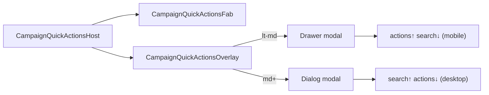

# Impl: FAB de ações rápidas (substituir bottom drawer persistente)

Status: aprovado
Atualizado em: 2026-08-02
Issue: #260
Intenção: docs/plans/fab-acoes-rapidas-substituir-drawer.md
Appetite restante: herdado (~1d)

## Leitura da intenção

- **Outcome:** drawer persistente some; FAB em todas as larguras fora do Início/wizards abre overlay modal com ações contextuais + busca no ritual do Início por breakpoint.
- **O que NÃO negociar:** catálogo contextual por rota; lockdown leader; sem FAB no Início nem `/campanha/acoes/*`; sem snap/peek/scroll-coupling; sem migration/RBAC.
- **O que reavaliar:** manter `CampaignQuickActionsDrawer` como nome — renomear para `CampaignQuickActionsOverlay`; snap context e `campaignQuickActionSnap.ts` saem por completo.

## Abordagem recomendada

**Opções consideradas:** A) um único Drawer em todas as larguras | B) Sheet lateral desktop | C) Dialog md+ + Drawer mobile espelhando `CampaignHomeLayout`  
**Recomendação:** **C** — ritual do Início já codificado em order classes; overlay sob demanda sem estados intermediários.  
**Rejeitadas:** A (desktop drawer inferior compete com sidebar); B (chrome paralelo).

### Componentes / mudanças

- **`campaignQuickActionMount.ts`:** renomear `shouldMountQuickActionsDrawer` → `shouldMountQuickActionsFab`; remover gate mobile do comentário.
- **`CampaignQuickActionsOverlay.tsx`** (substitui `CampaignQuickActionsDrawer.tsx`): conteúdo ações+busca; `useIsMobile` escolhe Drawer vs Dialog; ordem espelha `CampaignHomeLayout`; retração de ações quando `uiFocused`.
- **`CampaignQuickActionsFab.tsx`:** botão flutuante fixo; abre/fecha overlay; some quando overlay aberto.
- **`CampaignQuickActionsHost.tsx`:** estado `open`; fecha em `pathname` change; remove peek scroll (`CampaignContentScrollWithPeek`).
- **`CampaignAppScrollChrome.tsx`:** remove `CampaignQuickActionsSnapProvider`; `GlobalSearchProvider` só quando FAB elegível.
- **Deletar:** `CampaignQuickActionsSnapContext.tsx`, `campaignQuickActionSnap.ts`.
- **Migration:** sem migration.
- **UI:** Impeccable C — FAB discreto `bottom-4 right-4`, safe-area; Dialog `max-w-lg`; Drawer `max-h-[85dvh]`.

### Dados → forma

N/A — chrome de navegação.

## Fases verificáveis

1. **Remover snap/peek** — deletar snap modules; simplificar scroll chrome.
2. **Overlay + FAB** — novo overlay/dialog; host wiring; mount em todas as larguras.
3. **Tests + gates** — reescrever unit drawer→overlay; atualizar mount spec; `pnpm gate:fast`; `pnpm push`.

## Rabbit holes / Não escopo (engenharia)

- Refatorar `Drawer.tsx` além do que snap removal naturalmente limpa (snapPoints ainda usados por outros? — não, só quick actions; manter API do kit).
- FAB no Início ou unificar ritual Início.
- Grid 2×3 no overlay (permanece strip).

## Riscos e mitigação

- **Provider Tooltip (B102):** manter `TooltipProvider` no layout `(app)` — overlay continua sibling do scroll.
- **Teclado mobile no Dialog:** não usamos Dialog no mobile — Drawer modal cobre.
- **Testes snap:** remover; cobrir open/close + ordem busca/ações + suggest POST.

## Aceite de engenharia

- [ ] Aceite de produto da intenção ainda coberto
- [ ] Invariantes AGENTS/engineering-standards
- [ ] Testes de domínio previstos (unit) onde mount/overlay mudam

## Débitos deferidos (autônomo)

- Dialog desktop `max-w-lg` pode precisar polish se resultados de busca ficarem apertados — gatilho: feedback de uso pós-merge.

Self-score decision-quality: 5/5
