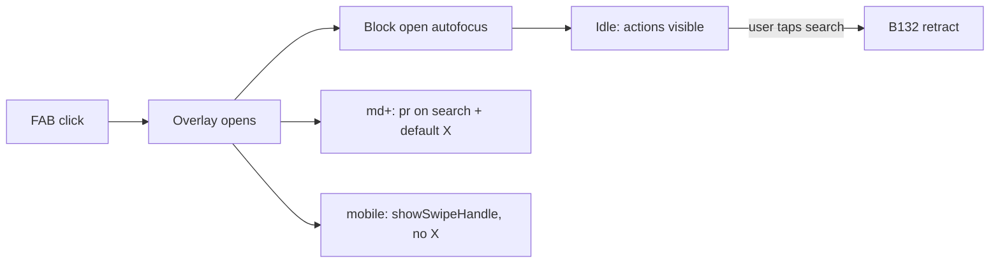

# Impl: FAB — overlay abre sem foco na busca; fechar não cobre o campo

Status: aprovado
Atualizado em: 2026-08-02
Issue: #317
Intenção: docs/plans/fab-overlay-sem-autofocus-e-fechar.md
Appetite restante: herdado (~0,5 dia eng)

## Leitura da intenção

- **Outcome:** Ao abrir o FAB, o overlay inicia em estado idle — ações visíveis, busca sem foco. Desktop: X não sobrepõe a busca. Mobile: handle de swipe, sem X.
- **O que NÃO negociar:** Ritual B132 (foco deliberado na busca ainda recolhe ações); catálogo/lockdown/limpeza de query inalterados; sem migration/Consent/RBAC.
- **O que reavaliar:** A hipótese de `autoFocus` explícito no input estava errada — o foco vem do trap de foco padrão do Dialog (Radix `onOpenAutoFocus`) e do Drawer (base-ui `initialFocus` default).

## Abordagem recomendada

**Opções consideradas:**

| Opção | Descrição | Veredito |
| ----- | --------- | -------- |
| A | `onOpenAutoFocus` / `initialFocus={false}` no overlay + `md:pr-10` na busca + `showSwipeHandle` no drawer | **Recomendada** — mínima, escopada ao dono |
| B | Header dedicado com X em flow no dialog | Rejeitada — mais chrome, fora do appetite |
| C | `showCloseButton={false}` + close custom em todo dialog kit | Rejeitada — polui kit global |

**Recomendação:** A — três props no `CampaignQuickActionsOverlay`, sem alterar `dialog.tsx`/`Drawer.tsx` globalmente.

### Componentes / mudanças

- **`CampaignQuickActionsOverlay`** (`src/components/campaign/shell/CampaignQuickActionsOverlay.tsx`):
  - Dialog: `onOpenAutoFocus={(e) => e.preventDefault()}` em `DialogContent`
  - Dialog: `md:pr-10` em `OverlaySearchChrome` (reserva faixa para X `right-3 size-8`)
  - Drawer: `showSwipeHandle` no `Drawer`; `initialFocus={false}` em `DrawerContent`
- **Migration:** sem migration
- **Access / Consent:** N/A
- **UI:** Impeccable B — polimento do chrome existente

### Dados → forma

N/A

## Fases verificáveis

1. **UI** — props de foco + padding + handle; testes unitários no spec existente
2. **Gates** — `pnpm gate:fast`; push via `pnpm push`

## Rabbit holes / Não escopo (engenharia)

- Alterar `DialogContent` default global
- Desligar recolhimento B132 ao focar
- Redesenhar grade ou catálogo

**Defer (gatilho):** extrair `HomeChromeRetractionShell` compartilhado com `CampaignHomeLayout` quando um 3º chrome retrátil for tocado de novo (já é o 3º — `quick-actions-chrome`; extrair em issue futura, fora do appetite B146).

## Riscos e mitigação

| Risco | Mitigação |
| ----- | --------- |
| `initialFocus={false}` quebra a11y teclado | Foco no título sr-only (B42), não na busca nem em void |
| `pr-10` insuficiente em telas estreitas | `md:` só no breakpoint dialog; mobile usa drawer |

## Aceite de engenharia

- [x] Aceite de produto da intenção ainda coberto
- [x] Invariantes AGENTS/engineering-standards
- [x] Testes unitários previstos em `campaignQuickActionsDrawer.unit.spec.tsx`
