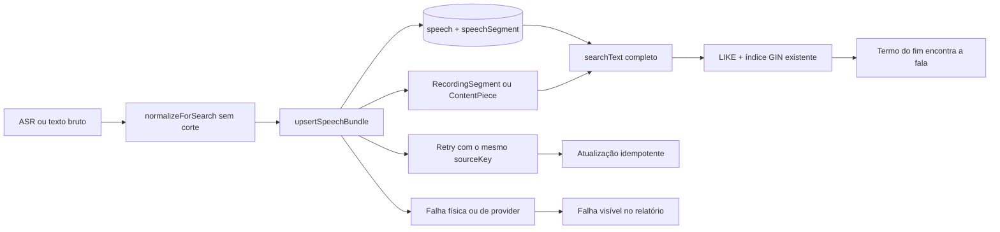

# Impl: Falas longas entram no acervo sem estourar o limite do texto normalizado

Status: aprovado
Atualizado em: 2026-09-25
Issue: #1337
Intenção: `docs/plans/falas-web-texto-normalizado-limite.md`
Appetite restante: ~0,5 dia; alteração de validação coberta por regressões de persistência, retry e busca
Impeccable: A — N/A
Design UI: N/A

## Leitura da intenção

- **Outcome:** uma transcrição longa, inclusive uma fala web de aproximadamente três horas, entra inteira no acervo, continua pesquisável do começo ao fim e pode ser reingerida sem duplicar registros.
- **O que não negociar:** não truncar; não rejeitar por tamanho de transcrição; não esconder falhas físicas; não alterar busca, facetas, paginação, rotas ou contrato público; não alterar access, segurança ou Consent.
- **O que reavaliar:** a hipótese de que bastariam os cinco `searchText`; a segurança de elevar o default global; a extensão dos campos brutos; a ausência de migration SQL.
- **Decisão de escopo:** corrigir os campos de texto que participam da transcrição do acervo. Reutilizar a normalização, o upsert transacional, o relatório e os loaders existentes.

## Estado técnico confirmado

- `normalizeForSearch` em `src/lib/speechSearch.ts:8-15` normaliza acentos, caixa e espaços sem cortar ou resumir.
- O Payload usa `defaultMaxTextLength = 40000` para `text`/`textarea` sem `maxLength`; um `maxLength` explícito substitui esse default (`node_modules/payload/dist/config/defaults.js:48` e `node_modules/payload/dist/fields/validations.js:24-35`).
- O upsert de Câmara/web em `src/utilities/speech/speechImport.ts:226-320` deriva o texto normalizado dos segmentos e grava fala e segmentos na mesma transação.
- O caminho de recordings grava `Recording.searchText` e cria `RecordingSegment` em `src/utilities/recordings/recordingJob.ts:294-332`.
- `ContentPiece` deriva `searchText` no hook em `src/collections/ContentPiece.ts:171-237`.
- A busca de Speech usa `searchText` com `LIKE` em `src/utilities/speech/speechListFilters.ts:65-108` e já usa o índice GIN trigram; não precisa mudar.
- As colunas PostgreSQL relevantes são `varchar` sem comprimento declarado, então a correção é de validação da aplicação, não de SQL.
- Os testes existentes de `speechImport` e `speechAcervo` cobrem persistência e busca com textos curtos, mas não atravessam o limite de 40 000.

## Abordagem recomendada

**Opções consideradas:** A | B | C | D

**Recomendação:** **C — declarar um `maxLength` explícito e efetivamente ilimitado nos campos brutos de transcrição e nos cinco `searchText`; manter o default global em 40 000.**

O valor deve ser uma constante compartilhada, `TRANSCRIPT_TEXT_MAX_LENGTH = Number.MAX_SAFE_INTEGER`, no owner existente `src/lib/speechSearch.ts`. O valor funciona como sentinel de validação, não como uma nova política de negócio: não cria uma fronteira artificial para transcrições, continua deixado ao limite físico do runtime/banco/storage, e falhas físicas continuam passando pelo relatório existente.

**Alternativas rejeitadas:**

- **A — elevar `defaultMaxTextLength`:** alteraria todos os `text`/`textarea` sem limite explícito, globs e formulários, ampliaria demais o risco de payloads enormes e mascararia limites de outros domínios.
- **B — elevar somente os cinco `searchText`:** deixaria os campos brutos com o teto de 40 000; uma transcrição longa ainda poderia ser rejeitada antes do texto derivado.
- **D — corrigir apenas o import web ou um hook condicional por origem:** os owners são compartilhados por Câmara/web, recordings e Central; a validação do schema mantém o mesmo teto e os caminhos divergem.

### Matriz de campos

| Collection         | Campo                | Tipo       | Motivo                            |
| ------------------ | -------------------- | ---------- | --------------------------------- |
| `speech`           | `officialTranscript` | `textarea` | Transcrição bruta do catálogo.    |
| `speech`           | `searchText`         | `textarea` | Concatenação pesquisável da fala. |
| `speechSegment`    | `text`               | `textarea` | Texto bruto de um segmento.       |
| `speechSegment`    | `searchText`         | `text`     | Derivado normalizado do segmento. |
| `recording`        | `searchText`         | `textarea` | Texto agregado pesquisável.       |
| `recordingSegment` | `text`               | `textarea` | Texto bruto do segmento.          |
| `recordingSegment` | `searchText`         | `text`     | Derivado normalizado do segmento. |
| `contentPiece`     | `transcript`         | `textarea` | Texto/transcrição da peça.        |
| `contentPiece`     | `searchText`         | `textarea` | Haystack derivado da peça.        |

Campos de resumo, erro, palavras-chave, Consent, Reel e demais formulários permanecem intocados: não são a transcrição pesquisável do acervo e devem conservar seus limites atuais.

## Componentes / mudanças

- **`src/lib/speechSearch.ts`:** adicionar `TRANSCRIPT_TEXT_MAX_LENGTH`; não alterar a normalização.
- **`src/collections/Speech.ts`:** aplicar a constante a `officialTranscript` e `searchText`.
- **`src/collections/SpeechSegment.ts`:** aplicar a constante a `text` e `searchText`.
- **`src/collections/Recording.ts`:** aplicar a constante a `searchText`.
- **`src/collections/RecordingSegment.ts`:** aplicar a constante a `text` e `searchText`.
- **`src/collections/ContentPiece.ts`:** aplicar a constante a `transcript` e `searchText`.
- **`src/lib/schemas/contentPiece.ts`:** usar a mesma constante no schema da ficha, para que a action não mantenha um teto de 200 000 caracteres diferente do campo.
- **`src/utilities/speech/speechImport.ts`, `webSpeechIngest.ts` e `speechListFilters.ts`:** sem mudança de comportamento; o upsert, o relatório e a busca existentes são reutilizados.
- **Migration:** nenhuma alteração SQL esperada; as colunas já são `varchar` sem limite. Não editar migrations, `payload-types.ts` ou `importMap.js`. Se a verificação de migration indicar alteração de banco, parar e revisar antes de prosseguir.
- **Access / Consent:** nenhuma alteração.
- **UI:** Impeccable A — nenhuma tela, componente, rota ou designer.

## Fases verificáveis

1. **Contrato e regressão principal:** criar teste de integração no caminho web com três segmentos individuais abaixo de 40 000 cujo agregado ultrapasse 40 000, incluindo um marcador apenas no último segmento. O teste deve provar persistência completa e nova execução com o mesmo `sourceKey` sem duplicar fala, segmentos ou mídia.
2. **Busca e campos irmãos:** provar no loader do acervo que o marcador final encontra a fala; adicionar cobertura de persistência para `officialTranscript`, `SpeechSegment.text`, `RecordingSegment.text`, `Recording.searchText`, `ContentPiece.transcript` e `ContentPiece.searchText` quando o teste existente permitir. Fixar que `defaultMaxTextLength` continua 40 000 e que os campos não relacionados mantêm seus limites.
3. **Configuração mínima:** aplicar a constante somente aos nove campos da matriz e rodar os testes alterados, `pnpm gate:fast` e os demais gates do repositório.
4. **E2E local afetado:** rodar os specs de `campaignSpeechAcervo`/superfície web que o classificador considerar afetados, se houver benefício além dos testes de integração.
5. **Changelog e fechamento:** registrar `docs/changelog/2026-09-25-c223.md`, revisar o diff, usar `pnpm push` e abrir PR Ready com `Closes #1337`; não executar o lote de produção nesta entrega.

## Rabbit holes / Não escopo de engenharia

- Subir apenas o default global.
- Truncar em 40 000, mesmo com registro.
- Alterar `speechListFilters`, GIN, facetas, ordenação ou URL.
- Criar collection, campo, relatório, tela ou status `truncated`.
- Reindexar dados históricos; a falha impedia a criação, portanto o retry do lote pendente basta.
- Alterar access, overrideAccess, segurança ou Consent.
- Ampliar campos de resumo/erro ou domínios sem relação com transcrição.
- Adicionar limite concreto sem evidência operacional; se surgir, deve ser issue separada com contagem e motivo no relatório.

## Riscos e mitigação

- **Volume de memória, payload e índice:** os textos já são normalizados e persistidos uma vez; manter os processamentos e índices existentes e observar o lote real antes de criar nova estratégia.
- **Limite físico residual:** Node, PostgreSQL, storage ou provider podem falhar; não truncar e deixar o fluxo existente reportar `sourceKey`, estágio e erro.
- **Campo esquecido:** a matriz de nove campos e os testes de persistência impedem uma segunda barreira de 40 000.
- **Retry:** reutilizar a transação e o `sourceKey` atuais; o teste prova identidade e contagem de segmentos.
- **Divergência com escopo:** revisar que busca, facetas, URLs, access, migrations e UI não foram alterados.

## Aceite de engenharia

- [ ] A fala de teste tem segmentos individuais abaixo de 40 000 e `searchText` agregado acima de 40 000.
- [ ] A transcrição e o marcador final são persistidos integralmente.
- [ ] A busca pelo marcador final retorna a fala.
- [ ] O retry com o mesmo `sourceKey` não duplica registros nem artefatos.
- [ ] Os nove campos da matriz aceitam o texto completo; campos não relacionados mantêm seus limites.
- [ ] `defaultMaxTextLength` continua 40 000.
- [ ] Nenhum texto é truncado; falhas físicas continuam visíveis no relatório.
- [ ] Nenhuma migration, alteração de tipos/importMap, busca, rota ou UI é introduzida.
- [ ] Testes relevantes, `pnpm gate:fast`, gates completos e build estão verdes.

## Triagem pós-simplify

### Já resolvido no simplify (não reabrir)

- P2: pin explícito do default `40 000` e de campo não relacionado.
- P2: comparação exacta de todos os segmentos, `searchText` e preservação de conteúdo/mídia no retry.
- P2: schema da ficha de `ContentPiece` alinhado à constante dos campos de transcrição.

### Explicitamente fora

- P3: assertion de `excerpt` no teste de busca foi removida por ser redundante e acoplada ao view model; o marcador e a presença da fala já provam o contrato.
- Nenhum novo lote, Issue ou follow-up deferido: não há débito caro remanescente.

## Self-score — decision-quality

| Critério                         | Nota | Justificativa                                                                               |
| -------------------------------- | ---: | ------------------------------------------------------------------------------------------- |
| Decisões caras têm rejeitadas?   |  5/5 | Global, cinco campos, escopo por origem e truncamento foram comparados.                     |
| A abordagem cabe no appetite?    |  5/5 | É configuração de nove campos mais regressões focadas, sem pipeline novo.                   |
| Rabbit holes nomeados?           |  5/5 | Busca, migration, relatório, reindexação, UI e domínios não relacionados foram delimitados. |
| Depth check: reusa donos?        |  5/5 | Reutiliza a constante de busca, upsert, hooks, loaders, índice e relatório existentes.      |
| A intenção permanece satisfeita? |  5/5 | Texto inteiro, busca ponta a ponta, retry e falhas honestas permanecem cobertos.            |

**Self-score total: 25/25 — 5/5. Gate `>= 4/5`: aprovado.**
