# Impl: Ingestão web de falas funciona no comando documentado, sem runtime local

Status: aprovado
Atualizado em: 2026-09-25
Issue: #1338
Intenção: docs/plans/falas-web-ytdlp-node-options.md
Appetite restante: herdado — ~0,5 dia eng (1 arquivo de `src` + 1 spec)

## Leitura da intenção

- **Outcome:** um lote de 1 vídeo do YouTube roda verde via `pnpm falas-web:import --findings <lote>` sob o `NODE_OPTIONS` do wrapper (`--no-deprecation --import=tsx/esm --import=./scripts/seed-loader.mjs`), sem wrapper de `node` em `~/.local/bin` e sem `~/.config/yt-dlp/config` especial; o relatório mostra `created`/`skipped` — nunca `failed (acquisition)`.
- **O que NÃO negociar:** contrato do relatório/estágios/exit codes e a interface do comando documentado; caminho Câmara intocado (não passa por yt-dlp); nenhum knob novo (`--no-node-options` etc.); sem download real nos testes; workaround de host não entra no repo; fix no dono do spawn, nunca em cada chamador.
- **O que reavaliar:** a hipótese "possivelmente nada em `scripts/import-web-speeches.mjs`/`package.json`" se confirmou — nada muda. E a hipótese de que "o runner é injetável, então o teste prova o comportamento" **não se sustenta sozinha**: injetar `run` substitui exatamente o `defaultRunner` que carrega o bug; a prova precisa interceptar `node:child_process` (achado do explorador; precedente `tests/unit/dbStart.unit.spec.ts:1,9-11`).

## Abordagem recomendada

```mermaid
flowchart LR
  A["pnpm falas-web:import<br/>NODE_OPTIONS do wrapper"] --> B["scripts/import-web-speeches.mjs"]
  B --> C["webSpeechIngest.defaultAcquire"]
  C --> D["ytdlp.ts: resolve / readYtDlpMetadata / download"]
  D --> E["defaultRunner (dono do execFile)"]
  E -->|"env = process.env sem NODE_OPTIONS<br/>(PATH/HOME/YTDLP_PATH preservados)"| F["execFile yt-dlp"]
  F --> G["yt-dlp (Python) + runtime JS próprio<br/>sem o loader do repo"]
  G --> H["relatório: created / skipped"]
```

**Opções consideradas:** A | B | C
**Recomendação:** **A** — remover `NODE_OPTIONS` por inteiro do env do filho no `defaultRunner` (dono único do spawn), via spread de `process.env` sem a variável. yt-dlp é Python e o runtime JS que ele invoca para o desafio do YouTube não tem nenhuma relação com o loader do repo; apagar a variável inteira mata a classe (hoje `--import=tsx/esm` + `seed-loader`, amanhã `--conditions=react-server` ou qualquer flag futura do wrapper) em vez da instância, sem parser de string de flags. Todo o resto do ambiente é preservado — `PATH`, `HOME`, `YTDLP_PATH`, proxies e locale seguem no filho.
**Rejeitadas:** B (remoção cirúrgica só dos `--import=…`) porque exige tokenizar um valor shell-like (aspas, espaços, `=`) para preservar um `--no-deprecation` inócuo em subprocesso Python, e deixa a próxima flag de runtime do repo reabrir o mesmo bug; C (helper global de exec sanitizado) porque é abstração com **1 call site** — "adapter com 1 call site" é rabbit hole explícito do repo — e generalizar para todo `execFile` é anti-goal nomeado. Gatilho de revisitação de A: um 2º dono passar a precisar do mesmo saneamento.

### Componentes / mudanças

- **`defaultRunner`** (`src/utilities/media/ytdlp.ts:43-57`, editando o dono): monta o env do filho com `const { NODE_OPTIONS: _nodeOptions, ...env } = process.env` (lint já ignora `^_`) e passa `env` nas options do `execFile`; comentário C224 curto explicando o porquê (Python + runtime JS próprio ≠ loader do repo). Cobre `resolveYtDlp`, `readYtDlpMetadata` e `downloadWithYtDlp` de uma vez, pois os três compartilham o runner. Sem export novo; `YtDlpRunner` e as assinaturas intocados.
- **`tests/unit/ytdlp.unit.spec.ts`** (editado): `// @vitest-environment node`, `vi.mock('node:child_process')` com um `execFile` mockado que chama o callback, e um teste que chama `readYtDlpMetadata` **sem** `run` (exercita o `defaultRunner` real) com o `NODE_OPTIONS` do wrapper plantado via `vi.stubEnv`; assere que `options.env.NODE_OPTIONS` é `undefined`, que `env.PATH === process.env.PATH` (passthrough) e que o `process.env` do teste realmente continha `--import=tsx/esm` (teste não-vacuoso). `vi.unstubAllEnvs()` + `execFileMock.mockReset()` no `afterEach`. Os testes existentes seguem usando `run` injetado e não são afetados pelo mock.
- **Migration:** sem migration (sem schema).
- **Access / Consent:** não se aplica — sem PII, sem schema, sem action.
- **UI:** Impeccable A — N/A sem UI.

### Dados → forma (se aplicável)

Não se aplica: nenhuma superfície de dados nova; o "dado" entregue é o relatório de lote existente, cujo formato e estágios ficam byte a byte como estão.

## Fases verificáveis

1. **RED (tracer)** — teste novo em `tests/unit/ytdlp.unit.spec.ts` falha contra o `defaultRunner` atual (env do filho ainda com `NODE_OPTIONS`); rodar só ele: `pnpm test:unit -- tests/unit/ytdlp.unit.spec.ts`. (~1/4 dia)
2. **GREEN no dono** — saneamento em `defaultRunner` (`src/utilities/media/ytdlp.ts`); mesmo comando verde. Nenhum outro arquivo de `src`/`scripts`/`package.json` tocado.
3. **Gates + evidência real** — `pnpm gate:fast` (lint + typecheck + unit) e, baratos no diff, `pnpm exec knip` e `pnpm check:cycles`. Evidência real anexada ao PR: `pnpm falas-web:import --findings <lote de 1 vídeo>` contra o DB local do worktree mostrando `created`/`skipped` (yt-dlp está instalado na máquina, `~/.local/bin/yt-dlp`); se chave/DB impedirem o lote completo, a prova mínima é chamar `readYtDlpMetadata` do dono sob o `NODE_OPTIONS` do wrapper contra 1 URL real do YouTube (antes: `Requested format is not available`; depois: metadados). Push via `pnpm push`.

## Rabbit holes / Não escopo (engenharia)

- Helper global/biblioteca de exec sanitizado, ou sanitizar todo `execFile` do repo — 1 call site hoje; gatilho: 2º dono precisar.
- Tocar outros spawns: `src/utilities/media/ffmpeg.ts:45` e `scripts/lib/mediaBinaries.mjs:32-36` (ffmpeg não sofre do problema; não generalizar).
- Mudar o comando (`package.json:92`), estágios/mensagens/exit codes de `scripts/import-web-speeches.mjs`.
- Validação de versão/runtime/cookies/config de yt-dlp, `~/.config/yt-dlp/config` ou flag nova no comando.
- e2e com download real/vídeo no CI (CI não deve depender do YouTube).
- Reprocessar/limpar itens falhados de lotes anteriores (idempotência por item já existe).
- Exportar helper só para teste (decidido em D2).

## Riscos e mitigação

- **Passar `env` ao `execFile` substitui o ambiente inteiro** — um erro (ex.: mandar só `{ NODE_OPTIONS: undefined }`) quebraria `PATH`/`HOME` e a resolução do binário. Mitigação: spread de `process.env` + asserção de `PATH` preservado no teste.
- **Mock pode divergir do contrato real do `execFile`** — Mitigação: o teste assere exatamente `options.env`, o mesmo contrato que o precedente `dbStart` inspeciona; o "mecanismo" é o próprio Node.
- **Futuro runtime JS do yt-dlp depender de algo no `NODE_OPTIONS`** — remover tudo assume que nada ali serve ao runtime dele. Mitigação/trigger: falha de challenge com traceback citando env → reavaliar (improvável; o runtime é próprio).
- **Evidência real depende de chave/DB/vídeo disponíveis** — Mitigação: o unit pinna a classe; a fase 3 tenta o comando documentado e, no mínimo, o probe real do dono; o resultado medido vai no PR.
- **Teste não-vacuoso** — se o `NODE_OPTIONS` do wrapper não estiver presente no processo de teste, a asserção passaria à toa. Mitigação: asserir que o processo de teste o tinha antes de chamar; fase 1 RED explícito.

## Aceite de engenharia

- [ ] Aceite de produto da intenção coberto (lote de 1 vídeo verde pelo comando documentado, sem wrapper local nem config especial de yt-dlp)
- [ ] Invariantes AGENTS/engineering-standards: fix no dono, sem twin; sem migration/Consent/access; identificadores em inglês e nenhuma URL/superfície pública tocada
- [ ] Teste de domínio: unit do `defaultRunner` prova o env sem `NODE_OPTIONS` e o passthrough de `PATH`, sem download real; int/e2e novos não se aplicam
- [ ] Contrato intocado: nada em `scripts/import-web-speeches.mjs`, `package.json` e no formato/estágios do relatório alterado
- [ ] Gates: `tsc --noEmit`, `pnpm lint`, `pnpm format:check`, `pnpm exec knip`, `pnpm check:cycles`, `pnpm test:unit` verdes
- [ ] Evidência real anexada ao PR (comando documentado ou probe do dono sob o `NODE_OPTIONS` do wrapper)

## Decisões de engenharia

**D1 — O que o filho herda do `NODE_OPTIONS` do wrapper.**
Opções: A) apagar `NODE_OPTIONS` inteiro do env do filho no `defaultRunner` | B) remover cirurgicamente só os `--import=…` de dentro do valor | C) helper global de exec sanitizado.
Recomendação: **A** — yt-dlp é Python e o runtime JS próprio dele não tem vínculo com o loader do repo; elimina a classe sem parser de flags e sem preservar um `--no-deprecation` sem sentido no filho. Rejeitadas: B porque parser de valor shell-like é frágil e deixa a próxima flag do wrapper reabrir o bug; C porque é adapter com 1 call site e generalização anti-goal. Revisita: 2º dono precisar (aí sim extrai o saneamento).

**D2 — Como provar a sanitização sem rede.**
Opções: (i) `vi.mock('node:child_process')` no spec unit, exercitando o `defaultRunner` real e inspecionando `options.env` (precedente `tests/unit/dbStart.unit.spec.ts:1,9-11`) | (ii) exportar um helper puro `childEnv(process.env)` do dono e testá-lo | (iii) fixture de binário fake apontado por `YTDLP_PATH` que imprime o próprio env.
Recomendação: **(i)** — prova a fiação real do `defaultRunner` (o ponto exato que falha), sem export novo só para teste e sem rede; precedente direto no repo. Rejeitadas: (ii) porque testa o helper, não o spawn — um refactor pode parar de usá-lo e o teste seguir verde, além de criar export sem dono de produção; (iii) porque exige fixture executável/chmod para provar por binário o que o mock lê direto, com mais partes móveis.

**Self-score: 5/5.**

1. Decisões caras (mecanismo e estratégia de prova) têm opções e rejeitadas explícitas — 2 decisões registradas.
2. Cabe no appetite herdado: 1 arquivo de `src` + 1 spec, sem schema/sem UI/sem dependência.
3. Rabbit holes nomeados com corte (helper global, outros spawns, package.json, e2e real).
4. Depth check respeitado: edita o dono existente (`defaultRunner`), zero módulo/abstração novos.
5. Outcome de produto intocado: comando, relatório, estágios e Câmara permanecem como estão.
