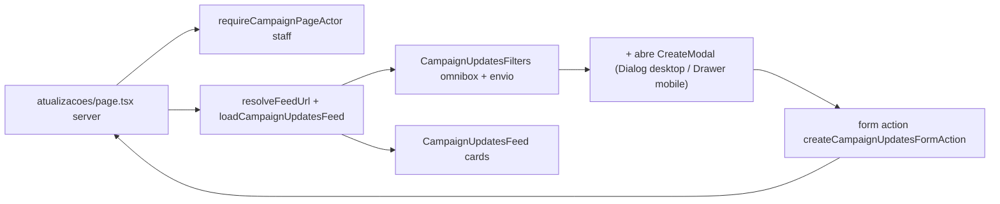

# Impl: C89 — Página Atualizações: feed de cards + filtro + criar (modal / bottom sheet)

Status: em execução
Atualizado em: 2026-08-08 (aprovado em gate humano 2026-08-08; execução concluída)
Issue: #401
Intenção: docs/plans/feed-atualizacoes-campanha-threads.md
Appetite: herdado ~1,5–2 dias eng — cabe (1 página + 1 modal + 1 action + loaders, sem migration)

## Leitura da intenção

- **Outcome:** `/campanha/atualizacoes` deixa de ser placeholder e vira um feed
  operacional da carteira do ator (staff), mais recentes no topo, com filtro
  combobox (município, polaridade, urgente, quem criou, texto) e criação
  in-place ("+": modal desktop / bottom sheet mobile) reusando o registro
  unificado já vivo (C87) — sem reload de página à toa.
- **O que NÃO negociar:** leader lockdown (gate `staff`); assessor só nos
  municípios que administra (access existente, fail-closed); card é leitura em
  v1 (sem thread — C88); criar segue o formulário unificado, não um segundo
  modelo; p/ `adversarySignal` só staff (coordinator/advisor/candidate).
- **O que reavaliar:** não existe "dashboard últimas atualizações de campo" no
  código — o precedente real do feed é o `UpdatesTab` do detalhe de município
  (`MunicipalityDetailTabs` + `loadMunicipalityUpdatesFeed`). A direção da
  intenção continua correta, mas o "precedente a olhar" apontava para um
  painel que não existe.

## Abordagem recomendada

**Opções consideradas:** A (novos módulos de URL/omnibox/feed espelhando o split
de municipios) | B (tudo dentro de `municipalityUpdatePageData.ts`) | C (pasta
nova `utilities/updates/`)
**Recomendação:** A — espelhar o split de `municipios` (`*ListUrl` +
`*Omnibox` + `*PageData`), que é o canonical do repo; mantém o contrato de URL
congelável (B18 saved filters) e o page-data por-município intacto.
**Rejeitadas:** B porque mistura leitura por-município e feed da carteira no
mesmo módulo; C porque uma pasta nova para uma página é premature.

### Componentes / mudanças

- **`municipalityUpdateListUrl.ts`** (`src/utilities/municipality/`): estado do
  feed — `page`, `q?` (busca de texto), `slugs?` (município),
  `polarities?` (boa|neutra|ruim, "todas"→ausente, `parseExhaustiveEnumParam`),
  `urgent?` (exclusivo), `authors?` (ids de campaignUser). Parse/serialize
  canônicos via `campaignListUrl` (`resolveListUrl`, `buildListHref`,
  `strictDecimalInteger`, `normalizedText`), `buildCampaignUpdatesWhere(state)`
  → `Where` (body contains / municipality in / polarity in / urgent equals /
  author in e `and`), `buildCampaignUpdatesHref` (base `/campanha/atualizacoes`).
- **`municipalityUpdateOmnibox.ts`** (`src/utilities/municipality/`): adapter
  fiel a `municipalityOmnibox` — chips (Busca/Município/Polaridade/Urgente/Autor),
  seeds agrupados (Município, Polaridade, Urgente, Autor, Busca), apply/remove/
  clear, `withPageReset`. Reusa `municipalityFilterOptionsForSlugs`
  (label via `municipalityCatalog`).
- **`campaignUpdatesFeedData.ts`** (`src/utilities/municipality/`): novo view
  model do card (id, body, polarity, urgent, adversarySignal, createdAt,
  authorName, authorAvatarUrl, municipalitySlug+Name) e:
  - `loadCampaignUpdatesFeed(payload, user, state)` — `payload.find` em
    `municipalityUpdate` `sort:-createdAt`, `depth:0`, `user`,
    `overrideAccess:false`, **sem** cláusula de município: o access
    `canReadMunicipalityUpdate` (scoped-read) já restringe à carteira do
    assessor. Pós-processa nomes/avatars (novo `loadCampaignUserDisplayByIds`)
    e rótulos de município (`loadMunicipalityLabelsByIds`).
  - `loadCampaignUpdatesFeedFacets(payload, user)` — slugs de municípios da
    carteira (unrestricted → todos do catálogo; advisor → `getAccessibleMunicipalityIds`
    → slugs) e autores presentes na carteira (find seletivo `author`,
    `limit:0`, rotulado por `loadCampaignUserNamesByIds`).
- **`loadCampaignUserDisplayByIds`** (`src/utilities/loadNamesByIds.ts`):
  extensão do "resolve names" — id → `{ name, avatarUrl }` (depth 1 +
  `select:{name:true, avatar:true}`, `mediaDocumentUrl`). Dono certo: o módulo
  de resolução de nomes; mantém `loadCampaignUserNamesByIds` intacto.
- **`CampaignUpdatesFeed.tsx`** (+ card): feed de cards responsivo. Card:
  `CampaignUserAvatar` no canto superior esquerdo, body, badges polaridade/
  urgente/adversário (variants já usadas em `MunicipalityUpdateFeed`), rodapé
  autor + município + data (`Intl.DateTimeFormat` pt-BR). Card é só leitura
  (sem link/thread — C88).
- **`CampaignUpdatesFilters.tsx`** (client): `CampaignListOmnibox` + trailing
  `Button` "+ Nova atualização"; `useCampaignListFilterNavigation` +
  `CampaignListPendingBoundary`/`CampaignListResults` (mesmo esqueleto de
  transição de municípios).
- **`CampaignUpdatesCreateModal.tsx`** (client): híbrido
  `Dialog`(desktop)/`Drawer`(mobile) via `useIsMobile` — precedente
  `CampaignQuickActionsOverlay`; corpo = combobox de município
  (`StrictCombobox` sobre slugs acessíveis, label via catálogo) +
  `MunicipalityUpdateFields` (reuso do form unificado C87) + `useActionState`.
- **`createFormActions.ts`** (`atualizacoes/`): action fina —
  `runCampaignFormAction` → parse → `createMunicipalityUpdate` →
  `revalidatePath('/campanha/atualizacoes')`. Extrai o parse de
  `updateFormActions.ts` para um helper compartilhado
  (`parseMunicipalityUpdateForm(formData)`) — 2º call site, DRY ganha.
- **`atualizacoes/page.tsx`**: substitui o placeholder; `resolveCampaignUpdatesUrl`
  (+redirect canônico), `gate:'staff'`, feed + facetas + footer
  (`CampaignListFooter` com total/página).
- **Migration:** nenhuma — filtros todos em campos já indexados
  (`municipality`, `author`, `polarity`, `urgent` já têm index).
- **Access / Consent:** nenhum novo. Reuso total de `canReadMunicipalityUpdate`
  (scoped-read) e `createMunicipalityUpdate` (transação + `adversarySignal`
  staff-only via `isCampaignStaff`). Leader não alcança a página (gate staff).

### Dados → forma (se aplicável)

Feed operacional cronológico: cards, mais recentes no topo, sem agregação
estadual — leitura relativa à carteira (restrição da intenção). Sem % absoluto.

## Fases verificáveis

1. **Tracer / pure (server):** `municipalityUpdateListUrl` + `municipalityUpdateOmnibox`
   - unit specs (canonicalização, "todas polaridades→ausente", page clamp,
     chips/sugestões/apply/remove) — `pnpm gate:fast`.
2. **Loader + view model:** `campaignUpdatesFeedData` +
   `loadCampaignUserDisplayByIds`; verificação por int spec leve do loader
   (carteira de advisor) se existir precedente análogo — senão unit puro.
3. **UI:** card feed → filtros (omnibox + "+") → modal/sheet + form →
   page. Impeccable D: shape → craft → critique → polish.
4. **Gates:** `pnpm gate:fast` na iteração; `pnpm push` na entrega; e2e do
   fluxo criar+filtro se a suíte cobrir `/campanha` (verificar).

## Rabbit holes / Não escopo (engenharia)

- **2º formulário de criação** — cortado: `MunicipalityUpdateFields` +
  combobox de município, mesma action de escritura.
- **Busca de texto em autor/município** — cortado: `q` cobre `body` só;
  gatilho de revisita se o usuário pedir busca ampla.
- **Thread/card navegável** — C88; card read-only.
- **Analytics / scroll infinito / KPI** — não escopo da intenção.
- **Saved filters (B18)** — não desta fatia; o contrato de URL já fica
  canônico para servir de base.

### Adiado com gatilho (triage 2026-08-08)

- **Promover `parseSlugsParam`/`parseAuthorsParam` para `campaignListUrl`**
  (gémeos dos helpers privados do `municipalityListUrl`; DRY 2 call sites).
  Gatilho: "quando um 3º `*ListUrl` precisar do mesmo parse de slugs/ids".
- Descartados (cheap_polish): `isStaff` constante na rota; copy do empty-state
  em função de filtro ativo; `loading.tsx` da rota; `revalidatePath` no-op;
  dedup manual pré-existente no `municipalityUpdatePageData`.

## Riscos e mitigação

- **`contains` em `textarea` (body):** campo text no Postgres; mesmo caret de
  `name:{contains}` das listas — verificar num int/unit do `where`.
- **Feed com access por carteira:** `overrideAccess:false` + `user` é o mesmo
  caminho do `UpdatesTab`; facets de autor/município usam o canal admin
  justificado (ids já autorizados / slugs da carteira).
- **Modal + server action:** `revalidatePath('/campanha/atualizacoes')`
  explícito na action para o card novo subir ao topo; estado de filtro preservado
  (searchParams intactos). **Achado real (2026-08-08):** o modal de criação não
  pode ser filho React do `<form role="search">` dos filtros — o React 19 não
  liga progressive enhancement (`$ACTION_ID`) num action-form aninhado em outro
  `<form>` na árvore de componentes (nenhum POST disparava; verificado em dev E
  build de produção). Fix: o modal é irmão do form de filtros (wrap em `
`,
  `CampaignUpdatesFilters.tsx`).
- **435 municípios no combobox:** client-side, slugs→catálogo (padrão B16+);
  `StrictCombobox` filtra no word-start — sem carga no servidor.

## Aceite de engenharia

- [ ] Aceite de produto da intenção coberto (feed + filtro 5 dimensões + criar modal/sheet)
- [ ] Invariantes AGENTS/engineering-standards (gate staff, access fail-closed, form unificado)
- [ ] Testes de domínio previstos (unit URL/omnibox; loader leve)
- [ ] Sem migration; `generate:importmap` se novo componente client (colocar em `components.json` se necessário)
