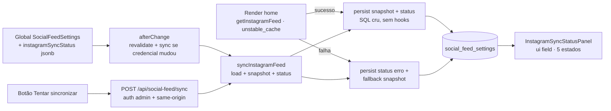

# Impl: Feed do Instagram configurado não aparece na home pública

Status: aprovado
Atualizado em: 2026-08-19
Issue: #115
Intenção: docs/plans/feed-instagram-nao-aparece-home.md
Appetite restante: ~1 dia eng

## Leitura da intenção

- **Outcome:** a assessoria vê, na própria global "Feed de redes sociais", o estado da sincronização do Instagram — "Sincronizado · há X min · N posts", "Falha na última sincronização" com o motivo em linguagem de produto e a correção esperada, ou "Instagram ainda não configurado" — e tem um botão "Tentar sincronizar de novo" para feedback imediato. O board público permanece fail-closed como hoje (artigos + YouTube quando o IG falha); a home pública não muda em nada.
- **O que NÃO negociar:** painel de status por plataforma na própria global, só estado atual + motivo (sem histórico, sem alertas, sem dashboard); sem wizard OAuth; sem embeds no site público; token nunca exposto fora do admin (`read` admin-only preservado); copy em pt; identificadores em inglês; a home pública nunca quebra nem vaza erro.
- **O que reavaliar:** a hipótese da intenção apontava `InstagramPostExclusionPicker` como superfície do status — o picker é a lista de exclusão (S3) e **fica intacto**; o painel de status é um **irmão** (`InstagramSyncStatusPanel`), mesma família de componente `admin.components`, mesmo padrão do rascunho (caixa de status separada da lista). `revalidateRequest.ts` realmente não muda (a tag `social-feed` já cobre). O diagnóstico da ocorrência em produção é impossível deste worktree (sem acesso ao DB de prod — `PROD_DATABASE_URL` não existe localmente): o próprio painel vira o instrumento de diagnóstico (1 clique após o deploy confirma a causa), e o runbook documenta validação/geração de token.

## Abordagem recomendada

**Opções consideradas:** A | B | C
**Recomendação:** A — estado da sincronização **persistido** numa coluna `jsonb` da própria global (escrito por render, hook e botão, todos pelo mesmo módulo `instagramSync.ts`); painel admin como campo `ui` irmão do picker; rota `POST /api/social-feed/sync` (auth de sessão admin + `isSameOriginRequest`) para o botão; erro da API mapeado para copy de produto (`InstagramApiError` + `describeInstagramError`). O caminho de render ganha apenas a persistência do status dentro do try/catch existente — zero mudança visual na home, fail-closed intacto.
**Rejeitadas:** B) estado derivado em runtime (o painel admin não renderiza a home — sem estado não há como mostrar nada; e a intenção exige o estado da **última** sincronização, que precisa sobreviver a restart) | C) server action no botão (primeiro uso sem precedente no shell do admin do Payload; rota HTTP é previsível, testável e segue o precedente de `/api/revalidate`).

### Decisões de engenharia

1. **Estado persistido como `instagramSyncStatus` (jsonb, campo hidden) — uma coluna, shape `{ lastSyncAt?, postCount?, error?, errorAt? }`.**
   Opções: A) uma coluna jsonb (padrão do `instagramFeedSnapshot`) | B) 3 colunas (`lastSyncAt`, `postCount`, `lastError`) | C) estado em memória/cache.
   Recomendação: A — o snapshot já é jsonb escrito por SQL cru; uma coluna nova espelha o padrão; o shape é autodescritivo e muda sem migration futura. `lastSyncAt`/`postCount` são da última sincronização **bem-sucedida**; `error`/`errorAt` da última **falha** (falha após sucesso preserva os campos de sucesso? **não** — o painel em falha mostra só o erro, cena 1 do rascunho; overwrite é mais simples e sem leitura-modificação-escrita).
   Rejeitadas: B 3 colunas = 3 DDLs para o mesmo dado; C não sobrevive a restart e o painel admin não compartilha o render.
   → **Migration:** `pnpm migrate:create add_instagram_sync_status` (ADD COLUMN jsonb nullable, não destrutiva; revisar o DDL gerado — precedente S2/S3 de drift em migrações hand-written).

2. **`InstagramApiError` (status + apiMessage) no `loadInstagramFeed` + `describeInstagramError` para copy de produto.**
   Opções: A) o fetch parseia o body de erro da Graph API (`{ error: { message, type } }`) e lança erro tipado; `describeInstagramError` mapeia para pt-BR com a correção | B) mensagem genérica "falhou com status N" (status quo) | C) mapa estático por status.
   Recomendação: A — o produto exige o "porquê" (token recusado vs ID inválido vs rede); o body da Graph API distingue OAuthException (token inválido/expirado/emitido via Facebook Login — copy do draft) de "Invalid user id"; status 5xx = API indisponível; `TypeError` de fetch = rede. O mesmo `describeInstagramError` serve render, hook e rota (uma spelling).
   Rejeitadas: B é o bug atual (assessoria cega); C não lê o body e não cobre casos reais.
   - Mapeamentos: `400|401|403` + OAuthException/`expired|invalid|revoked` → "O token do Instagram foi recusado pela Graph API — está inválido/expirado ou foi emitido via Facebook Login (a Graph API só aceita tokens gerados pelo Instagram Login). Gere um novo token de longa duração pelo Instagram Login e atualize o campo acima."; `400` + menção a user/id → "O ID do usuário não foi reconhecido pela Graph API. Confira se é o ID numérico da conta Business/Creator."; `5xx`/outros → "A Graph API está indisponível no momento (status N). Tente novamente em alguns minutos."; `TypeError` de fetch → "Não foi possível falar com a API do Instagram (rede indisponível)."; desconhecido → "Erro inesperado ao sincronizar o Instagram."

3. **Rota `POST /api/social-feed/sync` para o botão — auth de sessão admin + CSRF same-origin.**
   Opções: A) route handler em `(frontend)/api/social-feed/sync` com `payload.auth({ headers })` exigindo `collection === 'users'` + `isSameOriginRequest` (helper já existente) | B) server action | C) rota sem auth (confia no botão).
   Recomendação: A — o precedente `sameOriginRequest.ts` é literalmente para "cookie-authenticated JSON route handlers"; `payload.auth` lê o cookie `payload-token` da sessão admin (precedente `campaignAuth`); a rota vive ao lado de `/api/revalidate` (grupo `(frontend)` — route handlers não passam por layouts; o URL é `/api/social-feed/sync`). Retorna `{ ok, status }`; status `null`/400 quando IG não configurado (o botão nem renderiza nesse estado — defesa).
   Rejeitadas: B sem precedente no shell admin (risco de incompatibilidade com o RSC do Payload, custo de spike); C permite abuso do rate da Graph API.
   → Depois do sync, a rota chama `revalidateTag('social-feed')` (fora de cache — permitido).

4. **Sync no `afterChange` da global quando a credencial IG muda (awaited, bounded, à prova de erro).**
   Opções: A) hook `afterChange` [revalidateFeed, syncInstagramAfterChange] — sync **awaited** quando `doc` ≠ `previousDoc` em `instagramAccessToken`/`instagramUserId`/`instagramEnabled` (false→true); `AbortSignal.timeout(10_000)` no fetch; try/catch total — erro de sync nunca quebra o save | B) sync em todo save | C) sem hook — só botão e render.
   Recomendação: A — o fluxo da intenção é "preenche token + ID e salva → o admin mostra o estado": com o sync awaited, o reload da global após o salvar já mostra o resultado **com as credenciais novas** (o estado antigo mostraria a falha da credencial antiga — confuso e o problema do status quo). Gate por mudança: save de exclusões/YouTube não gasta chamada de API nem adiciona latência. Timeout: Graph API responde em <1s mesmo em erro; 10s cap em API pendurada.
   Rejeitadas: B latência e custo em todo save sem ganho; C deixa o fluxo principal da intenção em dois cliques e o estado inicialmente mentiroso.
   → O hook usa o MESMO `syncInstagramFeed` da rota (uma implementação, dois call sites).

5. **Painel `InstagramSyncStatusPanel` (campo `ui`, irmão do picker) — 5 estados.**
   Opções: A) componente client próprio lendo os campos do form via `useAllFormFields` + estado local pós-botão | B) estender o picker | C) campo `json` não-hidden renderizado cru.
   Recomendação: A — o picker prova o padrão (campo `ui` + componente client + `useAllFormFields`); o painel lê `instagramSyncStatus` (inicial), `instagramAccessToken`/`instagramUserId`/`instagramEnabled` e mantém estado local só para o pós-clique (o status já está persistido no servidor — o form não precisa ser modificado). Estados: (1) `instagramEnabled === false` → "Instagram desativado — os posts não aparecem no board."; (2) sem token ou sem ID → "Instagram ainda não configurado" + explicação (cena 3); (3) `error` → "Falha na última sincronização" + mensagem + botão "Tentar sincronizar de novo" (cena 1); (4) `lastSyncAt` → "Sincronizado · há X min · N posts" + "Próxima atualização automática em ~5 min. Os N posts mais recentes estão no board 'Acompanhe de perto' da home." (cena 2, sem botão — fiel ao rascunho); (5) configurado sem status → "Aguardando a primeira sincronização" + botão. Pós-clique: `pending` ("Sincronizando…") → sucesso cena 2 / falha cena 1 com o motivo retornado. Tempo relativo com `Intl.RelativeTimeFormat('pt-BR')` local (o painel é client; `formatRelativePostDate` é server-only — `posts.ts` abre com `import 'server-only'`).
   Rejeitadas: B mistura duas responsabilidades no picker (o picker é lista de exclusão; o status é estado operacional — o rascunho os desenha como caixas separadas); C expõe JSON cru (anti-produto).
   → **UI:** Impeccable C — encaixe na linguagem do admin (caixas zinc/red do draft, `text-sm`, bordas `rounded-lg`), shape → craft → critique → polish no navegador (admin, 3 cenas + estados).

6. **`loadInstagramFeed` ganha `signal?: AbortSignal` (repasse ao `fetchImpl`).**
   O hook precisa do deadline; o `LoadInstagramFeedArgs` aceita `init` no fetchImpl — o signal flui sem mudar a assinatura do fetch. Unit-testado.

7. **Stub IG ganha estado `invalid-token` (400 com body `{ error: { type: 'OAuthException', ... } }`).**
   A cena 1 do draft é literalmente esse erro; o e2e do painel precisa exercitá-lo (o estado `fail` atual responde 500 genérico). O painel de falha com a copy do token é o aceite central do item.

### Componentes / mudanças

- **`InstagramApiError` + `parseInstagramErrorBody`** (`src/utilities/socialFeed/instagramFeed.ts`, estender): parseia body de erro em resposta não-2xx, lança `InstagramApiError` (`status` + `apiMessage`); `loadInstagramFeed` aceita `signal` opcional repassado ao `fetchImpl` (fetch do usuário, media e refresh).
- **`src/utilities/socialFeed/instagramSync.ts`** (novo, `server-only`, dentro do subfolder `socialFeed/` — a pin de top-level da `codebaseConventions.unit.spec.ts` não se aplica a subfolders, o comentário já cobre o domínio):
  - `InstagramSyncStatus` (`{ lastSyncAt?: string; postCount?: number; error?: string; errorAt?: string }`).
  - `describeInstagramError(cause: unknown): string` — mapeamentos da Decisão 2 (puro, exportado p/ unit).
  - `successInstagramSyncStatus(postCount)` / `failedInstagramSyncStatus(error)` — builders puros.
  - `persistInstagramSyncStatus(payload, status)` — SQL cru UPDATE+INSERT (mesmo padrão/precondição do snapshot; rodado DENTRO de `unstable_cache` no render — sem hooks).
  - `syncInstagramFeed(payload, { signal? }): Promise<{ ok: true; status } | { ok: false; status }>` — lê a global, retorna "não configurado" sem tocar na API quando `enabled === false`/`instagramEnabled === false`/sem token/ID; sucesso → `persistInstagramSnapshot` + persist token renovado (reuso dos privados? **não** — os `persist*` atuais são module-private do `instagramFeed.ts`; exportar `persistInstagramSnapshot`/`persistInstagramAccessToken` do `instagramFeed.ts` para o sync module — o dono do persist é o feed, o sync é o orquestrador) + status de sucesso; falha → status de erro via `describeInstagramError`; nunca lança (status é o resultado).
- **`getInstagramFeed`** (`instagramFeed.ts`, estender): no try (sucesso) persiste também o status de sucesso; no catch persiste o status de erro ANTES do fallback snapshot (a ordem não importa para o board; importa para o painel). Nada mais muda no caminho público.
- **`SocialFeedSettings`** (`src/globals/SocialFeedSettings.ts`, estender): campo `instagramSyncStatus` (json, `admin.hidden: true` — o painel renderiza, o dado não aparece cru); campo `ui` `instagramSyncStatusPanel` (após `instagramEnabled`, antes do token — status no topo do bloco IG, fiel ao rascunho; `admin.components.Field` → painel); `afterChange` = `[revalidateFeed, syncInstagramAfterChange]` (gate da Decisão 4, try/catch total). Copy do campo token/`admin.description`: ajuste de 1 linha para apontar o painel de status ("veja o estado da sincronização abaixo/ao lado") — opcional, não bloquear.
- **`src/app/(frontend)/api/social-feed/sync/route.ts`** (novo): `POST`; `isSameOriginRequest` (401 se cross-origin); `payload.auth({ headers })` exigindo `user.collection === 'users'` (401 sem sessão admin); lê a global, IG desconfigurado → `400 { ok: false, error }`; `syncInstagramFeed` com `AbortSignal.timeout(10_000)`; `revalidateTag(REVALIDATE_SOCIAL_FEED_TAG)`; `200 { ok, status }`. Erro interno → `500` (sem stack).
- **`src/components/admin/InstagramSyncStatusPanel.tsx`** (novo, `'use client'`): estados da Decisão 5; fetch para a rota no clique; `aria-busy` no pending; sem escrita no form (status é persistido no servidor).
- **`tests/e2e/instagram-stub.mjs`** (estender): estado `'invalid-token'` → `400 { error: { type: 'OAuthException', message: 'Error validating access token' } }` em `/user` e `/media` (e refresh → 400); `POST /__stub/state` aceita o novo estado.
- **Migration:** `add_instagram_sync_status` (jsonb nullable). **Types/importmap:** `pnpm generate:types` + `pnpm generate:importmap` (com envs `S3_*` dummy setadas — OPS69). **Access/Consent:** sem consent (estado operacional interno, não PII); global segue admin-only; a rota exige sessão admin. **UI:** Impeccable C (encaixe no admin; shape → craft → critique → polish).

### Dados → forma

- O painel mostra **estado operacional**, não métrica: contagem de posts sincronizados (cru, da API), tempo desde a última boa, motivo da última falha. Nada de histórico, alertas ou engajamento (corte da intenção). Forma: caixas do rascunho (verde/zinc neutro sucesso, red falha, zinc neutro não-configurado) — contraste e semântica visuais primeiro, sem cor inventada.

## Fases verificáveis

1. **Schema + servidor** (~metade do appetite): migration + `generate:types`; `InstagramApiError` + parse do body + `signal` no `loadInstagramFeed`; `instagramSync.ts` (status builders + `describeInstagramError` + persist SQL + `syncInstagramFeed`); persistência de status no `getInstagramFeed`; rota `/api/social-feed/sync`. Unit tests: `describeInstagramError` (OAuthException→token, invalid-user→ID, 5xx→indisponível, TypeError→rede, unknown→inesperado), `loadInstagramFeed` com fetchImpl 400+body de erro lançando `InstagramApiError`, repasse de `signal`, builders de status, gate `instagramCredentialsChanged` (doc/previousDoc: token mudou, ID mudou, enabled false→true, exclusão não dispara). Gates parciais: tsc + `pnpm test`.
2. **Painel + hook + runbook** (restante): `InstagramSyncStatusPanel` + campo `ui` + hook `afterChange` com sync awaited; stub `invalid-token`; runbook `docs/ops/instagram-feed-token-runbook.md` (o que o painel mostra; validação do token via refresh/me com curl; geração pelo Instagram Login vs Facebook Login; a provável causa da ocorrência atual e como o painel confirma em 1 clique pós-deploy); alinhar a copy do vazio do picker com o rascunho ("Nenhum post sincronizado. Após uma sincronização bem-sucedida, os últimos posts aparecem aqui…"); `generate:importmap` + AGENTS.md (1 linha: painel de status + rota de sync na seção do `social-feed`). Polish no navegador (admin, 3 cenas).
3. **e2e + gates finais**: admin smoke — seed com token+ID → painel "Aguardando a primeira sincronização" → clique → "Sincronizado" com contagem + assert do `instagramSyncStatus` via REST; stub `invalid-token` → falha com copy do token + botão; stub `fail` → falha 500; reset do helper `resetSocialFeedSettings` ganha `instagramSyncStatus: null` (determinismo do serial); smoke do picker existente deve continuar verde (o hook passa a sincronizar no seed com credenciais — stub ok, determinístico). Gates: `pnpm gate:fast`, `pnpm test`, `pnpm build` local, e2e no CI; changelog `docs/changelog/2026-08-19-s11.md` + `pnpm changelog:build`.

## Rabbit holes / Não escopo (engenharia)

- Não sincronizar no salvar de exclusões/YouTube (gate por credencial — Decisão 4).
- Não fazer histórico/alerta/dashboard de saúde; não tocar no board público nem nos cards.
- Não mexer no fluxo de refresh de token existente (o `loadInstagramFeed` já refresca e persiste; o sync só reporta).
- Não paginar o feed, não buscar stories/métricas.
- Não backfill de status retroativo (a primeira sincronização após o deploy escreve o estado).
- Não acesso ao DB de prod para o diagnóstico (fora do alcance do worktree); o painel + runbook cobrem o aceite.
- Não mudar a pin de `codebaseConventions` (o módulo novo fica no subfolder `socialFeed/` já documentado).

## Riscos e mitigação

- **Rota auth no admin:** `payload.auth({ headers })` com cookie `payload-token` — precedente `campaignAuth`; sem sessão → 401 silencioso (o painel mostra o erro como falha de sincronização? **não** — o painel trata 401 como "sessão expirada": recarrega a página para o admin re-autenticar; copy honesta). e2e cobre.
- **Hook sync com latência no save:** cap `AbortSignal.timeout(10_000)`; sync nunca lança (try/catch); save de credenciais é raro (assessoria configura uma vez).
- **`revalidateTag` dentro de cache:** a persistência de status no render usa SQL cru (sem hooks) — mesma restrição documentada do snapshot (Next 15.4 lança `revalidateTag` dentro de `unstable_cache`); a rota/hook revalidam fora do cache (permitido).
- **e2e serial com hook novo:** todo seed de credenciais via REST dispara o sync (stub determinístico, ok/fail por estado); resets incluem `instagramSyncStatus: null`; orçamento de polling do serial mantido.
- **Formato do body de erro da Graph API:** documentado (`{ error: { message, type } }`); parse defensivo — body inesperado → mensagem genérica por status (nunca quebra o fluxo).
- **Painel com estado stale após save:** o sync awaited no hook resolve (status escrito antes do reload); botão cobre o resto; "há X min" é honesto (última boa real).

## Aceite de engenharia

- [ ] Aceite de produto da intenção coberto: painel de status na global (sincronizado/falha com motivo+não configurado), botão "Tentar sincronizar de novo", home pública inalterada e fail-closed, runbook curto com validação/geração de token, token nunca fora do admin
- [ ] Invariantes AGENTS/engineering-standards: migration não destrutiva; sem consent novo; identificadores em inglês; copy/admin em pt; access admin-only preservado; rota com auth de sessão + CSRF same-origin; tag `social-feed` já cobre revalidação; SQL cru fora de cache
- [ ] Testes de domínio previstos: unit (mapeamentos de erro, `InstagramApiError`, signal, builders, gate do hook) + e2e (painel ok/falha token/falha 500, status persistido via REST, serial determinístico)
