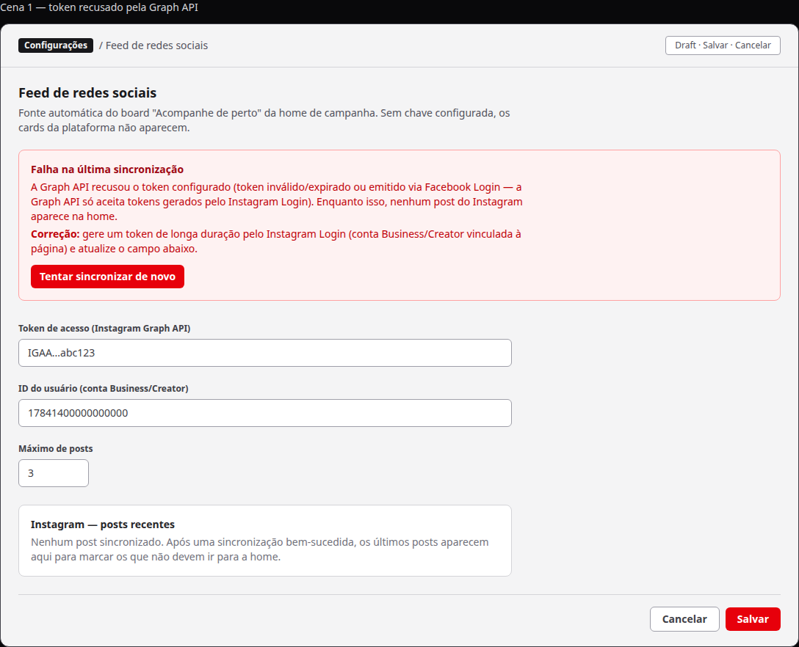
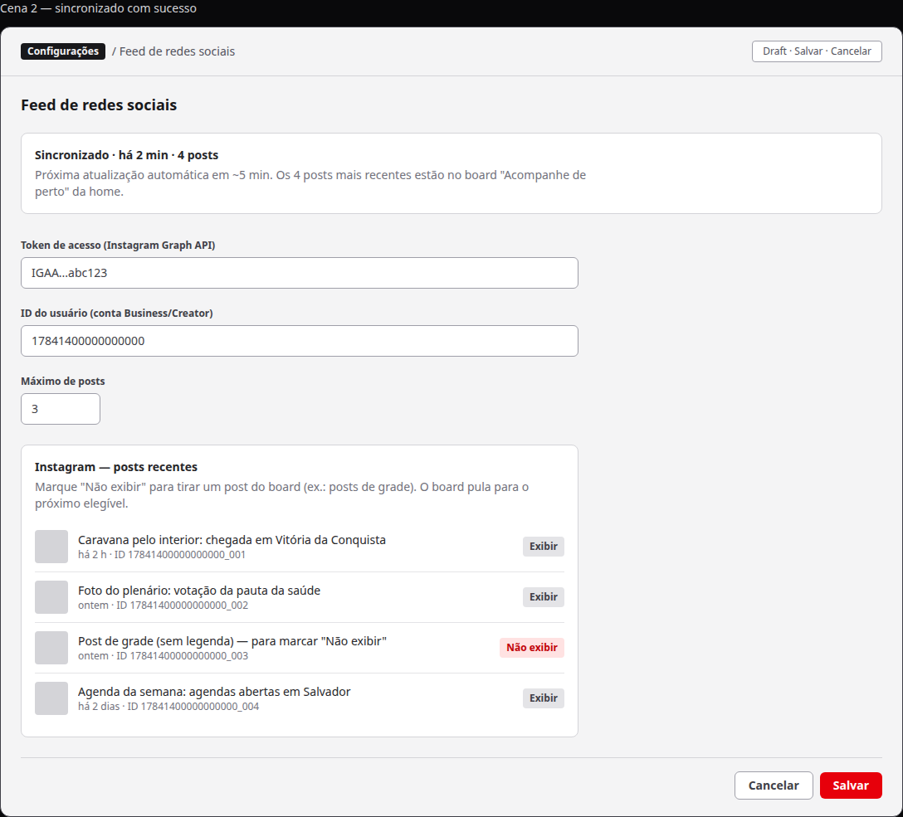
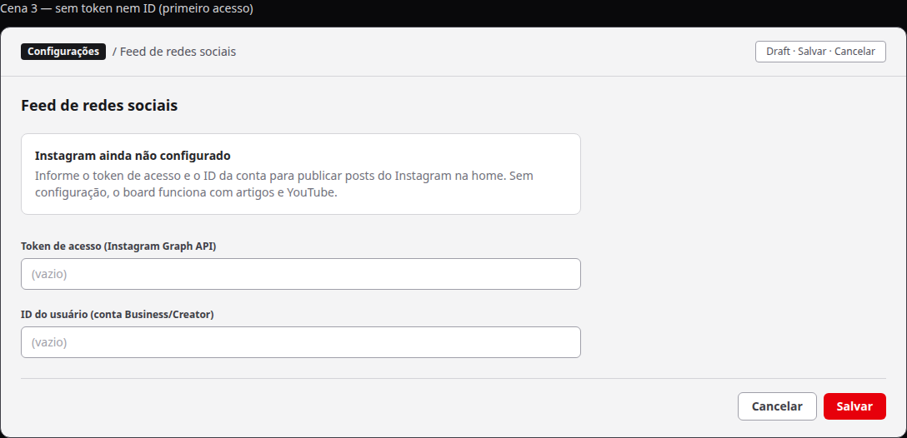

# Feed do Instagram configurado não aparece na home pública

Status: aprovado
Atualizado em: 2026-08-19
Issue: #115
Priority: P1
Model: cursor-grok-4.5-medium
Impeccable: C — encaixe na global do admin (painel de status de sincronização)
Rascunho UI: docs/plans/feed-instagram-nao-aparece-home-ui-draft.html + PNGs embutidos abaixo
Appetite: ~1 dia eng + diagnóstico da causa em produção
Responsável: —

## Intenção

A assessoria preencheu o token e o ID do Instagram na configuração do feed (global "Feed de redes sociais", entregue na S3) e os posts **não aparecem** na seção "Acompanhe de perto" da home pública — em produção, o board mostra YouTube e artigos, nenhum card do Instagram e nenhum link "Seguir no Instagram →" (verificado em 2026-08-19 em jorgesolla1313.com.br). O desenho da S3 é fail-closed **silencioso**: qualquer falha da API (token recusado, ID inválido, rede) degrada para "sem cards" sem deixar rastro — o único indício hoje é o picker do admin vazio ("Nenhum post recente"), que não diz **por quê**. A assessoria fica num ciclo cego de tentativa-e-erro de credenciais.

## Persona e fluxo

- **Persona / contexto:** assessoria de comunicação, configurando a global no admin do Payload (grupo "Configurações"), sem acesso ao código nem a logs.
- **Job principal:** saber, no mesmo lugar onde configurou o feed, se a sincronização do Instagram funcionou — e, se não, **por quê** e **o que fazer**.
- **Fluxo desejado:**
  1. A assessoria preenche token + ID e salva a global.
  2. O admin mostra o estado da sincronização: "Sincronizado · há X min · N posts" (e os posts aparecem no picker, prontos para exclusão), ou "Falha na última sincronização" com o motivo e a correção esperada (ex.: token inválido/expirado ou emitido via Facebook Login — gerar pelo Instagram Login).
  3. Com sincronização OK, os posts aparecem na home pública em minutos (cache revalidado no salvar).
  4. A causa da ocorrência atual fica diagnosticada e documentada num runbook curto para a assessoria não repetir o ciclo.
- **Anti-goals de produto:** nada de wizard OAuth "conectar com Facebook" dentro do admin; nada de dashboard de saúde de feeds; nada de embeds/scripts do Instagram no site público; nada de métricas de engajamento.

### Esboço de fluxo (B/C/D)

```text
[admin: global Feed de redes sociais]
  → salvar token+ID → [status: Sincronizado · N posts] → [home pública: cards IG em minutos]
  → [status: Falha + motivo + correção] → [assessoria corrige credencial e salva] → [status OK]
```

### Rascunho UI (B/C/D)

Painel de status de sincronização por plataforma na global do admin, embutido junto aos campos do Instagram (e reaproveitável para YouTube depois, se a paridade for pedida).







## Objetivo e aceite

- Com credenciais válidas (token gerado pelo Instagram Login + ID da conta Business/Creator), os posts do Instagram aparecem na seção "Acompanhe de perto" da home em até alguns minutos após salvar a configuração — badge "Instagram", legenda, data relativa, clique abre na plataforma. Sem ação manual além da config.
- Quando a Graph API recusa as credenciais ou a sincronização falha, o admin mostra o motivo em linguagem de produto e a correção esperada (ex.: "token inválido/expirado ou emitido via Facebook Login — gere pelo Instagram Login"). A assessoria deixa de ficar cega.
- A home pública continua fail-closed: API fora ou credenciais inválidas nunca quebram a página nem vazam erro — o board segue com artigos + YouTube (comportamento atual preservado).
- A causa da ocorrência em produção fica diagnosticada e registrada em runbook curto (passos para gerar/validar o token), para o ciclo de tentativa-e-erro não se repetir.
- Guardrails: token nunca exposto fora do admin (read da global admin-only, como hoje); zero embeds/scripts do Instagram no site público (LCP); identificadores em inglês, copy em pt.

## Dados (intenção)

- **Vou apresentar dados?** Não — o painel mostra estado operacional (última sincronização, nº de posts, motivo de erro), não métricas. Nenhuma decisão de análise desbloqueada.
- **Forma:** adiada ao plano de implementação — sem contadores, sem engajamento.

## Direção no codebase (hipótese)

- **Áreas prováveis:** `src/utilities/socialFeed/instagramFeed.ts` (onde o erro é engolido no fail-closed — fonte do "porquê"), `src/globals/SocialFeedSettings.ts` (superfície do status), `src/components/admin/InstagramPostExclusionPicker.tsx` (pickers/superfície admin já existente, mesma família de componente), `src/utilities/revalidateRequest.ts` (tag `social-feed` — o salvar já revalida; não espera-se tocar).
- **Precedente a olhar:** plano/impl da S3 (`docs/plans/secao-conteudos-home-instagram*.md`), irmão `youtubeFeed.ts`, e2e do describe serial da seção (stub IG) e smoke do picker no admin.
- **Risco de acoplamento:** o fetch roda dentro de `unstable_cache` durante render — qualquer persistência de status precisa respeitar a restrição de não chamar `revalidateTag` dentro de cache (precedente documentado da S2/S3). A home pública é ISR; revalidação via tag já cobre o salvar do admin.

## Dependências

- **S3** (pai, `done`/`in-prod` — imutável; este é item **sucessor**).

## Fora de escopo

- Setup OAuth / "conectar com Facebook" dentro do admin (o fluxo Meta fica com a assessoria; runbook documenta).
- Redesenho do board público ou dos cards (superfície aprovada na S3 não muda).
- Paridade de status para o YouTube (pode virar followup se a plataforma pedir; o desenho do painel é por plataforma).
- Backfill retroativo de snapshot.

## Rabbit holes de produto

- **Dashboard de saúde de feeds.** Se alguém "só completar" a ideia de status, vira painel de monitoramento com histórico e alertas. **Corte neste item:** um painel de status por plataforma na própria global, só estado atual + motivo; sem histórico, sem alertas.
- **Wizard OAuth no admin.** Completar o desejo com o fluxo completo da Meta explode o escopo (app Meta, permissões, redirects). **Corte neste item:** credenciais continuam preenchidas manualmente; o valor é diagnóstico e correção, não aquisição de token.
- **Investigação infinita da causa em produção.** A causa pode ser credencial da assessoria (troca fora do nosso controle). **Corte neste item:** diagnóstico com prazo — o que não for descoberto num período curto vira instrução de validação no runbook, não bloqueio do item.

## Questões em aberto (produto)

- **Onde a assessoria vê o "porquê"?** **Opções:** A) painel de status na própria global do feed (ao lado dos campos do Instagram) — o lugar onde a assessoria já está quando configura | B) só logs/exceção no servidor (exige acesso técnico — não resolve para a persona) | C) nada além do picker vazio (status quo). **Recomendação:** A — o fracasso acontece onde a configuração acontece; o sinal pertence a esse mesmo lugar. _(assumido — validar com produto)_
- **O item cobre a ocorrência atual em produção?** **Opções:** A) diagnóstico da causa atual + painel de status (a correção de credencial fica com a assessoria, documentada) | B) só painel de status; a causa atual fica para followup | C) só runbook de credenciais. **Recomendação:** A — sem o diagnóstico, não sabemos se há também um defeito de código por trás do sintoma; sem o painel, o sintoma se repete cegamente. _(assumido — validar com produto)_
- **Paridade de status para YouTube agora?** **Opções:** A) só Instagram nesta fatia (o YouTube funciona em produção; o painel nasce desenhado por plataforma) | B) YouTube e Instagram juntos. **Recomendação:** A — fatia mínima útil; paridade vira followup barato se pedida. _(assumido — validar com produto)_

## Referências

- Issue pai S3 (#20, `done`/`in-prod`) + `docs/plans/secao-conteudos-home-instagram.md` e `-impl.md`
- Rascunho UI (gate): `docs/plans/feed-instagram-nao-aparece-home-ui-draft.html` + PNGs acima
- Primeiras pistas para o executor: `src/utilities/socialFeed/instagramFeed.ts` (caminho de falha silenciosa), `src/globals/SocialFeedSettings.ts`, `src/components/admin/InstagramPostExclusionPicker.tsx`, `tests/e2e/frontend.e2e.spec.ts` (describe serial da seção)
- `docs/AGENT-OPS.md` (serializes: nenhum recurso compartilhado — `serializes: []`)
