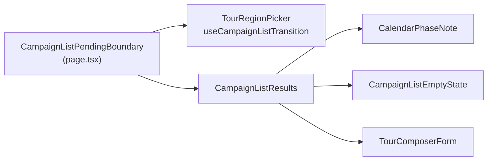

# Dimir o resultado no compositor de giro (feedback pendente)

Status: rascunho
Atualizado em: 2026-07-27
Item do roadmap: [docs/roadmap.md](../roadmap.md) (Fill-ins abertos)
Impeccable: B — encaixe em `/campanha/atividades/giros` (rota entregue no **E13 ✓**); nenhuma superfície nova
Appetite: ~0,25 dia eng; três pontos de edição, sem migration/action/`Consent`
Responsável: —

## Design (Impeccable)

Âncoras: `PRODUCT.md` (clareza sob pressão) / `DESIGN.md` (register `product`, Field Desk) · tema `data-theme='campaign'` · precedente `engineering-standards.mdc` § Loading feedback e as 10 listas de `/campanha` que já usam `CampaignListPendingBoundary` + `CampaignListResults`.

Na implementação (`implement-roadmap-item`): craft compacto → critique → polish. Sem redesign.

Brief compacto:

- **Persona / contexto:** o Assessor troca o Território de Identidade no seletor e o compositor abaixo é recomposto pelo servidor (âncora, satélites, semente, fila). Enquanto a navegação corre, a proposta antiga continua nítida na tela — nada diz que ela é do território anterior.
- **Job principal:** ao trocar de território, saber que a proposta visível está sendo substituída.
- **Estratégia de cor:** Restrained — o idioma já existe (`opacity-60` + `aria-busy` + `aria-live` do `CampaignListResults`); nada de spinner novo nem skeleton próprio.
- **Anti-goals:** transformar o compositor numa lista (ele não é); segundo idioma de pending; `loading.tsx` para a rota (a troca de território é uma transição, não uma entrada).

## Dados → decisão → apresentação

Dados: N/A — nenhuma métrica, série ou escala muda. O item é feedback de transição sobre a composição que o **E13 ✓** já entrega.

## Contexto

O `/simplify` do **E13** (2026-07-27, três revisores) marcou este achado como **"too involved — the composer isn't a list structure"** e o deixou passar. A auditoria de fechamento (`capture-review-debts`, mesma data) mediu o contrário: as peças de pending **não são acopladas a lista nenhuma** —

- `CampaignListPendingBoundary` (`src/components/campaign/shared/CampaignListPending.tsx:30`) é um `Context.Provider` em volta de `children`, sem uma linha sobre tabelas;
- `CampaignListResults` (`:107`) é uma `div` que aplica `data-pending` → `opacity-60`, `aria-busy` e a região `aria-live` "Atualizando resultados…";
- `useCampaignListTransition` (`:45`) **já** cai num `useTransition` local quando não há boundary acima.

Ou seja, o que falta é ligar três fios, não portar uma abstração. Hoje `TourRegionPicker` (`src/components/campaign/tour/TourRegionPicker.tsx:35`) instancia `useTransition()` **à mão** e gasta o `isPending` só no seu próprio `FieldDescription` (spinner + "Montando a proposta de giro…"), com o select desabilitado. É exatamente o padrão que o `engineering-standards.mdc` nomeia como defeito: _"a região de RESULTADOS dima, não só o controle"_.

Dois efeitos concretos, além da inconsistência com as dez listas vizinhas:

1. **A proposta obsoleta continua legível e clicável** durante a transição — inclusive as checkboxes de parada e o campo de nome do giro, cujo default (`Giro <TI> dd/mm`) é do território que está saindo.
2. **Leitor de tela perde o evento.** As listas anunciam "Atualizando resultados…" numa região `aria-live` que envolve o resultado; aqui o único sinal vive na descrição do próprio select, que o usuário de teclado acabou de sair.

## Objetivos

- Trocar de território em `/campanha/atividades/giros` dima a região de resultado (proposta do giro / empty state), não apenas o seletor.
- `TourRegionPicker` consome `useCampaignListTransition` em vez de instanciar o seu próprio `useTransition` — mesma peça que os outros controles navegantes de `/campanha`.
- A transição anuncia-se por `aria-live` uma vez (a do `CampaignListResults`), sem criar uma segunda região viva na página.
- Guardrails: sem migration, sem collection, sem server action, sem `Consent`; contrato de URL (`?region=`) intacto; o comportamento do formulário (`useActionState`, caps, validação) intacto.

## Decisões travadas

- **Reusar `CampaignListPendingBoundary`/`CampaignListResults` em vez de um par próprio para o compositor.** As duas peças não sabem o que é uma lista e o hook já tem fallback local; um par paralelo seria o segundo idioma de pending em `/campanha`. (2026-07-27, medição do fechamento do E13.) **Rejeitado:** componentes `TourComposerPending*` próprios (duplica `opacity`/`aria-busy`/`aria-live` por zero ganho); renomear as peças para `CampaignPending*` neste fill-in (toca 10 rotas por cosmética — só se um 3º domínio não-lista aparecer).
- **A fronteira do "resultado" é tudo o que depende de `?region=`:** o `CalendarPhaseNote`, os empty states de "escolha um território"/"nenhum candidato" e o `TourComposerForm`. O header, o seletor e o botão "Voltar para Atividades" ficam fora. **Rejeitado:** dimir a página inteira (o controle que o usuário está operando não deve desaparecer sob ele).
- **Nada de `loading.tsx` na rota.** A navegação é `router.push` dentro de uma transição, então o segmento não remonta; um `loading.tsx` só apareceria na entrada direta, que já é rápida. **Rejeitado:** skeleton do compositor (a proposta anterior dimada é mais informativa que um esqueleto).
- **i18n e naming** (AGENTS.md): identificadores em inglês; a copy visível reusa "Atualizando resultados…" já existente, sem nova string.

## Questões em aberto

- **A copy `aria-live` "Atualizando resultados…" serve para uma proposta de giro?** **Opções:** A) reusar como está | B) prop de mensagem no `CampaignListResults` para dizer "Recompondo o giro…". **Recomendação:** **A** — "resultados" descreve honestamente o que muda, e um prop novo abriria a porta para dez variações de copy nas listas; revisitar no critique se soar errado em voz alta.
- **O spinner atual do `FieldDescription` fica ou sai?** **Opções:** A) fica (controle + resultado sinalizam) | B) sai, deixando só o dim. **Recomendação:** **A** — é o feedback imediato no ponto do gesto; o dim é o que informa o escopo. Custa duas linhas manter.

## Abordagem proposta

Componentes:

- **`src/app/(campaign)/campanha/(app)/atividades/giros/page.tsx`**: envolve o seletor + o bloco de resultado num `CampaignListPendingBoundary` (o provider é client, o conteúdo continua RSC como nas dez listas) e o bloco condicional (`CalendarPhaseNote` + a escada de empty states + `TourComposerForm`) num `CampaignListResults`.
- **`src/components/campaign/tour/TourRegionPicker.tsx`** (`:35`): `useTransition()` → `useCampaignListTransition()`; nada mais muda (o `href` já vem serializado pelo RSC).
- **Teste:** caso jsdom em `tests/unit/` no molde de `campaignListFilterNavigation.unit.spec.ts` (router mockado) provando que a troca de território marca `aria-busy` na região de resultado; o `data-pending` é o mesmo atributo que as listas já pinam.
- **Migration:** nenhuma.

Depth check: nenhum módulo novo — três edições em dois arquivos que já donam a superfície.

## Dependências

- Dura: **E13 ✓** (a rota existe). Suave: **B33+ ✓** (`useCampaignListTransition` nasceu ali como fallback compartilhado).
- Reusa: `CampaignListPending.tsx` inteiro.

## Não escopo

- Feedback de submissão do formulário (gerar rascunhos) — já coberto pelo `useActionState` + `Spinner` do `TourComposerForm`.
- Pending nas demais superfícies do E13 (card "Elegibilidade para visita" no detalhe) — já streama atrás de `<Suspense>`.
- Renomear a família `CampaignList*` para algo neutro — gatilho no plano do **B32+** se um 3º consumidor não-lista aparecer.

## Rabbit holes

- **"Já que estou aqui, transformo o compositor numa lista canônica."** Se alguém "só completar": nasce paginação, filtros e footer numa tela de três interações. **Mitigação:** o item toca duas linhas de import e dois wrappers.
- **"Generalizo o pending para toda a `/campanha`."** Vira o rename de 10 rotas que esta decisão explicitamente adiou. **Mitigação:** boundary = a rota de giros.

## Adiado com gatilho

- **Renomear `CampaignList*` → `CampaignPending*`.** Revisitar quando um **3º** consumidor não-lista usar as peças (o compositor é o 2º, contando o wizard de import como parcial).

## Referências

- `docs/roadmap.md` (Fill-ins abertos)
- [planejador-de-giros.md](planejador-de-giros.md) — **E13 ✓**, o pai do achado
- `src/components/campaign/shared/CampaignListPending.tsx` (`:30` boundary, `:45` hook, `:107` results)
- `src/components/campaign/tour/TourRegionPicker.tsx` (`:35`)
- `src/app/(campaign)/campanha/(app)/atividades/giros/page.tsx`
- `src/app/(campaign)/campanha/(app)/municipios/page.tsx` — precedente de montagem boundary + results
- `tests/unit/campaignListFilterNavigation.unit.spec.ts` — molde do teste
- `.cursor/rules/engineering-standards.mdc` — § Loading feedback ("a região de RESULTADOS dima")
- `PRODUCT.md` / `DESIGN.md` — Field Desk
