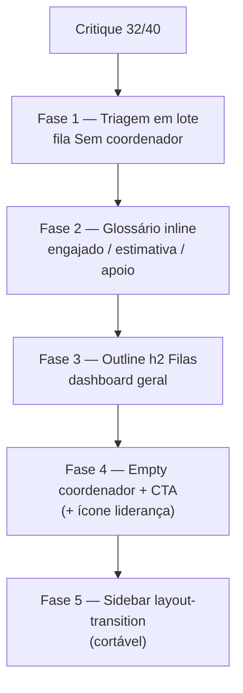

# UX Field Desk pós-critique

Status: registrado no roadmap (fases pendentes)
Atualizado em: 2026-07-20
Item do roadmap: [docs/roadmap.md](../roadmap.md) (FD2, fill-in de design/produto pós-critique Impeccable `/campanha`)
Responsável: —

## Contexto

O re-critique de `/campanha` (2026-07-19, dual-agent) subiu o score de **28 → 32/40** após o ciclo quieter → polish. Em **2026-07-19/20**, um segundo ciclo (layout dashboard `geral`, `/simplify`, re-critique) manteve **32/40** e fechou os P1 visuais do dashboard isolado (27→32 no eixo home). Os P1 do baseline anterior (parede de filtros, grade de KPI cards, side-tab) já estavam fechados. Permanecem débitos de **design/produto** registrados nas fases abaixo.

Fontes: [`.impeccable/critique/2026-07-19T11-03-23Z__src-app-campaign-campanha.md`](../../.impeccable/critique/2026-07-19T11-03-23Z__src-app-campaign-campanha.md), [`.impeccable/critique/2026-07-20T00-01-43Z__src-app-campaign-campanha.md`](../../.impeccable/critique/2026-07-20T00-01-43Z__src-app-campaign-campanha.md) e triage `capture-review-debts` (2026-07-20).

## Objetivos

- Alex (geral/coordenador) consegue tratar a fila **Prioridade · Sem coordenador** com multi-select + ação em lote (atribuir coordenador), sem N navegações.
- Lia e first-timers encontram definição inline de jargão recorrente (`engajado`, estimativa confirmada vs proposta, status de apoio) sem sair da tela.
- Outline do dashboard `geral` não pula de `h1` para `h3` (detector `skipped-heading`; Sam/a11y).
- Empty do coordenador sem núcleos espelha o padrão de liderança (CTA + próximo passo).
- Guardrails: sem migration obrigatória na v1 da triagem (reusa designação de coordenador existente); sem Consent novo; touch `min-h-11` preservado.

## Já resolvido nesta sessão (dashboard + simplify, 2026-07-19/20 — não reabrir)

Registrado via `capture-review-debts` após layout dashboard + `/simplify` + re-critique Impeccable.

- **`GeneralDashboardTopRow`** — grid desktop 3:2:1 (Filas | Próximos eventos | Recentes); reflow 4:2 quando sem visitas.
- **`ActionQueuesCard`** — subseções vazias omitidas; estado único “Tudo em dia” (`CheckCircle2Icon` + `Empty`).
- **`ChoroplethLegend`** — barra rose→vermelho com rótulos 0/máx (`formatElectionNumber`).
- **`LeadershipStatusCard`** — título, descrição, CTA “Ver núcleos”, grid com ênfase em `engajado`, empty dedicado.
- **`RecentlyVisitedCard`** — dedup com `RecentlyVisited`; `aria-label` no limpar; `list-none`; modo `compact`/`labeled`.
- **`CampaignPageShell`** — `mx-auto` (centro em ultra-wide).
- **`formatElectionNumber`** no dashboard (`CampaignDashboard`, `LeadershipStatusCard`) em vez de `Intl` local.
- **`buildDashboardQueueItemHref`** — import direto de `ActionQueuesCard` (sem re-export em `CampaignDashboard`).
- Props `empty` mortas removidas de `QueueSection`; `useCallback` estável em `onVisitCountChange`; hidratação SSR do painel recentes (`useEffect` + `useState([])`).

## Decisões travadas

- **Um plano FD2, fases por severidade do critique.** P2 antes de P3. Ordem: triagem em lote (impacto Alex) → glossário inline (Help) → outline a11y → empty coordenador → chrome motion (cortável).
- **Bulk só na fila de prioridade na v1.** As filas “sem atualização” e “estimativas pendentes” continuam one-by-one até haver evidência de volume — evita escopo de “saved views” genérico.
- **Glossário = affordance inline, não página de docs.** Tooltip/`Popover`/`?` em `SupportStatusBadge` e labels de estimativa; uma frase Núcleo/ZE já existe na lista.
- **P3 mobile red bar vs rail** permanece documentado em `DESIGN.md` como field-mode intencional — **fora deste plano** (escolha explícita no ciclo Impeccable).
- **i18n e naming:** identificadores em inglês (`bulkAssignCoordinators`, `CampaignGlossaryHint`), copy em pt-BR.

## Questões em aberto

- **Bulk assign: mesmo sheet de designação ou fluxo novo?** **Recomendação:** reusar o shell/lazy de `assignCoordinators` por núcleo em sequência sob uma txn ou N actions com progresso — não inventar multi-núcleo no Payload sem necessidade; UX é checklist + um coordenador aplicado a N slugs.
- **Quem pode bulk?** **Recomendação:** só `geral` (já é quem designa coordenadores em massa conceitualmente); `coordenador` não aparece na fila “Sem coordenador”.
- **Primeiro glossário: tooltip Radix ou texto expandido?** **Recomendação:** `Popover`/`HoverCard` com `min-h-11` no gatilho `?` — funciona em touch melhor que hover-only.
- **Ícone AlertTriangle no empty de liderança?** Critique minor: tom alarmista. **Recomendação:** trocar para `UsersIcon` / `InboxIcon` na mesma passagem do empty do coordenador (Fase 4).

## Abordagem proposta

### Fase 1 — Triagem em lote (P2)

- Em **`ActionQueuesCard`** / `QueueSection` com `openCoordinatorAssignment`: modo multi-select (checkbox por linha) + barra “Atribuir coordenador (N)”.
- Server action (ou extensão da existente de assign) recebe `nucleusSlugs[]` + `coordinatorIds[]`; access `geral`; `overrideAccess: false`; txn se multi-write.
- Reusa padrões de `CoordinatorAssignment` / shell lazy do detalhe do núcleo — extrair só o necessário para não puxar o editor completo N vezes no client.
- **Opcional (critique h1=3):** exibir idade relativa na linha da fila (“sem atualização há X dias”) quando o item vier de `withoutRecentUpdate` — só metadado de leitura; não bloqueia bulk.

### Fase 2 — Glossário inline (P2)

- **`CampaignGlossaryHint`** (novo, pequeno): props `termKey`, children trigger.
- Ligar em **`SupportStatusBadge`**, cartão de estimativa (`VoteEstimateCard` / labels no dashboard de liderança), e opcionalmente chip de ZE se ainda houver dúvida após a frase da lista.
- Copy curta aprovável por produto (sem inventar doutrina eleitoral).

### Fase 3 — Outline do dashboard (P2 a11y)

- Em **`CampaignDashboard`** (`GeneralDashboard`): promover “Filas de ação” a `h2` visível (hoje só `CardTitle` em `div`); manter títulos de cada fila como `h3`.
- Verificar ordem DOM: h1 → h2 Filas → h3s → h2 Indicadores.

### Fase 4 — Empty coordenador + polish P3 (P3)

- Espelhar **`LeadershipDashboard` empty**: `EmptyMedia` + CTA (`Ver meu perfil` e/ou texto “peça à coordenação geral…”).
- Suavizar ícone do empty de liderança (`AlertTriangle` → `UsersIcon` / `InboxIcon`).
- **`RecentlyVisitedCard` `compact`:** mostrar `formatRelativeAge` visível (`text-xs text-muted-foreground`, truncado) — hoje só `sr-only` (critique Alex).
- **`UpcomingActionPlansCard`:** empty com componente `Empty` (hoje `
` solto) + link opcional “Criar plano” para `geral`.

### Fase 5 — Motion do Sidebar (P3, cortável)

- Em **`Sidebar.tsx`** (ou wrapper campaign): evitar `transition-[width,height,padding]` em favor de `transform`/`opacity` onde o detector marcou `layout-transition`.
- Só se profiling/UX mostrar jank; caso contrário cortar.

## Dependências

- Soft: polish Field Desk (filas, empties base) mergeado.
- Soft: FD+ (shell/heading) melhora consistência mas **não bloqueia** FD2.
- Reusa `CampaignDashboard.tsx`, access de designação de coordenador, `SupportStatusBadge`, tema campaign.
- Sem migration na v1; sem Consent.

## Não escopo

- DRY de shell/heading/datas/VoteGoals/filters bag — **FD+** ([escala-dry-pos-field-desk.md](escala-dry-pos-field-desk.md)).
- Saved views genéricas de filtros de lista (além do bulk da fila).
- Quiet da barra vermelha mobile (field-mode documentado).
- Bulk nas filas secundárias do dashboard.
- Push/offline ambient cue no shell (Casey) — candidato a D1/D2 follow-up, não este plano.
- Mapa clicável para filtrar núcleos (pergunta de produto; read-only em v1).
- `max-w-screen-2xl` / margem ultra-wide — cap intencional do Field Desk.
- Cadeia de wrappers do mapa / `CardHeader` no mapa — polish cosmético descartado no triage.
- Top-row 3:2:1 no dashboard coordenador — **adiado** até produto pedir paridade com `geral`.

## Explicitamente fora (triage capture-review-debts 2026-07-20)

- **VR+ F1** (`pageshow`/`storage` em recentes) — permanece em [escala-dry-pos-visitados-recentemente.md](escala-dry-pos-visitados-recentemente.md).
- **VR+ F3** (`CampaignLinkListRow`) — defer: gatilho 3º painel de atalhos ou drift visual.
- **VR+ F4** (shell por role) — defer: `GeneralDashboardTopRow` cobre `geral`; coord/liderança pendem.
- **FD+** merge de dois `CampaignMetricStrip` em grid 2×3 — defer: gatilho terceira strip ou refactor VoteGoals F3.
- Re-export cleanup `SupportStatus`; reuse `NucleusListOverview` → `UpcomingActionPlansCard` — pureza/DRY descartados.

## Referências

- [`.impeccable/critique/2026-07-19T11-03-23Z__src-app-campaign-campanha.md`](../../.impeccable/critique/2026-07-19T11-03-23Z__src-app-campaign-campanha.md)
- [`.impeccable/critique/2026-07-20T00-01-43Z__src-app-campaign-campanha.md`](../../.impeccable/critique/2026-07-20T00-01-43Z__src-app-campaign-campanha.md)
- `docs/roadmap.md` (Fill-ins FD2)
- `PRODUCT.md` / `DESIGN.md` — Field Desk, Signal Red, personas Alex/Casey/Lia
- `src/components/campaign/ActionQueuesCard.tsx`, `GeneralDashboardTopRow.tsx`, `RecentlyVisitedCard.tsx`, `LeadershipStatusCard.tsx`, `ChoroplethLegend.tsx`, `CampaignDashboard.tsx`, `SupportStatusBadge.tsx`, shells de assign de coordenador
- AGENTS.md — campaign auth, `overrideAccess: false`, naming
