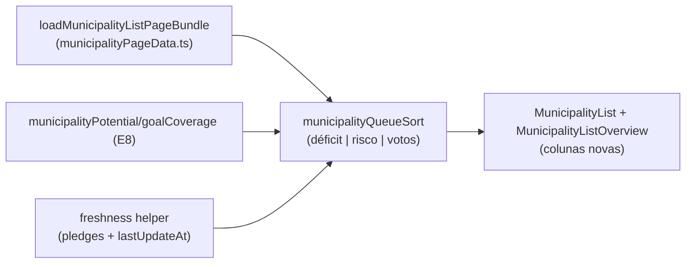

# E9 — Fila de alocação (lista de decisão do coordenador)

Status: rascunho
Atualizado em: 2026-07-24 (refs sincronizadas pós-remodelagem Municípios + hardening)
Item do roadmap: [docs/roadmap.md](../roadmap.md) (seção "Inteligência de campanha", E9; plano-mestre [inteligencia-campanha.md](inteligencia-campanha.md))
Impeccable: B — visão nova DENTRO de `/campanha/municipios` (ordenações + colunas + painel), sem rota nova
Appetite: ~1,5 dia eng; sem migration (deriva de E8 + dados existentes)
Responsável: —

## Design (Impeccable)

Âncoras: `PRODUCT.md` (princípios 2 "clarity under pressure", 3 "edit where you see", 5) / `DESIGN.md` (register `product`) · tema `data-theme='campaign'` · shells existentes (`MunicipalityList`, `MunicipalityListOverview`, `MunicipalityFilters`, `CampaignListPagination`).

Na implementação: craft compacto → critique → polish.

- **Persona / contexto:** "o mapa serve ao padrão espacial; a alocação de verdade se decide na lista" (relatório D3). Coordenador prepara a reunião de recurso; assessor abre a fila dos seus municípios.
- **Job principal:** a primeira linha da lista é o lugar onde falta mais voto que a campanha planejou ter.
- **Estratégia de cor:** Restrained; "coluna da vergonha" (sem responsável) como badge âmbar discreta, não alarme.
- **Edit where you see:** sim — responsável/meta/nível editáveis em contexto (reusa `MunicipalityListAdvisorsControl` e padrão B9).
- **Anti-goals:** data-grid/planilha full-row; segunda lista paralela à de municípios; ranking gamificado de assessores (alimenta gaming — relatório G4).

## Contexto

O relatório definiu a "fila de trabalho" com 7 colunas ranqueadas (FU3): votos em jogo; meta/cobertura/delta; classe operacional; desempenho relativo (LQ/captura); rede + frescor; competição local; tendência — com **ordenação default por déficit descoberto** (meta − comprometido, decrescente; empate por votos em jogo) e uma ordenação de risco (municípios de defesa por frescor, o mais dormente primeiro). A lista de municípios atual (`MunicipalityList` + `loadMunicipalityListPageBundle`) já tem filtros/URL/overview/edição rápida; faltam as colunas derivadas e as ordenações de decisão. A hierarquia de triagem completa (5 níveis) vive no plano-mestre e vira produto no E11 — aqui entra só a fila "estática" de colunas+ordenações.

## Objetivos

- Novas ordenações na URL (`?sort=deficit|risco-frescor|votos-em-jogo`) via `campaignListUrl.ts`, preservando filtros existentes — estende o `?sort=votos` que nasce em **A11** ([ranking-votos-municipio.md](ranking-votos-municipio.md)).
- Colunas derivadas na linha do município: déficit (meta − comprometido), cobertura %, votos em jogo (válidos projetados), **% da própria votação** (rank/share via helper de A11 — a âncora de prioridade da mesa, sessão 2026-07-23), LQ/captura, frescor (dias desde último pledge/sinal/atualização), badge "sem responsável".
- Visão do assessor: mesma fila filtrada às seus municípios (access já garante o escopo — `getAccessibleMunicipalityIds`).
- Overview da lista ganha "coluna da vergonha": contagem de municípios priorizados sem responsável (link filtrado).
- `leader` não vê a fila (colunas staff-only seguem o padrão de redaction dos view models `municipalityViewModels.ts`).

## Decisões travadas

- **A fila é a própria lista de municípios com ordenações/colunas novas — não uma rota nova.** Evita segundo sistema de listas e mantém filtros/URL/paginação existentes (C6 shells). **Rejeitado:** rota `/campanha/fila` dedicada (duplicaria filtros e navegação; a fila de _sugestões_ do E11 é outra superfície e outro item); tabela full-row editável (anti-goal PRODUCT.md).
- **Default de ordenação para staff = `deficit` quando houver metas** (revisão 2026-07-24). A regra de adoção do discovery é "registro no fluxo de poder — a reunião de recurso começa pela lista"; fila opt-in atrás de um select esconde a inteligência. Sem metas (pré-E8/E4R), default continua nome. **Rejeitado:** fila opt-in permanente (contradiz E1/O-B do relatório); forçar o default também para ordenações de risco (essas seguem opt-in).
- **Déficit usa meta efetiva = `voteGoals.regular ?? suggestedGoal`** (mesma regra de E8), e municípios N0/N1 (pós-E14) saem do topo por meta mínima — até E14, municípios sem meta ficam no fim, não no topo. **Rejeitado:** ordenar por déficit bruto sem tratamento (município perdido com meta lixo polui o topo — FU3).
- **i18n e naming:** `municipalityQueueSort`, `deficit`, `freshnessDays`, `unassignedPriorityCount`; labels pt-BR ("Déficit", "Frescor", "Sem responsável").

## Questões em aberto

- **Frescor conta o quê?** Opções: só `declaredAt`/`estimatedAt` de pledges | máx(pledge, `municipality.lastUpdateAt`) | incluir planos. **Recomendação:** máx(pledge mais recente, `lastUpdateAt`) — sinais de rede já alimentam `lastUpdateAt` via `municipalityUpdate`; planos entram quando C12 tipar sinais.
- **Colunas visíveis por default no mobile?** **Recomendação:** déficit + cobertura + frescor (3), resto em disclosure — campo usa celular (PRODUCT.md).

## Abordagem proposta

Componentes:

- **`src/utilities/municipalityQueue.ts`**: composição das linhas (déficit, cobertura, frescor, flags) sobre o bundle existente — uma passada, sem N+1; ordenações puras testáveis em unit.
- **`MunicipalityList.tsx` / `MunicipalityListOverview.tsx`**: colunas/badges novas; select de ordenação em `MunicipalityFilters.tsx` (mesmo padrão auto-aplicado do fill-in filtros-auto).
- **URL**: `campaignListUrl.ts` ganha `sort` (nasce em A11 com `votos`); com metas presentes (E8/E4R), o default do staff passa a `deficit` (decisão travada acima); sem metas, default nome. Select "Ordenar por" continua para as demais ordenações.
- **Sem migration, sem collection, sem server action nova** (edição em contexto reusa `municipalityStaffFormActions`).

## Dependências

- Dura: **E8** (meta efetiva, votos em jogo, cobertura). Suaves: E10 (coluna classe passa a usar classificação relativa quando existir; até lá mostra a atual), E14 (nível modula o topo), C12 (frescor de sinais tipados).
- Reusa: `municipalityPageData.ts`, `votePledgeData.ts`, `campaignListUrl.ts`, `MunicipalityFilters`, padrão B9 de edição em contexto.

## Não escopo

- Sugestões/menu de ações e triagem 1–5 (E11 — [motor-de-sugestoes.md](motor-de-sugestoes.md)); rollup por TI (E12); mudanças no mapa (B13); histerese de mudanças (E11/E14).

## Rabbit holes

- **Virar data-grid.** "Só mais uma coluna editável" até virar planilha. **Mitigação:** colunas derivadas são read-only; edição só nos 3 Popovers já existentes (B9) + meta (E8).
- **Ordenação server-side vs. client.** O bundle já carrega o conjunto filtrado inteiro para overview/mapa (A9+); ordenar em memória é O(n log n) sobre ~435 — não abrir paginação SQL nova por isso.

## Adiado com gatilho

- **Fila persistida com posição manual (drag).** Gatilho: coordenador pedir reordenação manual na reunião (hoje: ordenação é derivada, determinística).

## Referências

- `docs/roadmap.md` (Inteligência de campanha, E9) · [plano-mestre](inteligencia-campanha.md) (fila canônica) · [ranking-votos-municipio.md](ranking-votos-municipio.md) (A11 — helper de rank/share e `?sort=votos`)
- `docs/research/relatorio-entrevista-persona-campanha.md` FU3 (colunas e ordenações), §6.2 (triagem), D3 ("a alocação se decide na lista")
- `docs/CUSTOMER.md` — "Salvador cobrado 10×" (coluna da vergonha), âncora % da própria votação (sessão 2026-07-23)
- `src/utilities/municipalityPageData.ts`, `src/utilities/votePledgeData.ts`, `src/components/campaign/MunicipalityList.tsx`, `src/components/campaign/MunicipalityListOverview.tsx`, `src/components/campaign/MunicipalityFilters.tsx`, `src/utilities/campaignListUrl.ts`
- AGENTS.md — access por papel, view models com redaction, URLs com chaves em inglês
