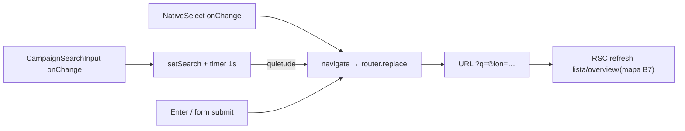

# Filtros auto-aplicados na lista de municípios

Status: entregue (2026-07-21; em produção desde 2026-07-23)
Atualizado em: 2026-07-24
Item do roadmap: [docs/roadmap.md](../roadmap.md) (Fill-ins)
Impeccable: B — encaixe em `MunicipalityFilters` (`/campanha/municipios`); sem rota nova
Appetite: ~0,5 dia eng; só client em `MunicipalityFilters` (+ pending a11y); sem migration
Responsável: —

> **Revisão 2026-07-24 (remodelagem M1 + hardening):** identificadores renomeados `plaza*` → `municipality*` (`MunicipalityFilters`, `buildMunicipalityFiltersKey`, `shouldUpdateMunicipalitySearchUrl` em `municipalityUi.ts`, rota `/campanha/municipios`); nomes antigos abaixo são da época. O hardening 2026-07-23 entregou o **shell compartilhado de pending** (`CampaignListPendingBoundary` + `useCampaignListPending`), fechando um dos itens Adiados.

_Revisão 2026-07-21 (pós-implementação + `/simplify` + capture-review-debts): debounce 1s + Enter imediato + pending UI; `commitNavigation` com no-op key; testes unit. Débitos S1–S2 registrados em Adiado (não reabrir no simplify)._

## Design (Impeccable)

Âncoras: `PRODUCT.md` / `DESIGN.md` (register product — Field Desk) · tema `data-theme='campaign'` · shells existentes (`CampaignPageShell`, `CampaignSearchInput`, `PlazaFilters`).

Na implementação (`implement-roadmap-item`): craft compacto → critique → polish (sem shape longo — interação, não redesign).

Brief compacto:

- **Persona / contexto:** Alex / Assessor monta um recorte de Praças sob pressão (TI + tipo + busca por município); espera que a lista reaja sem um passo extra de confirmação.
- **Job principal:** filtrar a lista (e, com B7, o mapa) só mudando controles — busca com atraso curto, selects imediatos.
- **Estratégia de cor:** Restrained (inalterada).
- **Anti-goals:** segundo botão de confirmação; redesign do disclosure de filtros; unificar todas as listas da vertical neste item.

## Contexto

Em `/campanha/pracas`, `PlazaFilters` (`src/components/campaign/PlazaFilters.tsx`) já aplica **selects** na URL via `router.replace` + `buildPlazaListHref` no `onChange` (região, tipo, assessoria, tendência, prioridade). Só o campo de texto `q` fica em estado local e só sobe para a URL no `onSubmit` do form — daí o botão **"Buscar"**.

Na era Núcleos (2026-07-17) a listagem já aplicava filtros pelo estado da URL sem botão de confirmação (notebook). A remodelagem R2 reintroduziu o padrão "digitar + Buscar" só na busca textual. Pedido de produto (2026-07-21): aplicar automaticamente ao selecionar valores; na busca, disparar a atualização após **1 s** sem digitar, para não navegar a cada caractere.

Precedente de pending UI: `ActionPlanFilters` (`useTransition` + `data-pending` + `aria-live` "Atualizando resultados…"). `SupporterFilters` ainda usa Buscar no `q` — fora deste item.

## Objetivos

- Remover a necessidade do botão **Buscar** em `/campanha/pracas`: selects continuam imediatos; `q` atualiza a URL após **1000 ms** de quietude (debounce).
- Enter no campo de busca aplica `q` **imediatamente** (sem esperar o timer) — acessibilidade e atalho de poder.
- Manter **Limpar** (zera local + `router.replace('/campanha/pracas')`).
- Preservar remontagem canônica por `key={buildPlazaFiltersKey(state)}` na página (servidor = fonte da verdade; voltar/avançar sincroniza).
- Feedback de atualização (`isPending` / `aria-busy` / live region) alinhado a `ActionPlanFilters`.
- Guardrails: sem migration, sem collection, sem Consent, sem server action; URL e `parsePlazaListParams` inalterados.

## Decisões travadas

- **Fill-in com plano (não B8 nem fase de R6/B7).** É restauração de interação barata, paralelizável, cortável; não muda contrato lista↔mapa (B7) nem ciclo visual R6. (2026-07-21, classificação roadmap-item.) **Rejeitado:** item de trilha B (infla grafo por polish de ½ dia); absorver só em R6 (atrasa quick win e some no critique largo); fase de [mapa-pracas-filtrado.md](mapa-pracas-filtrado.md) (preocupação distinta: where do mapa).
- **Debounce só em `q` = 1000 ms; selects sem debounce.** Pedido explícito de produto; selects já são baratos (um replace por mudança). **Rejeitado:** debounce em todos os controles (atrasa feedback de select); Buscar só no texto e selects auto (estado atual — deixa o botão como falso afunilamento mental).
- **Remover o botão Buscar; Enter aplica na hora.** Com debounce + Enter, o botão é redundante. **Rejeitado:** manter Buscar como atalho (ruído visual Field Desk; era Núcleos já operava sem).
- **Não extrair hook/shared filter shell neste item.** Um call site de debounce; `ActionPlanFilters` / `SupporterFilters` não unificam ainda. **Rejeitado:** `useDebouncedPlazaFilters` / factory de listas (&lt;3 call sites — classitis).
- **i18n e naming** (AGENTS.md): identificadores em inglês (`SEARCH_DEBOUNCE_MS`, `navigate`, `isPending`); strings visíveis em pt-BR (live region, labels existentes).

## Questões em aberto

- **Espelhar em apoiadores / lideranças / organizações?** **Opções:** A) neste item | B) fill-ins separados sob demanda | C) lote em R6. **Recomendação:** B — escopo = Praças (pedido); cada lista tem forma diferente (disclosure, tabs). Gatilho abaixo.
- **Constante 1000 ms vs prop?** **Opções:** A) `const SEARCH_DEBOUNCE_MS = 1000` no arquivo | B) prop no componente. **Recomendação:** A — um call site; prop só se o 2º consumidor divergir.

## Abordagem proposta

Componentes:

- **`PlazaFilters`** (`src/components/campaign/PlazaFilters.tsx`):
  - Manter `navigate(next)` com `page: 1` e `scroll: false`.
  - Em `onChange` do search: atualizar `search` local; `clearTimeout` + `setTimeout(1000)` que chama `navigate({ ...state, q: trimmed || undefined })` só se o valor canônico diferir de `state.q` (evitar replace no-op).
  - Cleanup do timer no unmount; cancelar timer ao Limpar / ao Enter (flush imediato).
  - Envolver replaces em `startTransition`; espelhar `data-pending` / `aria-busy` / live region de `ActionPlanFilters`.
  - Remover o `Button type="submit"` "Buscar"; form pode permanecer com `onSubmit` = flush imediato do `q` (Enter).
  - Depth check: reusar `buildPlazaListHref` / `PlazaListState` / `CampaignSearchInput` — sem utility nova de debounce até o 3º call site.
- **`pracas/page.tsx`**: sem mudança obrigatória (já passa `key={buildPlazaFiltersKey(state)}`). Soft: com B7 entregue, cada replace de filtro também refresca o mapa — aceitável no appetite.
- **Teste:** unit leve do helper de “próximo `q` / skip no-op” se extrair uma função pura de 5 linhas; senão E2E/manual: digitar “salvador”, esperar ≥1s, assert URL `q=`; mudar TI, assert URL imediata sem clique. Precedente de filtros URL: era Núcleos / notebook.
- **Migration:** Sem migration, sem collection, sem server action.

## Dependências

- **Dura:** nenhuma de outro plano (R2 já entregue).
- **Suave:** B7 ([mapa-pracas-filtrado.md](mapa-pracas-filtrado.md)) ✓ entregue — cada replace de filtro também refresca o mapa filtrado.
- Reusa: `plazaUi.ts` (`buildPlazaListHref`, `PlazaListState`), padrão pending de `ActionPlanFilters.tsx`, dwell do `RecentVisitTracker` (já re-arma o timer a cada `href` — debounce 1s + dwell ~2s evita visitar intermediários).

## Não escopo

- Filtro do mapa pela URL → **B7**.
- Critique/polish visual / mover filtros acima do mapa → **R6**.
- Auto-busca em `/campanha/apoiadores`, lideranças, organizações → fill-ins futuros (gatilho abaixo).
- `setStyle` incremental no mapa → **B6**.

## Rabbit holes

- **Hook compartilhado `useCampaignListFilters`.** Se alguém “só generalizar”: redesenha três listas. **Mitigação:** inline neste arquivo; extrair no 3º call site.
- **Debounce via lib (`use-debounce` etc.).** Dependência nova por 10 linhas. **Mitigação:** `setTimeout` + cleanup.
- **Otimistic list client-side.** Duplicaria `buildPlazaListWhere` no browser. **Mitigação:** URL + RSC como hoje.

## Já resolvido no simplify/critique (não reabrir)

- Alias `plazaSearchParamFromInput` removido; `normalizedText` + `shouldUpdatePlazaSearchUrl` em `plazaUi.ts`.
- No-op de navegação via `buildPlazaFiltersKey` (não dois `buildPlazaListHref`).
- `hasActiveFilters` inclui texto local de busca (Limpar visível antes do debounce).
- `clearDebounce` duplicado no `onSubmit` removido.
- Impeccable `detect.mjs` no alvo: 0 findings (sem critique formal nesta sessão).

## Adiado com gatilho

- **Sync `search` local ↔ `state.q` no back/forward do browser.** `key={buildMunicipalityFiltersKey(state)}` remonta na maioria dos casos; edge case: campo pode mostrar texto stale após voltar/avançar. **Gatilho:** QA ou R6 reportar desync em `/campanha/municipios`.
- ~~**Shell compartilhado de pending UI**~~ — **entregue no hardening 2026-07-23:** `CampaignListPendingBoundary`/`useCampaignListPending` compartilhados por `MunicipalityFilters`, `ActionPlanFilters`, `SupporterFilters`, `CampaignSearchForm` e paginação (dim + `aria-busy`).
- **Auto-aplicação com debounce nas demais listas com Buscar** (`SupporterFilters`, `CampaignSearchForm` de lideranças/organizações/dobradinhas — hoje têm pending compartilhado, mas o `q` ainda é submit-driven). Revisitar quando produto pedir ou quando R6/critique citar “Buscar” como atrito repetido em ≥2 listas.
- **Extrair `useDebouncedSearchParam`.** Revisitar no 3º call site idêntico (municípios + apoiadores + 1).

## Referências

- `docs/roadmap.md` (Fill-ins; R6)
- `src/components/campaign/MunicipalityFilters.tsx` — alvo da mudança
- `src/components/campaign/ActionPlanFilters.tsx` — precedente auto-apply + pending
- `src/components/campaign/SupporterFilters.tsx` / `CampaignSearchForm.tsx` — pending compartilhado; `q` ainda submit-driven
- `src/components/campaign/CampaignListPending.tsx` — shell de pending do hardening
- `src/app/(campaign)/campanha/(app)/municipios/page.tsx` — `buildMunicipalityFiltersKey`
- `src/utilities/plazaUi.ts` — URL canônica
- AGENTS.md — naming; superfície `(campaign)`
- `PRODUCT.md` / `DESIGN.md` — Field Desk / clarity under pressure
- Notebook — precedente 2026-07-17 filtros auto na lista de Núcleos
