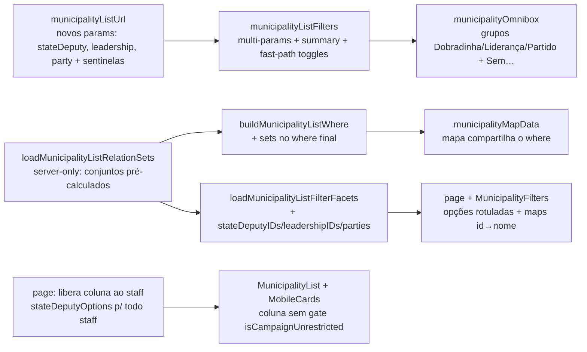

# Impl: Filtrar municípios por Dobradinha, Liderança e Partido (+ liberar a coluna Dobradinhas ao Assessor)

Status: aprovado
Atualizado em: 2026-08-09
Issue: #458
Intenção: docs/plans/filtros-municipios-dobradinha-lideranca.md
Appetite restante: ~1,5–2 dias eng (herdado)

## Leitura da intenção

- **Outcome:** na omnibox de `/campanha/municipios`, **Dobradinha**, **Liderança** e **Partido (dobradinha)** viram dimensões de filtro (busca por nome/sigla + chips removíveis + recorte "Sem …"), no padrão do Assessor; Multi-valor OR por dimensão; parâmetros novos **aditivos** à URL congelada. A **coluna Dobradinhas** passa a ser vista e editada (inline) pelo **Assessor**, dentro dos municípios que ele administra.
- **O que NÃO negociar:** URL congelada (B18) — mudança aditiva, nunca re-sêmantiza parâmetros existentes; leader lockdown (a página já tem `gate: noLeader`); facets/nomes nunca vazam escopo do ator; `estimatedVotes` fora de alcance (nenhum destes filtros toca estimativa); dados de Dobradinha são staff-wide (registro), mas o recorte do assessor nasce do portfólio administrado.
- **O que reavaliar:** a intenção supõe "liderança necessita leitura reversa" e "partido via facel de leitura cruzada". Confirmei no código: `stateDeputy` **não** guarda `municipalities` (a relação vive só em `municipality.stateDeputies`, `index: true`), então **partido também exige pré-cálculo de conjuntos** (deputados do partido → municípios ligados), não só liderança. O filtro de dobradinha é o único direto (`stateDeputies: { in: [...] }`).

## Abordagem recomendada

**Opções consideradas:**

- **A — Filtros expressos em `where` com conjuntos pré-calculados** (recomendada): `buildMunicipalityListWhere(state, sets?)` continua pura/síncrona e **fail-closed** quando `leadership`/`party` pedem conjuntos ausentes; conjuntos vêm de um helper server-only (`loadMunicipalityListRelationSets`) usado por página, facets e mapa. Dobradinha (direta) e os "Sem …" combinam sem sair de `where` (`exists: false`, `not_in`).
- **B — Derivar em memória como `class`** (forçar o caminho load-tudo + filtro em JS): simples, mas descarta o paged-by-Payload para 3 dimensões novas (perde paginação nativa e `totalDocs` correto via DB) — pior custo na 435-linha.
- **C — Campo espelho `stateDeputy.municipalities`** (hasMany espelhado mantido pelo mesmo hook que escreve `municipality.stateDeputies`): permitiria joins diretos para partido/liderança, mas é **migração** + hook de espelhamento novo + risco de drift fora do escopo do appetite ("sem migration" no plano da intenção).

**Recomendação:** A — sem migration, mantém o contrato de URL aditivo, mantém a paginação nativa (o `where` continua expresso), facets seguem a regra "valores ainda alcançáveis", e o custo novo é um conjunto pequeno de leituras únicas (sem N+1). C é cara e rejeitada; B é barata mas piora performance global da lista.
**Rejeitadas:** B (introjeção em memória de 3 dimensões numa lista paginada); C (migração + campo espelho; fora do appetite declarado "sem migration").

### Decisões de engenharia

1. **Parâmetros de URL (aditivos)** — `stateDeputy` (IDs numéricos multi, sentinela `sem_dobradinha`), `leadership` (IDs multi, sentinela `sem_lideranca`), `party` (texto multi, sentinela reusa `NO_PARTY_FILTER_VALUE = 'sem_partido'`). Nomes espelham B143 (`stateDeputy`) e `stateDeputyListUrl` (`party`). Estado: `stateDeputies?: number[]`, `leaderships?: number[]`, `parties?: string[]`.
   - **Decisão:** extrair o par "sentinela + branch `exists:false`" num helper compartilhado — o comentário de `municipalityListUrl.ts:54-58` já pedia "a third should extract"; hoje há `sem_nivel` e `sem_partido` e este item adiciona `sem_dobradinha` + `sem_lideranca`.
2. **`buildMunicipalityListWhere(state, sets?)`** — assinatura ampliada sem quebrar call sites atuais (map/página passam conjuntos; teste unitário puro continua valendo para o resto). `leadership`→`id: { in: union(named) }` / `id: { not_in: union(all) }`; `party`→`stateDeputies: { in: partyDeputyIDs }` / `stateDeputies: { not_in: allPartyDeputyIDs }`; `stateDeputy` direto. **Guard fail-closed:** se `leaderships` OU `parties` ativos sem `sets`, lança — nenhum caller pode dropar filtro em silêncio.
3. **Novo módulo server-only `municipalityListRelationSets.ts`** — `loadMunicipalityListRelationSets(payload, user, state)` computa 4 conjuntos com `user` + `overrideAccess: false` (scope-honoring): `leadershipMunicipalityIDs` (união dos municípios das lideranças selecionadas), `allLeadershipMunicipalityIDs` (união sobre TODAS as lideranças do escopo; para "Sem liderança"), `partyDeputyIDs` (deputados com `party in selecionados`), `allPartyDeputyIDs` (deputados com qualquer partido; para "Sem partido"). Leitura reversa única de `leadership.municipalities`; `stateDeputy.party` é barato.
4. **Facets** — `loadMunicipalityListFilterFacets` estende o `select` das rows para `stateDeputies`; novo campo `stateDeputyIDs` (união dos vínculos nas rows omit), `leadershipIDs` (leitura reversa sobre os ids das rows omit, reusa `loadMunicipalityLeadershipSummaries`), `parties` (lookup de partido dos deputados presentes nas rows). A regra "cada facet omita a dimensão que ela própria possui" exige que `facetRows` passe a resolver `where` por dimensão via `buildMunicipalityListWhere(state+omit, setsDe(state+omit))` — o memo atual por `JSON.stringify(where)` passa a ser por estado omitido (mesma disciplina, chave nova).
5. **Omnibox** — grupos novos `Dobradinha` (label `Nome (PARTIDO)`, keywords deputado/dobradinha), `Liderança` (nome do contato, keywords lider/lideranca), `Partido` (sigla, keywords partido/psd/…); sons "Sem …" como seeds estáticos (precedente de "Sem nível", não `emptyQueryVisible` — surgem ao digitar "sem"). Chips: `stateDeputy:<id>`, `leadership:<id>`, `party:<value>` com maps id→nome fornecidos pela página; apply/remove via `toggleMunicipalityMultiFilterValue` genérico (novos params entram em `MunicipalityMultiFilterParam`).
6. **Liberação da coluna ao Assessor** — **só UI + catálogo**: o path de escrita já é staff-wide e scoped no servidor (`setStateDeputyMunicipalitiesBatchRecord`/`createMunicipalityStateDeputyRecord` usam `reloadStaffActor` + `canUpdateMunicipality` + `stateDeputies` `canManageCampaignStaffField`, todos staff/portfolio-ready em `actions/stateDeputy.ts`). Mudanças: `MunicipalityList.tsx` (coluna sem o wrapper `isCampaignUnrestricted` no ramo staff; picker idem), `MunicipalityListMobileCards.tsx` (idem), página (`isStaffView ? loadStateDeputyOptions : []`).
   - **Catálogo do picker da coluna para o assessor — decisão aberta para o gate humano:** registro de dobradinha é staff-wide por design (`canReadStateDeputy` = staff, diferente de `canReadLeadership` que é scoped). **Recomendação:** manter o catálogo completo do staff para o combobox da célula (o write já limita o município; o picker completo evita o assessor não conseguir adicionar uma dobradinha estadual ao seu município), e o **filtro** nasce scoped por vir das rows do portfólio. **Alternativa:** scoping do catálogo da célula (espelha B155) — mais restritivo, mas gera uma restrição nova que contradiz o registro staff-wide. Ajuste é 1 loader (barato). _(Marcar no gate.)_
7. **Mapa** — `loadMunicipalityMapBundle` passa a computar `sets` (o mapa compartilha o estado da URL da lista; sem isso um recorte por liderança/partido não filtraria o mapa).
8. **Resumo/visita** — `formatMunicipalityActiveFiltersSummary` ganha Dobradinha/Liderança por contagem ("N dobradinhas") e Partido por siglas (valores já são legíveis), coerente com Assessor por contagem; chip label dos sentinelas ("Sem dobradinha" etc.).

### Componentes / mudanças

- **`src/utilities/municipality/municipalityListUrl.ts`**: estado + parse/serialize + `where` (com `sets?`) + paramNames; sentinelas `NO_STATE_DEPUTY_FILTER_VALUE`/`NO_LEADERSHIP_FILTER_VALUE` (+ helper de sentinela compartilhado reusando `NO_PARTY_FILTER_VALUE`).
- **`src/utilities/municipality/municipalityListFilters.ts`**: `MunicipalityMultiFilterParam` + `stateDeputies|leaderships|parties`; toggles/clear já genéricos; summary + `buildMunicipalityFilterOptionHref` (fast-path dos novos params).
- **`src/utilities/municipality/municipalityRelationSets.ts`** (novo, server-only): conjuntos pré-calculados + rótulos (nomes para o omnibox/facets) respeitando escopo.
- **`src/utilities/municipality/municipalityPageData.ts`**: `MunicipalityListFilterFacets` + conjuntos no bundle; página/mapa consomem.
- **`src/utilities/municipality/municipalityOmnibox.ts`**: chips/seeds/apply/remove dos 3 grupos + "Sem …".
- **`src/utilities/municipality/municipalityMapData.ts`**: `sets` no `buildMunicipalityListWhere`.
- **`src/components/campaign/municipality/MunicipalityFilters.tsx`**: props novas (`stateDeputyFilterOptions`, `leadershipFilterOptions`, `partyFilterOptions`, maps id→nome) → seeds/chips.
- **`src/components/campaign/municipality/MunicipalityList.tsx` / `MunicipalityListMobileCards.tsx`**: coluna Dobradinhas liberada ao staff (ramo `isStaffView`).
- **`src/app/(campaign)/campanha/(app)/municipios/page.tsx`**: carrega `stateDeputyOptions` para todo staff; monta as option lists dos novos grupos + maps.
- **Migration:** sem migration (sem schema).
- **Access / Consent:** sem Consent; escopo via `user` + `overrideAccess: false` já existentes; fail-closed no guard de `sets`.
- **UI:** Impeccable **B** — encaixe na omnibox existente (shell `CampaignListOmnibox`, chips, grupos) e no gate de coluna; nenhum componente novo de superfície além dos option lists. Shape→craft (nomes/chips legíveis; grupo "Partido" por sigla; sentinelas com rótulo PT).

### Dados → forma (pergunta 3)

- Forma escolhida: sem dados novos — quantitativo dos recortes já visível; chips citam o mesmo nome das colunas (`stateDeputyDisplayName` / nome do contato da liderança) — única leitura de nomes alimenta coluna e filtro (precedente B155/B157).
- Rejeitadas: % estadual, expor `estimatedVotes`, contagem de seleção além da própria lista.

## Fases verificáveis

1. **URL + where + sets (schema/server)** — sentinela compartilhado, `stateDeputies|leaderships|parties` no estado/parse/serialize, `buildMunicipalityListWhere(state, sets?)` fail-closed, `loadMunicipalityListRelationSets`, facets estendidas, `mapData` com sets. Testes unitários (parse/serialize/where/sentinela/omit-por-dimensão) + int (conjuntos + facets no `teqo_wt…_test`).
2. **UI** — `MunicipalityFilters` + omnibox (grupos, seeds, chips, apply/remove, summary/visita), liberação da coluna (desktop + mobile + picker), página (catalog staff-wide + options). Impeccable B no encaixe.
3. **Gates** — `pnpm gate:fast` na iteração; e2e: inverter o teste "keeps Dobradinha restricted…" → assessor vê/edita a coluna; assessor edita inline dentro do portfólio e é rejeitado fora; adicionar filtros por Dobradinha/Liderança/Partido + "Sem …" (chip, URL, lista). Entregar com `pnpm push`.

## Rabbit holes / Não escopo (engenharia)

- **`not_in` com lista vazia** (ex.: "Sem liderança" com zero lideranças no escopo) — semântica SQL a fixar **com teste** (special-case: `in: []` matchea nada; `not_in: []` matchea tudo).
- **Spillover para a página de edição da ficha (`/editar`)** — a intenção cobre só a **coluna** da lista; a ficha fica como está (fora de escopo; notar como follow-up se o gate quiser).
- **Popover de filtro no header das colunas** — decidido "não" no gate; sem trabalho.
- **"Sem organização"/filtros das outras listas** — for a de escopo (candidatos a Items sucessores).
- **Otimização além do padrão** — se os conjuntos exigirem N+1, medir antes (regra da intenção); hoje é 1–3 leituras únicas.

## Riscos e mitigação

- **Custo das facets/leitura reversa no 435-linha (coordenador):** mitigado com leitura única (sem N+1), `index: true` em `municipality.stateDeputies`/`leadership.municipalities`, e reuso do scope da página como semente (mesmo padrão B16+).
- **Regressão no contrato de URL congelado (B18/saved filters):** mudança estritamente aditiva; parse tolerante (IDs inválidos/fora de escopo → simplesmente não matcheiam); bookmarks antigos continuam válidos (params ausentes = sem restrição).
- **Assessor editar/vincular fora do portfólio:** já rejeitado no servidor (B37/B157 `canUpdateMunicipality`); teste de acesso no aceite; UI não esconde a recusa.
- **Vazamento de escopo nas facets:** todas as reads com `overrideAccess: false`; facet de liderança honra `canReadLeadership`.

## Aceite de engenharia

- [x] Aceite de produto da intenção ainda coberto (3 dimensões + 3 "Sem…" na omnibox; coluna Dobradinhas staff-wide; URL aditiva; assessor scoped no servidor)
- [x] Invariantes AGENTS/engineering-standards (identificadores EN; copy PT; sem migration; sem Consent novo; `overrideAccess: false`)
- [x] Testes de domínio: unit (parse/serialize/where/sentinela/omnibox) + int (sets/facets) + e2e (coluna ao assessor desktop+mobile; edição no portfólio; filtros novos)

## Débitos diferidos (gate capture-review-debts 2026-08-09)

Achados P3 dos reviewers de /simplify, deferidos com gatilho (não poluem a fila):

- **Gatilho (se tocar no resumo de filtros da lista):** consolidar os 3 blocos `formatAbsenceAwareSummary` num formatter tipado de dimensão (contagem/partido) — hoje um helper local cobre; só vale extrair quando uma 4ª dimensão aparecer.
- **Gatilho (se tocar em `parseAdvisorsParam`/canonicalização):** unificar `parseAdvisorsParam` com o núcleo de `canonicalRelationshipWithAbsenceValues` (mesmo loop sem sentinela) — 7 linhas privadas no mesmo arquivo, adiado.
- **Gatilho (se o combobox da coluna Dobradinhas mostrar `Dobradinha #N` para id selecionado fora do facet):** preferir o nome do registro staff-wide antes do placeholder — hoje o cenário não ocorre (facet une selecionados + registro é staff-wide), mantido o precedente `Assessor #N`.
