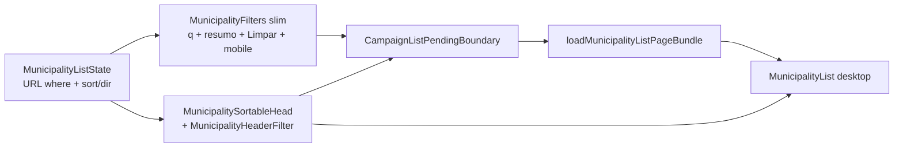

# B16 — Filtros no header das colunas da lista de Municípios

Status: entregue
Atualizado em: 2026-07-24
Item do roadmap: [docs/roadmap.md](../roadmap.md) (Demais itens abertos, B16; superfície de coordenação)
Impeccable: B — encaixe em `MunicipalityList` / `MunicipalitySortableHead` / `MunicipalityFilters` em `/campanha/municipios`; sem rota nova
Appetite: ~1–1,5 dia eng; relocação dos selects de recorte para o header (desktop) + barra slim + mobile stacked selects; sem migration, sem collection, sem Consent
Responsável: —

## Design (Impeccable)

Âncoras: `PRODUCT.md` (princípios 2 — clareza sob pressão — e 8 — Feel the action) / `DESIGN.md` (register `product`; Field Desk) · tema `data-theme='campaign'` · shells `MunicipalitySortableHead`, `CampaignListPendingBoundary`, shadcn `Table` / `NativeSelect` / `Popover`.

Na implementação (`implement-roadmap-item`): craft compacto → critique → polish (só composição header+filtro; sem redesign da lista/overview).

Brief compacto:

- **Persona / contexto:** Assessor / CG / Candidato na tabela densa de até 435 municípios; olho na coluna (TI, tendência, cobertura…) e quer **restringir aquele eixo** sem subir o olhar até a fileira de selects acima do overview.
- **Job principal:** filtrar pelo header da coluna correspondente **e** continuar ordenando pelo mesmo header (B15 intacto).
- **Estratégia de cor:** Restrained — indicador de filtro ativo sóbrio (ícone/weight), sem segunda fileira de chips coloridos.
- **Edit where you see:** não — filtro/sort são navegação URL; células B9 (Assessores / Tendência / votos estimados) permanecem Popovers de mutação.
- **Anti-goals:** spreadsheet / data-grid mode; TanStack Table / lib nova; inventar filtros numéricos novos (faixa de votos, frescor) neste item; esconder busca/Limpar; duplicar o mesmo select no topo **e** no header no desktop.

## Dados → decisão → apresentação

- **Vou apresentar dados?** Não como métrica nova — **Dados: N/A** para fórmula/KPI. A superfície continua a **tabela/lista** já existente; este item só relocaciona as affordances de recorte (URL where) para o header.
- **Decisões desbloqueadas:** Staff: “neste TI / só zonas / só sem assessor / só tendência X / só prioritárias — e no topo por votos/frescor — o que atacar?” (mesmo recorte de hoje, gestual colado à coluna).
- **Forma escolhida:** **tabela / lista** (inalterada) + filtro no `TableHead` — **por quê:** o eixo do filtro já é a coluna. **Rejeitado:** segundo painel de facets; chips flutuantes sobre a tabela; chart de distribuição dos filtros.
- **Profile:** N/A (sem série/mapa novo); granularidade município; ≤435 no filtrado.
- **Anti-goals de dado:** sem % estadual; sem filtro que minta a paginação (where continua no loader); sem reordenar o mapa por este item.

## Contexto

Em `/campanha/municipios`, o estado canônico de lista já vive na URL via `MunicipalityListState` (`municipalityUi.ts`): `q`, `region`, `kind`, `coverage`, `priority`, `trend`, `page`, e desde **B15** `sort`/`dir` com headers clicáveis (`MunicipalitySortableHead`). Os filtros de recorte ainda estavam numa **fileira separada** (`MunicipalityFilters`) acima do overview — o olho alternava entre barra e tabela.

Mapeamento coluna ↔ filtro URL (staff) — as-built pós-E8:

| Coluna (desktop)   | Sort (B15)      | Filtro URL (B16)                                                                     |
| ------------------ | --------------- | ------------------------------------------------------------------------------------ |
| Município          | `name`          | `priority` (checkbox) + `slug` (multi, com busca)                                    |
| Território         | `region`        | `region` (multi, com busca)                                                          |
| Tipo               | `kind`          | `kind`                                                                               |
| 2022 (`votos`)     | `votos`         | —                                                                                    |
| Assessores         | `coverage`      | `coverage` (com/sem assessor) + `advisor` (multi) — **não** "Cobertura da meta" (E8) |
| Tendência          | `trend`         | `trend` (multi; todos ou nenhum = todas)                                             |
| Votos estimados    | `expectedVotes` | —                                                                                    |
| Última atualização | `lastUpdateAt`  | —                                                                                    |
| Cobertura da meta  | —               | — (estática; E8)                                                                     |

## Objetivos

- Desktop (`md+`): para cada filtro URL já existente que tem coluna correspondente, o controle de filtro vive no `TableHead` daquela coluna, **ao lado** do sort B15 (sem perder `aria-sort` / toggle `dir`).
- Semântica URL intacta (`parse`/`build`/`resolveMunicipalityListUrl`); pending via `CampaignListPendingBoundary` / `commitNavigation` (Feel the action).
- Barra superior slim: **busca** (`q`) + **resumo dos filtros ativos** + **Limpar** (+ **Cenário** quando o fill-in de Cenário entregar; mobile: selects empilhados).
- Mobile (cards): filtros **não** fingem header — permanecem empilhados em `md:hidden` (sem disclosure novo — não havia precedente no repo).
- Guardrails: sem migration, sem collection, sem Consent, sem server action; `leader` continua redirecionado; staff-only filters só com `showStaffFilters` / `isStaffView`.

## Decisões travadas

- **Item de trilha B16 (não fill-in; não só R6; não reabrir B15).** Pattern de composição da lista que E9 consome; ~1–1,5d; B15 já entregue o contrato sort. (2026-07-24, roadmap-item.)
- **Só relocacionar filtros URL existentes — não inventar where novos.** v1: `region`, `kind`, `trend`, `coverage`, `priority` no header; `q` fica na barra (texto livre).
- **Sort = clique no rótulo/chevron (B15); filtro = funil irmão no mesmo `TableHead` → Popover uniforme.** Opções navegam por `CampaignTransitionAnchor`. **Rejeitado:** NativeSelect inline no header; híbrido NativeSelect+Popover.
- **Desktop: removes selects duplicados da fileira superior.** Barra slim = busca + resumo + Limpar (+ Cenário).
- **Mobile: selects empilhados** (não disclosure). **Rejeitado:** inventar Collapsible neste item.
- **Prioridade no header da coluna Município** com trigger **rotulado** "Prioridade" (discoverability pós-critique).
- **Coluna "Assessoria" removida (2026-07-25, produto):** ela repetia a informação de "Assessores". O param `coverage` sobrevive — ordena a coluna Assessores (por nº de assessores, label de sort "Assessores") e filtra "Com/Sem assessor" no mesmo popover, acima da lista de assessores; no mobile continua como select próprio ("Assessoria"). Segue **não** sendo a coluna "Cobertura da meta" (E8).
- **i18n e naming:** `MunicipalityHeaderFilter`, `MunicipalityFilterParam`, estender `MunicipalitySortableHead`; labels pt-BR.

## Questões em aberto (resolvidas na implementação)

- **Controle no header:** Popover uniforme (confirmado com produto na sessão de plano).
- **Fill-in Cenário:** fora deste PR — barra slim reserva o slot.
- **Label coverage:** sort/coluna **Assessores**; select mobile **Assessoria** (auditoria pós-E8).

## Abordagem proposta (as-built)

Componentes:

- **`MunicipalityHeaderFilter`** — funil / FunnelPlus + Popover; optimistic enquanto pending; busca no Popover quando ≥8 opções; Prioridade rotulada.
- **`MunicipalitySortableHead`** — prop opcional `filterParam`.
- **`MunicipalityFilters`** — desktop slim; mobile `md:hidden` a partir de `municipalityFilterDefinitions`.
- **`municipalityUi.ts`** — `municipalityFilterDefinitions`, `applyMunicipalityFilterValue`, `buildMunicipalityFilterHref`, `municipalityListFilterParts`, `formatMunicipalityActiveFiltersSummary`.

## Dependências

- **Dura:** nenhuma — **B15 ✓** já entregue.
- **Suaves:** fill-in Cenário (destino = barra slim); fill-in ícone prioridade; **E9** (herda o pattern).

## Não escopo

- Novos params de filtro (faixa de votos, frescor, rank) — produto futuro / E9.
- Sort na coluna Assessores; filtro “por assessor nomeado”.
- Unificar headers filtráveis em apoiadores/lideranças.
- Redesign do overview / mapa; R6 glossário.
- Lib de data-grid / reorder de colunas.

## Rabbit holes

- Spreadsheet mode · Mitigação: só navegação URL + B9 Popovers.
- Segundo `useTransition` · Mitigação: `useCampaignListPending` / `CampaignTransitionAnchor`.
- Abstrair `FilterableSortableHead` genérico · Mitigação: 1 call site.
- Disclosure mobile novo · Mitigação: selects empilhados.

## Adiado com gatilho

- Filtro numérico / por faixa · pedido mesa ou E9.
- Filtro “por assessor” (ID) · coordenação pedir além do scope de advisor.
- Shared head filtrável em `components/ui` · 2ª lista pedir o padrão.
- Chips dismissíveis no resumo (P2 critique) · atrito medido no onboarding.

## Notas de implementação (2026-07-24)

- **Auditoria pré-implementação:** mapa de colunas defasado pós-E8 (Assessoria ≠ Cobertura da meta); “disclosure mobile” inexistente → selects empilhados; default sort = `votos` desc (A11).
- **Affordance:** Popover uniforme (não híbrido). Escopo: só B16 (Cenário fora).
- **Critique** (dual-agent, score 25/40): 0 P0; 3 P1 fechados (optimistic control, Prioridade rotulada, busca no Popover de TI); P2 summary wrap mitigado. Snapshot: `.impeccable/critique/2026-07-25T02-37-03Z__src-components-campaign-municipalitylist-tsx.md`.
- **Verificação:** `tsc`/`lint`/`knip`/`test:unit` (328)/`test:int` (verde; 2 timeouts flaky na 1ª passada, ok no retry)/`build` local. Aikido 0 findings nos arquivos editados. E2E `municip` bloqueado por ambiente da máquina (`ENOSPC` → Postgres local caiu / porta 5432 indisponível); não é regressão de produto deste item — revalidar com `pnpm test:e2e` quando o disco/DB local estabilizar.

## Ajustes pós-uso (2026-07-25)

- **Bug do clique que se auto-desfazia** (Prioritária não aplicava; TI selecionado não desmarcava): o `href` de cada opção era derivado do estado **otimista**, e o `onPointerUp` aplicava o otimista **antes** do `click` — o clique navegava para o estado já invertido. Regra agora: `CampaignTransitionAnchor` expõe `onNavigate`, chamado **depois** de o clique fixar o `href`; o otimista é derivado (`{ baseKey, next }` comparado com a chave do estado da URL), sem `useEffect` correndo contra a transição.
- **Opções cruzadas com os filtros ativos:** `loadMunicipalityListFilterFacets` (em `municipalityPageData.ts`) devolve slugs/territórios/assessores ainda alcançáveis. Cada facet aplica todos os outros filtros e **omite o próprio param** (o conjunto OR continua somável); valores selecionados entram na união para poderem ser desfeitos; `where` idênticos colapsam em uma query (caso comum = 1 leitura).
- **Peso dos headers:** "Assessores" e "Cobertura da meta" passaram a `font-normal`, igualando os headers ordenáveis inativos.
- **Rolagem e header fixo:** a tabela não é mais um scroller próprio — `Table` ganhou `containerClassName` e a lista passa `overflow-x-visible`, de modo que o único scroller vertical é o da área de conteúdo (`campaign-content-scroll`) e o `sticky top-0` dos `th` resolve contra ele. Fundo opaco (`bg-background`) + `shadow-[inset_0_-1px_0_var(--border)]` no lugar da borda da `tr` (que não acompanha células sticky) e cantos arredondados nas células das pontas, já que o wrapper perdeu o `overflow-hidden`. Trade-off aceito: uma tabela mais larga que a viewport passa a rolar junto com a página em vez de ter barra própria.
- **Tendência multi-escolha:** `state.trend` virou `state.trends[]` (param `trend` repetido). Regra travada: **todas ou nenhuma selecionadas = "todas"** — o `where` só restringe com `0 < n < 3` (senão municípios sem tendência registrada sumiriam), e o mesmo teste governa o ícone "filtro ativo" e o resumo. Sem opção "Todas" no popover. Mobile ganhou `MobileMultiFilterField` (escolher adiciona, escolher de novo remove), agora compartilhado com Assessores. `applyMunicipalityFilterValue` sobrou só para `kind` e virou `applyMunicipalityKindFilter`.
- **Empty state só nas linhas:** o overview e a linha de header (com os filtros) continuam montados; `MunicipalityListEmptyState` entra numa `tr` com `colSpan` no `tbody` (e no lugar dos cards no mobile). Para isso `loadMunicipalityListPageBundle` passou a devolver overview **zerado** em vez de `null` quando o escopo filtrado é vazio (int test atualizado). Sem isso o usuário ficava sem como desfazer o filtro que zerou a lista.
- **Verificação visual:** Playwright dirigido contra um dev server no banco de teste — header `position: sticky` colado no topo com o scroller em 900px, `table-container` com `overflow: visible` e sem scroll vertical próprio; empty state com overview + header + 6 botões de filtro presentes; popover de Tendência com as 3 opções e URL `?trend=favoravel&trend=neutra` após dois cliques.

## Referências

- `docs/roadmap.md` (B16; B15 ✓; fill-ins Cenário / prioridade; E9)
- [ordenacao-colunas-lista-municipios.md](ordenacao-colunas-lista-municipios.md) (B15)
- [filtros-auto-pracas.md](filtros-auto-pracas.md)
- [cenario-junto-filtros-municipios.md](cenario-junto-filtros-municipios.md)
- `src/components/campaign/MunicipalityList.tsx`, `MunicipalitySortableHead.tsx`, `MunicipalityHeaderFilter.tsx`, `MunicipalityFilters.tsx`
- `src/utilities/municipalityUi.ts`
- `PRODUCT.md` / `DESIGN.md`
