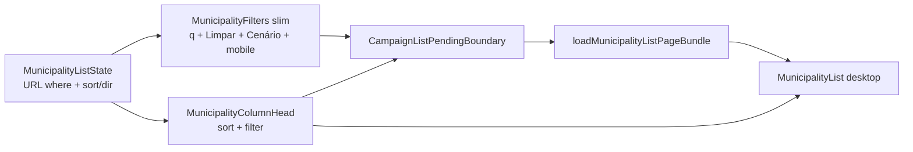

# B16 — Filtros no header das colunas da lista de Municípios

Status: rascunho
Atualizado em: 2026-07-24
Item do roadmap: [docs/roadmap.md](../roadmap.md) (Demais itens abertos, B16; superfície de coordenação)
Impeccable: B — encaixe em `MunicipalityList` / `MunicipalitySortableHead` / `MunicipalityFilters` em `/campanha/municipios`; sem rota nova
Appetite: ~1–1,5 dia eng; relocação dos selects de recorte para o header (desktop) + barra slim + mobile disclosure; sem migration, sem collection, sem Consent
Responsável: —

## Design (Impeccable)

Âncoras: `PRODUCT.md` (princípios 2 — clareza sob pressão — e 8 — Feel the action) / `DESIGN.md` (register `product`; Field Desk) · tema `data-theme='campaign'` · shells `MunicipalitySortableHead`, `CampaignListPendingBoundary`, shadcn `Table` / `NativeSelect` / `Popover` se precisar.

Na implementação (`implement-roadmap-item`): craft compacto → critique → polish (só composição header+filtro; sem redesign da lista/overview).

Brief compacto:

- **Persona / contexto:** Assessor / CG / Candidato na tabela densa de até 435 municípios; olho na coluna (TI, tendência, cobertura…) e quer **restringir aquele eixo** sem subir o olhar até a fileira de selects acima do overview.
- **Job principal:** filtrar pelo header da coluna correspondente **e** continuar ordenando pelo mesmo header (B15 intacto).
- **Estratégia de cor:** Restrained — indicador de filtro ativo sóbrio (ícone/weight), sem segunda fileira de chips coloridos.
- **Edit where you see:** não — filtro/sort são navegação URL; células B9 (Assessores / Tendência / votos estimados) permanecem Popovers de mutação.
- **Anti-goals:** spreadsheet / data-grid mode; TanStack Table / lib nova; inventar filtros numéricos novos (faixa de votos, frescor) neste item; esconder busca/Limpar; duplicar o mesmo select no topo **e** no header no desktop.

## Dados → decisão → apresentação

- **Vou apresentar dados?** Não como métrica nova — **Dados: N/A** para fórmula/KPI. A superfície continua a **tabela/lista** já existente; este item só relocaciona as affordances de recorte (URL where) para o header.
- **Decisões desbloqueadas:** Staff: “neste TI / só zonas / só sem assessor / só tendência X / só prioritárias — e no topo por votos/frescor — o que atacar?” (mesmo recorte de hoje, gestual colado à coluna).
- **Forma escolhida:** **tabela / lista** (inalterada) + filtro no `TableHead` — **por quê:** o eixo do filtro já é a coluna. **Rejeitado:** segundo painel de facets; chips flutuantes sobre a tabela; chart de distribuição dos filtros.
- **Profile:** N/A (sem série/mapa novo); granularidade município; ≤435 no filtrado.
- **Anti-goals de dado:** sem % estadual; sem filtro que minta a paginação (where continua no loader); sem reordenar o mapa por este item.

## Contexto

Em `/campanha/municipios`, o estado canônico de lista já vive na URL via `MunicipalityListState` (`municipalityUi.ts`): `q`, `region`, `kind`, `coverage`, `priority`, `trend`, `page`, e desde **B15** `sort`/`dir` com headers clicáveis (`MunicipalitySortableHead`). Os filtros de recorte ainda estão numa **fileira separada** (`MunicipalityFilters`) acima do overview — o olho alterna entre barra e tabela. Sort e filtro não compartilham affordance espacial.

Mapeamento atual coluna ↔ filtro URL (staff):

| Coluna (desktop)         | Sort (B15)      | Filtro URL hoje                                                            |
| ------------------------ | --------------- | -------------------------------------------------------------------------- |
| Município                | `name`          | `q` (busca; não é select) + `priority` (badge/ícone na célula, sem coluna) |
| Território de identidade | `region`        | `region`                                                                   |
| Tipo                     | `kind`          | `kind`                                                                     |
| 2022 (`votos`)           | `votos`         | —                                                                          |
| Assessores               | — (editor B9)   | — (filtro “Assessoria” alimenta a coluna **Cobertura**)                    |
| Tendência                | `trend`         | `trend`                                                                    |
| Votos estimados          | `expectedVotes` | —                                                                          |
| Última atualização       | `lastUpdateAt`  | —                                                                          |
| Cobertura                | `coverage`      | `coverage`                                                                 |

Pedido de produto (2026-07-24): avaliar juntar os filtros aos headers, **idealmente no header de cada coluna**, mantendo sort.

Fill-ins vizinhos: [Cenário junto aos filtros](cenario-junto-filtros-municipios.md) (assume fileira de filtros); [ícone de prioridade](icone-prioridade-lista-municipios.md) (coluna do nome). **E9** herda a mesma lista/URL — o padrão de header deve sobreviver à fila.

## Objetivos

- Desktop (`md+`): para cada filtro URL já existente que tem coluna correspondente, o controle de filtro vive no `TableHead` daquela coluna, **ao lado** do sort B15 (sem perder `aria-sort` / toggle `dir`).
- Semântica URL intacta (`parse`/`build`/`resolveMunicipalityListUrl`); pending via `CampaignListPendingBoundary` / `commitNavigation` (Feel the action).
- Barra superior slim: **busca** (`q`) + **Limpar** (+ **Cenário** quando o fill-in de Cenário entregar; mobile: disclosure com os mesmos filtros).
- Mobile (cards): filtros **não** fingem header — permanecem no disclosure/barra (padrão B15 do select “Ordenar”).
- Guardrails: sem migration, sem collection, sem Consent, sem server action; `leader` continua redirecionado; staff-only filters só com `showStaffFilters` / `isStaffView`.

## Decisões travadas

- **Item de trilha B16 (não fill-in; não só R6; não reabrir B15).** Pattern de composição da lista que E9 consome; ~1–1,5d; B15 já entregue o contrato sort. (2026-07-24, roadmap-item.) **Rejeitado:** fill-in só (subestima conflito sort×filtro e o destino da barra); absorver em R6 (atrasa e dilui); fase informal de B15 (entrega fechada).
- **Só relocacionar filtros URL existentes — não inventar where novos.** v1: `region`, `kind`, `trend`, `coverage`, `priority` no header; `q` fica na barra (texto livre). **Rejeitado:** filtro por faixa de `expectedVotes` / frescor / rank 2022 neste item (rabbit hole de produto + UI numérica); filtro no header de Assessores (ambíguo com editor B9 — o where “com/sem assessor” fica no header **Cobertura**, label do select pode continuar “Assessoria” ou alinhar a “Cobertura” no craft).
- **Sort = clique no rótulo/chevron (B15); filtro = controle irmão no mesmo `TableHead`.** Dois alvos distintos (`CampaignTransitionAnchor` vs `NativeSelect`/`Popover`), `stopPropagation` no filtro. **Rejeitado:** clique único ciclando sort+filter; segunda linha de cells tipo Excel sob o header (altura + spreadsheet vibe); TanStack Table.
- **Desktop: removes selects duplicados da fileira superior** para os params que migraram ao header. Barra slim = busca + Limpar (+ Cenário). **Rejeitado:** manter barra completa + header (duplicata); eliminar a barra inteira (busca/Limpar/Cenário precisam de casa).
- **Mobile: disclosure com os filtros atuais** (e sort select B15). **Rejeitado:** inventar “headers” em cards.
- **Prioridade no header da coluna Município** (select Todos / Prioritárias), coexistindo com o fill-in do ícone Flag na célula. **Rejeitado:** coluna Prioridade nova só para o filtro.
- **i18n e naming:** identificadores ingleses (`MunicipalityColumnHead`, `MunicipalityHeaderFilter`, estender `MunicipalitySortableHead` ou composição); labels pt-BR inalterados na essência.

## Questões em aberto

- **Controle no header: `NativeSelect` compacto vs ícone Filter → Popover?** **Opções:** A) NativeSelect sob/ao lado do rótulo | B) ícone Filter + Popover com as opções | C) DropdownMenu. **Recomendação:** **B** se a largura da coluna apertar (TI é longo); **A** em colunas curtas (Tipo, Cobertura) — decidir no craft medindo a tabela real; default de implementação: Popover+lista para TI, NativeSelect para enums curtos. _(assumido — validar no craft)_
- **Fill-in Cenário: aterrar antes ou depois de B16?** **Opções:** A) Cenário primeiro (barra ainda “cheia”) | B) B16 primeiro (barra slim; Cenário encaixa na slim) | C) mesmo PR. **Recomendação:** **B** ou **C** se o implementador pegar os dois — B16 redefine o destino da barra; o plano de Cenário já prevê fileira de `MunicipalityFilters` (atualizar destino → slim bar no craft). _(assumido)_
- **Label do filtro `coverage` no header Cobertura: “Assessoria” vs “Cobertura”?** **Opções:** A) manter “Assessoria” (copy atual do select) | B) “Cobertura” alinhado ao header | C) “Com assessor”. **Recomendação:** **B** no header (contexto da coluna); opções internas `Com assessor` / `Sem assessor` inalteradas.

## Abordagem proposta

Componentes:

- **`MunicipalityColumnHead`** (novo ou extensão de `MunicipalitySortableHead` em `src/components/campaign/`): `TableHead` com (1) âncora de sort B15 e (2) slot opcional de filtro (`filterParam` + options). Cliente leve; reusa `buildMunicipalityListHref` / `commitNavigation` pattern / pending compartilhado. Depth: **não** extrair factory multi-lista (&lt;3 call sites).
- **`MunicipalityList.tsx`**: passar state + wire dos filtros por coluna; coluna Assessores permanece `TableHead` estático (sem filtro/sort).
- **`MunicipalityFilters.tsx`**: desktop slim (busca + Limpar [+ Cenário]); em `md:hidden` (ou disclosure) manter os NativeSelects de `region`/`kind`/… espelhando a URL; remover duplicata desktop dos params migrados.
- **`municipalityUi.ts`**: sem mudança de contrato URL se os params forem os mesmos; helpers opcionais `municipalityHeaderFilterOptions` para labels/options por param (evitar duplicar arrays no JSX).
- **Migration:** Sem migration, sem collection, sem server action.

## Dependências

- **Dura:** nenhuma de item aberto — **B15 ✓** (sort no header + `sort`/`dir`) é pré-requisito já entregue.
- **Suaves:** fill-in Cenário (destino = barra slim); fill-in ícone prioridade (célula do nome); **E9** (herda o pattern).

## Não escopo

- Novos params de filtro (faixa de votos, frescor, rank) — produto futuro / E9 se a fila pedir.
- Sort na coluna Assessores; filtro “por assessor nomeado” (pessoa) — fora; coverage binário basta.
- Unificar headers filtráveis em apoiadores/lideranças — fill-in sob demanda (3º call site).
- Redesign do overview / mapa; R6 glossário.
- Lib de data-grid / reorder/resize de colunas — avaliação dedicada em [reordenar-colunas-lista-municipios.md](reordenar-colunas-lista-municipios.md) (fora de escopo com gatilho; não B17 agora).

## Rabbit holes

- **Spreadsheet mode.** Header filter+sort ≠ grade editável. **Mitigação:** só navegação URL + B9 Popovers existentes; ban TanStack/Editable grid neste item.
- **Duplicar pending / segundo `useTransition`.** **Mitigação:** reusar `useCampaignListPending` / `CampaignTransitionAnchor` como B15/filtros-auto.
- **Abstrair `FilterableSortableHead` genérico cedo.** **Mitigação:** composição local na lista de municípios; extrair no 2º consumidor.
- **Reescrever o fill-in Cenário como B16.** **Mitigação:** Cenário continua plano próprio; B16 só reserva o slot na slim bar.

## Adiado com gatilho

- **Filtro numérico / por faixa em Votos estimados ou 2022.** Revisitar quando: pedido explícito da mesa ou E9 exigir faceta na fila.
- **Filtro “por assessor” (ID de `campaignUser`).** Revisitar quando: coordenação pedir “só os meus” além do scope de advisor já imposto pelo access.
- **Shared head filtrável em `components/ui`.** Revisitar quando: 2ª lista `/campanha` pedir o mesmo padrão.

## Referências

- `docs/roadmap.md` (B16; B15 ✓; fill-ins Cenário / prioridade; E9)
- [ordenacao-colunas-lista-municipios.md](ordenacao-colunas-lista-municipios.md) (B15 — contrato sort/header)
- [filtros-auto-pracas.md](filtros-auto-pracas.md) (URL + pending + debounce busca)
- [cenario-junto-filtros-municipios.md](cenario-junto-filtros-municipios.md) (destino da barra)
- [icone-prioridade-lista-municipios.md](icone-prioridade-lista-municipios.md) (coluna nome)
- [fila-de-alocacao.md](fila-de-alocacao.md) (E9 — herda lista)
- `src/components/campaign/MunicipalityList.tsx`, `MunicipalitySortableHead.tsx`, `MunicipalityFilters.tsx`
- `src/utilities/municipalityUi.ts` — `MunicipalityListState`, href/where
- `src/components/campaign/CampaignListPending.tsx` — pending compartilhado
- AGENTS.md — naming EN / strings pt-BR; Campaign auth; sem migration neste item
- `PRODUCT.md` / `DESIGN.md` — Field Desk, Feel the action, anti spreadsheet
