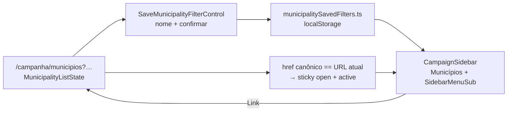

# B18 — Filtros salvos na lista de Municípios (+ acesso rápido no sidebar)

Status: rascunho
Atualizado em: 2026-07-24
Item do roadmap: [docs/roadmap.md](../roadmap.md) (Demais itens abertos, B18; superfície de coordenação)
Impeccable: B — encaixe em `MunicipalityFilters` / barra slim + `CampaignSidebar` (2º nível sob Municípios); sem rota nova
Appetite: ~1–1,5 dia eng; persistência local + Salvar com nome + submenu hover/sticky no sidebar; sem migration, sem collection, sem Consent
Responsável: —

## Design (Impeccable)

Âncoras: `PRODUCT.md` (princípios 2 — clareza sob pressão — e 8 — Feel the action; exceção justificada ao “Auto-save, no Save button” porque nomear é confirmatório) / `DESIGN.md` (register `product`; Field Desk) · tema `data-theme='campaign'` · shells `CampaignSidebar`, `MunicipalityFilters`, primitivos `SidebarMenuSub*` já em `src/components/ui/Sidebar.tsx`.

Na implementação (`implement-roadmap-item`): craft compacto → critique → polish (só salvar + submenu; sem redesign da nav completa nem sync multi-device).

Brief compacto:

- **Persona / contexto:** Alex (CG / Assessor / Candidato) monta o mesmo recorte várias vezes na semana (ex. “Prioritárias sem assessor · TI X · sort votos”) e precisa voltar a ele em um toque a partir da nav — sem refazer selects.
- **Job principal:** nomear o estado atual da URL da lista e reabri-lo como atalho de 2º nível sob **Municípios** no sidebar.
- **Estratégia de cor:** Restrained — submenu indentado com `border-l` do `SidebarMenuSub`; active sóbrio (`data-active`); sem chips coloridos de “views”.
- **Edit where you see:** não — bookmark de navegação URL; mutações B9 nas células seguem iguais.
- **Anti-goals:** collection/`campaignUser` prefs; saved views genéricas em todas as listas; segundo nível sempre visível (polui nav); sticky em qualquer `/campanha/municipios` (só no filtro salvo ativo); auto-gravar sem nome (vira “Visitados”).

## Dados → decisão → apresentação

- **Vou apresentar dados?** Não — **Dados: N/A**. Este item não inventa métrica; só persiste e reabre o **mesmo** recorte URL que a lista já resolve.
- **Decisões desbloqueadas:** Staff: “voltar ao recorte mental desta sessão (ex. prioritárias / TI / sem assessor) sem remontar filtros.”
- **Forma escolhida:** **lista/tabela existente** + links nomeados no sidebar — **por quê:** o dado já está na lista; o problema é atrito de remontagem. **Rejeitado:** dashboard de “minhas views”; chart de uso de filtros; segunda página de gestão de views.
- **Profile:** N/A.
- **Anti-goals de dado:** sem KPI de “quantos filtros salvos”; sem % estadual.

Self-check dados: N/A (sem superfície de métrica nova).

## Contexto

Em `/campanha/municipios`, o estado canônico de recorte/ordem vive na URL via `MunicipalityListState` (`src/utilities/municipalityUi.ts`: `q`, `region`, `kind`, `coverage`, `priority`, `trend`, `sort`/`dir`, `page`, `compare`). Helpers já canonicalizam href (`resolveMunicipalityListUrl` / `buildMunicipalityListHref` / `buildMunicipalityListVisitHref`). **B15** ✓ sort; **B16** relocaciona filtros ao header e deixa barra slim; **B17** preferência de colunas em `localStorage`.

O sidebar (`CampaignSidebar.tsx` + `nav.ts`) é **flat** — um `SidebarMenuButton` por item; primitivos `SidebarMenuSub` / `SidebarMenuSubButton` existem no shadcn local e **não são usados**. “Visitados recentemente” (`recentVisits.ts`) já prova o padrão client-only + limpeza no logout, mas é histórico automático — não nomeado.

Pedido de produto (2026-07-24): **salvar** o filtro atual com um **nome**, e expor os salvos como **acesso rápido de 2º nível** sob Municípios: aparecem no **hover** (desktop) ou **clique/expansão** (mobile no drawer do sidebar); **permanecem visíveis** quando a URL atual é a de um filtro salvo; **somem** fora de Municípios e sem hover/expansão.

FD2 ([field-desk-ux-pos-critique.md](field-desk-ux-pos-critique.md)) adiava “saved views genéricas”; este item é a fatia **concreta e única** (só lista de municípios), não um framework de views.

## Objetivos

- Staff em `/campanha/municipios`: affordance **Salvar filtro** (nome obrigatório) que grava o estado canônico atual da URL (sem `page`, sem `compare`).
- Lista de filtros salvos no **sidebar**, indentada sob **Municípios**, cada um linkando ao href canônico; item ativo quando a URL atual casa com o href salvo.
- Visibilidade do submenu:
  - **mostrar** no hover do item Municípios (desktop);
  - **mostrar** ao expandir Municípios no drawer mobile (clique);
  - **mostrar (sticky)** quando a página atual é um filtro salvo (match de href);
  - **esconder** em rotas que não são de municípios **e** sem hover/expansão.
- CRUD mínimo: criar + abrir + apagar (renomear = questão em aberto).
- Guardrails: sem migration, sem collection, sem Consent, sem server action de escrita; `leader` sem a página; access/loader inalterados; Feel the action no Salvar (pending no controle) e na navegação do atalho (`CampaignListPending` já cobre a lista).

## Decisões travadas

- **Item de trilha B18 (não fill-in; não fase de B16/B17; não absorver em Visitados).** Job distinto: bookmark **nomeado e intencional** vs histórico automático (Visitados) vs viewport de colunas (B17) vs relocação de selects (B16). Appetite ~1–1,5d; cortável. (2026-07-24, roadmap-item.) **Rejeitado:** fill-in só (subestima o contrato de submenu sticky/hover); estender `recentVisits` com “pin” (mistura dwell automático com nomeação); saved views genéricas multi-lista (FD2 já vetou; explode escopo).
- **Persistência = `localStorage` (não servidor).** Preferência/atalho por dispositivo; mesmo racional de Visitados e B17. Key estável namespaced (ex. `teqo:campaign:municipality-saved-filters`). **Rejeitado:** collection `savedFilter` / campo em `campaignUser` (migration + access + sync sem evidência de multi-device); `sessionStorage` (perde no ritual diário); cookie server-side.
- **Estado salvo = subset da URL da lista**, canonicalizado via `municipalityUi` (reusar `parseMunicipalityListParams` + href page=1): `q`, `region`, `kind`, `coverage`, `priority`, `trend`, `sort`, `dir`. **Excluir** `page` (sempre reabre na 1) e `compare` (lente do mapa no Início, não da lista). **Excluir** cenário A10 (fora da URL; lente local — alinhado ao fill-in Cenário / decisão A10). **Rejeitado:** gravar `page`/`compare`/cenário; gravar snapshot de IDs de municípios (vira lista morta).
- **Identidade:** `id` client-side (UUID) + `name` (pt-BR, trim, length cap) + `href` canônico (+ opcional `savedAt`). Active = comparação de href canônico com a URL atual (pathname `/campanha/municipios` + search normalizado). **Rejeitado:** rota dedicada `/campanha/municipios/vistas/[id]` (URL nova cara; share pior); dedup só por nome (dois nomes iguais OK se href diferente).
- **UI de salvar = submit explícito com nome** (Dialog/Popover + input + confirmar). Exceção justa ao princípio “Auto-save, no Save button”: nomear é confirmatório. **Rejeitado:** auto-save silencioso a cada mudança de filtro (vira Visitados); prompt nativo `window.prompt`.
- **Sidebar = 2º nível sob Municípios** com `SidebarMenuSub*` existente; hover (desktop) / expand (mobile); sticky só no match de filtro salvo — **não** sticky em `/campanha/municipios` genérico nem em `/campanha/municipios/[slug]`. Bottom nav mobile permanece flat (atalhos vivem no drawer do sidebar). **Rejeitado:** sempre listar salvos sob Municípios (polui); grupo separado no rodapé do sidebar; chips no dashboard.
- **Limite + logout:** `MAX_ENTRIES` curto (recomendação 12); `clearMunicipalitySavedFilters()` no logout junto com `clearRecentVisits()` (dispositivo compartilhado). **Rejeitado:** ilimitado; sync cross-device.
- **i18n e naming:** `MunicipalitySavedFilter`, `municipalitySavedFilters.ts`, `SaveMunicipalityFilterControl`, `MunicipalityNavSavedFilters`; strings “Salvar filtro”, “Filtros salvos”, “Apagar”; identificadores em inglês.

## Questões em aberto

- **Permitir salvar a lista “nua” (sem filtros, só sort default)?** **Opções:** A) só com ao menos um param de recorte (`q`/`region`/…) | B) qualquer estado, inclusive nua | C) nua só se `sort`/`dir` ≠ default. **Recomendação:** **A** — alinhado a Visitados (`buildMunicipalityListVisitLabel` retorna null sem filtro); atalho “Municípios” já cobre a lista nua. _(assumido — validar com produto)_
- **Renomear no v1?** **Opções:** A) só criar/apagar | B) renomear no submenu (inline/Dialog). **Recomendação:** **A** — apagar+recriar basta no appetite; renomear = Adiado. _(assumido)_
- **Onde mora o botão Salvar?** **Opções:** A) barra slim de `MunicipalityFilters` (ao lado de Limpar / Colunas) | B) menu “…” da lista | C) só no overview. **Recomendação:** **A** — mesmo lugar mental dos filtros; soft com B16/B17. _(assumido)_
- **Dois salvos com o mesmo href: atualizar o existente ou criar duplicata?** **Opções:** A) upsert (pede confirmação se nome diferente) | B) sempre criar | C) bloquear com mensagem. **Recomendação:** **A** — um atalho por href; evita submenu duplicado. _(assumido)_

## Abordagem proposta

Componentes:

- **`src/utilities/municipalitySavedFilters.ts`** (client-safe, guarda `typeof window`): `STORAGE_KEY`, `MAX_ENTRIES`, tipos, `list` / `upsert` / `remove` / `clear`; validação de shape; no-op fora do browser. Depth: espelhar `recentVisits.ts`, não inventar service genérico de “prefs”.
- **Helpers em `municipalityUi.ts`:** `buildMunicipalitySavedFilterHref(state)` (= visit href / page=1 sem compare) + `municipalityListHasSavableFilters(state)` (gate do botão). Reusar parse/canonical já existentes.
- **`SaveMunicipalityFilterControl`** (client, em `src/components/campaign/`): Popover/Dialog com nome; desabilitado se não há filtro salvável ou se já é o ativo sem mudanças; pending imediato no confirmar; toast/inline “Salvo” curto; montar na barra slim (`MunicipalityFilters` pós-B16, ou fileira atual se B16 ainda não aterrissou).
- **`MunicipalityNavSavedFilters`** (client island no `CampaignSidebar`): lê storage pós-mount (sem mismatch de hidratação); renderiza `SidebarMenuSub` sob o item Municípios; hover/focus-within (desktop) + estado expandido (mobile); `forceOpen` quando `usePathname`+`useSearchParams` casam com algum `href` salvo; cada linha = `SidebarMenuSubButton asChild` + `Link` + ação apagar (`SidebarMenuAction` ou botão sr-only no hover); fechar drawer mobile ao navegar (mesmo padrão atual).
- **`CampaignSidebar` / item Municípios:** especializar só o item `href === '/campanha/municipios'` (não mudar `nav.ts` para árvore genérica — YAGNI &lt;3 call sites). `isCampaignNavActive` do pai continua por pathname; sub-item ativo por match de search.
- **Logout:** chamar `clearMunicipalitySavedFilters()` ao lado de `clearRecentVisits()`.
- **Sem migration, sem collection, sem server action, sem Consent.**

## Dependências

- Soft: **B16** (barra slim = destino natural do Salvar) e **B17** (vizinho na mesma barra) — não bloqueiam; sem eles, Salvar pousa ao lado de Limpar na fileira atual.
- Soft: precedente Visitados ([visitados-recentemente.md](visitados-recentemente.md)) — padrão storage/logout.
- Nenhuma dependência dura de outro plano. Reusa `municipalityUi.ts`, `CampaignSidebar`, `SidebarMenuSub*`, `CampaignListPendingBoundary`.

## Não escopo

- Sync multi-device / preferências em `campaignUser` — exigiria migration + access.
- Saved views em Planos / Apoiadores / Demandas — FD2 “genéricas”; só Municípios aqui.
- Sticky do submenu em qualquer rota `/campanha/municipios*` — só match de filtro salvo.
- Incluir Cenário A10 ou `compare` do mapa no bookmark.
- Substituir Visitados recentemente / B14 município mais próximo.
- Reorder DnD de colunas — [fora de escopo](reordenar-colunas-lista-municipios.md).

## Rabbit holes

- **Framework de “nav tree” / collapsible genérico no `nav.ts`.** Se alguém “só preparar” para outros itens: explode o shell. **Mitigação:** especializar só Municípios neste item; 3º call site = gatilho de abstrair.
- **Rota `/vistas/[id]` + loader server.** Se alguém “só para deep-link nomeado”: migration mental + share frágil. **Mitigação:** href = query canônica da lista.
- **Optimistic list sem refresh ao abrir atalho.** Anti-goal Feel the action. **Mitigação:** `Link` + pending da região de resultados existente.
- **Spreadsheet / painel de gestão de views.** **Mitigação:** criar/apagar no fluxo; sem página admin de views.

## Adiado com gatilho

- **Renomear filtro salvo.** Revisitar quando: ≥2 atores pedirem em R6/sessão **ou** apagar+recriar gerar atrito medido.
- **Sync servidor / share de view entre assessores.** Revisitar quando: evidência de multi-device **e** pedido explícito de “mandar este recorte” (aí sim collection + access; não neste appetite).
- **Salvar também o viewport B17 (colunas visíveis) junto do filtro.** Revisitar quando: B17 estável **e** usuários pedirem “a view completa” (hoje misturaria bookmark de decisão com preferência de densidade).

## Referências

- `docs/roadmap.md` (Demais itens abertos · grafo · Janela 1–2 · cortes)
- `docs/plans/visitados-recentemente.md` — precedente localStorage + logout
- `docs/plans/filtros-no-header-lista-municipios.md` (B16) · `docs/plans/seletor-colunas-lista-municipios.md` (B17)
- `docs/plans/field-desk-ux-pos-critique.md` — “saved views genéricas” adiadas; este item é a fatia concreta
- `src/utilities/municipalityUi.ts` — estado URL / href canônico / visit label
- `src/utilities/recentVisits.ts` — espelho de storage
- `src/components/campaign/CampaignSidebar.tsx`, `nav.ts`, `MunicipalityFilters.tsx`
- `src/components/ui/Sidebar.tsx` — `SidebarMenuSub*`
- AGENTS.md — naming EN / copy pt-BR; campaign auth; sem Consent para preferência local do próprio usuário
- `PRODUCT.md` / `DESIGN.md` — Field Desk; Feel the action; Auto-save (exceção nomear)
