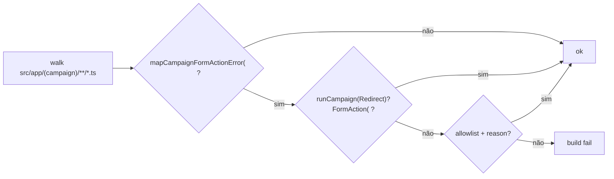

# Form-action guard — política na escada, não no filename

Status: registrado
Atualizado em: 2026-08-02
Issue: #241 (OPS14)
Priority: P2
Model: composer-2.5
Impeccable: A — N/A (sem superfície UI; convention spec)
Appetite: ~1 dia eng; reescrever guarda em `codebaseConventions` (+ migrar ladders expressíveis se couber no mesmo PR); sem migration
Responsável: —

## Dados → decisão → apresentação

Dados: N/A — higiene de guardrail; sem métrica de produto.

## Contexto

Pass 2 W4d / C8 F4b: `runCampaignFormAction` / `runCampaignRedirectFormAction` unificam a escada try/catch → `mapCampaignFormActionError` → return/redirect. A guarda em `tests/unit/codebaseConventions.unit.spec.ts` só varre arquivos cujo **filename** casa `*FormActions.ts` ou `taskActions.ts`.

**Dodge ledgerado (P3-I / `docs/TECH-DEBT.md` / `docs/GUARDRAILS.md`):** ladders hand-rolled em `src/app/(campaign)/campanha/actions/*.ts` são invisíveis à guarda. Baseline medido no Pass 4: ~7 ladders assim (`profile` avatar×2, `leaderSupporter`, mais `password`/`auth` parcialmente bespoke). Actions novas que **usam** o wrapper (`notifications`, `webauthn`, …) passam por disciplina, não por mecanismo.

Agentes otimizam o gate: colocar mutação nova em `actions/foo.ts` com try/catch + `mapCampaignFormActionError` literal **não quebra o build**, embora viole a política.

Pedido (review 2026-08-02, item 2): **melhorar o pin** — falhar o build quando a **escada** aparece fora do wrapper, independentemente do path.

## Objetivos

- A guarda deixa de filtrar por filename `*FormActions.ts` / `taskActions.ts`.
- Critério positivo: export/`'use server'` action sob `src/app/(campaign)` que implementa a escada (try + `mapCampaignFormActionError` **sem** passar por `runCampaign(Redirect)?FormAction`) é offender, salvo allowlist **com reason** por arquivo (ou por símbolo).
- Allowlist inicial documenta exceções genuínas hoje (`atividades/formActions` unique-violation, `apoiadores/[id]` flatten, `taskActions` optimistic, e o que for realmente inexprimível nos wrappers — `auth`/`password` se ainda forem).
- Ladders **expressíveis com zero delta semântico** (`profile` avatar, `leaderSupporter` se ainda raw) migram para o wrapper **neste item** ou ficam como offenders até migrar no mesmo PR — não expandir allowlist “porque o filename mudou”.
- Atualizar linha em `docs/GUARDRAILS.md` e fechar/anotar P3-I no `TECH-DEBT.md`.
- Guardrails: sem migration; access control inalterado; sem mudar copy de erro.
- **Tracer bullet:** spec que flagra um fixture/`actions/*.ts` com try+mapError sem wrapper → verde após migrate ou allowlist justificada → `pnpm gate:fast`.

## Decisões travadas

- **Detecção = presença da escada (try + `mapCampaignFormActionError`), não do filename.** Opções: A) sweep AST/regex em `(campaign)/**/*.ts` | B) ESLint rule local | C) só ampliar filename para `actions/*.ts`. **Recomendação: A (convention spec)** — mesmo mecanismo da guarda atual, um PR, alinhado a P3-I. **Rejeitado:** C (ainda é proxy de path; `lib/` ou helper colocalizado escapa); B como v1 (appetite maior; Adiado com gatilho se A for dodgeable).
- **Chamada real a `runCampaignFormAction(` / `runCampaignRedirectFormAction(` continua obrigatória** onde a escada existia — comentário nomeando o wrapper **não** passa (já é invariante atual).
- **Não crescer os wrappers** para absorver políticas únicas (unique-violation→fieldErrors, flatten de fieldErrors, optimistic checklist). Essas ficam allowlisted com reason — precedente W4d.
- **Migrar o que for expressível no mesmo PR** quando o custo for mecânico (<~3 call sites citados no ledger). Se um arquivo for grande/bespoke, allowlist + defer com gatilho “próxima edição do arquivo”.
- **Kind: `chore` (OPS14).**
- **i18n:** ids de teste em inglês.

## Questões em aberto

- **Incluir `throw` + mapError fora de try no mesmo padrão?** **Opções:** A) só try+mapError (escada clássica) | B) qualquer `mapCampaignFormActionError(` fora de arquivo que já chama o wrapper. **Recomendação:** **B** — o helper de map é o cheiro da escada hand-rolled; wrappers encapsulam o map. Verificar que nenhum call site legítimo chama mapError direto após a migração. _(assumido)_
- **`actions/*.ts` que só re-exportam / orquestram sem mapError:** fora do radar. OK.

## Abordagem proposta

Componentes:

- **`tests/unit/codebaseConventions.unit.spec.ts`:** substituir `isGuardedActionFile` / describe W4d pelo sweep acima; allowlist `Map<path, reason>` (ou Set + comentário adjacente); manter require de call site real do wrapper.
- **Migrações mecânicas (se couber):** `profile.ts` / `leaderSupporter.ts` → `runCampaignFormAction` (espelhar `notifications.ts` / `webauthn.ts`).
- **Allowlist residual:** `atividades/formActions.ts`, `apoiadores/[id]/formActions.ts`, `taskActions.ts`, e auth/password se ainda inexprimíveis — reasons copiados do bloco atual + TECH-DEBT.
- **`docs/GUARDRAILS.md`:** atualizar a linha “filename `*FormActions.ts` — dodge `actions/*.ts`”.
- **`docs/TECH-DEBT.md`:** fechar/anotar P3-I remaining open sobre o dodge de filename.
- **Migration:** nenhuma.

## Dependências

- Nenhuma dura. Independente de OPS13/OPS15.
- Soft: P3-I ledger row.

## Não escopo

- Unificar políticas bespoke (unique violation, flatten) dentro dos wrappers.
- Rotas JSON (`campaignJsonMutationRoute`) — já têm guarda própria.
- OPS13 classname / OPS15 TooltipProvider.

## Rabbit holes

- **"Já que detecto a escada, reescrevo todos os actions do domínio."** Explode. **Mitigação:** migrar só expressíveis; allowlist o resto com gatilho.
- **False positive em testes/helpers.** **Mitigação:** sweep só `src/app/(campaign)`; excluir `*.spec.ts`.
- **AST completo vs regex.** Regex no estilo das outras convention specs basta; se surgir dodge por rename de mapError, ESLint depois.

## Adiado com gatilho

- **ESLint local `require-run-campaign-form-action`.** Revisitar se A for dodgeada ≥1× (rename/`mapError` indireto).
- **Absorver unique-violation / flatten nos wrappers.** Revisitar no 3º call site da mesma política.

## Referências

- GitHub Issue #241 (OPS14)
- Review de guardrails (chat 2026-08-02) — item 2
- `tests/unit/codebaseConventions.unit.spec.ts` — bloco formActions / W4d
- `docs/TECH-DEBT.md` — P3-I (filename guard escapes)
- `docs/GUARDRAILS.md` — linha FormActions
- `src/utilities/campaignFormActionError.ts` — wrappers
- `src/app/(campaign)/campanha/actions/{profile,leaderSupporter,password,auth,notifications,webauthn}.ts`
- AGENTS.md — formActions como cascas sobre `runCampaignFormAction`
