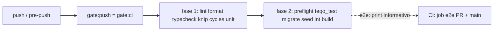

# Impl: Pre-push sem e2e: e2e roda uma vez, no CI (gate local fica com os outros testes)

Status: aprovado
Atualizado em: 2026-08-18
Issue: #46
Intenção: docs/plans/gate-push-sem-e2e.md
Appetite restante: ~0,5 dia eng (herdado — cabe com folga)

## Leitura da intenção

- **Outcome:** `pnpm push` / `.husky/pre-push` não rodam mais e2e (sem playwright install, sem build `.next-e2e`, sem `test:e2e`); mantêm lint, format:check, typecheck, knip, check:cycles, test:unit, test:int e build na cascata/escopo atuais. O e2e do CI continua como está e gateia PR (job `e2e` do `ci-pr.yml` → rollup `checks`) e main (`e2e` do `ci.yml` → `checks` → `deploy`). Docs do fluxo atualizadas para "e2e = verificado no CI após o push; local opcional (`pnpm test:e2e:affected`)".
- **O que NÃO negociar:** CI intocado (não remover/alterar e2e de PR ou main); nenhum flag novo de "pular e2e" (escape `--no-verify` documentado continua sendo o único bypass); política "Dono do PR, dono do CI" inalterada.
- **O que reavaliar:** a hipótese de "áreas prováveis" aponta só para `scripts/gate-ci.mjs` + docs. Verificado no código: além do bloco e2e de `gate-ci.mjs`, existe **um teste unit que ancora o e2e no gate local** (`ciSkipInvariants` lista `scripts/gate-ci.mjs` entre os arquivos que devem conter `.next-e2e`) — a remoção do bloco quebra esse teste se ele não for ajustado junto. Também verificado: `AGENTS.md` (checklist local item 3) cita `pnpm test:e2e` como passo local obrigatório — precisa virar "e2e no CI; local opcional". `AGENT-OPS.md`, `work-issue`/`agent-work-issue`/`worktree-next-issue`/`local-database` skills **não** citam e2e no pre-push (verificado por grep) — nada a mudar nelas. Workflows do CI: e2e → `checks` (PR) e e2e → `checks` → `deploy` (main) comprovados — verificação, sem mudança.

## Abordagem recomendada

**Opções consideradas:**

- **A — Editar o espelho (`scripts/gate-ci.mjs`):** remover o bloco e2e da cascata, manter o readout do classificador como aviso informativo ("o que o CI fará"), ajustar o invariante `ciSkipInvariants` e atualizar os 3 docs que descrevem o gate.
- B — Flag/env `--skip-e2e` no gate para o agente optar por pular: vira o bypass um recurso (anti-goal explícito da intenção).
- C — Novos scripts de gate (ex. `gate:push` sem e2e + `gate:ci` completo para quem quiser): twin do espelho, duplicação de cascata, viola "edit the owner, don't twin".

**Recomendação:** A — a intenção manda cortar o bloco do espelho, não criar caminho paralelo; `gate:push`/`gate:ci`/`.husky/pre-push`/`git-push.mjs` continuam como a cadeia única (sem mudança em package.json, hook ou git-push.mjs).
**Rejeitadas:** B porque cria o bypass como feature; C porque duplica a cascata que o espelho existe para manter DRY.

### Componentes / mudanças

- **`scripts/gate-ci.mjs`** — corta o bloco e2e (linhas ~146–166: playwright install, migrate/seed de e2e, build `.next-e2e`, `test:e2e`); o e2e sai de `needsDb` (preflight passa a depender só de test/build); o readout do escopo mantém `e2e=${scope.e2e.mode}` e o bloco vira **print informativo** do que o CI rodará (mode `full`/`selected`/`none` + specs) com a nota "e2e roda no CI — não no pre-push (OPS59)"; remove o check `unmapped` duplicado (o próprio `ci-scope.mjs` já imprime os unmapped no stderr antes do parse — e sem e2e local ele virou puramente informativo); docstring atualizada (espelho do `ci-pr.yml` **sem e2e** + corrige o path `.github/workflows/ci-pr.yml` → `.forgejo/workflows/ci-pr.yml`, obsoleto desde OPS50). Linha final do sucesso: "ci-pr mirror without e2e (e2e verified in CI)".
- **`tests/unit/ciSkipInvariants.unit.spec.ts`** — tira `scripts/gate-ci.mjs` da lista do invariante `.next-e2e` (o invariante existe para manter artefatos de build e2e fora do dist de dev; o gate local não builda mais e2e). `scripts/run-e2e-affected.mjs` e `playwright.config.ts` continuam na lista — o e2e local opcional e o CI ainda usam `.next-e2e`.
- **`.agents/rules/engineering-standards.mdc`** (linha do gate em duas velocidades) — "gate:push → gate:ci (espelho serial do ci-pr.yml, inclui format:check)" ganha a cláusula OPS59: espelho **sem e2e**; e2e roda uma vez no CI (PR e main); local opcional via `pnpm test:e2e:affected`.
- **`.agents/rules/agent-pr-workflow.mdc`** (passo 2 do push canônico) — idem: "espelho do ci-pr.yml (inclui format:check)" → "sem e2e (e2e é verificado pelo CI após o push; local opcional `pnpm test:e2e:affected`)".
- **`AGENTS.md`** (checklist local item 3) — sai `pnpm test:e2e`/`pnpm test:all` da sequência obrigatória local; entra "e2e roda no CI (PR e main) — local opcional `pnpm test:e2e:affected`".
- **`docs/plans/gate-push-sem-e2e.md`** (intenção) — Status → `entregue` no fechamento (padrão dos planos entregues, ex. `gate-push-local.md`).
- **`docs/changelog/2026-08-18-ops59.md`** + `pnpm changelog:build` (OPS44, agregado insert-only).
- **Migration:** sem migration. **Access / Consent:** N/A. **UI:** N/A (Impeccable A).

### Dados → forma (se aplicável)

N/A — chore de DX/processo, sem superfície de dados.

## Fases verificáveis

1. **Gate + invariante** — `scripts/gate-ci.mjs` (corte do bloco e2e + readout informativo) e `tests/unit/ciSkipInvariants.unit.spec.ts`. Verificação: `pnpm test:unit -- tests/unit/ciSkipInvariants.unit.spec.ts` e inspeção do diff do gate.
2. **Docs do fluxo** — engineering-standards.mdc, agent-pr-workflow.mdc, AGENTS.md, changelog OPS44, status da intenção. Verificação: varredura final por citações residuais (`gate:push`/`gate:ci`/`test:e2e`/`test:all` nas rules/skills/AGENT-OPS — nada deve descrever e2e como etapa do pre-push).
3. **Gates** — `pnpm gate:ci` local (roda a cascata nova: fase 1 + migrate/seed/int/build em `teqo_test`; e2e vira print) + `pnpm push`. O e2e em si NÃO roda local — por design; o CI roda full nesta PR (`gate-ci.mjs` é HIGH_RISK → `test`/`e2e` full no ci-pr).

## Rabbit holes / Não escopo (engenharia)

- Remodelar a cascata do espelho (ex.: "já que removo e2e, simplifico o build/preflight") — corte só o bloco e2e; o restante fica fiel ao CI.
- Flag/env de pular e2e no gate — bypass como recurso, anti-goal.
- Tocar nos workflows `.forgejo/*` — CI é o verificado, intocado (verificação apenas).
- Mudar `scripts/run-e2e-affected.mjs`/`e2e-affected.mjs`/manifestos — o e2e local opcional permanece como está.
- Tirar `.next-e2e` de gitignore/prettierignore/playwright.config — ainda usado pelo CI e pelo e2e local opcional.
- Editar `docs/plans/gate-push-local.md` (histórico entregue — não é lock, é registro).

## Riscos e mitigação

- **Invariante CI quebra ao remover o bloco** → `ciSkipInvariants` atualizado na mesma mudança (fase 1 junto do gate); a suíte unit roda antes do push.
- **Citação residual de e2e no pre-push em doc** → varredura explícita na fase 2 (regras/skills/AGENT-OPS/AGENTS.md) antes do push; `engineering-standards.mdc` e `agent-pr-workflow.mdc` são a fonte contratual do gate.
- **Gate local fica "mais fraco" que o CI por engano (skips divergentes)** → o restante da cascata e os skips do classificador ficam intactos; o readout do escopo (incl. e2e) é impresso para o agente saber o que o CI fará.
- **Docs-only diff sem e2e no CI**: comportamento pré-existente (classificador pula e2e em docs-only) — nada muda.

## Aceite de engenharia

- [x] Aceite de produto da intenção ainda coberto (push sem e2e; CI gateando PR e main — workflows verificados: `ci-pr.yml` e2e → `checks`; `ci.yml` e2e → `checks` → `deploy`)
- [x] Invariantes AGENTS/engineering-standards (nenhum write de dado; docs em pt-BR; sem acesso/Consent/migration)
- [x] Testes previstos: `ciSkipInvariants` ajustado; `pnpm gate:ci` valida a cascata nova; CI roda full (HIGH_RISK `gate-ci.mjs`)
