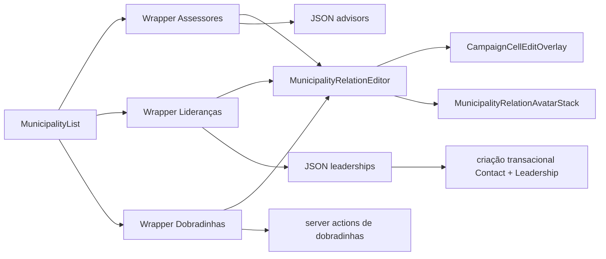

# Impl: Generalizar editor e display das colunas de relação na lista de municípios

Status: em execução
Atualizado em: 2026-08-05
Issue: #374
Intenção: docs/plans/generalizar-colunas-relacao-municipios.md
Appetite restante: ~0,75 dia eng; manter sem migration, rota nova ou mudança de access

## Leitura da intenção

- **Outcome:** Assessores, Lideranças e Dobradinhas devem ter a mesma linguagem de interação na lista de municípios: avatar stack fechado e `CampaignCellEditOverlay` com busca, chips removíveis e criação inline por nome.
- **O que NÃO negociar:** Assessores continua sendo a referência visual; o contrato de props de `MunicipalityList` e as regras de visibilidade por papel não mudam; busca com acento, optimistic UI, reconciliação de respostas fora de ordem, erros e bridges de opções recém-criadas continuam funcionando; `RelationChipCell` permanece dono dos editores inline fora desta lista.
- **O que reavaliar:** a extração não pode presumir que os três writes usam o mesmo transporte. Assessores e Lideranças usam JSON routes; Dobradinhas usa server actions. Além disso, retirar o telefone da criação inline de Lideranças exige mudar o schema específico e o serviço existente, não somente esconder um campo.

## Abordagem recomendada

**Opções consideradas:** A) editor compartilhado com adaptadores de domínio | B) ampliar `RelationChipCell` com uma segunda apresentação | C) manter máquinas separadas e compartilhar somente peças visuais  
**Recomendação:** A — concentra a única máquina de optimistic state, sequência de requests, busca, chips e criação, enquanto wrappers pequenos normalizam os transportes e preservam copy, bridges e regras próprias de cada domínio.  
**Rejeitadas:** B porque mistura o editor inline de 813 linhas com outra política de interação e ameaça os call sites fora de `/campanha/municipios`; C porque entrega aparência igual mantendo três implementações do comportamento crítico, contrariando o aceite interno e deixando regressões divergentes prováveis.

### Decisões de engenharia

**Contrato do editor**  
Opções: callbacks genéricos de baixo nível | componente ciente dos três endpoints | contrato normalizado de mutação  
Recomendação: contrato normalizado de mutação — o shared recebe entradas `{ id, label, searchText? }`, `selectedIDs`, copy e callbacks `toggle`/`create` que retornam o conjunto confirmado e, na criação, a nova opção. O editor é dono de pending sentinels, sequência, rollback, reconcile, filtro e UI; cada wrapper é dono do transporte e do bridge de catálogo.  
Alternativas rejeitadas: callbacks de baixo nível porque vazariam setters e refs, tornando o shared apenas markup; endpoints embutidos porque acoplariam um componente visual às rotas e a server actions incompatíveis.

**Display compartilhado**  
Opções: um avatar stack com entradas normalizadas | manter wrappers visuais duplicados | tornar o editor responsável por iniciais específicas  
Recomendação: `MunicipalityRelationAvatarStack` recebe entradas `{ id, label, initialsLabel? }`, limite e empty state; o editor deriva tooltip e acessibilidade dos labels. Assessores preserva `MissingAdvisorBadge`, e Dobradinhas informa o nome sem partido em `initialsLabel`.  
Alternativas rejeitadas: duplicação porque já produziu o desalinhamento atual; regras de iniciais dentro do editor porque são apresentação de cada domínio, não estado de edição.

**Liderança criada somente com nome**  
Opções: enviar telefone sintético | tornar telefone opcional em todos os formulários | aceitar somente nome no schema específico e reutilizar o serviço transacional com dedup condicional  
Recomendação: o schema estrito de `municipalityLeadershipCreateSchema` passa a aceitar somente `municipalityId + name`; o núcleo existente de criação aceita telefone opcional internamente. Como `Contact.phone` já é opcional no Payload, esse caminho cria um novo `Contact` com `phone: null` e a `Leadership` na mesma transação, após fresh-actor e scope check. O telefone poderá ser preenchido depois na ficha. Com telefone nos demais fluxos, o serviço mantém lock e dedup atuais; os schemas de cadastro completo permanecem fora do escopo desta Issue.  
Alternativas rejeitadas: telefone sintético não é necessário e corromperia a identidade/unicidade de `Contact`, podendo colidir com um telefone real; ampliar a mudança a todos os formulários alteraria outros fluxos e sua política de dedup sem fazer parte do aceite desta lista.

### Componentes / mudanças

- **`MunicipalityRelationEditor`** (`src/components/campaign/shared/MunicipalityRelationEditor.tsx`): nova dona da máquina compartilhada de overlay, optimistic IDs, requests concorrentes, chips, Command, busca normalizada, criação name-only e erro acessível.
- **`MunicipalityRelationAvatarStack`** (`src/components/campaign/shared/MunicipalityRelationAvatarStack.tsx`): avatar stack único, máximo padrão de três, nomes para screen reader/tooltip e empty state injetável.
- **`MunicipalityListAdvisorsControl`**: wrapper de opções/copy/JSON e bridge de novos assessores; usa os dois componentes compartilhados sem alterar comportamento ou empty state prioritário.
- **`MunicipalityListLeadershipsControl`**: wrapper de opções/copy/JSON e bridge; remove formulário e imports de telefone, cria diretamente pelo nome pesquisado e usa avatar stack no trigger.
- **`MunicipalityStateDeputyRelationCell`**: troca `RelationChipCell` pelo editor compartilhado; adapta `commitAction`/`createAction`, mantém busca por nome e partido, links dos chips quando aplicável e nomes sem partido nas iniciais.
- **Criação de liderança** (`src/lib/schemas/leadership.ts`, route e `src/app/(campaign)/campanha/actions/leadership.ts`): o input inline envia apenas nome e persiste `Contact.phone = null`; mantém transação, fresh actor, escopo, defaults e revalidações existentes, sem telefone stub.
- **Código substituído:** remover os avatar stacks locais e a máquina duplicada que ficar órfã; `RelationChipCell` permanece porque ainda serve `LeadershipStateDeputyRelationCell` e `MunicipalityPortfolioCell`.
- **Migration:** sem migration; `Contact.phone` já é opcional.
- **Access / Consent:** nenhuma política nova. O novo caminho usa o mesmo staff gate, fresh actor, scope check e transação; não há opt-in ou Consent neste fluxo interno.
- **UI:** Impeccable B; replicar exatamente shape/craft da coluna Assessores em desktop Popover e mobile Drawer, depois criticar foco, target de 44 px, tooltip, live region, overflow e estados vazio/pending/error.

## Fases verificáveis

1. **Tracer / contrato server** — ajustar e testar a criação inline name-only de Liderança no serviço existente; provar `Contact.phone === null`, vínculo ao município, bloqueio de papel/escopo e preservação do caminho completo com telefone.
2. **Editor e display compartilhados** — extrair primeiro Assessores como referência; manter testes de overlay, optimistic reconcile, rollback, criação e busca antes de migrar os demais wrappers.
3. **Lideranças e Dobradinhas** — migrar ambas; confirmar avatar stack/tooltip, criação name-only, busca por acento e por partido, remoção, criação e adapters JSON/server action em Popover e Drawer.
4. **Polish e gates** — revisar os três call sites em desktop/mobile, eliminar código morto e executar `pnpm gate:fast`; no fechamento, `/simplify`, captura de débitos e push via `pnpm push`.

## Estratégia de testes

- **Unit do editor compartilhado:** render fechado, Popover/Drawer, busca normalizada, toggle/remove, criação otimista, resposta fora de ordem, rollback e erro/live region.
- **Unit dos wrappers:** copy e payload de cada domínio, bridge da opção criada, Lideranças sem campo de telefone, Dobradinhas pesquisável por partido e adaptação do resultado da server action.
- **Unit de composição:** `MunicipalityList` mantém visibilidade por papel e passa a renderizar as três pilhas com iniciais, limite e nomes acessíveis.
- **Integração server:** caminho name-only cria `Contact` + `Leadership` atomicamente e respeita staff/scope; caminho geral com telefone continua deduplicando pelo telefone.

## Rabbit holes / Não escopo (engenharia)

- Não migrar `LeadershipStateDeputyRelationCell`, `MunicipalityPortfolioCell` nem outros call sites de `RelationChipCell`.
- Não unificar JSON routes, server actions, providers de criação ou tipos de domínio só para obter uma API uniforme.
- Não mudar visibilidade de colunas, URLs, collections, Payload schema, Consent ou regras de access.
- Não generalizar o componente para relações fora da lista de municípios; gatilho para revisitar: outro editor Popover repetir a mesma máquina completa.
- Não alterar os cadastros completos de liderança nesta Issue; o atalho inline da lista cria somente com nome e a ficha recebe o telefone real depois.

## Riscos e mitigação

- **Abstração larga demais:** props excessivas podem esconder três políticas diferentes. Mitigar com um resultado normalizado pequeno, wrappers de domínio e testes do componente pelo comportamento, não pela implementação.
- **Concorrência otimista:** extração pode perder a regra de maior sequência confirmada. Mitigar movendo a máquina como uma unidade e pinando resposta fora de ordem + falha concorrente em unit test.
- **Criação somente com nome:** não há dedup confiável por pessoa sem identificador. Mitigar criando um novo `Contact` deliberadamente com telefone nulo, deixando o telefone real para a ficha e não usando stub nem dedup por nome.
- **Server action versus JSON:** erros têm formatos diferentes. Mitigar nos adapters, que convertem ambos para o mesmo success/error do editor sem expor `FormData` no shared.
- **Acessibilidade responsiva:** trocar o trigger pode quebrar tooltip, foco ou Drawer compartilhado. Mitigar reutilizando `CampaignCellEditOverlay` sem alterações de contrato e ampliando a matriz existente de testes Popover/Sheet para Dobradinhas.

## Aceite de engenharia

- [ ] Aceite de produto da intenção ainda coberto
- [ ] As três colunas usam um único editor e um único avatar stack
- [ ] Criação de liderança envia somente nome e persiste telefone nulo sem afrouxar outros formulários
- [ ] optimistic state, resposta fora de ordem, erro, busca e criação cobertos por testes
- [ ] Invariantes AGENTS/engineering-standards preservadas
- [ ] Sem migration, rota nova, mudança de props de `MunicipalityList` ou regressão de access

## Self-score decision-quality

5/5 — decisões caras registram opções e rejeitadas; a abordagem cabe no appetite com cortes explícitos; rabbit holes estão nomeados; reutiliza os donos existentes; o outcome e os lockdowns da intenção permanecem intactos.
