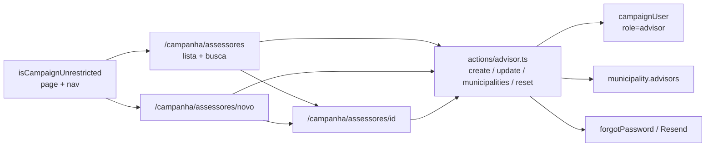

# B19 — Gerenciar assessores (`/campanha/assessores`)

Status: rascunho
Atualizado em: 2026-07-24
Item do roadmap: [docs/roadmap.md](../roadmap.md) (Demais itens abertos, B19; superfície de coordenação)
Impeccable: C — UI nova em `/campanha/assessores` (lista + novo + detalhe); sem design-ref
Appetite: ~1,5–2 dias eng; lista + create + detalhe/edição in-context + gate de nav; sem migration; alinhamento de access `candidate`↔`coordinator` nos helpers de `campaignUser`
Responsável: —

## Design (Impeccable)

Âncoras: `PRODUCT.md` (princípios 2 clareza sob pressão, 3 Edit where you see, 4 Auto-save, 8 Feel the action) / `DESIGN.md` (register `product`; Field Desk) · tema `data-theme='campaign'` · precedente de lista+CRUD [`organizacoes/page.tsx`](<../../src/app/(campaign)/campanha/(app)/organizacoes/page.tsx>) e [`dobradinhas/`](<../../src/app/(campaign)/campanha/(app)/dobradinhas/>).

Na implementação (`implement-roadmap-item`): shape → craft → critique → polish.

Brief compacto:

- **Persona / contexto:** Alex (Coordenador Geral) e o Candidato no desk — onboarding do time (Onda 0 §4) e manutenção da carteira de assessores; sem ir ao Payload `/admin` (JWT de campanha não entra lá).
- **Job principal:** criar e manter contas `advisor` (nome, e-mail, celular) e ver/ajustar quais municípios cada um administra.
- **Estratégia de cor:** Restrained — lista densa Field Desk; sem hero-metric de “N assessores”.
- **Edit where you see:** sim — campos de conta e vínculo a municípios editáveis no detalhe (Popover/multi-select + auto-save); create multi-campo com submit explícito.
- **Anti-goals:** página “Equipe” genérica com todos os papéis; IAM tipo SaaS; ranking/gamificação de assessores; spreadsheet de municípios×assessores; expor a lista a `advisor`/`leader`.

## Dados → decisão → apresentação

- **Vou apresentar dados?** Sim, superfície neste item — lista operacional de pessoas + contagem de municípios, não KPI eleitoral.
- **Decisões desbloqueadas:**
  - Coordenador / Candidato: “este assessor já tem login válido (e-mail real) ou ainda é placeholder da planilha?”
  - Coordenador / Candidato: “quem cobre quantos / quais municípios — falta alguém na carteira X?”
  - Coordenador / Candidato: “criar assessor novo agora e depois atribuir municípios?”
- **Forma escolhida:** **tabela/lista** (nome, e-mail, celular, Nº municípios, link detalhe) + detalhe com lista dos municípios — **por quê:** comparar muitas entidades e agir; degrau mais pobre que resolve. **Rejeitado:** dashboard de carga por assessor (vaidade / gaming — research G4); mapa de carteiras (outro job; B13/E12); chart de distribuição.
- **Profile:** categórico + contagem; granularidade = `campaignUser` (role `advisor`); tamanho típico dezenas (seed E4R ~24 assessores); absoluto só como contagem de vínculos.
- **Anti-goals de dado:** sem % estadual; sem ranking de performance; sem KPI de “cadastros feitos pelo assessor”.

Self-check dados: 5/5.

## Contexto

Onde se gerencia assessor hoje:

- **Conta** (`campaignUser` com `role: 'advisor'`): só via Payload admin (`/admin`) ou seed `pnpm db:seed:projecao` (e-mails `@planilha.invalid`, sem login até trocar). CG/candidato de campanha **não** acessam `/admin`.
- **Carteira:** `municipality.advisors` — já editável na lista/detalhe via `MunicipalityListAdvisorsControl` (B9) + `eligibleCampaignStaffWhere`.
- **Access já existe:** `canManageCampaignUsers` = `isCampaignUnrestricted` (create/delete); `canManageCampaignUserRole` = unrestricted; **mas** `canUpdateCampaignUser` / phone create-update ainda privilegiam só `coordinator` (assimetría pós-role `candidate` — bug de produto para esta superfície).
- Hook `preventAssignedAdvisorDowngrade` impede `advisor`→`leader` enquanto houver municípios; self-service no perfil não altera `role`/`name`/`email`/`phone`.

Pedido de produto (2026-07-24): página na vertical `/campanha` para gerenciar assessores, **visível só a Coordenador Geral e Candidato**.

## Objetivos

- Rotas `/campanha/assessores`, `/campanha/assessores/novo`, `/campanha/assessores/[id]` (id numérico, como lideranças).
- Gate de página + item de nav: só `isCampaignUnrestricted`; `advisor`/`leader` → redirect `/campanha` (e item ausente no sidebar).
- Lista: busca por nome/e-mail; colunas Nome · E-mail · Celular · Municípios (contagem) · link para detalhe; só `role === 'advisor'`.
- Criar assessor: nome + e-mail (obrigatório para login staff) + celular opcional; senha aleatória server-side; se e-mail entregável, disparar `forgotPassword` (fluxo já em `actions/password.ts`) — CG não vê a senha.
- Detalhe: editar nome/e-mail/celular (auto-save); listar municípios administrados com link; atribuir/remover municípios no contexto (atualiza `municipality.advisors`); CTA “Enviar link de redefinição de senha”.
- Sem delete na UI v1 (collection delete permanece para admin Payload).
- Sem migration, sem collection nova, sem `Consent` novo.
- Testes int: gate de rota/access (advisor negado; unrestricted ok) + create com `overrideAccess: false`.

## Decisões travadas

- **Visibilidade e escrita = `isCampaignUnrestricted` (coordinator + candidate).** Pedido explícito; alinha create já existente. **Rejeitado:** só coordinator (candidate ficaria cego no onboarding); staff inteiro vê a lista (assessor não gerencia pares — vazaria e-mails/carteiras); Payload `/admin` como UX principal (CG não entra).
- **Alinhar access de update/phone de terceiros a unrestricted.** Hoje `canUpdateCampaignUser` / `canCreateCampaignUserPhone` / `canUpdateCampaignUserPhone` são coordinator-only — candidate criaria conta e não corrigiria e-mail. **Rejeitado:** deixar assimetria (página inútil para candidate); página “só leitura” para candidate.
- **Escopo = só papel `advisor`.** Create força `role: 'advisor'`; lista filtra esse role. Coordinator/candidate continuam fora desta UI. **Rejeitado:** “Equipe” multi-papel (explode IAM); promover assessor a coordinator nesta tela.
- **URL `/campanha/assessores` + detalhe por `[id]`.** Português no segmento (padrão da vertical); id interno (sem slug em `campaignUser`). **Rejeitado:** `/campanha/usuarios` genérico; slug inventado.
- **Sem delete na UI v1.** Evita órfãos e disputa com vínculos. Desativar = remover municípios + (futuro) flag — Adiado. **Rejeitado:** soft-delete/collection `archived` neste appetite; hard-delete com cascade silenciosa.
- **Senha: nunca exibida; onboarding via forgot-password / e-mail.** Reusa Resend + `requestCampaignPasswordReset` (ou equivalente privilegiado unbound ao titular). Placeholder `@planilha.invalid` exige troca de e-mail antes do envio. **Rejeitado:** senha temporária na tela (vazamento em share/screenshot); SMS.
- **Atribuição de municípios no detalhe do assessor (além de B9).** Edit where you see: quem olha a carteira do assessor ajusta ali; B9 continua no sentido município→assessores. **Rejeitado:** só links “vá à lista de municípios” (onboarding sofrível); segunda planilha full-grid.
- **i18n e naming:** identificadores em inglês (`AdvisorList`, `loadAdvisorListPageData`, `createAdvisor`, `updateAdvisorMunicipalities`, `reloadUnrestrictedActor`); strings pt-BR (“Assessores”, “Novo assessor”, “Enviar link de senha”).

## Questões em aberto

- **Nav: item no sidebar staff filtrado, ou só link a partir do Início/onboarding?** **Opções:** A) item “Assessores” no `staffNav` só se unrestricted | B) fora do nav (como Organizações hoje) + atalho no dashboard. **Recomendação:** **A** — onboarding precisa descobrir a superfície; bottom nav mobile **não** inclui (já no limite de 5; perfil/organizações também ficam de fora). _(assumido — validar no craft)_
- **Create: celular obrigatório?** **Opções:** obrigatório | opcional. **Recomendação:** opcional — e-mail é o login staff; celular ajuda contato/WhatsApp (D3) mas seed já criou name-only.
- **Atribuição em lote no create (municípios no mesmo form)?** **Opções:** create só conta → detalhe atribui | create com multi-select. **Recomendação:** create só conta (submit atômico curto); municípios no detalhe com auto-save — evita form monstro e falha parcial.

## Abordagem proposta

Componentes:

- **`reloadUnrestrictedActor`** em `src/utilities/campaignActionContext.ts` (espelha `reloadCoordinatorActor` com `isCampaignUnrestricted`) — depth: reusar o padrão; não inventar policy paralela.
- **Access:** ajustar `canUpdateCampaignUser` (não-self), `canCreateCampaignUserPhone`, `canUpdateCampaignUserPhone` para `isCampaignUnrestricted` (+ admin) em `src/utilities/access/campaignUsers.ts`; int tests cobrindo candidate.
- **`src/utilities/advisorData.ts`** (server-only): `parseAdvisorListParams`, `loadAdvisorListPageData` (find `campaignUser` where role=advisor + contagem de municípios via query agregada ou map a partir de `municipality.advisors`), `loadAdvisorDetail` com lista de municípios; `select` mínimo; `overrideAccess: false`.
- **`src/app/(campaign)/campanha/actions/advisor.ts`:** `createAdvisor` / `updateAdvisorProfile` / `setAdvisorMunicipalities` / `sendAdvisorPasswordReset` — assert unrestricted; create com senha aleatória (`crypto.randomBytes`) + `role: 'advisor'`; municipalities em transação se N writes; reset só se e-mail não-placeholder.
- **UI:** `AdvisorList` / `AdvisorForm` / `AdvisorDetail` / `AdvisorMunicipalitiesControl` em `src/components/campaign/` — shells `CampaignPageShell`, `CampaignListPendingBoundary`, `CampaignSearchForm`, `CampaignListPagination`; Feel the action nos controles.
- **`nav.ts`:** item “Assessores” (ícone `UserCog` ou similar) incluído só quando `isCampaignUnrestricted(role)`; bottom nav inalterado.
- **Rotas** sob `src/app/(campaign)/campanha/(app)/assessores/`.
- **Sem migration.**

## Dependências

- Nenhuma dura de outro item aberto. Reusa `campaignUser` access/hooks, B9 (`municipality.advisors`), reset de senha (`actions/password.ts` / Resend), shells de lista (organizações/dobradinhas), `eligibleCampaignStaffWhere`.
- **Suave:** onboarding Onda 0 §4 (esta UI é o caminho sem `/admin`); E4R seed já populou assessores placeholder — a página é o jeito de “ativar” e-mails reais.

## Não escopo

- Gerenciar `coordinator` / `candidate` / `leader` nesta UI.
- Delete / arquivar assessor.
- Inbox cruzado ou métricas de performance por assessor (D5 / research anti-gaming).
- Convite WhatsApp tipado para assessor (D3–D4; staff login = e-mail).
- Preferências UI syncadas em `campaignUser` (B17/B18).
- Alterar o modelo `municipality.advisors` (hasMany permanece).

## Rabbit holes

- **IAM completo (desativar, auditoria, 2FA, sessões).** Explode appetite. **Mitigação:** create/edit/reset + lista; sem delete.
- **Planilha municípios×assessores bidirecional full-grid.** Conflita com anti spreadsheet do PRODUCT. **Mitigação:** multi-select no detalhe + B9 no sentido inverso; sem data-grid.
- **Unificar com Organizações / “cadastros de referência” genérico.** Pass-through raso. **Mitigação:** actions e loaders nomeados `advisor*`; `runStaffEntityMutation` só se couber sem forçar policy staff genérica (aqui é unrestricted).
- **Consent por e-mail de assessor.** Staff interno, não opt-in de apoiador. **Mitigação:** sem chave nova; se jurídico pedir depois, defer.

## Adiado com gatilho

- **Delete / desativar assessor na UI.** Revisitar quando: CG pedir remoção recorrente **e** houver regra clara para municípios órfãos (reassign obrigatório).
- **Create com municípios no mesmo submit.** Revisitar quando: onboarding medir ≥2 cliques extras como atrito real pós-R6.
- **Nav mobile dedicado.** Revisitar se bottom nav for redesenhado (hoje teto 5).

## Referências

- `docs/roadmap.md` (Demais itens abertos · B19; Onda 0 §4 onboarding)
- `src/collections/CampaignUser.ts` — auth, hooks de downgrade/self-service, fields
- `src/utilities/access/campaignUsers.ts` — `canManageCampaignUsers`, update/phone asymmetry
- `src/utilities/access/shared.ts` — `isCampaignUnrestricted`, `eligibleCampaignStaffWhere`
- `src/components/campaign/MunicipalityListAdvisorsControl.tsx` — precedente de atribuição
- `src/components/campaign/nav.ts` — gate de itens por papel
- `src/app/(campaign)/campanha/(app)/organizacoes/page.tsx` — shell de lista CRUD
- `src/app/(campaign)/campanha/actions/password.ts` — forgotPassword / Resend
- `src/utilities/campaignActionContext.ts` — `reloadCoordinatorActor` (padrão a espelhar)
- AGENTS.md — Campaign auth, naming, `overrideAccess: false`, candidate = unrestricted visibility
- `PRODUCT.md` / `DESIGN.md` — Field Desk; Edit where you see; Feel the action
