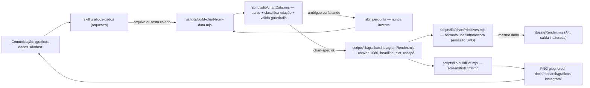

# Impl: Gráficos de dados para Instagram (skill de comunicação)

Status: em execução
Atualizado em: 2026-09-18
Issue: #1145
Intenção: docs/plans/graficos-dados-instagram.md
Appetite restante: herdado (~2–3 dias eng) — sem corte
Design tier: openai/gpt-5.6-sol (crítica de fechamento certificada; sem bloqueantes)

## Leitura da intenção

- **Outcome:** numa invocação, transformar dados colados/em arquivo (`xlsx/csv/md/txt/texto`) num **gráfico PNG** legível, na paleta Solla, com título-manchete e um destaque de cor, no tamanho do Instagram (`1080×1350` default, `1080×1080`, `1080×1920`). O tipo segue a relação dos dados (barra, coluna, linha, número-âncora); dado ambíguo/faltando → pergunta, nunca completa; render 100% local; artefato gitignored.
- **O que NÃO negociar:** bars/colunas partem do zero; ≤ ~7 pontos; sem pizza grande, 3D ou eixo truncado; rótulos ≥30px e headline ≥48px; contraste ≥4.5:1 (texto) / ≥3:1 (marcas); cor nunca é a única pista; sem persistir dado/schema/migration; **sem segundo pipeline irmão do renderer do dossiê**; dado de campanha nunca sai da máquina; PNG/intermediários nunca commitados (repo público).
- **O que reavaliar (hipóteses do "Direção no codebase"):** (a) que os primitivos de `dossieRender.mjs` são reaproveitáveis como estão — são `const` privados, A4/mm/pt e com `CHART_COLORS` de domínio dossiê; o reuso exige **extração parametrizada**, não `import` direto. (b) que `buildPdf.mjs` serve a saída imagem — ele só tem caminho `page.pdf()`; falta um caminho `page.screenshot()`. (c) que `xlsx`/`csv-parse` exigem dependência nova — já são devDeps. (d) que o subagente é necessário — a etapa semântica é pequena (1 dataset, 1 escolha) e não isola contexto pesado como o C186.

## Abordagem recomendada

**Opções consideradas:** A (extrair o dono dos primitivos + caminho de screenshot no `buildPdf`; superfície só skill+command) | B (renderer Instagram novo e isolado, sem tocar `dossieRender`; subagente classificador) | C (dependência de chart library, ex. vega/Chart.js, e/ou MCP de gráfico).
**Recomendação:** A — é o que a intenção manda ("estender/extrair o dono"), cabe no appetite e mantém o núcleo de parsing/classificação puro e testável.
**Rejeitadas:** B porque gemina o desenho de gráfico (anti-goal explícito) e um subagente sem contexto pesado a isolar só acrescenta handoff/pin; C porque traz bundler/CDN/dep para um caminho que precisa ser local, determinístico e sem rede.

### Decisões de engenharia

**(i) Reuso/extração dos primitivos de gráfico sem geminar renderer nem quebrar o A4**

- **Opções:** A) Extrair a **emissão SVG** dos tipos (barra, coluna, linha, âncora) para `scripts/lib/chartPrimitives.mjs`, parametrizada por `{ width, height, colors, classNames, format, highlight }`, e rewiring de `dossieRender.mjs` para consumi-la com os defaults A4 atuais (saída byte-idêntica); o renderer Instagram chama os mesmos emissores com canvas 1080 e paleta Solla. | B) Renderer Instagram copia os primitivos (twin). | C) Instagram renderer importa `dossieRender.mjs` e reescreve CSS por cima.
- **Recomendação:** A — `barChart/valueList/columnChart/stackedColumnChart` e `CHART_COLORS` (L898–993) são usados **só dentro** de `dossieRender.mjs` (8 call sites em L1791–1840), então a extração é contida: o dono passa a ser um módulo deep de desenho de gráfico; cada consumidor mantém a **composição de página** (dossiê A4 × canvas Instagram). Linha e número-âncora não existem hoje e nascem nesse mesmo dono (não num irmão). A extração é provada sem mudança por um **golden spec** que compara a string SVG emitida antes/depois para fixtures fixas.
- **Alternativas rejeitadas:** B porque o anti-goal é explícito e correção de palette/guardrail passaria a exigir dois edits (drift); C porque os primitivos não são exportados e arrastam CSS A4/`CHART_COLORS` de domínio para dentro do caminho Instagram (o médium é genuinamente outro: px, paleta Solla, headline/rodapé).

**(ii) Artefato intermediário (HTML→PNG) e execução do Chromium/screenshot**

- **Opções:** A) Adicionar `screenshotHtmlPng(browser, { html, width, height, outPath })` ao dono `scripts/lib/buildPdf.mjs` (reusa `launchPdfBrowser`; viewport exato; `page.screenshot({ type:'png', clip:[0,0,w,h] })`; `document.fonts.ready`; guarda de tamanho ≤8MB) e o renderer devolve HTML com CSS **inline**. | B) Rasterizar o PDF A4 existente. | C) Renderizar com `sharp`/`resvg` ou serviço externo.
- **Recomendação:** A — o `buildPdf.mjs` é o dono do launch/emit do Chromium; o novo caminho é **aditivo** e não toca constantes A4, `emulateMedia('print')` nem a lógica de fit (o PNG usa mídia `screen` e viewport `1080×(1350|1080|1920)`; o `.canvas` tem exatamente o tamanho de saída, então `clip` é o canvas). CSS inline porque o pipeline não tem bundler — o hi-fi usa Tailwind por CDN, que **não** pode ser dependência de rede no render. PNG do Chromium já é sRGB; a guarda de 8MB falha fechado (`die`).
- **Alternativas rejeitadas:** B porque exige o caminho A4 (páginas mm/pt, `preferCSSPageSize`) e ainda um rasterizador extra; C porque adiciona dependência/pipeline novo e (no serviço externo) viola "dado nunca sai da máquina".

**(iii) Superfície pública: skill + command + (sub)agente**

- **Opções:** A) **skill** `.agents/skills/graficos-dados/SKILL.md` (canônica) + **command** `.opencode/commands/graficos-dados.md` (homônimo, carrega a skill pelo nome e passa `$ARGUMENTS`); **sem** subagente. | B) skill + command + subagente classificador (`redator/classificador`) que devolve um recibo. | C) skill + command + subagente renderizador.
- **Recomendação:** A — a etapa semântica é pequena e cabe no agente principal (parse do formato + leitura da tabela + escolha do tipo + copy), e o builder determinístico faz a validação; o par skill+command é exigido pelo pin `opencodeCommands.unit.spec.ts` (nome exato, sem `model:`). Não há contexto pesado (pesquisa web multi-era) a isolar como no C186. Gatilho de revisitação: quando a invocação passar a aceitar **lote** (vários gráficos por comando) ou pesquisa web, reavalie um subagente por lote.
- **Alternativas rejeitadas:** B porque duplicaria os guardrails da skill num recibo/handoff sem ganho de contexto; C porque renderização é etapa determinística de script — nunca de LLM.

**(iv) Parsing de xlsx/csv/md/txt/texto com o mínimo de dependência**

- **Opções:** A) `xlsx` (já devDep L194) para `xlsx/xls`; `csv-parse/sync` (já devDep L171) para `csv`; sniffer de delimitador local para `txt` (`,`/`;`/`\t`); parser local de tabela GFM para `md`; fallback de pares `rótulo<sep>valor` para texto solto; `node:fs` para leitura. | B) Adicionar `papaparse` e/ou `mammoth` (docx). | C) Shell-out para `libreoffice`/`ssconvert`.
- **Recomendação:** A — zero dependência nova; tudo isolado em `scripts/lib/chartData.mjs` (puro, sem Chromium), com detecção de header e inferência de tipo numérico, e falha explícita quando a matriz não tem 2 colunas mínimas (`label` + `value`). `doc/docx` fica **fora do v1** (a intenção já decidiu) com gatilho de revisitação se houver demanda real.
- **Alternativas rejeitadas:** B porque `papaparse` é redundante com `csv-parse` e `mammoth` reabre o `docx` já cortado; C porque depende de binário externo e torna o determinismo ambiental.

**(v) Onde ficam tipos/classificação de relação e o que é unit-testável**

- **Opções:** A) Núcleo puro em `scripts/lib/chartData.mjs` — `parseInput`, `classifyRelation`, `validateSpec` e o shape `ChartSpec`; o entry `scripts/build-chart-from-data.mjs` é orquestrador fino; testes unit cobrem o núcleo. | B) Lógica dentro do entry `.mjs`. | C) Lógica em `src/lib/*.ts` compartilhada com o app.
- **Recomendação:** A — Dependency Rule: o núcleo (parse/classificação/guardrails) não conhece Chromium nem CSS e roda em `test:unit` sem DB/rede; o renderer/emissor é a camada externa. Unit-testável e pinado: parsing de cada formato (fixtures inline, sem PII), classificação (`tempo→linha/coluna`, `ranking/comparação→barra`, `1 medida→âncora`, ambíguo→`needsQuestion`), guardrails (base zero, ≤7 pontos, `pie` recusada no v1), mapeamento de tamanho→viewport, **golden** dos primitivos (`chartPrimitives`) e estrutura do HTML Instagram (canvas exato, paleta hex, headline ≥48px, rótulos ≥30px, rodapé/fonte).
- **Alternativas rejeitadas:** B porque não é importável e foge do pin de CI; C porque não é superfície de app (é ferramenta local) e travaria o núcleo ao build do Next.

### Componentes / mudanças

- **`.agents/skills/graficos-dados/SKILL.md`** (novo): frontmatter só `name`+`description` (aspas simples). Corpo: quando usar; fluxo (parse → propõe tipo → gera → confere/ajusta); **contrato do `chart-spec.json`**; uso do CLI (plain `node`, sem `tsx` — o builder é `.mjs` puro); guardrails; troubleshooting; links. Dado colado vira arquivo em `data/graficos-instagram/` antes do `--in`.
- **`.opencode/commands/graficos-dados.md`** (novo): frontmatter só `description:` (sem `model:`); corpo carrega a skill `graficos-dados` pelo nome exato, aponta `.agents/skills/graficos-dados/SKILL.md` e passa `$ARGUMENTS`. Satisfaz `tests/unit/opencodeCommands.unit.spec.ts`.
- **Sem `.opencode/agent/graficos-dados.md` no v1** (decisão iii).
- **`scripts/build-chart-from-data.mjs`** (novo entry, auto-entry em `knip.json` `scripts/*.mjs`): flags `--in=<path>|-` / `--text-file=`, `--spec=<json>` (replay sem reparse), `--inspect` (imprime a matriz parseada em JSON para o agente), `--type=`, `--headline=`, `--source=`, `--size=feed|square|story`, `--out=`. Lê → `parseInput` → (`classifyRelation` se `--type` ausente) → `validateSpec` (fail-closed) → `renderChartHtml` → `screenshotHtmlPng` → grava PNG + `chart-spec.json` intermediário. `die` via `dieWithLabel`/`parseEqualsFlags` de `scripts/lib/cli.mjs`.
- **`scripts/lib/chartData.mjs`** (novo): `parseInput`, `classifyRelation`, `validateSpec`, `SIZES` (1080×1350 / 1080×1080 / 1080×1920 + safe zones de stories 250px) e `CHART_TYPES` (`bar|column|line|anchor`). JSDoc para knip `types: error`. Sem Chromium/DOM.
- **`scripts/lib/chartPrimitives.mjs`** (novo): dono da emissão SVG dos tipos, extraído de `dossieRender.mjs` L895–993, parametrizado (`width/height/colors/classNames/format/highlight`); inclui o `lineChart` (novo) e o `proportionalPercent` (escala honesta compartilhada). A composição de barra/coluna/âncora do Instagram é CSS do template aprovado, com a proporção vinda do dono. Exportado e consumido pelos dois renderers.
- **`scripts/lib/graficosInstagramRender.mjs`** (novo): compõe canvas 1080 + regra de topo + kicker/contexto + headline + subtítulo + plot (via primitivos) + rodapé (fonte/nota + lockup tipográfico de marca) para os 3 tamanhos; CSS **inline**; paleta Solla verbatim; sem `asset-flag`/anotações do gate.
- **`scripts/lib/buildPdf.mjs`** (editar o dono): adicionar `screenshotHtmlPng` (aditivo; constantes A4 e `emitHtmlPairPdf` intactos).
- **`scripts/lib/dossieRender.mjs`** (editar o dono): remover os 5 `const` e importar de `chartPrimitives.mjs` com os defaults A4 atuais (saída inalterada).
- **Testes (novos):** `tests/unit/chartData.unit.spec.ts`, `tests/unit/chartPrimitives.unit.spec.ts` (golden), `tests/unit/graficosInstagramRender.unit.spec.ts`, `tests/unit/graficosDadosSkill.unit.spec.ts` (prosa da skill por strings literais).
- **`tests/unit/opencodeCommands.unit.spec.ts`** (editar): incluir `'graficos-dados'` no array `commands`.
- **`scripts/lib/test-affected-core.mjs`** (editar): adicionar `scripts/lib/chartData.mjs`, `scripts/lib/chartPrimitives.mjs`, `scripts/lib/graficosInstagramRender.mjs` a `SCRIPTS_SPEC_PINNED` (L31–90) — obrigatório porque os specs novos os importam; o invariante em `ciSkipInvariants.unit.spec.ts:192-216` recalcula o closure e exige igualdade exata.
- **`.gitignore`** (editar, após L93): bloco `# C191 — ...` com `/data/graficos-instagram/` e `/docs/research/graficos-instagram/`.
- **`docs/changelog/2026-09-18-c191-graficos-instagram.md`** (novo).
- **`package.json`:** sem dep nova e **sem script novo** (o builder é chamado direto, como os irmãos); nada de migration/schema/DB.
- **Access / Consent:** não se aplica (ferramenta local; sem collection, sem PII, sem escrita de banco).

### Dados → forma (pergunta 3 de data-presentation)

- **Forma escolhida:** **barras horizontais** para ranking/comparação (rótulo direto + valor na ponta, ordenado por valor, barras do zero); **colunas** para poucos períodos (base zero, `≤~7`); **linha** para série temporal contínua (ponto final destacado); **número-âncora** para uma única medida. Um único destaque `#c51414` (~≤10% da peça) sobre o resto neutro; fonte/ressalva dentro da imagem.
- **Rejeitadas:** pizza (v1 **não** gera; pedido `pie` é recusado com sugestão de barras — cena 05 do gate); pizza >5 fatias (recusa fail-closed); 3D/perspectiva/eixo truncado (nunca implementados); dashboard/segundo renderer/interatividade (fora de escopo).

## Fases verificáveis

1. **Tracer — extração sem mudança de comportamento** (quota: ~0,5 dia). Mover os primitivos para `chartPrimitives.mjs`, rewiring de `dossieRender.mjs`, golden spec comparando a string SVG. Prova: `pnpm test:unit` verde e `git diff` em `dossieRender.mjs` apenas de import/remoção.
2. **Tracer — screenshot PNG** (~0,5 dia). `screenshotHtmlPng` em `buildPdf.mjs` + smoke com um canvas dummy em cada tamanho; verificar dimensões e `<8MB`.
3. **Núcleo de dados** (~0,5 dia). `chartData.mjs` + `chart-spec` + unit specs de parse/classificação/guardrails.
4. **Renderer Instagram** (~0,5 dia). `graficosInstagramRender.mjs` para os 4 tipos × 3 tamanhos, paleta/contraste/tipografia mínimas, rodapé/lockup.
5. **Superfície + pinos** (~0,5 dia). skill + command; `opencodeCommands.unit.spec.ts`; `SCRIPTS_SPEC_PINNED`; `.gitignore`; changelog. Rodar a skill de ponta a ponta com `xlsx`, `csv`, `md` e texto.
6. **Gates** — `pnpm gate:fast` (lint + typecheck + unit); conferir `knip` (exports consumidos) e `check:cycles`; `pnpm push` (o PR CI roda a cascata).

## Rabbit holes / Não escopo (engenharia)

- **Segundo renderer de gráfico:** proibido; o dono é `chartPrimitives.mjs` (decisão i).
- **Parametrizar o dossiê A4 além do necessário:** não mudar layout, classes ou CSS do dossiê; a extração preserva a saída.
- **`docx`/`mammoth`, MCP de gráfico, serviço remoto:** fora do v1 (render local).
- **Editor gráfico:** sem cores/fontes/eixos configuráveis além de tipo/rótulo/tamanho/destaque.
- **Fontes self-hosted / logo oficial:** v1 usa stack de sistema e o lockup tipográfico do hi-fi; o asset oficial (NEEDS ASSET) é gatilho futuro.
- **DRY especulativo:** não criar abstrações para tipos não pedidos (pizza, stacked, área).
- **Migration/schema/DB e persistência de dado:** fora; artefato gitignored.

## Adiado com gatilho (triage pós-simplify)

- **Módulo-folha de constantes** (`SIZES`/`RELATION_LABEL` sem `xlsx`/`csv-parse`)
  — hoje o renderer importa de `chartData.mjs`, arrastando os parsers. Gatilho:
  um consumidor de `SIZES`/`RELATION_LABEL` sem parsers (renderer em bundle/browser).
- **Decompor `main()` do entry** em `buildSpec`/`emitPng`. Gatilho: modo lote/2ª
  saída ou entry > ~200 linhas.

Cobertura de runtime (parse ambíguo pt-BR, teste do entry, smoke real do PNG):
registrada como `C191-runtime` (`depends: [1145]`), plano
`docs/plans/graficos-dados-instagram-runtime-followups.md`.

## Riscos e mitigação

- **Regressão no dossiê por tocar `dossieRender.mjs` (high-risk/spec-pinned):** extração mínima, golden spec dos primitivos, defaults idênticos; rodar os builders de dossiê num fixture e comparar HTML intermediário (amostra).
- **Fonte não determinística no PNG (Inter ausente / fallback):** v1 usa stack de sistema com `document.fonts.ready`; medir nos dois ambientes; se houver drift, avaliar embed de woff2 (novo item, não neste PR).
- **`page.screenshot` capturar tamanho errado:** `.canvas` com dimensões exatas + `clip` e viewport iguais; teste de dimensão do PNG.
- **PNG >8MB:** guarda falha fechado; arte é vetorial/flat (esperado ≪8MB).
- **Dados ambíguos/enganosos:** `validateSpec` fail-closed + fluxo de pergunta da skill; nunca completa nem infere.
- **`xlsx@0.18.5` tem CVEs conhecidas (devDep):** uso local com insumo da própria equipe; preferir CSV quando possível; documentar.
- **Pin de CI esquecido:** adicionar os 3 libs a `SCRIPTS_SPEC_PINNED` no mesmo commit; o invariante falha se divergir.
- **knip `exports: error`:** todo export novo precisa de consumidor real (entry/renderer/spec) — já coberto pelo desenho.

## Aceite de engenharia

- [x] Rodar a skill/entry com `xlsx`, `csv`, `md` e texto gera PNG `1080×1350` legível (default) e `1080×1080`/`1080×1920` sob `--size`, todos sRGB e <8MB.
- [x] Tipos essenciais (barra, coluna, linha, número-âncora) escolhidos pela relação dos dados; `pie` recusada; base zero; ≤7 pontos (5 em stories); um destaque `#c51414`; headline ≥48px e rótulos ≥30px; contraste atendido.
- [x] Dado ambíguo/faltando → pergunta; nada é inventado nem completado.
- [x] Nenhum dado bruto/PNG commitado: `.gitignore` cobre `data/graficos-instagram/` e `docs/research/graficos-instagram/`.
- [x] Saída do dossiê A4 inalterada após a extração dos primitivos (golden + specs de dossiê verdes).
- [x] Invariantes AGENTS/engineering-standards: sem schema/migration/DB; sem PII; identificadores em inglês, copy pt-BR; "edite o dono".
- [x] Testes de domínio previstos: `chartData` (parse/classificação/guardrails), `chartPrimitives` (golden), `graficosInstagramRender` (estrutura/medidas), prosa da skill, e `opencodeCommands` atualizado; `SCRIPTS_SPEC_PINNED` sincronizado.
- [x] `pnpm gate:fast` verde; knip sem export órfão; push via `pnpm push`.

## Self-score decision-quality

1. **Decisões caras têm rejeitadas? — 5/5.** As cinco decisões exigidas (extração dos primitivos, HTML→PNG/screenshot, superfície pública, parsing, núcleo de tipos) trazem Opções/Recomendação/Rejeitadas nomeadas.
2. **Abordagem cabe no appetite? — 4/5.** Extração contida + 3 módulos + 1 entry cabem em ~2–3 dias; o único risco de appetite é o rewrite de `dossieRender.mjs`, mitigado por extração mínima e golden.
3. **Rabbit holes nomeados? — 5/5.** Segundo renderer, editor, `docx`, MCP, fontes/logo, DRY especulativo e DB estão explicitamente cortados.
4. **Depth check (reusa shells/helpers)? — 5/5.** Reusa `buildPdf.launchPdfBrowser`/emit como dono do Chromium, `cli.mjs` (`dieWithLabel`/`parseEqualsFlags`), os primitivos extraídos do próprio dono e o padrão skill+command dos irmãos; nenhum caminho paralelo.
5. **Intenção (aceite de produto) permanece satisfeita? — 5/5.** O outcome, os guardrails e os anti-goals seguem intactos; a engenharia não reescreveu o produto.

**Média: 4,8 — passa o gate ≥4.** (Critério mais fraco: appetite, 4.)
