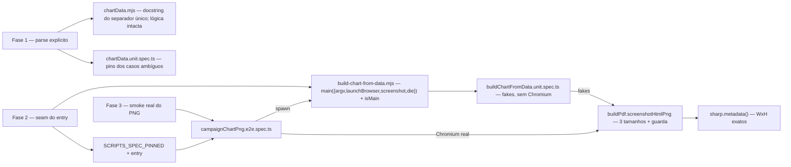

# Impl: Runtime follow-ups C191 — cobertura do entry/PNG e parse ambíguo

Status: aprovado (modo --auto)
Atualizado em: 2026-09-18
Issue: #1151
Intenção: docs/plans/graficos-dados-instagram-runtime-followups.md
Appetite restante: herdado (~0,5 dia eng, fill-in) — sem corte
Impeccable: A (só backend/ferramenta; sem superfície de UI)

## Leitura da intenção

- **Outcome:** fechar a cobertura de runtime da skill `graficos-dados` e tornar explícito o único parsing hoje silencioso, sem mudar o comportamento entregue no C191. Em uma frase: o PNG real (3 tamanhos + guarda), o entry e a regra pt-BR do separador único passam a ter prova; o que a comunicação já usa continua idêntico.
- **O que NÃO negociar:** comportamento entregue no C191 inalterado — nenhum input que hoje gera PNG passa a bloquear e nenhum valor numérico muda de leitura. Render 100% local (dado de campanha não sai da máquina), nada de PNG/intermediário commitado (`data/graficos-instagram/` e `docs/research/graficos-instagram/` seguem gitignored), sem schema/migration/DB/PII. A fase 1 diz "se a decisão for por perguntar…" — o outcome ("sem mudar o comportamento") resolve a condicional por **não**: documentar + pinar, e registrar o gatilho para reabrir.
- **O que reavaliar (hipóteses que podem estar erradas):**
  - que o entry precisa de injeção de dependências para ser testável sem Chromium — se o seam crescer além de `main(options)` + guard, o fallback é manter o entry intocado e mover a fase 2 para o smoke e2e (custo maior, mas sem tocar produção);
  - que o smoke real cabe num e2e spec sem editar workflow e sem DB próprio — o spec não usa `page` nem fixtures de auth, mas o runner ainda paga o boot do webServer (custo aceito, não escondido);
  - que `sharp.metadata()` é aceitável no worker e2e — se sharp atrapalhar o loader do Playwright, o fallback é ler o IHDR (4 bytes big-endian) no helper do próprio spec.

## Abordagem recomendada

**Opções consideradas:** A (fechar as três fases com unit + um e2e spec, sem mudança de comportamento) | B (só unit, incluindo browser fake no entry e sem smoke real) | C (mudar o parse para fail-closed e cobrir o entry por spawn).
**Recomendação:** A — é o que a intenção pede fase a fase: a regra do separador vira doc + unit pin, o entry ganha um seam mínimo (`main(options)` + guard `isMain`, padrão já existente em `scripts/check-test-locations.mjs:68`) para ser importado sem Chromium, e o smoke real usa o único veículo onde o Chromium está garantido (e2e), sem tocar workflow.
**Rejeitadas:** B porque browser fake no unit não satisfaz a fase 3 ("exercitar `screenshotHtmlPng` com Chromium real") e o guard de 8 MB continuaria só com browser fake (`tests/unit/buildPdf.unit.spec.ts:57-98`); C porque bloquear `'1.234'` muda o comportamento entregue (viola o outcome) e é um produto decision fora do appetite.

### Decisões de engenharia

**(i) Como cobrir o parse ambíguo pt-BR (issue fail-closed × null × documentar+pinar)**

- **Opções:** A) **Documentar e pinar a regra vigente**: separador único é decimal (`'1.234'`→1.234, `'1,5'`→1,5, `'1,500'`→1,5), os dois separadores juntos usam o último como decimal (`'1.234,56'`→1234,56), e separador múltiplo (`'1.234.567'`/`'1,234,567'`) é recusado (`null`); corrigir a docstring de `parseNumber` (`scripts/lib/chartData.mjs:47-51`) e pinar os casos em unit, incluindo `parseInput` **sem** issue para separador único. | B) Fail-closed: sinal explícito de ambiguidade (novo retorno/sentinela, nunca `null`) que vira `issues` no `matrixToDataset` (`chartData.mjs:138-174`) e bloqueia a geração no entry (`build-chart-from-data.mjs:95-100`). | C) Devolver `null` para ambíguo e deixar o fluxo existente tratar.
- **Recomendação:** A — o outcome é explícito ("sem mudar o comportamento entregue no C191"): o ganho da fase 1 é tornar a decisão de hoje **intencional e provada**, não alterá-la. O par `--inspect` obrigatório da skill (`SKILL.md:36-40`) já mostra `{ rows, format, issues }` antes de desenhar, então o valor errado é visível para a pessoa antes do PNG.
- **Alternativas rejeitadas:** B porque bloqueia entradas hoje aceitas (mudança de comportamento), exige um sinal novo que atravessa `matrixToDataset`/`splitPair`/`classifyRelation` e estoura o fill-in; C porque `null` é sobrecarregado no módulo — decide o header heurístico (`chartData.mjs:144-150`), o bare-number da âncora (`:213-214`) e a issue de valor não numérico (`:161-163`); devolver `null` para ambíguo reclassificaria linha de dado real como header/ausente (a armadilha registrada).
- **Gatilho de revisitação:** se o uso real mostrar leitura 1000× errada de `1.234` (ex.: TSE/planilha com milhar por ponto), reabrir como Issue de fail-closed com o sinal próprio; não fazer neste PR.

**(ii) Como testar o entry sem Chromium e sem matar o worker**

- **Opções:** A) Exportar `main({ argv = process.argv.slice(2), launchBrowser = launchPdfBrowser, screenshot = screenshotHtmlPng, die = dieWithLabel('graficos-dados') } = {})` e proteger a execução com o guard `isMain` (`process.argv[1]` vs `import.meta.url`, padrão em `scripts/check-test-locations.mjs:68`); o unit injeta fakes e cobre `--inspect`, `needsQuestion`/`die`, `--source` ausente, `--spec` replay, spec gravado e a linha de log por tamanho. | B) Não tocar o entry: unit só por spawn cobre os caminhos que saem antes de `launchPdfBrowser()` (`build-chart-from-data.mjs:135`) e o resto vai para o e2e. | C) `vi.mock` + import dinâmico + spies em `process.argv`/`process.exit`.
- **Recomendação:** A — menor seam que torna o entry importável de verdade (hoje `main()` executa no import, `build-chart-from-data.mjs:154-156`, e `die` mata o worker via `process.exit(1)`, `scripts/lib/cli.mjs:18-21`). Mantém o entry como orquestrador (<~170 linhas), sem decompor `buildSpec`/`emitPng` — o defer com gatilho do plano pai segue preservado; o caminho CLI fica idêntico porque todos os defaults são os imports atuais.
- **Alternativas rejeitadas:** B porque a fase 2 pede "a linha de log por tamanho" **sem Chromium** — spawn puro só alcança os caminhos de erro e empurraria sucesso/replay para 3 launches de Chromium no e2e (lento e menos isolado); C porque mock de ESM + `process.exit` + `argv` global é frágil (um caminho que escape do mock mata o worker) e não deixa seam reutilizável.

**(iii) Onde roda o smoke real do PNG**

- **Opções:** A) Novo `tests/e2e/campaignChartPng.e2e.spec.ts` (project `campaign`, Chromium garantido; o spec **spawna** o entry real por tamanho e lê as dimensões; também chama `screenshotHtmlPng` direto com `maxBytes` baixo para exercitar a guarda de 8 MB com browser real) + entrada em `E2E_CURATED_SPECS` (`scripts/lib/e2e-affected-manifest.mjs:24-36`). | B) Unit/int com Chromium real. | C) Script dedicado (`scripts/smoke-chart-png.mjs`) + step novo no workflow. | D) Não fazer o smoke real.
- **Recomendação:** A — é o único lugar onde o browser está instalado **depois** de unit/int (`ci-pr.yml:152-184` vs `:209-211`; `deploy.yml:149-170` vs `:186-187`); o seletor já auto-inclui spec novo editado (`scripts/lib/test-affected-core.mjs:356-363`) e um diff high-risk roda a curated (`:341-351`). O nome tem de casar um project (`campaign.*`, `playwright.config.ts:170-175`; `frontend`/`admin` em `:176-194`) — spec que não casa nenhum project falha "No tests found" (precedente OPS39 documentado em `test-affected-core.mjs:397-404`). Com `build-chart-from-data.mjs` em `SCRIPTS_SPEC_PINNED`, diffs do entry/libs viram high-risk e a curated (com o novo spec) acorda o smoke; hoje isso não aconteceria via manifest porque `E2E_AFFECTED_MANIFEST` só mapeia `src/**` (`e2e-affected-manifest.mjs:61-363`).
- **Alternativas rejeitadas:** B porque unit/int rodam antes do `playwright install` no CI (falha em clone limpo e diverge local×CI — o pior drift); C porque um step novo exige editar `.github/workflows/*` (diff que classifica `none` em `test-affected-core.mjs:249-260`, então a própria fiação não seria verificada pela cascata) e cria cerimônia paralela ao veículo e2e; D não satisfaz a fase 3.

**(iv) Como ler as dimensões do PNG**

- **Opções:** A) `sharp(path).metadata()` (dep de produção, `package.json:139`; uso idêntico em `scripts/resize-images.mjs:158` e `scripts/fill-image.mjs:90`). | B) Parsear o IHDR manualmente (offset 16/20, big-endian).
- **Recomendação:** A — o teste valida assinatura **e** dimensões sem código binário próprio, e sharp já é o dono de imagem do repo (inclusive no boot do Payload, `src/payload.config.ts:5`).
- **Alternativas rejeitadas:** B porque duplica um problema já resolvido no repo e o parser próprio não teria verificação independente (testar o parser com ele mesmo é circular).

### Componentes / mudanças

- **`scripts/lib/chartData.mjs`** (editar a prosa, não a lógica): docstring de `parseNumber` (`:47-51`) passa a declarar a regra do separador único (dot-only/comma-only = decimal) e a limitação de separador múltiplo; nenhum branch muda.
- **`tests/unit/chartData.unit.spec.ts`** (editar): novos pins em `parseNumber` — `'1.234'`→1.234, `'1.500'`→1.5, `'1,234'`→1.234, `'1.234.567'`→null, `'1,234,567'`→null — e em `parseInput`, separador único **não** gera issue (a regra é intencional, não ambígua para o fluxo).
- **`.agents/skills/graficos-dados/SKILL.md`** (editar `:114`): troubleshooting do número pt-BR ganha a regra explícita ("separador único é decimal: `1.234` é 1,234 — para milhar use os dois separadores `1.234,56` ou `1234`").
- **`scripts/build-chart-from-data.mjs`** (editar): `main` exportado com deps injetáveis e guard `isMain`; defaults = imports atuais (`launchPdfBrowser`, `screenshotHtmlPng`, `dieWithLabel('graficos-dados')`, `process.argv.slice(2)`). Sem flag nova, sem mudança de fluxo.
- **`tests/unit/buildChartFromData.unit.spec.ts`** (novo, `// @vitest-environment node`, precedente `tests/unit/dbStart.unit.spec.ts:1-11`): cobre `--inspect` (JSON `{rows,format,issues}` no stdout), `needsQuestion` + die (com `launchBrowser` que explode, provando que não abre browser), `--source` ausente, `--in` ilegível, `--spec` replay, spec intermediário gravado e a linha de log exata por tamanho (feed/quadrado/story + cap 5 em story bar), tudo com `screenshot` fake que devolve `{ size }`.
- **`scripts/lib/test-affected-core.mjs`** (editar `SCRIPTS_SPEC_PINNED`, `:31-94`): adicionar `scripts/build-chart-from-data.mjs` ao grupo top-level — obrigatório porque o spec novo o importa e o invariante refaz o closure (`tests/unit/ciSkipInvariants.unit.spec.ts:192-216`) exigindo igualdade exata.
- **`tests/e2e/campaignChartPng.e2e.spec.ts`** (novo): importa `test`/`expect` do `@playwright/test` cru (sem `e2eTest.ts`; não há `page` do app para vigiar — precedente browserless em `tests/e2e/fixtures/campaignHttpTest.ts:8-16`). Escreve dados inline num `mkdtemp` (`tmpdir()`), spawna `process.execPath scripts/build-chart-from-data.mjs` para feed/quadrado/story com `--out` em tmp, asserta exit 0, stdout `[graficos-dados] PNG … (WxH, N KB) · tipo=… · N ponto(s) ≤ cap`, `sharp.metadata()` com WxH exatos de `SIZES` e tamanho <8 MB. Em seguida chama `screenshotHtmlPng(browser, { …, maxBytes: 1024 })` com o Chromium real do fixture e espera a rejeição (>1024 bytes) — a guarda de 8 MB (`scripts/lib/buildPdf.mjs:48-53`) exercitada de verdade. Comentário de topo registra a restrição do nome (`campaign*` casa o project).
- **`scripts/lib/e2e-affected-manifest.mjs`** (editar `E2E_CURATED_SPECS`, `:24-36`): adicionar `'campaignChartPng'` — é o que faz o smoke rodar em diffs high-risk do entry/libs.
- **`tests/unit/e2eAffectedManifest.unit.spec.ts`** (editar `:51-70`): atualizar o pin congelado da curated (a lista é deliberada; a mudança é intencional e revisada, não drift).
- **`docs/changelog/2026-09-18-c191-runtime-followups.md`** (novo): uma entrada curta, padrão `docs/changelog/`.
- **Migration:** nenhuma (sem schema/DB).
- **Access / Consent:** não se aplica (ferramenta local; sem collection, sem PII).
- **UI:** Impeccable A — nenhuma superfície visual; o smoke só verifica o PNG gerado.

### Dados → forma (se aplicável)

Não se aplica — sem superfície de dados/UI nesta entrega; a forma visual do C191 permanece intocada.

## Fases verificáveis

1. **Parse explícito (fase 1)** — quota ~0,5 h. Docstring + SKILL.md + pins de `chartData.unit.spec.ts`. Prova: `pnpm test:unit -- tests/unit/chartData.unit.spec.ts` verde; nenhum arquivo de produção com lógica alterada.
2. **Seam do entry + unit sem Chromium (fase 2)** — quota ~1,5 h. `main(options)` + `isMain`; `buildChartFromData.unit.spec.ts`; entrada em `SCRIPTS_SPEC_PINNED`. Prova: `pnpm test:unit` verde (inclui `ciSkipInvariants`); `node scripts/check-test-locations.mjs`; `node scripts/build-chart-from-data.mjs --in=… --inspect` idêntico ao comportamento anterior.
3. **Smoke real do PNG (fase 3)** — quota ~1,5 h. Spec e2e + curated + pin. Prova local: `pnpm test:e2e --no-deps -- tests/e2e/campaignChartPng.e2e.spec.ts` (receita de `playwright.config.ts:148-152`; `pnpm db:start` antes) verde; em CI o spec entra pela seleção do diff e, nos high-risk, pela curated.
4. **Gates** — quota ~0,5 h. `pnpm gate:fast` (lint + typecheck + unit, `package.json:58`); rodar o smoke e2e uma vez; `pnpm push` (a cascata do PR roda guards → lint → typecheck → knip → cycles → unit/int → build → e2e selecionado).

## Rabbit holes / Não escopo (engenharia)

- **Mudar a semântica do parse** (fail-closed de `1.234`): fora — muda o comportamento entregue; gatilho de revisitação registrado na decisão (i).
- **Decompor `main()` em `buildSpec`/`emitPng`:** defer com gatilho do plano pai preservado; aqui só injeção + guard.
- **Helper próprio de dimensão PNG:** não criar; sharp é o dono.
- **Mapear `scripts/**`no`E2E_AFFECTED_MANIFEST`:** não — o invariante exige prefixos `src/` (`tests/unit/e2eAffectedManifest.unit.spec.ts:34-42`); a curated é o veículo.
- **Chromium em unit/int:** nunca (ordem do CI); browser só no e2e.
- **Flags novas no entry** (`--max-bytes`, `--spec-out`): não — a guarda é exercitada direto na lib e o side effect em `data/graficos-instagram/` é gitignored (com cleanup no teste).
- **Fixture xlsx:** não há precedente de teste xlsx; os specs de dados usam strings inline (`chartData.unit.spec.ts`) e a fase 2 não pede formato novo.
- **Reabrir o que o C191 já resolveu:** linha silenciosa com valor faltando, `--size`/`--highlight` fail-closed, `escapeHtml`, padding de stories, `proportionalPercent` com zero — intocados.

## Adiado com gatilho (triage pós-simplify)

- **Cobertura unit do `--in=-` (stdin):** `readInput` lê `process.stdin` global
  (`scripts/build-chart-from-data.mjs:57-68`) e o seam injeta só browser/
  screenshot/die/repoRoot. Gatilho: o caminho stdin mudar (encoding/flag) ou
  ganhar consumidor além do uso manual — então injetar `readInput` no seam ou
  fixar fixture de stdin.
- **Custo da curated com o smoke:** o `campaignChartPng` roda em todo PR
  high-risk (4 launches de Chromium; deliberado e documentado no manifest).
  Gatilho: o smoke ficar flaky/lento no CI — então a guarda de 8 MB vira 1
  launch direto e os tamanhos ficam nos 3 spawns.

## Riscos e mitigação

- **CI roda unit antes do `playwright install`:** qualquer Chromium fica no e2e (decisão iii); unit usa só fakes.
- **Importar o entry em unit matar o worker:** guard `isMain` + `die` injetável; o próprio spec importa o módulo e prova que nada executa no import.
- **Spec e2e novo sem project match → "No tests found":** nome `campaignChartPng` casa `/campaign.*\.e2e\.spec\.ts/`; restrição documentada no topo do spec.
- **Smoke e2e lento/flaky:** 3 spawns com timeout de 45 s cada (teste com 90 s de budget — o default de 60 s cobre mal 3 launches sob carga); dimensões vêm de viewport/clip (não de fontes); o job já paga Chromium/build; a curated roda só em high-risk e o verify roda full.
- **Side effect do unit em `data/graficos-instagram/`:** gitignored; o spec remove o `chart-spec.json` gerado no `afterEach`.
- **Curated congelada:** atualizar o pin unit no mesmo commit (`e2eAffectedManifest.unit.spec.ts:51-70`); o custo extra é um spec curto nos PRs high-risk.
- **Entry vira high-risk ao entrar no `SCRIPTS_SPEC_PINNED`:** intencional — diffs do entry passam a rodar unit full + curated, que agora inclui o smoke real.
- **`sharp` no worker e2e:** dependência de produção já instalada; nenhum pacote novo.

## Aceite de engenharia

- [ ] Aceite de produto da intenção ainda coberto: comportamento do C191 inalterado; o parsing silencioso vira regra documentada e pinada.
- [ ] `parseNumber` com separador único pinado em unit (`'1.234'`→1.234, `'1,234'`→1.234, `'1.500'`→1.5) e separador múltiplo→null; `SKILL.md:114` explica o que a comunicação deve escrever para milhar.
- [ ] Entry cobrindo `--inspect`, `needsQuestion`, `--source`/`--in` faltando, `--spec` replay e a linha de log por tamanho **sem Chromium** (fakes injetados); CLI real idêntico.
- [ ] Smoke e2e com Chromium real nos 3 tamanhos: dimensões exatas via `sharp.metadata()` e guarda real exercitada (`screenshotHtmlPng` com `maxBytes` baixo).
- [ ] `SCRIPTS_SPEC_PINNED` com `scripts/build-chart-from-data.mjs`; curated com `campaignChartPng`; pins unit correspondentes verdes (`ciSkipInvariants`, `e2eAffectedManifest`).
- [ ] Invariantes AGENTS/engineering-standards: sem migration/schema/DB; sem PII; nada commitado em `data/`/`docs/research/`; identificadores em inglês, prosa/copy pt-BR; "edite o dono" (sem caminho paralelo).
- [ ] `pnpm gate:fast` verde; smoke e2e verde local; changelog registrado; push via `pnpm push`.

## Self-score decision-quality

1. **Decisões caras têm rejeitadas? — 5/5.** As quatro decisões deliberadas (parse ambíguo, seam do entry, veículo do smoke, leitura de dimensões) trazem Opções/Recomendação/Rejeitadas nomeadas, com a armadilha do `null` sobrecarregado e a ordem do Chromium no CI explicitadas.
2. **Abordagem cabe no appetite? — 4/5.** Duas superfícies de execução (unit + e2e) num fill-in de ~0,5 dia exige disciplina de quota, mas o seam é de ~10 linhas, o spec unit é fakes puros e o e2e é um arquivo; nenhuma fase estoura.
3. **Rabbit holes nomeados? — 5/5.** Semântica de parse, decomposição do `main`, helper de PNG, manifest `scripts/**`, Chromium em unit/int, flags novas, fixture xlsx e reabertura do simplify estão cortados com motivo.
4. **Depth check (reusa shells/helpers)? — 5/5.** Reusa `screenshotHtmlPng`/`launchPdfBrowser` (`buildPdf.mjs:23,31`), `dieWithLabel`/`parseEqualsFlags` (`cli.mjs:18,34`), o padrão `isMain` (`check-test-locations.mjs:68`), o veículo e2e/curated e `sharp`; nada de caminho paralelo.
5. **Intenção (aceite de produto) permanece satisfeita? — 5/5.** O outcome "sem mudar o comportamento" é o eixo da decisão (i); as fases 2 e 3 fecham exatamente a cobertura de entry e PNG real pedida.

**Média: 4,8 — passa o gate ≥4.** (Critério mais fraco: appetite, 4 — fill-in com duas camadas de teste; mitigado pelas quotas por fase.)
