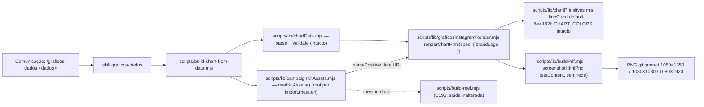

# Impl: Gráficos de dados do Instagram na marca oficial do kit 1313

Status: aprovado
Atualizado em: 2026-09-19
Issue: #1192
Intenção: docs/plans/graficos-dados-marca-kit-1313.md
Appetite restante: herdado (~1 dia eng) — sem corte
Aprovação: modo autônomo (`--auto`) — impl plan auto-aprovado; crítica de design segue fail-closed

## Leitura da intenção

- **Outcome:** a skill `graficos-dados` (C191) passa a gerar o PNG de Instagram na **marca e na paleta oficiais do kit 1313**: o rodapé usa o lockup oficial (`jorge-solla-positivo.png`) no lugar do lockup tipográfico provisório, o destaque/valência boa vira `#e4102f` e o azul `#184e92` vira o sinal de marca — preservando o template aprovado (grid, headline-manchete, um destaque), os formatos, os guardrails, o render 100% local e a saída gitignored. Sem cena de captura de site: a peça inteira é gráfica.
- **O que NÃO negociar (aceite 1–5 da intenção):** (1) marca oficial no rodapé, preservando área/contraste; (2) paleta oficial com o mapeamento semântico fixado no hi-fi C203 (destaque/valência boa `#e4102f` **sempre** com palavra+forma; ruim `#78716c`; azul é sinal de marca, não cor de dado; amarelo/verde só dentro dos ativos); (3) 1080×1350 / 1080×1080 / 1080×1920 PNG; (4) guardrails intactos (100% local, gitignored, sem fonte sem peça, base zero, ≤7 pontos, valência redundante, projeção/cruzamento só confirmados, texto real, um único destaque); (5) o slogan "Mais Saúde, Mais Futuro" só dentro das marcas completas — nunca headline nem quarta mensagem. Decisões do gate 2026-09-19: A) adoção completa (paleta + marca); destaque/valência = `#e4102f` do kit; peça de campanha → kit.
- **O que reavaliar (achados do explorador, não hipóteses cegas):**
  - O débito cita `brandLockup` em `:139-145`, mas hoje o bloco está em `scripts/lib/graficosInstagramRender.mjs:197-203` (footer em `:205-208`) — o alvo real.
  - `ptRed` não tem consumidor; `brandDark` (`:222`, `:324`) e `ptYellow` (`:323`) ficam mortos assim que o topo/rodapé mudam. A remoção é consequência da troca, não migração de uso.
  - O único ponto compartilhado com os dossiês que muda é o **default** de `lineChart` (`scripts/lib/chartPrimitives.mjs:504`); `CHART_COLORS` e `dualLineChart` (que exige `colors`) ficam intactos, e os snapshots byte-identical do dossiê (`tests/unit/chartPrimitives.unit.spec.ts:14-17`) não podem mudar.
  - O entry roda com `repoRoot`/cwd temporários nos testes (`tests/unit/buildChartFromData.unit.spec.ts:144-187`) e no e2e (`tests/e2e/campaignChartPng.e2e.spec.ts:50-71`) — ler o ativo por cwd/`repoRoot` quebraria; o default tem de ser resolvido do módulo (`import.meta.url`).
  - O hi-fi tem resíduos do débito antigo (`.brand-lockup` + `asset-flag` em `docs/plans/graficos-dados-instagram-ui-design.html:1966-1975` e `:2127-2130`), mas a revisão C203 (`:896-920`) declara a decisão **global** ("todo rodapé usa o arquivo oficial … sem lockup tipográfico recriado"); os resíduos são ilustrações desatualizadas — a autoridade é a revisão.
  - O precedente `reelRender.mjs:121-138` resolve `root` por `process.cwd()` e o build-reel passa `ROOT`; a extração do dono precisa preservar a saída do reel e ganhar default cwd-independente.
  - CI: `scripts/lib/test-affected-core.mjs:31-102` é literal e o invariante `tests/unit/ciSkipInvariants.unit.spec.ts:193-216` exige igualdade exata do closure — o módulo novo importado pelo entry tem de entrar em `SCRIPTS_SPEC_PINNED`; `campaignChartPng` já está em `E2E_CURATED_SPECS` (`scripts/lib/e2e-affected-manifest.mjs:39`) e o manifest de e2e não cobre `scripts/`.

## Abordagem recomendada

**Opções consideradas:** A) estender os donos — extrair a leitura dos ativos para `campaignKitAssets.mjs`, trocar a paleta/marca no renderer atual e injetar o logo pelo entry (renderer segue sync/puro); B) o renderer resolve/lê o arquivo sozinho (fs dentro do render); C) manter a paleta provisória e trocar só o lockup, ou criar um segundo renderer "kit".
**Recomendação:** A — é o menor diff que cumpre o gate (adoção completa), mantém o render puro/determinístico (recebe a string do data URI), preserva dossiês e reels e cabe no appetite.
**Rejeitadas:** B porque põe I/O e resolução de path dentro de uma função pura testada por string, quebra o `cwd` temporário do e2e e o `setContent` sem base URL só entende data URI; C porque peça híbrida contraria o gate e um segundo renderer é o twin proibido (correção de guardrail passaria a exigir dois edits).

### Decisões de engenharia

**(i) Onde mora a leitura dos ativos do kit (não gemiar)**

- **Opções:** A) extrair `KIT_ASSETS` + `readKitAssets` de `scripts/lib/reelRender.mjs:121-138` para `scripts/lib/campaignKitAssets.mjs` (dono único), com default de `root` resolvido por `import.meta.url` (= repo root), rewiring de `scripts/build-reel.mjs:51` para importar do novo dono (call site `:145` mantém `{ root: ROOT }`, diff mínimo) e consumo pelo entry; `reelRender.mjs` perde o bloco e não ganha import. | B) o entry importa `readKitAssets` de `reelRender.mjs`. | C) o entry lê o PNG inline com path/constante próprios (ou duplica `KIT_ASSETS`).
- **Recomendação:** A — o concern (nomes dos arquivos + resolução do diretório do kit) já existe e passa a ter um dono só; o default por `import.meta.url` é o que faz o entry funcionar sob `repoRoot`/cwd temporários sem acoplar o renderer ao fs.
- **Rejeitadas:** B porque arrasta as deps de reel (`reelFfmpeg`/`reelCapture`/`reelTimeline`) para o caminho do gráfico e faz o spec do entry pinar módulos de reel pela tabela; C porque duplica o conhecimento dos ativos (twin exato do que o "edite o dono" proíbe) e perde o ponto único quando o kit ganhar novo ativo.

**(ii) Qual ativo, como entra e o contrato do render**

- **Opções:** A) `namePositive` (`jorge-solla-positivo.png`, lockup do nome) — assinatura `renderChartHtml(spec, { brandLogo })` com `brandLogo` **obrigatório** (string `data:image/png;base64,`), falha fechado se ausente ou fora do contrato; CSS `.brand-logo-frame` 286×90 com `object-fit: contain` (portado do hi-fi `:217-232`); `alt="Jorge Solla — Deputado Federal"` (literal do hi-fi). | B) `completePositive` (`marca-positiva-completa.png`) no rodapé. | C) `brandLogo` opcional (rodapé sem marca quando ausente) ou aceitar caminho/URL.
- **Recomendação:** A — o hi-fi usa exatamente esse arquivo nos placements (incl. o rodapé da cena 01, `:988-993`, e do story, `:2307-2312`); ele é o lockup do nome, enquanto a completa carrega `1313` + slogan (viraria quarta mensagem, furando o aceite 5). O fail-closed impede a volta silenciosa do lockup provisório.
- **Rejeitadas:** B porque o slogan/`1313` não pertencem ao rodapé e o peso/área da marca completa é outro; C porque ausência silenciosa é o débito atual e caminho/URL quebra o render sem rede (`screenshotHtmlPng`, `scripts/lib/buildPdf.mjs:39-63`, usa `setContent` sem base).

**(iii) Paleta oficial e aposentadoria da provisória**

- **Opções:** A) `SOLLA_PALETTE` = `highlight:'#e4102f'`, `brandBlue:'#184e92'`, neutros atuais (`ink/hairline/paper/bar/barStrong/axis/label`); **remover** `brandDark`, `ptRed`, `ptYellow`; CSS `.top-rule`/`.context` → `brandBlue`; remover as regras `.brand`, `.brand-signal`, `.brand-name`, `.brand-office`; `DUAL_COLORS.good` herda `highlight` (`bad`/neutros ficam). | B) trocar só o lockup e manter a paleta provisória. | C) manter as duas paletas atrás de flag.
- **Recomendação:** A — decisão A do gate: o vermelho do kit é o destaque/valência e o azul é sinal de marca (régua/kicker), exatamente como o hi-fi fixou (`docs/plans/graficos-dados-instagram-ui-design.html:1033-1092`); amarelo/verde **não existem na paleta** — só dentro dos ativos, e a ausência é o guardrail. Contraste preservado: `#e4102f` no papel ≈4,8:1 e branco sobre `#e4102f` ≈4,8:1 (o número na barra destacada segue AA).
- **Rejeitadas:** B porque deixa a peça híbrida (contra a decisão registrada e a nota do hi-fi que manda substituir o lockup); C porque flag de paleta é caminho test-only/morto que cria duas verdades visuais.

**(iv) Default do `lineChart` no dono compartilhado**

- **Opções:** A) `chartPrimitives.lineChart` default `highlight` `#c51414` → `#e4102f` (`:504`); o renderer continua passando explícito. | B) deixar `#c51414` (sem efeito no Instagram hoje). | C) remover o default e tornar `highlight` obrigatório.
- **Recomendação:** A — `lineChart` tem o Instagram como consumidor único (o dossiê usa `barChart`/`columnChart`/`stackedColumnChart`); sem a troca, a cor aposentada fica no dono compartilhado como armadilha para o próximo consumidor. O pin de `tests/unit/chartPrimitives.unit.spec.ts:141` trava a troca; `CHART_COLORS` (`:17-31`) intocado.
- **Rejeitadas:** B por manter segunda verdade do vermelho de marca; C porque amplia a API sem consumidor que se beneficie (o renderer já passa explícito) — churn, não correção.

**(v) Prosa canônica (skill + command)**

- **Opções:** A) edição cirúrgica: `SKILL.md` (descrição com "marca e paleta oficiais do kit 1313"; contrato `#c51414`→`#e4102f` em `:126` e `:169`; guardrail novo "rodapé usa o ativo oficial … nunca recriar lockup"; referência ao `public/campaign-kit/README.md` e ao plano do kit) e `.opencode/commands/graficos-dados.md:2`. | B) deixar a prosa e mudar só o código. | C) reescrever a skill inteira.
- **Recomendação:** A — a prosa é o contrato de produto da skill (pinada por `tests/unit/graficosDadosSkill.unit.spec.ts`); prosa velha faz agente/pessoa gerar com expectativa errada (paleta e lockup citados são os que a migração aposenta).
- **Rejeitadas:** B porque o pin de prosa passaria a proteger o texto errado; C por churn de um documento grande com risco de quebrar os pins sem ganho.

**(vi) Testes e pinos de CI**

- **Opções:** A) atualizar os **4** specs existentes (render, primitives, entry, skill-prose) e `SCRIPTS_SPEC_PINNED += 'scripts/lib/campaignKitAssets.mjs'`; snapshots do dossiê e e2e intocados. | B) criar spec novo para o módulo de ativos e reescrever os pinos. | C) relaxar asserções de literal.
- **Recomendação:** A — o e2e `campaignChartPng` (real-Chromium, `cwd` tmp) já é a prova de dimensões, da guarda de 8MB e do default cwd-independente; o entry-spec ganha a asserção do data URI no HTML capturado pelo stub (prova que o ativo real foi lido com `repoRoot` tmp) e o render-spec pina frame/alt/fail-closed.
- **Rejeitadas:** B porque o módulo é extração verbatim (nenhuma lógica nova) e um 5º spec só amplia o closure sem cobrir nada novo; C porque os literais são o contrato visual do gate (paleta, lockup, medidas) — removê-los é perder a trava da migração.

**(vii) Design de fechamento, tier e registro**

- **Opções:** A) **sem trigger (a)** — nenhuma superfície visual nova (a revisão C203 já cobre "todo rodapé"); **crítica de fechamento (trigger c) obrigatória** contra PNGs renderizados dos 3 tamanhos; tentar o tier 1 (frontier `openai/gpt-5.6-sol`); se quota/visão falhar, desce para `DEGRADED` e, sendo degradado, **para sem PR** e pede sign-off humano. | B) pular a crítica porque o hi-fi já foi aprovado no gate. | C) abrir o PR mesmo com crítica degradada.
- **Recomendação:** A — o gate aprovou o artefato; o port real pode divergir (escala do logo no rodapé, contraste do vermelho no canvas, peso do azul). `DEGRADED` nunca certifica, então o run para e o humano decide — o `Design tier:` só entra no PR depois do sign-off.
- **Rejeitadas:** B porque o débito `NEEDS ASSET` era exatamente uma promessa do artefato que só o renderizado prova; C porque contraria a regra fail-closed do fluxo de design.

### Componentes / mudanças

1. **`scripts/lib/campaignKitAssets.mjs` (novo — dono da leitura do kit):** `KIT_ASSETS` verbatim de `reelRender.mjs:121-127` (5 arquivos) + `readKitAssets({ root, keys })` devolvendo data URIs (default `keys` = todos; o gráfico pede só `namePositive`); default `root = join(dirname(fileURLToPath(import.meta.url)), '..', '..')` (repo root, cwd-independente); exporta **só** `readKitAssets` (`KIT_ASSETS` privado — `knip.json` rules `exports: error`); JSDoc `@param`/`@returns`; sem dep além de `node:fs/promises`/`node:path`/`node:url`.
2. **`scripts/lib/reelRender.mjs` (editar):** remover `KIT_ASSETS`/`readKitAssets` (`:121-138`); nenhum outro comportamento muda (saída do reel C196 inalterada).
3. **`scripts/build-reel.mjs` (editar):** `readKitAssets` passa a vir de `./lib/campaignKitAssets.mjs` (import atual em `:51`); chamada `:145` mantém `{ root: ROOT }`.
4. **`scripts/lib/graficosInstagramRender.mjs` (editar):** `SOLLA_PALETTE` oficial; CSS `.top-rule`/`.context`→azul e bloco `.brand*` substituído por `.brand-logo-frame`+`img` (286×90, contain); `footer` recebe o data URI; `renderChartHtml(spec, { brandLogo })` sync/puro e fail-closed (ausente ou fora de `data:image/png;base64,`); `alt="Jorge Solla — Deputado Federal"`; `lineChart` chamado com `highlight: SOLLA_PALETTE.highlight` (já passa).
5. **`scripts/build-chart-from-data.mjs` (editar):** importar `readKitAssets`; após `validateSpec` e antes do browser, ler só `namePositive` com `readKitAssets({ keys: ['namePositive'] })` (**sem** `repoRoot`!) e chamar `renderChartHtml(spec, { brandLogo })` (`:195`); falha na leitura → `die` acionável citando o kit.
6. **`scripts/lib/chartPrimitives.mjs` (editar):** default `highlight` do `lineChart` (`:504`); `CHART_COLORS` e os demais emissores intactos.
7. **`.agents/skills/graficos-dados/SKILL.md` (editar):** frontmatter (marca/paleta oficiais do kit 1313); `:126` e `:169` `#c51414`→`#e4102f`; guardrail do rodapé com o ativo oficial (nunca recriar lockup); referências ao `public/campaign-kit/README.md` e a `docs/plans/graficos-dados-marca-kit-1313.md`.
8. **`.opencode/commands/graficos-dados.md` (editar):** descrição `:2` — "na marca e paleta oficiais do kit 1313".
9. **`tests/unit/graficosInstagramRender.unit.spec.ts` (editar):** helper local injeta `brandLogo` stub nas chamadas; substitui as asserções do lockup (`:45-50`, `:190`) pelos pinos do frame (`brand-logo-frame`), do data URI e do `alt`, com ausência de `MANDATO DEPUTADO FEDERAL`; pins de `#e4102f` e ausência de `#c51414` (`:56`, `:74`, `:182`, `:234`); `throw` sem `brandLogo` (fail-closed); paleta `toMatchObject` nova (`:100-107`) + `not.toHaveProperty` de `brandDark`/`ptRed`/`ptYellow`.
10. **`tests/unit/chartPrimitives.unit.spec.ts` (editar):** `:141` `fill="#e4102f"`; fixture `:160-169` e asserções `:185`/`:188`/`:279` com o vermelho novo (é fixture local, não pin de produção — alinhado para não deixar literal aposentado); **snapshots `:14-17` intocados**.
11. **`tests/unit/buildChartFromData.unit.spec.ts` (editar):** asserção sobre o HTML capturado pelo stub — contém `data:image/png;base64,` e não contém `MANDATO DEPUTADO FEDERAL` — provando o ativo real com `repoRoot: tmpdir` (`:144-187`).
12. **`tests/unit/graficosDadosSkill.unit.spec.ts` (editar):** pinar `jorge-solla-positivo.png`, `#e4102f` e a ausência de `#c51414` na prosa.
13. **`scripts/lib/test-affected-core.mjs` (editar):** `SCRIPTS_SPEC_PINNED += 'scripts/lib/campaignKitAssets.mjs'` (`:31-102`, ordem alfabética).
14. **`tests/e2e/campaignChartPng.e2e.spec.ts` (intocado):** prova real de dimensões/8MB e do default cwd-independente (`cwd: workDir`); já em `E2E_CURATED_SPECS` (`scripts/lib/e2e-affected-manifest.mjs:39`) e o novo pin torna o diff high-risk, acordando a seleção curada. O `#c51414` de `:96` é fill descartável do guard de 8MB, não pin de paleta — fica.
15. **`docs/changelog/2026-09-19-c203-graficos-kit-1313.md` (novo):** uma entrada — rodapé oficial, paleta do kit, dono dos ativos extraído, testes/pinos e design tier.
16. **`docs/plans/graficos-dados-marca-kit-1313-impl.md` (novo, este arquivo).**
17. **Sem tocar:** `package.json` (sem dep/script), migrations/schema/DB, access control, Consent, `.gitignore` (saídas já cobertas), `docs/plans/graficos-dados-instagram-ui-design.html` (sem trigger (a); resíduos são ilustrações), `CHART_COLORS`, dossiês/boletins, site público/mapa (`bahiaMapStyle` mantém `#c51414`, fora deste item).

### Dados → forma

O gate fixou o mapeamento; a migração troca os literais e o rodapé, sem mudar a codificação:

| Papel                         | Cor                   | Uso no gráfico                                                                              |
| ----------------------------- | --------------------- | ------------------------------------------------------------------------------------------- |
| Destaque único + valência boa | `#e4102f`             | barra/coluna/linha/âncora destacada; na linha de 2 séries sempre com círculo + ↑ + "amplia" |
| Valência ruim                 | `#78716c`             | quadrado + ↓ + "recua"; nunca vermelho                                                      |
| Sinal de marca                | `#184e92`             | régua de topo e kicker; **não é cor de dado**                                               |
| Tinta / papel                 | `#1c1917` / `#faf9f7` | texto e fundo                                                                               |
| Amarelo / verde               | `#ffeb00` / `#009647` | só dentro dos ativos oficiais (nunca texto, eixo ou dado)                                   |
| Laranja `#f89c0e`             | —                     | não usado                                                                                   |

- Um único destaque por peça (vermelho ≤~10% da área, inalterada pela troca de hex); o topo azul devolve o vermelho ao papel de dado/valência.
- A valência continua redundante (palavra+seta+forma+cor) e o delta segue sem valência (vermelho fora do plot).
- O rodapé é lockup do nome (sem `1313`/slogan): o slogan permanece exclusivo das marcas completas.

## Fases verificáveis

1. **Extração do dono dos ativos** (quota ~0,15 dia). Criar `campaignKitAssets.mjs`, rewiring de `build-reel.mjs`/`reelRender.mjs`. **Prova:** `pnpm gate:fast` verde; `pnpm knip` sem export órfão; `grep -rn "KIT_ASSETS" scripts/` aponta só o novo dono; nenhum spec importava `reelRender`, então a suíte não muda.
2. **Paleta + rodapé no renderer e entry** (quota ~0,35 dia). `SOLLA_PALETTE` nova, CSS, `brandLogo` obrigatório, default do `lineChart`, entry lê `namePositive` e injeta. **Prova:** render manual dos 3 tamanhos via `node scripts/build-chart-from-data.mjs` com fixture sem PII; HTML contém `data:image/png;base64,`, não contém `MANDATO DEPUTADO FEDERAL` nem `#c51414`; `pnpm gate:fast` verde.
3. **Pinos e prosa** (quota ~0,30 dia). Os 4 specs, `SKILL.md`, command e `SCRIPTS_SPEC_PINNED`. **Prova:** `pnpm test:unit` verde (incl. invariante do closure); `pnpm test:e2e -- tests/e2e/campaignChartPng.e2e.spec.ts` verde; snapshots do dossiê inalterados no `git diff`.
4. **Prova de runtime + crítica de fechamento** (quota ~0,15 dia). Gerar PNG final de amostra nos 3 formatos pelo fluxo da skill e rodar a crítica do `designer` (trigger c) contra o hi-fi C203. **Prova:** PNGs 1080×1350/1080×1080/1080×1920 <8MB e parecer registrado com `Design tier:`; **se o tier disponível for degradado, parar sem PR e pedir sign-off humano**.
5. **Fechamento** (quota ~0,05 dia). Changelog, plano, `pnpm push`, PR `Closes #1192` com `Design tier:` e evidência. **Prova:** check `checks` do PR CI verde; sem migration/DB/access.

Total ~1,0 dia (0,80 de código+testes, 0,15 de prova/crítica, 0,05 de fechamento).

## Rabbit holes / Não escopo

- **Segundo renderer/biblioteca de chart** — estender o dono; nada de vega/Chart.js/MCP.
- **Redesenhar o template** (grid, headline-manchete, tipografia) — preservado.
- **Fontes self-hosted/Brexter** — o canvas segue com o stack do template; fonte de marca é item de UI, não deste port.
- **Site público/tokens e o mapa** (`bahiaMapStyle` mantém `#c51414`) — identidade legada fora de escopo.
- **Dossiês/boletins/relatório de cidade** — `CHART_COLORS` e a regra "nunca marca de campanha" intactos.
- **Reels (C196)** — extração não muda a saída; nenhuma cena de captura neste item.
- **Limpar os resíduos de ilustração do hi-fi** (`:1966-1975`, `:2127-2130`) — sem trigger (a); a revisão C203 é a autoridade; se quiserem consistência do arquivo, item de design separado.
- **Editor gráfico / configurar cores** — template fixo + dados de entrada.
- **Expor amarelo/verde na paleta** — eles só vivem dentro dos ativos; expor é furar o guardrail.
- **Unificar os defaults de `chartPrimitives` com `SOLLA_PALETTE` (S10)** — decisão (iv) travada; unificar importaria a paleta do kit para dentro do dono compartilhado e os neutros já existem assim em `main`.
- **Migration/schema/DB/Consent/access** — ferramenta local, sem persistência.
- **Commitar PNG/dado** — saídas gitignored.

## Adiado com gatilho (triage pós-simplify)

- **S9 — root redundante em `scripts/build-reel.mjs:145`:** gatilho: na próxima edição de `build-reel.mjs`, trocar `readKitAssets({ root: ROOT })` por `readKitAssets()` — o default do dono resolve o mesmo repo root e passa a ser a única resolução.

## Riscos e mitigação

- **Ativo resolvido por cwd/`repoRoot` quebra testes e e2e (cwd tmp).** Default por `import.meta.url` no novo dono; o entry chama sem root; prova no entry-spec (data URI com `repoRoot: tmpdir`) e no e2e (`cwd: workDir`). Se alguém passar `repoRoot`, o ENOENT aparece no teste, não em produção.
- **Snapshots do dossiê** (`chartPrimitives.unit.spec.ts:14-17`). Só o default do `lineChart` muda; `CHART_COLORS`/emissores A4 intactos; `pnpm test:unit` prova o byte-identical.
- **Contraste/valência redundante.** `#e4102f` no papel ≈4,8:1 (texto AA) e branco sobre `#e4102f` ≈4,8:1; a redundância palavra+seta+forma+cor segue pinada (`↑ amplia`/`↓ recua`) e o delta/neutro seguem sem vermelho no plot.
- **Knip `exports: error`.** `KIT_ASSETS` privado; `readKitAssets` consumido por dois entries; as chaves removidas da paleta não têm mais referência (grep `brandDark|ptRed|ptYellow`); `reelRender` deixa de exportar o símbolo que ninguém importa.
- **Pin de CI esquecido.** `SCRIPTS_SPEC_PINNED` no mesmo commit; o invariante (`ciSkipInvariants.unit.spec.ts:193-216`) falha se o closure divergir; `SCRIPTS_SPEC_PINNED ⊂ HIGH_RISK_EXACT` acorda a curadoria de e2e (que já contém `campaignChartPng`).
- **Prosa vs. comportamento.** Os dois literais `#c51414` da skill e a descrição do command entram no mesmo commit; o skill-test pina `jorge-solla-positivo.png`/`#e4102f` e a ausência do hex velho.
- **PNG >8MB.** O embed do lockup soma ~28 KB base64 ao HTML (ativo real 21.243 B); a guarda de 8MB do `screenshotHtmlPng` segue fail-closed e o e2e mede.
- **Tier de design degradado.** Crítica obrigatória; degradado → **sem PR**, sign-off humano antes de abrir; `Design tier:` registrado no PR.
- **Resíduos do hi-fi confundirem a crítica.** O parecer compara com a revisão C203 (`:896-920`, `:1033-1092`) e com os PNGs; os trechos `:1966-1975`/`:2127-2130` são ilustrações antigas, não a decisão.

## Aceite de engenharia (checklist)

- [ ] Rodapé com `jorge-solla-positivo.png` (frame 286×90, `object-fit: contain`, `alt`) nos 3 tamanhos, preservando área/contraste do template.
- [ ] Paleta oficial no renderer: `#e4102f` (destaque/valência boa), `#184e92` (régua/kicker); `#c51414`/`#ae1603`/`#a21c1c`/`#ffe607` ausentes do caminho Instagram e do default do `lineChart`; amarelo/verde só nos ativos.
- [ ] `renderChartHtml` sync/puro, fail-closed sem `brandLogo` (ou fora do data URI PNG); entry injeta o ativo lido pelo dono compartilhado.
- [ ] Formatos 1080×1350/1080×1080/1080×1920 PNG preservados (e2e real-Chromium verde, <8MB).
- [ ] Guardrails intactos: 100% local/sem rede, saída gitignored, sem fonte sem peça, base zero, ≤7 pontos (≤5 no story), valência redundante, projeção/cruzamento só confirmados, texto real, um único destaque.
- [ ] Slogan apenas nas marcas completas — o rodapé usa o lockup do nome.
- [ ] Dossiê byte-idêntico (snapshots) e reels inalterados; `CHART_COLORS`/mapa fora de escopo.
- [ ] `SCRIPTS_SPEC_PINNED` sincronizado; 4 specs atualizados; skill/command na prosa nova; knip sem órfão.
- [ ] `pnpm gate:fast` + e2e do PNG verdes; changelog commitado; sem migration/schema/DB/access/Consent.
- [ ] Crítica de fechamento registrada (`Design tier:`); se degradado, sign-off humano antes do PR.

## Self-score decision-quality

1. **Decisões caras têm rejeitadas? — 5/5.** As sete decisões (dono dos ativos, ativo/contrato do render, paleta, default do `lineChart`, prosa, testes/pinos, design/registro) trazem Opções/Recomendação/Rejeitadas nomeadas, com o motivo de cada rejeitada.
2. **Abordagem cabe no appetite? — 4/5.** O corte é pequeno (~0,8 dia de código/testes) e as fases somam ~1 dia, mas a prova de runtime e a crítica de design podem esticar o calendário se o tier frontier estiver sem quota (parada para sign-off) — por isso não é 5.
3. **Rabbit holes nomeados? — 5/5.** Segundo renderer, redesenho do template, fontes self-hosted, site público/mapa, dossiês, reels, limpeza do hi-fi, paleta amarelo/verde, DB e commit de artefato estão explicitamente cortados.
4. **Depth check (reusa shells/helpers)? — 5/5.** Reusa o dono dos primitivos (`lineChart`), o caminho `screenshotHtmlPng`, o padrão de injeção por data URI do `reelRender` (movido, não copiado), `cli.mjs` (`dieWithLabel`) e o harness de pinos da suíte; nenhum caminho paralelo nasce.
5. **Intenção (aceite de produto) permanece satisfeita? — 5/5.** Os cinco itens do aceite e as decisões do gate estão mapeados no checklist; nenhuma engenharia reescreveu o produto.

**Média: 4,8 — passa o gate ≥4.** (Critério mais fraco: appetite, 4 — risco de parada por tier de design.)
