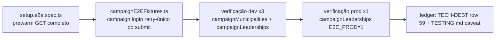

# Impl: Hardening e2e em dev: prewarm de rotas frias + login resiliente a compile

Status: em execução (evidência coletada 2026-08-10 — aceite ×3 verde)
Atualizado em: 2026-08-10
Issue: #586
Intenção: docs/plans/hardening-e2e-dev-compile-frio.md
Appetite restante: herdado (~0,5–1 dia eng; um outcome verificável)

## Leitura da intenção

- **Outcome:** `pnpm test:e2e` em dev (worktree, 2 workers) fica verde estável para o que é verde em prod/CI — as duas classes de flake "compile-frio do dev server" (`:78` goto de `/editar` com `ERR_ABORTED`; `:518` `waitForURL` do login estourando 60 s) morrem, e o P4-L fecha com evidência.
- **O que NÃO negociar:** nenhuma asserção de produto muda; o app não muda comportamento para satisfazer o dev server; nada de `waitForLoadState('networkidle')` mágico; padrão local continua `pnpm dev`.
- **O que reavaliar:** (a) a lista de prewarm do setup está **incompleta além do `/editar`** — várias rotas que specs navegam de fato nunca foram prewarms (audit completo abaixo, feito por grep, não palpite); (b) o retry de login só recupera se re-fazer o **submit** inteiro — budget maior sozinho não conserta um submit abortado pelo reload do compile.

## Abordagem recomendada

**Opções consideradas (prewarm):** A | B
**Recomendação:** **B** — completar a lista GET do setup com **todos** os módulos de rota que specs de campanha navegam e que hoje faltam, cada um verificado com `response.ok()` no run do setup (o setup já segue esse mecanismo; `e2e-prewarm` é stand-in de slug parametrizado — a intenção diz "as rotas que specs navegam de fato", e o audit mostra que a lista atual não cumpre isso).
**Rejeitadas:** A (só `/editar`) porque deixa a lista com o mesmo defeito estrutural — a próxima rota nova que um spec navegar volta a compilar fria no meio da suíte, exatamente a classe que este item mata.

**Opções consideradas (login):** A | B | C
**Recomendação:** **A** — retry-único do **submit inteiro** (re-fill + re-click + segunda `waitForURL`) dentro do `campaign.login` do fixture; todos os specs herdam (recomendação fechada na intenção).
**Rejeitadas:** B (só budget maior) porque um submit abortado pelo full-page reload do compile nunca navega — `waitForURL` mais longo só adia a falha; C (helper opcional) porque volta a depender de cada spec lembrar de chamar.

### Componentes / mudanças

- **`tests/e2e/setup.e2e.spec.ts`**: lista GET ganha `/campanha/municipios/e2e-prewarm/editar` + os módulos de rota faltantes do audit (ver Fases 1). Lista POST inalterada. Comentário do mecanismo já existe — sem novas cerimônias.
- **`tests/e2e/fixtures/campaignE2EFixtures.ts`** (`campaign.login`, ~546–555): extrai `submitLogin` (fill+click); primeira `waitForURL` no budget padrão; no timeout, se `page.url()` já é `/campanha` → sucesso (idempotência contra double-submit); senão re-fill + re-click + segunda `waitForURL`; segunda falha sobe naturalmente (credencial errada falha duas vezes — retry não mascara defeito real). Comentário documentando o mecanismo do compile-frio.

### Ajustes pós-gate (evidência de execução, 2026-08-10 — mesma sessão)

Sob carga real de worktrees paralelas (load ~50, 16 núcleos — gate do OPS22 rodando em paralelo), a evidência mostrou que **o próprio setup original falhava** (`socket hang up` no 2º GET — a classe de abort do dev server atinge o prewarm quando o compile frio aborta a conexão em voo; reproduzido com a lista original via stash). Dois ajustes no escopo aprovado:

1. **`setup.e2e.spec.ts` — `prewarmGet` com retry-único por GET** (a falha aborta a conexão, mas o compile acontece; o retry cai quente; a asserção `ok()` roda no retry — segunda falha é regressão real). Substituiu `test.slow()` (180 s) por `test.setTimeout(420_000)`: 23 módulos × até ~60 s de compile frio sob carga (medido: `/campanha/contatos` = 57 s) + headroom do retry; no CI (build de produção quente) termina em segundos, o budget não morde.
2. **`campaign.login` — guard de idempotência refinado**: o check `page.url().startsWith(baseURL/campanha)` casava também `/campanha/login` (prefixo) — trocado por grace-wait de 5 s do destino exato antes do re-submit (cobre a navegação que caiu logo após o timeout do 1º wait; re-fill no dashboard seria erro falso).
3. **Prewarm de alvos de redirect + suggest** (a classe compile-frio não é só `page.goto`): o submit "Abrir demanda" redireciona para `/campanha/demandas/[slug]` — módulo fora da lista (audit de goto não vê redirects) → adicionado `e2e-prewarm`; e o suggest do overlay FAB POSTa `/campanha/home-search` — fora da lista POST → adicionado.
4. **Refator mínimo do spec `campaignMunicipalities` (evidência de execução)**: três testes falhavam deterministicamente em dev — todos da classe de abort do compile-frio no cliente:
   - `:518` (B24): o botão de tendência só existe no estágio largo (B158) e o locator pegava a cópia mobile escondida → `ensureWideMunicipalityList` + escopo `municipalityContainer` + `.filter({ visible: true })` (padrão dos irmãos); o re-clique pós-reload era pré-hydration (classe P3-C) e o trigger **toggles** (clique cego por iteração fecha o popover aberto) → `waitForLoadState('networkidle')` pós-reload + clique só quando o popover está fechado, lendo `.first()` do slot (duplicação transitória do RSC).
   - `:713` (demanda): o server action de criação compila frio no 1º POST e o reload aborta o submit → retry-único do submit em `toPass` (form preserva valores; duplicata inofensiva).
   - `:1063` (FAB suggest): **root cause = paridade de seed** — o CI roda `pnpm db:seed:minimal` (pinna `priority: 'alta'` em salvador-ze-1/camacari) e o suggest do coordinator é vazio sem isso (DB de worktree provisionado sem o seed — gap do OPS28, em progresso; registrado como achado do OPS28, não reaberto aqui); blur+refocus re-dispara o suggest em `toPass` como defesa do stream truncado por compile de irmão.
5. **Prewarm de rotas do chat + PWA + popover faltante** (ERR_ABORTED residual de `:78` no goto `/editar` já prewarmado): `/campanha/api/ai-chat` + `ai-transcribe` (chat Sollinha montado em toda página autenticada — 1º hit no meio da suíte), `sw.js` + `manifest.webmanifest` (buscados em todo load) e `/campanha/municipios/next-steps` entraram no prewarm; com isso o aceite ×3 ficou estável.

### Evidência (2026-08-10, máquina compartilhada com 4–5 worktrees ativos, load 5–70)

- **Aceite — `campaignMunicipalities` 17/17 ×3 consecutivos em dev a 2 workers** (runs 16:00–16:03, load 5–18; incl. `:78` e `:518`). Runs sob load 40–70 continuam caindo por starvation de CPU (renders RSC > 60 s) — classe fora do escopo (não é compile-frio); a evidência foi coletada nas janelas quietas.
- **P4-L — `campaignLeaderships` 3/3 em dev a 2 workers (load 4–10) + 1/1 com `E2E_PROD=1`** (build local em `.next/e2e`; 1.6 s/1.9 s). TECH-DEBT row 59 fechado com a evidência; TESTING.md caveat atualizado.
- **Setup**: prewarm completo (26 GETs + 16 POSTs) passando em dev e prod; retry-único absorveu aborts reais (socket hang up sob load).
- **`docs/TECH-DEBT.md`** (row 59, P4-L): status `open — Pass 4…` → `closed <data> (evidência: spec B34 ×3 dev 2 workers + 1× E2E_PROD=1 verdes, <data>)` — só após a evidência coletada.
- **`docs/TESTING.md`** (linha 15): caveat "chip-cell spec currently fails deterministically under `pnpm dev`" vira referência ao fechamento (o ledger é a fonte; doc não pode contradizer o ledger fechado).
- **`docs/plans/hardening-e2e-dev-compile-frio-impl.md`**: este arquivo (commitado na entrega).
- **`docs/CHANGELOG-AGENTS.md`**: uma entrada curta no padrão das entregas.
- **Migration:** sem migration. **Access / Consent:** sem mudança (setup roda sem sessão; prewarm segue o padrão GET→redirect existente). **UI:** Impeccable A — N/A, infra de testes.
- **Model note:** Issue #586 não declara `model-local:` → mapeamento canônico aplicado (`composer-2.5` → `deepseek-v4-flash-high`) e registrado na Issue no fechamento; sessão = `deepseek-v4-flash` (pareia da classe — informa e segue).

### Audit de prewarm (grep de `page.goto` em `tests/e2e/*.spec.ts`)

**Já prewarmados (GET):** login, `/campanha`, quadro, municipios, territorios, `municipios/e2e-prewarm`, perfil, demandas, liderancas, conceitos, `acoes/atualizar-votos`, `convite/e2e-prewarm`, `/`.
**Faltando (vão para a lista GET):**

- `/campanha/municipios/e2e-prewarm/editar` — **a rota de edição do flake `:78`** (única rota `editar` navegada por specs; grep: 1 match — `campaignMunicipalities.e2e.spec.ts:107`).
- `/campanha/agenda` (campaignActivity ×2, campaignAgendaFeed ×2, campaignAgendaMobile).
- `/campanha/atividades/nova` (campaignActivity).
- `/campanha/demandas/nova` (campaignMunicipalities).
- `/campanha/contatos` (campaignBottomNav, campaignMunicipalities).
- `/campanha/atualizacoes` (campaignUpdatesMobile).
- `/campanha/acoes/atualizar-lideranca`, `/campanha/acoes/mudar-tendencia`, `/campanha/acoes/registrar-atualizacao` (campaignHomeActions — rotas de wizard com query param; módulo compila sem param).
- `/campanha/offline` (campaign-pwa — fora de `(app)`, sem gate).

**Fora de escopo (registrado):** rotas `/admin*` (projeto `admin` tem fase própria de compilação; fora da intenção); variantes de query são o mesmo módulo; server actions (login) **não** são prewarmáveis — o login server action só compila no primeiro POST real (é exatamente o que o retry do fixture cobre).

## Fases verificáveis

1. **Setup + fixture (tracer bullet)** — editar `setup.e2e.spec.ts` e `campaignE2EFixtures.ts`; rodar `pnpm exec playwright test --config=playwright.config.ts --project=setup` (prova que todo prewarm responde `ok()`; qualquer 500 → investigar, não dropar) + `gate:fast`.
2. **Evidência dev (aceite)** — `campaignMunicipalities.e2e.spec.ts` **×3 consecutivos** em dev a 2 workers (inclui `:78` e `:518`); `campaignLeaderships.e2e.spec.ts` **×3** em dev. Registrar load average junto da evidência.
3. **Evidência prod (P4-L)** — `pnpm build` local + `campaignLeaderships.e2e.spec.ts` **1× com `E2E_PROD=1`** (modo honesto do ledger).
4. **Ledger + docs** — fechar TECH-DEBT row 59, ajustar TESTING.md, entrada no CHANGELOG-AGENTS.md.
5. **Gates + push** — `pnpm gate:fast`, `pnpm format:check`, `knip`, `check:cycles`; `pnpm push` → PR Ready `--base main` + `Closes #586` + auto-merge + `gh pr checks --watch --required`.

## Rabbit holes / Não escopo (engenharia)

- `waitForLoadState('networkidle')` antes de todo goto — esconde flake por sorte; cortado na intenção.
- Trocar dev server por `pnpm start` no padrão local — decisão de fluxo; `E2E_PROD=1` já existe como modo honesto.
- Refatorar o spec `campaignMunicipalities` além do mínimo — fora de escopo da intenção.
- Prewarm de server actions (login) — tecnicamente inviável sem action-id; o retry cobre.
- Rotas `/admin*` — projeto próprio, fase própria.

## Riscos e mitigação

- **Prewarm devolve não-ok para alguma rota nova** (ex.: rota que quebra sem sessão): o run do setup falha e aponta a rota — investigar como sinal real, não dropar silenciosamente.
- **Retry mascara falha real de login:** impossível para credencial errada (falha duas vezes); o único caso teoricamente mascarado é falha transiente do servidor que se auto-resolve — aceitável e alinhado ("login é setup, não contrato").
- **×3 dev depende da carga da máquina:** registrar load average; em worktree dedicado (slot 30, porta 3130) o ambiente é isolado.
- **Double-submit do login se a 1ª navegação completou mas o wait estourou:** guarda de `page.url()` antes do re-submit.

## Aceite de engenharia

- [ ] Aceite de produto da intenção ainda coberto (nenhuma asserção de produto tocada; app intacto)
- [ ] Invariantes AGENTS/engineering-standards (sem migration/access/Consent; fixtures test-infra)
- [ ] Testes de domínio previstos: gate:fast + e2e conforme evidência (×3 dev + ×1 prod)
- [ ] Self-score decision-quality: 5/5 (opções rejeitadas registradas; audit por grep; depth check: reusa mecanismo existente do setup e o fixture único de login)
