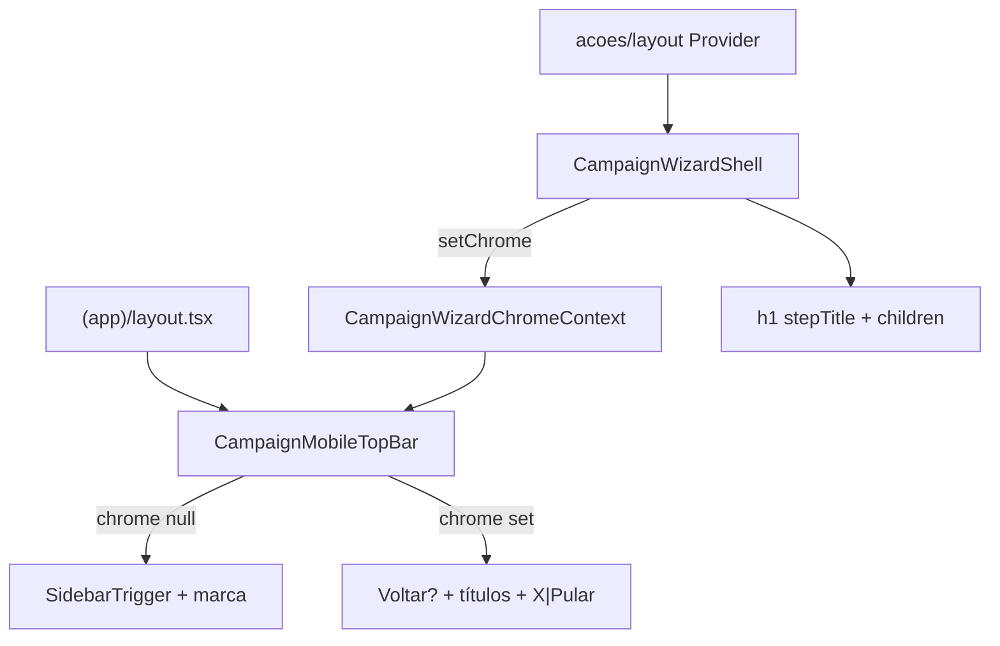

# Header mobile do wizard (chrome no Mandate Red)

Status: entregue (2026-07-30)
Atualizado em: 2026-07-30
Item do roadmap: [docs/roadmap.md](../roadmap.md) (Trilha B — **B75**; chassis UX-1 / emenda a B59)
Impeccable: C — chrome novo no shell `(app)` durante `/campanha/acoes/*`; brief abaixo
Appetite: ~1–1,25d eng; provider + header condicional + shell sem chrome duplicado no mobile; sem migration
Responsável: —

## Design (Impeccable)

Âncoras: `PRODUCT.md` (Clarity under pressure; Feel the action) / `DESIGN.md` (Mandate Red mobile top bar) · tema `data-theme='campaign'`.

Na implementação (`implement-roadmap-item`): shape → craft → critique → polish.

Brief compacto:

- **Persona / contexto:** CG/assessor no celular entre Zaps; entrou numa ação do Início; o header vermelho do app (sidebar + “Jorge Solla”) **compete** com Voltar + título do passo que hoje moram no conteúdo (`CampaignWizardShell`).
- **Job principal:** durante o wizard, o header Mandate Red vira **navegação do fluxo** (sair / voltar / pular encadeado + título da ação + município), sem segundo sticky no scroll.
- **Estratégia de cor:** Restrained — **mesmo** `bg-primary` / `text-primary-foreground` do header mobile atual; ícones/links herdam contraste do header (não inventar barra branca no topo).
- **Edit where you see:** não — chrome de fluxo.
- **Anti-goals:** dois headers sticky (app + shell); sidebar acessível no meio do ritual; X e “Pular” ambíguos; desktop ganhando chrome vermelho; Sheet full-screen no lugar de rota (B59).

## Dados → decisão → apresentação

Dados: N/A — chrome; conteúdo numérico nas etapas B60–B64 / B70.

## Contexto

**B59 ✓** entregou `CampaignWizardShell` com:

- sticky **branco** no topo do conteúdo: Voltar (`md:hidden`) | caption município | `trailingAction`;
- `h1` = pergunta do passo no `<main>`.

O layout `(app)` **sempre** renderiza acima disso o header vermelho mobile (`SidebarTrigger` + “Jorge Solla” / “Campanha · Bahia”) em [`layout.tsx`](<../../src/app/(campaign)/campanha/(app)/layout.tsx>). Em `/campanha/acoes/<slug>` o usuário vê **dois** chrome empilhados — o vermelho é irrelevante ao ritual e come viewport.

Pedido de produto (2026-07-30):

| Estado                                                | Esquerda                           | Centro (título / subtítulo)                                                     | Direita                                  |
| ----------------------------------------------------- | ---------------------------------- | ------------------------------------------------------------------------------- | ---------------------------------------- |
| 1ª etapa do fluxo                                     | —                                  | **fluxo** (ex. “Ajustar votos”); subtítulo município **só depois** de escolhido | **X** (sair do wizard → Início / origem) |
| 2ª+ etapa                                             | **Voltar**                         | fluxo + município (se houver)                                                   | **X**                                    |
| Fluxo **encadeado** (ex. sinal depois de votos no A1) | Voltar (se não for 1ª do subfluxo) | título do **subfluxo** atual                                                    | **“Pular &lt;fluxo&gt;”** no lugar do X  |

A pergunta do passo (“Em qual município?”, grid de tipos…) permanece no **conteúdo** (`h1`), não no header.

Skip de B63/B64/B70 (“Pular registro de sinal…”) **migra** para este slot direito no mobile quando a origem for encadeada; no entry standalone o direito é X.

## Objetivos

- Em viewport **&lt; `md`**, rotas `/campanha/acoes/*`: substituir o header app (sidebar + marca) por **header de wizard** Mandate Red com a tabela acima.
- Em **`md+`**: header slim atual (só `SidebarTrigger`) **inalterado**; shell pode manter caption de município discreta **ou** só no conteúdo — sem Voltar duplicado (browser). Recomendação: no desktop, sem barra vermelha de wizard; `h1` + caption opcional no conteúdo como hoje.
- Remover do `CampaignWizardShell` o sticky branco de Voltar/município/`trailingAction` **no mobile** (evita chrome duplo); no desktop, `trailingAction` de skip pode ficar no conteúdo até o wiring A1 — ou sumir se só mobile importa (recomendação: skip só no header mobile; desktop = link textual no conteúdo se B63+ precisar).
- Provider/contrato tipado para o shell **publicar** chrome (`flowTitle`, `municipalityLabel?`, `stepKind: 'entry' | 'continue'`, `previousHref?`, `dismissHref`, `skip?: { label, href }`).
- a11y: X com nome “Fechar” / “Sair da ação”; Voltar com verbo visível; “Pular …” contém o nome do fluxo; foco no `h1` do passo preservado (B59).
- Guardrails: sem migration / Consent / action de escrita; print:hidden; staff gate de `acoes/layout` intacto.

## Decisões travadas

- **Arquitetura: chrome condicional no layout `(app)` + context publicado pelo shell (não um segundo header solto, não portal ad-hoc).** Extrair o header mobile atual para um componente client (`CampaignMobileTopBar`) que, se houver chrome de wizard ativo, renderiza o modo wizard; senão o modo app. `CampaignWizardChromeProvider` envolve só `acoes/layout.tsx` (ou o `(app)` inteiro com default `null`). O shell **registra** o chrome via `useCampaignWizardChromeSet` / efeito; cleanup no unmount. **Rejeitado:** A) layout route group paralelo `(wizard)` fora de `(app)` (duplica auth/sidebar/Toaster/PWA; caro de manter); B) portal `createPortal` no `document` sem contrato (frágil com RSC/scroll); C) só CSS `hidden` no header app sem substituir (some a affordance de sair); D) Sheet full-screen (B59 já rejeitou).
- **Título do header = nome da ação/fluxo (catálogo B45), não a pergunta do passo.** Fonte: produto 2026-07-30. **Rejeitado:** repetir `stepTitle` no header (some hierarquia; B59 já separou pergunta × contexto).
- **Subtítulo = município só após escolha (B60).** Ausente na 1ª etapa de busca. **Rejeitado:** slug cru; “Município” genérico.
- **1ª etapa: só X à direita (sem Voltar).** X → `dismissHref` (default Início). **Rejeitado:** Voltar na 1ª (= mesmo que X, confunde); hamburger + X.
- **2ª+: Voltar à esquerda + X à direita.** Voltar = `previousHref` (passo anterior). **Rejeitado:** só gesture edge; esconder X após a 1ª (usuário precisa abortar no meio).
- **Encadeado: X vira “Pular &lt;fluxo&gt;”.** Quando `skip` está definido, o slot direito é o skip (não X+Pular). Fonte: produto 2026-07-30 + planos B63/B64/B70. **Rejeitado:** X e Pular juntos (dois escapes); Pular no conteúdo e X no header (split mental).
- **Sidebar inacessível durante o wizard mobile** (trigger some com o chrome app). Sair = X ou concluir. **Rejeitado:** manter SidebarTrigger no canto (reabre domínio-primeiro no meio do ritual — alinhado a B73).
- **i18n:** ids `CampaignWizardChrome`, `flowTitle`, `dismissHref`, `skipLabel`; copy pt-BR (“Pular registro de sinal”, nomes do catálogo).

## Questões em aberto

- **Desktop: caption município no conteúdo ou só no header inexistente?** **Opções:** A caption muted acima do `h1` no `md+` | B só contexto na URL/query. **Recomendação:** **A** — paridade com B59 desktop; header vermelho wizard é mobile-only. _(assumido)_
- **`stepKind` derivado de `previousHref` vs prop explícito?** **Opções:** A prop `isEntryStep` | B `previousHref == null` ⇒ entry. **Recomendação:** **A** — Voltar e dismiss não são o mesmo href na 1ª (dismiss=Início; não há previous); entry ≠ “sem previous”. _(assumido)_

## Abordagem proposta

Componentes:

- **`CampaignWizardChromeContext`** (`src/components/campaign/shell/` ou `shared/`): tipo `CampaignWizardChromeState | null`; provider; `useSetCampaignWizardChrome(state)` com sync em `useEffect` + clear on unmount (evitar chrome órfão na navegação Início←ações).
- **`CampaignMobileTopBar`**: client; lê context; modo app vs wizard; tokens `bg-primary` / foreground; `min-h-14`; safe-area top; `print:hidden`; `md:hidden` no modo app **e** no modo wizard (desktop inalterado).
- **`(app)/layout.tsx`**: trocar o `<header className="… bg-primary … md:hidden">` inline por `<CampaignMobileTopBar />` (provider precisa ancestrar o top bar — **subir** o provider para `(app)/layout` com default `null`, ou nestar top bar dentro de um client shell que também envolve `children`). Preferência: **client island `CampaignAppChrome`** wrapping header+children slot pattern só o necessário; evitar marcar o layout RSC inteiro como client.
  - Padrão prático: `SidebarInset` recebe `<CampaignWizardChromeProvider>` no `(app)/layout` (provider leve) + `CampaignMobileTopBar` + `{children}` — provider no layout RSC via componente client que só passa children.
- **`acoes/layout.tsx`**: sem mudança de gate; opcional `data-wizard-route` se útil a testes.
- **`CampaignWizardShell`**: props novas `flowTitle`, `isEntryStep`, `dismissHref`, `skip?: { label, href }`; no mobile **não** renderiza sticky branco; chama setChrome; `h1` + children permanecem; `md+` pode mostrar caption município se `municipalityLabel`.
- **Copy de fluxo:** reusar labels de `campaignHomeActions.ts` (ex. “Ajustar votos”) via mapa `slug → flowTitle` em `campaignWizardCopy.ts` ou `campaignActionRoutes.ts` — uma fonte, não string solta por página.
- **Testes:** unit do top bar (entry / continue / skip); atualizar `campaignWizardShell.unit.spec.tsx` (back some do shell no mobile — testar via context ou `data-slot` no top bar); e2e smoke: abrir ação → header sem sidebar → X volta Início; 2ª etapa → Voltar.
- **Migration:** Sem migration, sem collection, sem server action.

## Dependências

- Dura: **B59 ✓** (shell + rotas `/campanha/acoes`). Soft: **B60 ✓** (município no subtítulo); **B45 ✓** (labels de fluxo); planos B63/B64/B70 (passam a alimentar `skip` no header em vez de `trailingAction` no sticky branco). Soft **B73** (remove bottom nav — não bloqueia).
- Desbloqueia polish mobile dos wizards B61/B63/B64/B70 (sem este item, cada um herda chrome quebrado).

## Não escopo

- Orquestração completa A1 “Quer também…?” (wiring de cadeia) — este item só **hospeda** o chrome quando a cadeia existir; a máquina de passos continua nos planos A1/B63+.
- Remoção da bottom nav → **B73**. Gap da strip → **B74**.
- Redesign do header desktop slim.
- Persistência de rascunho (Adiado B59).

## Rabbit holes

- **Route group `(wizard)` fora de `(app)`.** Explode auth/PWA/sidebar. **Mitigação:** context no inset.
- **State machine global de wizard.** **Mitigação:** chrome burro; hrefs por etapa.
- **Animar troca app↔wizard header.** **Mitigação:** swap imediato; motion só se critique pedir e com `prefers-reduced-motion`.

## Adiado com gatilho

- **Skip no desktop no mesmo visual do header.** Revisitar se B63+ shippar e a mesa reclamar que “Pular” sumiu no notebook (hoje browser + conteúdo bastam).
- **Deep-link “voltar ao Zap” com dismiss ≠ Início.** Revisitar se entry points fora do Início (E11 → wizard) pedirem `dismissHref` dinâmico — o prop já existe; falta produto.

## Referências

- `src/app/(campaign)/campanha/(app)/layout.tsx` — header vermelho mobile
- `src/components/campaign/shared/CampaignWizardShell.tsx` — sticky atual a retirar no mobile
- `src/app/(campaign)/campanha/(app)/acoes/layout.tsx` — gate staff
- `src/lib/campaignHomeActions.ts` — labels de fluxo
- `src/lib/campaignWizardCopy.ts` / `campaignActionRoutes.ts`
- [chassis-wizard-campanha.md](chassis-wizard-campanha.md) (B59 ✓) — emenda chrome mobile
- [wizard-registro-sinal.md](wizard-registro-sinal.md) / [wizard-mudar-tendencia.md](wizard-mudar-tendencia.md) / [wizard-atualizar-lideranca.md](wizard-atualizar-lideranca.md) — skip encadeado
- [fluxos-acao-primeiro-inicio.md](fluxos-acao-primeiro-inicio.md)
- `PRODUCT.md` / `DESIGN.md` — Mandate Red / Field Desk
- AGENTS.md — naming; sem Consent novo

## As-built (2026-07-30)

- `CampaignWizardChromeProvider` envolve o inset em `(app)/layout.tsx`; `CampaignMobileTopBar` troca modo app (sidebar+marca) ↔ modo wizard quando o shell publica chrome.
- `CampaignWizardShell` chama `useSetCampaignWizardChrome` (cleanup no unmount); mobile sem `<header>` sticky branco; desktop mantém caption de município no `<main>` (`md:block`).
- `wizardFlowTitleForSlug` deriva o título do catálogo B45 via `campaignWizardActionIdForSlug` + `wizardFlowTitleForActionId`.
- Skip encadeado (B63/B64/B70) usa prop `skip` no shell — slot direito do header no mobile; desktop adiado (débito no plano).
- Testes: unit `campaignMobileTopBar`, `campaignWizardShell`; e2e smoke `campaignWizardChrome.e2e.spec.ts`; prewarm `/campanha/acoes/atualizar-votos` no `setup.e2e`.

Qualidade de decisão: 4/5
