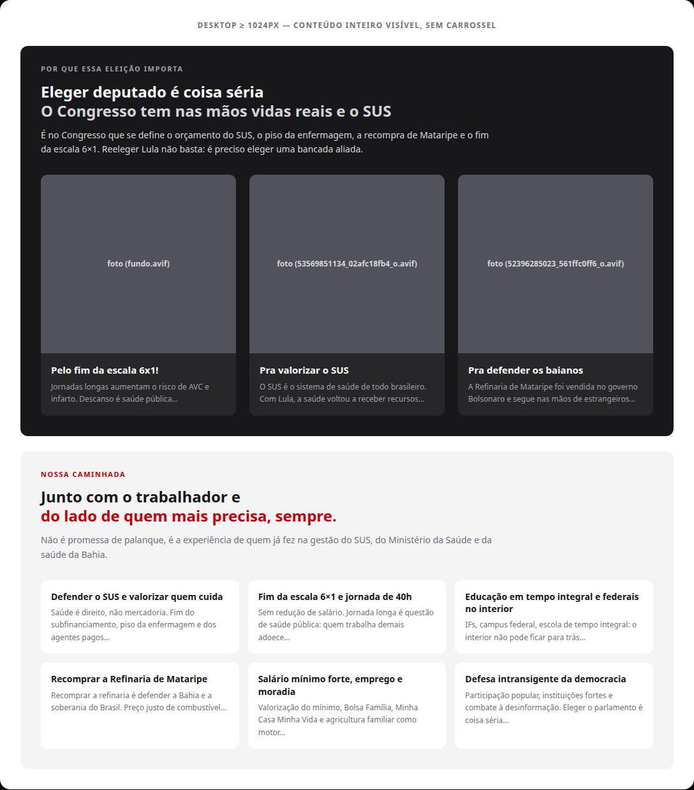
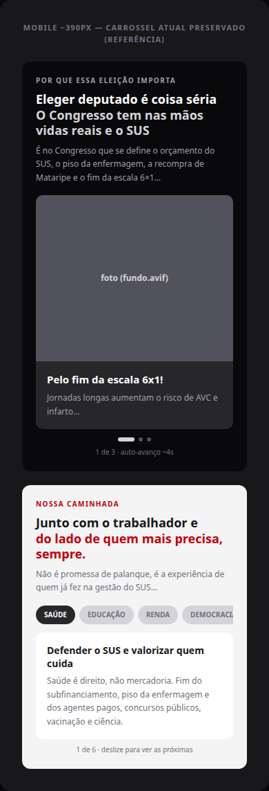

# Home de campanha sem carrossel no desktop — "Por que essa eleição importa" + "Nossa caminhada" (S6)

Status: registrado
Atualizado em: 2026-08-18
Issue: #34
Priority: P2
Model: composer-2.5
Impeccable: B — mudança de layout em duas seções visíveis da home pública de campanha
Rascunho UI: docs/plans/home-campanha-sem-carrossel-desktop-ui-draft.html + PNGs embutidos abaixo
Appetite: ~0,5–1 dia eng; só layout responsivo, sem dados novos
Responsável: —

## Intenção

As duas seções centrais de mensagem da home pública (jorgesolla1313.com.br) rodam carrossel em **todas** as larguras, com auto-avanço (~4s). No desktop o conteúdo inteiro cabe na página — não há motivo para o carrossel ativo: ele esconde cards, impõe ritmo de leitura e move a tela sozinho. Quem visita em desktop (imprensa, parceiros, eleitor no computador) deve ver toda a mensagem de uma vez: os 3 cards de "Por que essa eleição importa" lado a lado e os 6 cards de "Nossa caminhada" em grade 3 colunas × 2 linhas. O mobile (maioria do tráfego, onde o carrossel faz sentido) fica exatamente como está.

## Persona e fluxo

- **Persona / contexto:** visitante em desktop (imprensa, parceiros, eleitor no computador) rolando a home de campanha; lê com calma e não tem o gesto de swipe do mobile.
- **Job principal:** entender os argumentos da campanha sem esperar o auto-avanço nem perder cards ocultos.
- **Fluxo desejado:** rola a home → seção "Por que essa eleição importa" mostra os 3 cards inteiros → continua → seção "Nossa caminhada" mostra as 6 bandeiras em grade → lê tudo no seu ritmo.
- **Anti-goals de produto:** o mobile NÃO muda (carrossel segue); a seção "Acompanhe de perto" (S1, já em bento no desktop) NÃO é tocada; nada de redesenho de cards/copy/imagens.

### Rascunho UI (B)

Fonte iterável: [`home-campanha-sem-carrossel-desktop-ui-draft.html`](home-campanha-sem-carrossel-desktop-ui-draft.html).

## Objetivo e aceite

- Desktop (≥1024px): "Por que essa eleição importa" mostra os **3 cards lado a lado**, todos visíveis, sem auto-avanço, sem rolagem oculta e sem indicadores de carrossel.
- Desktop (≥1024px): "Nossa caminhada" mostra os **6 cards em grade 3 colunas × 2 linhas**, sem auto-avanço; os chips de navegação não aparecem no desktop (ver questões em aberto).
- Mobile (<1024px): comportamento atual 100% preservado (carrossel 1 card por tela, auto-avanço ~4s com pausa em hover/foco/toque, chips sincronizados, swipe).
- Mesma copy, mesmas imagens, mesma ordem de cards; nenhuma mudança de conteúdo.
- As seções continuam sem sobreposição e com respiro (alturas recalibradas para o conteúdo inteiro visível).
- Acessibilidade: no desktop, nada de foco em elemento inativo de carrossel; a leitura não é interrompida por movimento.
- Zero mudança de schema/migration/Consent; zero dados novos.

## Dados (intenção)

- **Vou apresentar dados?** Não — só layout de conteúdo já existente (cards estáticos).
- **Decisões desbloqueadas:** nenhuma nova (a pessoa lê os cards no próprio ritmo).
- **Forma:** _adiada ao plano de implementação_ — restrição de produto: sem contadores, sem elementos novos.

## Direção no codebase (hipótese)

- **Áreas prováveis:** `src/app/(frontend)/(home)/page.tsx` (seções `problem` e `flags`, itens `problemItems`/`flagItems`); `src/components/CampaignCarousel.tsx` (componente compartilhado das duas seções — como o desktop deixa de ser carrossel fica a critério de quem executa: variante estática em `lg` ou estado desativado no desktop); bloco `[data-theme='campaign-site']` de `src/app/(frontend)/styles.css` (alturas fixas das seções, posicionamento absoluto de eyebrow/título/copy/carrossel, insets e gaps do track).
- **Precedente a olhar:** `docs/plans/secao-conteudos-home-artigos.md`/`-impl.md` (S1 — a seção "Acompanhe de perto" já resolveu bento no desktop + carrossel no mobile, com `CampaignContentCarousel`, módulo separado); e2e `tests/e2e/frontend.e2e.spec.ts` (o teste de auto-avanço/controles hoje roda em viewport desktop — precisa virar asserção de grade estática no desktop e/ou migrar o teste de carrossel para viewport mobile); unit `tests/unit/campaignCarousel.unit.spec.tsx` (comportamento mobile do componente permanece).
- **Risco de acoplamento:** as duas seções usam altura fixa com elementos posicionados em absoluto (eyebrow/título/copy/carrossel em `top:` com `clamp`) — a troca para grade exige recalibrar as alturas para o conteúdo inteiro visível; a seção S1 usa `CampaignContentCarousel` (módulo próprio) e não é afetada.

## Dependências

- Nenhuma.
- Soft: `docs/plans/secao-conteudos-home-artigos.md` (S1) — referência de como a home já resolveu "bento no desktop + carrossel no mobile".

## Fora de escopo

- Mudar o comportamento mobile (carrossel preservado).
- Redesenhar cards, copy, imagens, cores ou espaçamento interno das seções — só a disposição (grade) e os elementos de carrossel.
- Remover o carrossel da seção "Acompanhe de perto" (S1 já é bento no desktop).
- Layout dedicado novo para tablets (segue carrossel abaixo de 1024px, como hoje).
- Qualquer outra seção da home ou do site.

## Rabbit holes de produto

- **Redesenho dos cards de bandeira no desktop.** Se alguém "só completar": entra foto/ícone/cor por bandeira, reescreve copy, e o item vira redesign de seção. **Corte neste item:** mantém o card atual (título + corpo) só mudando a disposição para grade 3×2.
- **Ajustes de respiro em outras seções.** Se alguém "só completar": recalibra hero, prova social e S1 junto. **Corte:** só as alturas das duas seções afetadas, o mínimo para a grade caber.
- **"Melhorar" o carrossel no meio do caminho.** Se alguém "só completar": troca o comportamento mobile junto. **Corte:** mobile é intocável neste item.

## Questões em aberto (produto)

- **Chips de "Nossa caminhada" no desktop?** **Opções:** A) somem no desktop (a grade estática é a navegação; chip é chrome de carrossel) | B) ficam como rótulos estáticos não-clicáveis acima da grade | C) viram âncoras para a própria seção. **Recomendação:** A — na grade, chips não têm função e pareceriam clicáveis sem efeito. _(assumido — A, validar no gate)_
- **Proporção dos cards de bandeira no desktop?** **Opções:** A) grade 3×2 com cards preenchendo a coluna (~374px de largura, altura definida pelo conteúdo com respiro — rascunho acima) | B) manter o card horizontal baixo atual (~327×100) forçando 3 colunas estreitas. **Recomendação:** A — o card baixo existe porque o carrossel empilha; na grade, título + corpo respiram melhor. _(assumido — A, validar no gate)_
- **Breakpoint da grade?** **Opções:** A) `lg` (1024px, o mesmo do carrossel atual) | B) outro valor. **Recomendação:** A — manter o breakpoint que já governa as larguras dos cards. _(assumido — A)_
- **Nome da seção dos 6 cards.** O pedido chama de "Nossa campanha"; no site a seção se chama **"Nossa caminhada"** (eyebrow, mesma que usa o carrossel de 6 cards). Confirmar que é esta — assumido que sim, dada a grade 3×2.

## Referências

- GitHub Issue #34
- Rascunho UI (gate): `docs/plans/home-campanha-sem-carrossel-desktop-ui-draft.html` + PNGs acima
- `src/app/(frontend)/(home)/page.tsx` — seções `problem` (3 cards) e `flags` (6 cards)
- `src/components/CampaignCarousel.tsx` — componente carrossel das duas seções (variants `problem`/`flags`)
- `src/app/(frontend)/styles.css` — alturas/posicionamento das seções, insets/gaps do track
- `tests/e2e/frontend.e2e.spec.ts` — testes de auto-avanço/controles (hoje em viewport desktop)
- `docs/plans/secao-conteudos-home-artigos.md` (S1) — precedente bento desktop + carrossel mobile
