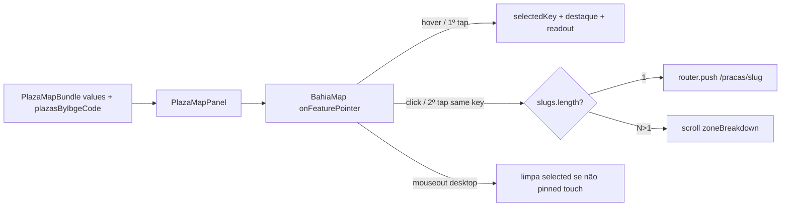

# Hover no Mapa das Praças (destaque + total de votos + navegação)

Status: entregue 2026-07-21 (branch; deploy pendente com remodelagem)
Atualizado em: 2026-07-21 (navegação: desktop click / mobile 2º tap; B6 ✓ setStyle incremental)
Item do roadmap: [docs/roadmap.md](../roadmap.md) (Trilha B, item B10 — entregue 2026-07-21)
Impeccable: B — encaixe em `PlazaMapPanel` / `BahiaMap` (sem rota nova)
Appetite: ~0,5–1 dia eng; handlers Leaflet + faixa + mapa ibge→slug + teste/checklist
Responsável: —

_Revisão 2026-07-21 (pós-implementação + `/simplify`): `BahiaMap` com `onFeatureSelect` / `onFeatureActivate`; `MapFeatureReadout`; `plazasByIbgeCode` + `resolvePlazaMapNavigation`; SSA/CMS N>1 → scroll `#plaza-zone-breakdown`. Cleanup: dedup hover, merge effects, `emphasizeFeature`. Débito hot path O(n) `eachLayer` → **B6 ✓** ([escala-dry-pos-b3.md](escala-dry-pos-b3.md))._

## Design (Impeccable)

Âncoras: `PRODUCT.md` / `DESIGN.md` (register product — Field Desk) · tema `data-theme='campaign'` · shells existentes (`PlazaMapPanel`, `BahiaMap`, `ChoroplethLegend`).

Na implementação (`implement-roadmap-item`): craft compacto → critique → polish (superfície já existe; interação nova, sem shape longo).

Brief compacto:

- **Persona / contexto:** Assessor/Coordenador Geral (Alex) inspeciona o coroplético, lê o número sob o cursor e, quando quiser, **abre a Praça** sem voltar à lista.
- **Job principal:** destacar o polígono ativo, mostrar nome + total da métrica corrente, e navegar para `/campanha/pracas/[slug]` com o gesto certo (click desktop / 2º tap mobile).
- **Estratégia de cor:** Restrained — borda/weight de destaque com primário `#C51414`; fill do coroplético inalterado.
- **Anti-goals:** não navegar no hover; não tooltip SaaS ornamentado; não segunda legenda; não redesenhar o painel; não exigir `matchMedia` separado se o modelo selected+click unificar desktop/mobile.

## Contexto

O **Mapa das Praças** (`PlazaMapPanel` em `/campanha/pracas`) já pinta municípios pelo valor do ano selecionado (TSE 2014/2018/2022 ou estimativas 2026) e no modo comparar pelo diff Solla − outro. O renderer `BahiaMap` monta `L.geoJSON` com estilo estático e `highlightKeys` **só** para zoom/destaque programático — **não** há `mouseover` / readout / click→Praça.

Pedido de produto (2026-07-21): hover destaca + mostra votos; **click navega**. Em mobile (sem hover): **primeiro toque seleciona** (mesmo readout); **segundo toque na já selecionada** navega.

Não cobre: filtro URL (**B7**), polígonos por zona (**B8**). ~~`setStyle` incremental ao trocar ano~~ → **B6 ✓**.

## Objetivos

- Hover (desktop) sobre um município: borda/weight mais forte + readout com **nome** + **valor formatado** da métrica corrente; **não** navega.
- Click (desktop) no polígono sob o hover: `router.push` / `Link` para a Praça correspondente.
- Touch: 1º tap = seleciona (destaque + readout); 2º tap na **mesma** seleção = navega; tap noutro polígono = troca a seleção.
- O valor exibido é o mesmo de `values` já passado ao mapa — sem fetch por hover/click.
- Guardrails: sem migration, sem collection, sem Consent, sem server action; `leader` continua sem mapa; pan/zoom do Leaflet não devem competir com o 2º tap (ver abordagem).

## Decisões travadas

- **Item próprio B10 (não absorver em B6, B7 nem R6).** Interação de inspeção+atalho ≠ filtro URL, ≠ perf `setStyle`, ≠ polish genérico. (2026-07-21.) **Rejeitado:** fill-in sem plano; fase de B7.
- **Modelo unificado selected + click (não forks `pointer: coarse` obrigatórios).** Estado `selectedKey`: hover (desktop) e 1º tap (mobile) **selecionam**; click/tap com `key === selectedKey` **navega**; hover não navega. Em desktop o hover já deixa `selectedKey` igual ao polígono, então o 1º click navega. Em mobile o 1º tap só seleciona. (Produto, 2026-07-21.) **Rejeitado:** só highlight sem navegação; navegação no hover; `matchMedia` mobile/desktop com dois comportamentos divergentes sem o mesmo selected.
- **Cliente-only; bundle traz `plazasByIbgeCode`.** Nome no readout pode vir do GeoJSON; navegação precisa de `slug`(s) por `codarea` — incluir no `PlazaMapBundle` um mapa `ibgeCode → { slug, name }[]` (já filtrado pelo escopo de access / futuro B7). **Rejeitado:** Server Action por click; adivinhar slug a partir do nome do município no client.
- **Faixa de leitura sob o mapa + destaque Leaflet.** Touch-friendly e `aria-live="polite"`. Tooltip Leaflet opcional só no polish. **Rejeitado:** só tooltip hover-only; painel inspect lateral.
- **Mesma métrica do seletor Ano / Comparar.** **Rejeitado:** segundo número no hover v1.
- **Salvador / Camaçari (N>1 Praças no mesmo `ibgeCode`):** seleção mostra agregado municipal + readout; **navegação no 2º gesto não escolhe zona às cegas** — faz scroll/focus na lista `zoneBreakdown` (ou na faixa, com hint “ver Praças por zona abaixo”). Se o escopo do usuário tiver **exatamente 1** Praça-zona naquele município, aí sim navega para o único slug. (2026-07-21.) **Rejeitado:** sempre ir à ZE 1 / primeira do catálogo; inventar hit-test por zona (= B8).
- **i18n e naming** (AGENTS.md): `onFeatureSelect`, `selectedFeature`, `plazasByIbgeCode`, `MapFeatureReadout`; strings em pt-BR.

## Questões em aberto

- **Polígono sem valor (0 / ausente no `values`)?** **Opções:** A) ainda seleciona e mostra “0” / “Sem dados”; navegação só se houver slug(s) no mapa | B) ignora interação. **Recomendação:** A — “Sem dados” se chave ausente; “0” se presente e zero; click-nav segue a regra de slugs (município sem Praça no escopo → sem navegação, só readout).
- **Faixa clicável como atalho de navegação?** **Opções:** A) só o polígono | B) faixa também é link/`button` para o mesmo destino. **Recomendação:** B quando há exatamente 1 slug (a11y / alvo 44px); com N>1 a faixa não navega (só o scroll hint). _(assumido — validar no craft)_

## Abordagem proposta

Componentes:

- **`loadPlazaMapBundle` / `PlazaMapBundle`** (`src/utilities/plazaMapData.ts`): acrescentar `plazasByIbgeCode: Record<string, { slug: string; name: string }[]>` a partir das Praças já carregadas (município = 1 entrada; SSA/CMS = N zonas no escopo). Sem query extra.
- **`BahiaMap`** (`src/components/campaign/BahiaMap.tsx`): `onEachFeature` com `mouseover` / `mouseout` / `click`. Hover → callback `onFeatureSelect(info)`; mouseout → `onFeatureSelect(null)` (só se o ponteiro for fino / não após tap recente — ref `pointerType` ou “touch pin” até tap fora). Click → callback `onFeatureActivate(key)` (o painel decide select vs navigate). Destaque via `setStyle` + `bringToFront`; mouseout restaura estilo do coroplético. Depth check: sem wrapper novo.
- **`PlazaMapPanel`**: estado `selected`; readout; em `onFeatureActivate`: se `key !== selected` → select; se igual → `navigateForIbge(key)` (1 slug → `router.push`; N>1 → `scrollIntoView` na seção zonas). Opcional: link na faixa quando `slugs.length === 1`.
- **Alinhamento com B6:** mesma função de estilo no reset pós-hover. Não bloqueia B10.
- **Teste:** unit do resolver `navigateForIbge` (0 / 1 / N slugs); checklist manual desktop (hover→readout, click→ficha) e mobile (tap1 select, tap2 navigate, tap outro troca).
- **Migration:** Sem migration, sem collection, sem server action.

## Dependências

- **Dura:** R2 (mapa Praças) — entregue.
- **Suave:** A9 (métrica 2026); ~~B6 (`setStyle`)~~ entregue; B7 (filtro → `plazasByIbgeCode` só do conjunto filtrado); B8 (aí o 2º tap em SSA/CMS pode passar a ir à Praça-zona).
- Reusa: `PlazaMapPanel`, `BahiaMap`, `plazaMapData`, formatters existentes.

## Não escopo

- Filtrar mapa pela URL da lista → **B7** ([mapa-pracas-filtrado.md](mapa-pracas-filtrado.md)).
- ~~Rebuild/perf do layer ao trocar ano~~ → **B6 ✓** ([escala-dry-pos-b3.md](escala-dry-pos-b3.md)).
- Polígonos / hover por Praça-zona SSA/CMS → **B8** ([poligonos-pracas-zona.md](poligonos-pracas-zona.md)).
- Redesenho do painel / mover filtros → **R6**.

## Rabbit holes

- **`react-leaflet` / Popup Radix.** **Mitigação:** Leaflet nativo + faixa HTML.
- **Hit-test de zonas sem polígono.** **Mitigação:** agregado + scroll para `zoneBreakdown` até B8.
- **Detectores `isMobile` frágeis.** **Mitigação:** modelo selected+activate; no máximo `pointerType` no evento para não limpar seleção no “mouseout” sintético pós-tap.
- **Conflito pan vs 2º tap.** **Mitigação:** só navegar em `click` Leaflet do path (não em `moveend`); se pan arrastar, Leaflet não dispara click no feature.

## Adiado com gatilho

- **2º tap em SSA/CMS → Praça-zona específica.** Revisitar quando **B8** entregar polígonos (hit-test real) ou produto pedir picker de zona no readout.
- **Tooltip Leaflet além da faixa.** Revisitar no polish se critique pedir reforço desktop.

## Referências

- `docs/roadmap.md` (Trilha B, item B10 — entregue)
- `src/components/campaign/BahiaMap.tsx` — `onFeatureSelect` / `onFeatureActivate` / highlight
- `src/components/campaign/PlazaMapPanel.tsx` — selected + readout + nav
- `src/utilities/plazaMapData.ts` / `plazaMapNavigation.ts` — `plazasByIbgeCode`
- `docs/plans/mapa-pracas-filtrado.md` — B7
- `docs/plans/escala-dry-pos-b3.md` — B6
- `docs/plans/poligonos-pracas-zona.md` — B8
- AGENTS.md — naming, mapa dinâmico `/campanha`, access assessor
- `PRODUCT.md` / `DESIGN.md` — Field Desk
