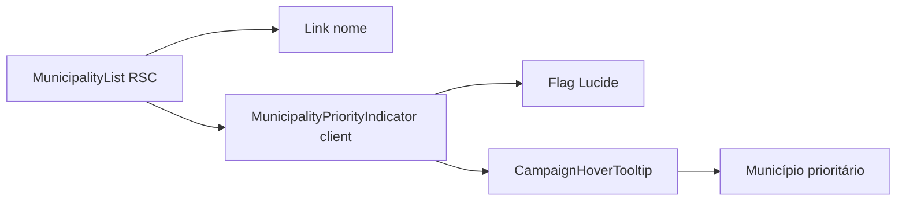

# Ícone de prioridade na lista de Municípios

Status: entregue
Atualizado em: 2026-07-28
Item do roadmap: [docs/roadmap.md](../roadmap.md) (Fill-ins)
Impeccable: B — encaixe em `MunicipalityList` (`/campanha/municipios`); sem rota nova
Appetite: ~0,25 dia eng; troca Badge→ícone+tooltip na coluna do nome; sem migration
Responsável: —

Revisão 2026-07-28: paths Pass 2 W2 (`municipality/MunicipalityList.tsx`, `municipalityLabels.ts`); primitivo de tooltip = `CampaignHoverTooltip` (B23 ✓), não Tooltip cru isolado; touch via tap no primitivo; card mobile exige `relative` no trigger (B42 link esticado).

## Design (Impeccable)

Âncoras: `PRODUCT.md` (princípio 2 — clareza sob pressão) / `DESIGN.md` (register `product`; Field Desk) · tema `data-theme='campaign'` · shell `MunicipalityList` + `CampaignHoverTooltip` (`src/components/campaign/shared/CampaignHoverTooltip.tsx`).

Na implementação (`implement-roadmap-item`): craft compacto → critique → polish (só affordance de prioridade na lista; sem redesign da tabela).

Brief compacto:

- **Persona / contexto:** Assessor / CG varre a lista densa de municípios; o chip “Prioritária” compete com o nome e ocupa largura na coluna.
- **Job principal:** reconhecer de relance quais linhas são prioritárias, sem ler um badge de texto; confirmar o significado no hover.
- **Estratégia de cor:** Restrained — ícone com tom de ênfase do tema (`text-primary` ou equivalente ao `Badge destructive` atual), sem segundo sistema de chips.
- **Edit where you see:** não — prioridade continua mutável só no form/estratégia (`MunicipalityStrategyForm` / card); lista só sinaliza.
- **Anti-goals:** segundo badge colorido; tooltip em toda a célula do nome; Popover “?” (`CampaignInfoHint`) para um flag binário; redesign do card de estratégia neste item.

## Dados → decisão → apresentação

Dados: N/A — este item **não** muda métricas, agregação nem o significado de `priority`; só a affordance visual do flag já exibido (`alta` → chip). Filtro `?priority=alta` e labels em forms/overview permanecem.

## Contexto

Em `/campanha/municipios` (staff), `MunicipalityList` (`src/components/campaign/municipality/MunicipalityList.tsx`) mostrava, ao lado do nome na coluna da tabela desktop **e** no card mobile, um `Badge variant="destructive"` com o texto de `municipalityPriorityLabels.alta` (“Prioritária”) quando `municipality.priority === 'alta'`. A lista é Server Component; o sinal é só leitura.

Pedido de produto (2026-07-24): na coluna do município da tabela, trocar o chip por um **ícone** que indique prioridade + **tooltip** com o texto **“Município prioritário”** (ortografia correta; tipografia do pedido tinha “Muncípio”).

`CampaignHoverTooltip` (B23) cobre hover, foco e toque; `CampaignInfoHint` permanece padrão errado para flag binário.

## Objetivos

- Staff em `/campanha/municipios`: quando `priority === 'alta'`, na coluna do nome (tabela desktop) **e** no header do card mobile do mesmo componente, renderizar ícone + tooltip “Município prioritário” em vez do `Badge` “Prioritária”.
- Acessibilidade: `aria-label` (ou equivalente) no trigger com o mesmo texto do tooltip — hover não é a única via.
- Guardrails: sem migration, sem collection, sem Consent, sem server action; semântica `priority` / filtro / forms intactos; `leader` não vê o sinal (já gated por `isStaffView`).

## Decisões travadas

- **Fill-in com plano próprio (não ID B novo; não absorver só em R6).** Polish cosmético, ~¼ dia, paralelizável, cortável. (2026-07-24, classificação roadmap-item.) **Rejeitado:** B16 de trilha (infla grafo); só R6 (atrasa quick win no critique largo); fase informal sem plano (precedente fill-in: Cenário junto aos filtros).
- **Ícone Lucide `Flag` (ou `FlagIcon`) ao lado do link do nome.** Sinal de prioridade sem competir com “favorito” / alerta de cobertura. **Rejeitado:** `Star` (lê como favorito); `CircleAlert` (já usado na coluna Cobertura); manter Badge de texto (pedido explícito); `title=` nativo sem Tooltip (UX inconsistente com shadcn).
- **Client island mínima** (`MunicipalityPriorityIndicator.tsx` `'use client'`) usada nos 2 loci de `MunicipalityList` (tabela + card). Lista permanece Server Component. **Rejeitado:** `'use client'` em todo `MunicipalityList`; `title` só no SSR; abstrair shared `PriorityChip` genérico (&lt;3 call sites fora desta lista).
- **Copy fixa: “Município prioritário”.** Não reusar o label curto “Prioritária” do Badge/filtro. **Rejeitado:** “Prioritária” no tooltip (pedido de produto); tipografia “Muncípio”.
- **Escopo = só lista (`MunicipalityList`).** Card de estratégia no detalhe (`MunicipalityStrategyCard`) mantém Badge por enquanto. **Rejeitado:** unificar todas as superfícies de `priority` neste item (estoura appetite e mistura leitura de lista com card de estratégia).
- **i18n e naming** (AGENTS.md): identificador inglês (`MunicipalityPriorityIndicator`); string visível pt-BR “Município prioritário”.
- **Tooltip via `CampaignHoverTooltip`** (2026-07-28). **Rejeitado:** Tooltip shadcn cru com provider local (B23 já padronizou touch + dismiss).

## Questões em aberto

- **Cor do ícone:** **Fechado** — `text-primary` (recomendação A).
- **Touch / mobile:** **Fechado** — `CampaignHoverTooltip` com tap; `aria-label` no trigger; no card, `relative` + alvo 44px para ficar acima do link esticado (B42).

## Abordagem proposta

Componentes:

- **`MunicipalityPriorityIndicator`** (`src/components/campaign/municipality/MunicipalityPriorityIndicator.tsx`, `'use client'`): `FlagIcon`, `aria-label="Município prioritário"`, `CampaignHoverTooltip` com o mesmo texto. Props: `className` opcional (card passa `relative size-11`).
- **`MunicipalityList`**: nos dois ramos `priority === 'alta' && isStaffView`, `<MunicipalityPriorityIndicator />`.
- **Migration**: Sem migration, sem collection, sem server action.

Depth check: reusa `CampaignHoverTooltip` e Lucide; island local (&lt;3 call sites) — sem helper shared prematuro.

## Dependências

- Nenhuma de outro plano aberto. Reusa `priority` / `isStaffView` já no loader/VM e `CampaignHoverTooltip` (B23).

## Não escopo

- Badge de prioridade em `MunicipalityStrategyCard` / form de edição / filtro “Prioritárias” — permanecem texto.
- Coluna dedicada “Prioridade” ou sort por `priority` (B15 rejeitou sort sem coluna; filtro `?priority=` basta).
- Rename do header “Praça” → “Município” (débito de copy da remodelagem / R6).
- Mudança de semântica `alta|normal` ou seed E4R.

## Rabbit holes

- **Popover touch “completo” / `CampaignInfoHint`.** Explode um “?” genérico para flag binário. **Mitigação:** `CampaignHoverTooltip` + `aria-label`.
- **Componente shared de prioridade em todo `/campanha`.** Classitis com 1–2 call sites. **Mitigação:** island só na lista; unificar quando o 3º call site aparecer (ex. se StrategyCard pedir o mesmo ícone).
- **Tooltip no link inteiro do nome.** Atrapalha clique/navegação e a11y. **Mitigação:** trigger só no ícone.

## Adiado com gatilho

- **Mesmo ícone+tooltip no `MunicipalityStrategyCard`.** Revisitar quando: R6 critique o card de estratégia ou produto pedir paridade lista↔detalhe.

## Referências

- `docs/roadmap.md` (Fill-ins)
- `src/components/campaign/municipality/MunicipalityList.tsx`
- `src/components/campaign/shared/CampaignHoverTooltip.tsx`
- `src/utilities/municipalityLabels.ts` — `municipalityPriorityLabels` (forms/filtro)
- `src/components/campaign/municipality/MunicipalityStrategyCard.tsx` — Badge fora de escopo
- [cenario-junto-filtros-municipios.md](cenario-junto-filtros-municipios.md) — precedente de fill-in Impeccable B na mesma vertical
- AGENTS.md — naming; staff vs leader
- `PRODUCT.md` / `DESIGN.md` — Field Desk, clareza sob pressão
