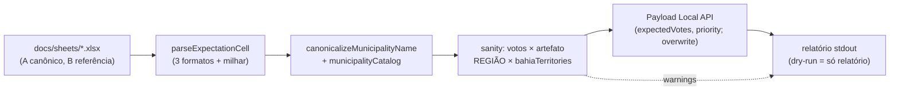

# E4R — Import único da planilha de projeção (seed de estratégia, local e produção)

Status: entregue em código (2026-07-24)
Atualizado em: 2026-07-24 (alvo mudou para `expectedVotes` — "Metas" removidas do app; overwrite-always; SheetJS; seed local 189 estimativas / 50 alta)
Item do roadmap: [docs/roadmap.md](../roadmap.md) (E4R)
Impeccable: n/a — script/CLI sem superfície de UI (relatório em stdout)
Appetite: ~1 dia eng (parser + mapeamento + dry-run + runbook de produção)
Responsável: —

Revisão 2026-07-24 (a): idempotência mudou de “só campos vazios” para **sempre sobrescrever** nas linhas casadas — a planilha sobe de novo quando a mesa manda versão mais nova sobre DB já populado. Entrega: `pnpm db:seed:projecao`, parser em `src/lib/projectionSheetParse.ts`, script `scripts/import-projecao.mjs`. Seed local verificado: 189 municípios com estimativas parseáveis, 50 `priority=alta`, Salvador pulado, re-run delta=0.

Revisão 2026-07-24 (b) — **alvo é `expectedVotes`, não `voteGoals`:** decisão de produto — "Meta Bom/Regular/Mínimo" duplicava o conceito de votos estimados; a campanha trabalha com UMA série por cenário. O grupo `municipality.voteGoals` foi **removido do app** (migration `20260724_133600_drop_municipality_vote_goals`, com backfill metas→estimativas onde estimativa estava vazia) e o seed passou a gravar `municipality.expectedVotes` com o mapeamento **Bom → otimista, Regular → média (`central`), Mínimo → pessimista**. A ordem é validada com `getVoteEstimateOrderViolation` (pessimista ≤ média ≤ otimista) e a UI exibe tudo no card "Votos estimados".

## Contexto

A sessão real com o Coordenador Geral (2026-07-23 — [CUSTOMER.md](../CUSTOMER.md)) confirmou O5 com força máxima: a planilha de projeção é a fonte de verdade da mesa ("eu acordo todos os dias lendo o nosso mapa") e ele se comprometeu a enviá-la — as versões mais recentes já estão versionadas em `docs/sheets/`. O corte E4 (2026-07-19, [mapa-projecao-municipios.md](mapa-projecao-municipios.md): "dados estratégicos via UI, sem script") foi decidido **antes** dessa evidência; preencher ~240 municípios com metas à mão na semana de onboarding não acontece, e o Big Hire depende de "seeded picture" (CUSTOMER.md). Decisão de produto de 2026-07-24: **seed único e assistido via script**; import automático/recorrente continua fora de escopo (atualização contínua segue via UI — o produto é o registro vivo, não espelho de planilha).

### Forense dos arquivos (2026-07-24)

Mesma linhagem (criados 2026-05-05, ambos modificados 2026-07-14 por "joao vitor pitanga"); **se complementam**:

| Arquivo                                  | Abas                                                                                 | Papel                                                                                                                                                                                             |
| ---------------------------------------- | ------------------------------------------------------------------------------------ | ------------------------------------------------------------------------------------------------------------------------------------------------------------------------------------------------- |
| `Mapa projeção de votos Solla 2026.xlsx` | MAPA GERAL · PRIORITÁRIAS · RESUMO (salvo 15:11)                                     | **Canônico para estratégia** — o MAPA GERAL é mais fresco nas 9 linhas divergentes (ex.: Jaguaquara "Bom: 10.000", que bate com o "investiu pesado em Jaguaquara ~10k" da entrevista)             |
| `Mapa_projecao_votos_Solla_2026.xlsx`    | + SALVADOR (bairros) · SALVADOR (ZONAS) · DE-PARA (2014-2022) · LISTAS (salvo 14:52) | **Referência de Salvador** — zonas só têm votos históricos (sem estratégia; ZE 20ª extinta anotada); DE-PARA reconcilia rótulos TSE→bairro. PRIORITÁRIAS e RESUMO são idênticas nos dois arquivos |

Divergências A×B no MAPA GERAL (9 linhas: Brejões, Catu, Iaçu, Ipiaú, Jaguaquara, Manoel Vitorino, Santa Cruz Cabrália, Tanquinho, Contendas do Sincorá) — o dry-run imprime as duas versões; importa-se a do arquivo A.

## Objetivos

- Script `scripts/import-projecao.mjs` que lê o xlsx canônico e escreve nos `municipality` do catálogo: `expectedVotes.optimistic/central/pessimistic` (coluna EXPECTATIVA 2026; Bom→otimista, Regular→média, Mínimo→pessimista) e `priority` (coluna PRIORIDADE) — **v1 só números/enums, zero PII**.
- Parser tolerante aos 3 formatos observados de EXPECTATIVA: `Bom: 350 | Regular: 250 | Minimo: 150` (com/sem espaços), `Bom:350`, `800/500/400`; separador de milhar `10.000`.
- Matching de nome via `canonicalizeMunicipalityName` + catálogo (`municipalityCatalog.ts`); sanity check duplo: VOTOS 2014/18/22 da planilha × `bahiaElectionAggregates` (valida o match), REGIÃO × `bahiaTerritories` (diverge = warning, não bloqueia).
- `--dry-run` com relatório completo: linhas casadas/não casadas, campos que seriam escritos, 9 divergências A×B, Salvador pulado, totais.
- **Sempre sobrescreve** `expectedVotes` + `priority` em toda linha casada (a planilha é a fonte da estratégia naquele momento; re-run com arquivo novo ou `--file` substitui o que já estiver no banco). Não toca outros campos nem `lastUpdateAt`.
- Runbook de produção documentado no próprio script (header) e neste plano.

## Decisões travadas

- **v1 importa apenas números/enums (`expectedVotes`, `priority`).** Colunas com nomes (LIDERANÇAS, ASSESSOR RESPONSÁVEL, DOBRADINHAS, ENCAMINHAMENTOS, OBSERVAÇÃO) ficam para fase 2, pós-lote jurídico — nome de ator político é dado pessoal que revela opinião política (LGPD art. 11); destino (CRM `leadership` × nota staff-only) se decide com a assessoria. **Rejeitado:** importar tudo com access staff-only (antecipa exatamente o risco que a Onda 0 segura); campo novo `networkNotes` (schema por dado que ainda não pode entrar).
- **SITUAÇÃO e VOTOS não são importados.** Tendência é derivada do TSE (`computeVoteTrend` — decisão E2 mantida); votos históricos vêm de `electionTally`/artefato. A planilha só manda no que é julgamento humano: metas e prioridade. **Rejeitado:** persistir a SITUAÇÃO da planilha (duplicaria a derivação com dado defasado).
- **Salvador (linha única, metas 30k/27k/25k) é pulado com relatório explícito.** O catálogo tem 19 Municípios-zona e a planilha não distribui; inventar rateio viola "não estimar o que não tem dado" (falsa precisão). Metas de zona entram via UI pelo coordenador. **Rejeitado:** rateio proporcional ao voto por zona (número inventado com cara de número).
- **Arquivo A é o canônico de estratégia; B é referência.** Mais recente nos 9 conflitos e corroborado pela entrevista (Jaguaquara). O script aceita `--file` para apontar planilha nova se chegar versão mais atual.
- **`priority`: `alta` → `alta`; `Baixa`/vazio → `normal`.** Cross-check com a aba PRIORITÁRIAS (conjunto alfabético de 50, não ranking): prioritária sem `alta` no MAPA GERAL = warning no relatório.
- **Escrita via Payload Local API em transação única** (`withPayloadTransaction`), `overrideAccess: true` (processo CLI, mesmo padrão dos seeds); guarda de banco da família dos seeds (`assertLocalDatabase`; produção só com `ALLOW_REMOTE_DB=true`).
- **Overwrite sempre na escrita:** cada linha casada do MAPA GERAL grava `expectedVotes` + `priority` da planilha por cima do valor atual. **Rejeitado:** empty-only (quebraria o re-seed quando a mesa manda planilha atualizada). **Rejeitado:** merge por célula / “só se diferente” como gate — o dry-run já mostra o delta; a escrita é a declaração consciente após revisão.
- **Não atualizar `lastUpdateAt`.** Seed/re-seed não é sinal de campo; frescor (E9/G8) não pode nascer inflado.
- **Parser xlsx:** SheetJS CE (`xlsx`) como devDependency (knip entry `scripts/*.mjs`).
- **i18n e naming:** identificadores em inglês (`importProjectionSheet`, `parseExpectationCell`, `--dry-run`/`--file`); relatório em pt-BR.

## Questões em aberto

_(nenhuma — SheetJS e lastUpdateAt fechados 2026-07-24; overwrite-always fechado na implementação.)_

## Abordagem proposta

### Runbook (ordem obrigatória)

1. Local: `pnpm db:start` → `pnpm db:seed:projecao -- --dry-run` → revisar relatório → `pnpm db:seed:projecao` (sobrescreve) → conferir 3 municípios na UI (`/campanha/municipios`).
2. Produção (após smoke pós-deploy, ou quando chegar planilha nova): `ALLOW_REMOTE_DB=true DATABASE_URL=<prod> pnpm db:seed:projecao -- --dry-run` → revisar → aplicar (sem `--dry-run`). Sem revalidate (páginas de campanha são dinâmicas).
3. Registrar no notebook a data do seed e o arquivo usado (proveniência). Planilha nova: `--file <path>` + dry-run + apply.

## Dependências

- `expectedVotes` (grupo por cenário) existe desde A10; a migration `20260724_133600_drop_municipality_vote_goals` precisa estar aplicada (remove o grupo antigo). Consome: `municipalityCatalog.ts`, `bahiaElectionAggregates.ts`, `bahiaTerritories.ts`, guard family dos seeds.
- Alimenta: **E8** (metas iniciais da decomposição), **A11/E17** (quadro com prioridade real), onboarding (Onda 0 §4).

## Não escopo

- Import recorrente/automático (fora de escopo do roadmap — atualização contínua via UI); colunas com nomes (fase 2 pós-lote jurídico); Salvador por zona/bairro (UI manual; drill de bairro segue como E5 futuro); criação de `leadership`/`Contact` a partir da planilha (CRM real só com Consent).

## Rabbit holes

- **"Já que estamos, importar as lideranças como texto."** É exatamente o dado segurado pela Onda 0; qualquer coluna textual espera o parecer. Mitigação: v1 whitelist de 2 campos, hard-coded.
- **Normalizar a planilha inteira (RESUMO, LISTAS, DE-PARA).** Só MAPA GERAL (+ PRIORITÁRIAS para cross-check) tem dado importável; o resto é referência humana.
- **Resolver os 9 conflitos A×B "automaticamente com merge inteligente".** A é canônico; o relatório imprime os dois valores para o coordenador conferir depois. Merge por célula é engenharia para um problema de 9 linhas.

## Adiado com gatilho

- **Fase 2 (colunas com nomes).** Gatilho: lote jurídico final + decisão de destino com a assessoria.
- **Metas de Salvador por zona via planilha.** Gatilho: coordenação produzir metas por ZE (hoje não existem em nenhuma aba).
- **`--file` apontando planilha atualizada.** Gatilho: coordenador enviar versão mais nova que as de `docs/sheets/` (o script já nasce parametrizado; o gatilho é o re-run consciente após dry-run — a escrita já sobrescreve).
- **Batch SQL no lugar de ~189 `payload.update` sequenciais.** Gatilho: re-seed remoto (Neon) sentir-se lento; hoje Local API + overwrite-always cabem no appetite de seed one-shot. Helpers bulk existentes são insert-oriented (`supporterImportBulk`).

## Já resolvido no simplify (não reabrir)

- Chaves de Map via `normalizeMunicipalityKey` (não NFD local fraco)
- `asCompleteGoals` / drop `sheetRow` morto / ordem Bom≥Regular≥Mínimo via `getVoteGoalsOrderViolation`
- `--reference` explícito falha fechado; A×B só com B parseável

## Referências

- `docs/roadmap.md` (E4R; Onda 0 §4; Fora de escopo — import recorrente) · [mapa-projecao-municipios.md](mapa-projecao-municipios.md) (E1–E5; corte E4 original)
- `docs/CUSTOMER.md` — O5 confirmada ✚✚, compromisso da tabela, Big Hire = seeded picture
- `docs/sheets/Mapa projeção de votos Solla 2026.xlsx` (canônico estratégia) · `docs/sheets/Mapa_projecao_votos_Solla_2026.xlsx` (referência Salvador)
- `scripts/seed-tse-results.mjs` (padrão CLI: guard de banco, transação, idempotência por escopo) · `scripts/guard-dev-db.mjs`
- `src/lib/municipalityCatalog.ts`, `src/lib/bahiaElectionAggregates.ts`, `src/lib/bahiaTerritories.ts`, `src/collections/Municipality.ts`
- AGENTS.md — guarda de banco local/produção, `ALLOW_REMOTE_DB`, naming
