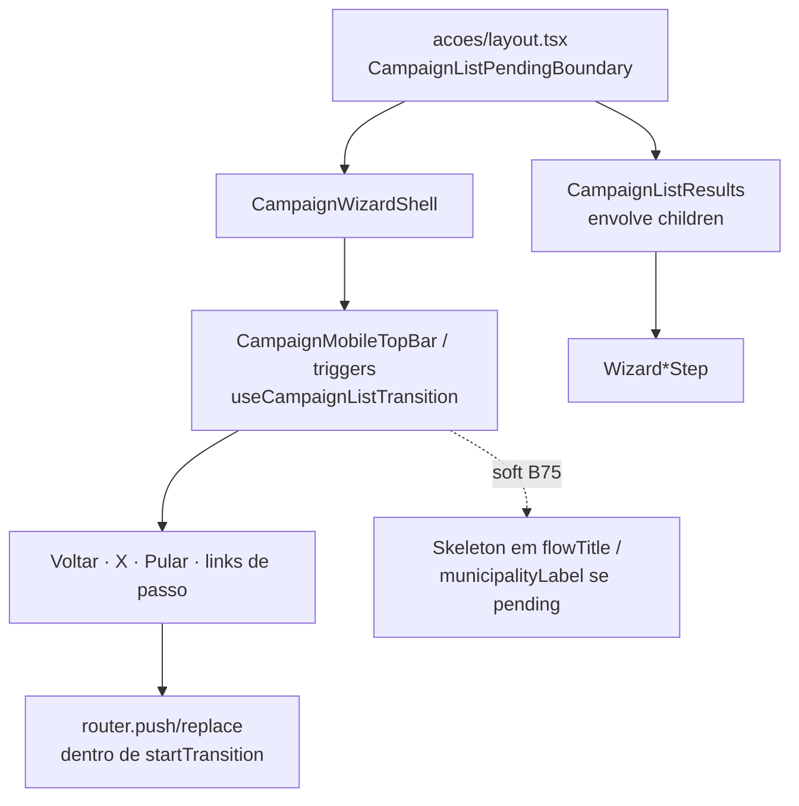

# Indicação de carregamento nas ações de navegação do wizard

Status: rascunho
Atualizado em: 2026-07-30
Item do roadmap: [docs/roadmap.md](../roadmap.md) (Trilha B, item **B78** — UX-1 wizards / Feel the action)
Impeccable: B — encaixe no shell e no chrome mobile do wizard; sem rota nova
Appetite: ~0,25–0,5 dia eng; boundary de transição + pending no conteúdo (+ shimmer opcional no header pós-B75); sem migration
Responsável: —

## Design (Impeccable)

Âncoras: `PRODUCT.md` § **Feel the action** · `.agents/rules/campanha-action-feedback.mdc` · precedente `CampaignListPendingBoundary` / `CampaignListResults` / `useCampaignListTransition` (`src/components/campaign/shared/CampaignListPending.tsx`) e fill-in do compositor de giro ([feedback-pendente-compositor-giro.md](feedback-pendente-compositor-giro.md)) · tema `data-theme='campaign'`.

Na implementação (`implement-roadmap-item`): craft compacto → critique → polish. Sem shape novo.

Brief compacto:

- **Persona / contexto:** CG/assessor no celular, no meio de um ritual (`/campanha/acoes/*`); toca **Voltar**, **X**, **Pular** ou escolhe um município e a rota troca — o passo anterior continua nítido enquanto o RSC carrega.
- **Job principal:** ao navegar entre passos do wizard, saber que a ação registrou e que o conteúdo visível está sendo substituído.
- **Estratégia de cor:** Restrained — `opacity-60` + `aria-busy` no corpo (mesmo idioma das listas); no header Mandate Red (**B75** ✓/soft), shimmer discreto só nos slots de título/subtítulo, não na barra inteira.
- **Edit where you see:** não — feedback de transição, não edição.
- **Anti-goals:** spinner full-page; segundo idioma de pending só no botão; `loading.tsx` por passo; skeleton que inventa layout do passo seguinte.

## Dados → decisão → apresentação

Dados: N/A — chrome de navegação; números/texto nas etapas B61/B63/B64/B70/B77.

## Contexto

**B59 ✓** entregou `CampaignWizardShell` e rotas `/campanha/acoes/<slug>` com navegação por `router.push` / `router.replace` (`?municipio=`, passos seguintes, Voltar). **B60 ✓** já trata loading da **busca** (debounce + estado local do `POST /campanha/home-search`) — isso **não** cobre a transição de rota após selecionar o município ou usar os controles do shell.

**B75** (header mobile Mandate Red) vai concentrar Voltar / título do fluxo / subtítulo do município / X ou Pular no topo. Sem pending explícito, o usuário pode tocar de novo (double-submit mental) ou achar que Voltar não funcionou — especialmente em rede lenta entre Zaps.

Pedido (2026-07-30): indicar carregamento nas **ações de navegação do shell**; após o ajuste de design do header (**B75**), considerar **shimmer** no header nos slots que mudam (título/subtítulo), não só dim no conteúdo.

## Objetivos

- Toda navegação do wizard que dispara transição de rota (`Voltar`, `dismissHref`, `skip`, seleção de município → `?municipio=`, avanço entre passos com `router.push`/`replace`) participa de **uma** `useTransition` compartilhada no layout do wizard.
- A região de **conteúdo** do passo (`<main>` do shell / filhos) dima com `data-pending` + `aria-busy` + live region “Atualizando…” (reuso de `CampaignListResults` ou wrapper equivalente sem renomear o mundo).
- Controles de navegação mostram feedback **imediato** no gatilho: `aria-busy` no link/botão ativo, `pointer-events-none` ou `disabled` enquanto `isPending` (evitar double-tap em Voltar/X).
- **Pós-B75 (soft):** enquanto `isPending`, título e subtítulo do header Mandate Red entram em estado de placeholder com `Skeleton` (shadcn) ou pulse equivalente — **só** os textos, ícones Voltar/X permanecem clicáveis ou já disabled conforme política acima.
- Não alterar o contrato de URL nem loaders de busca já existentes (B60).
- Guardrails: sem migration / Consent / action; `prefers-reduced-motion` respeitado (shimmer → opacity estática).

## Decisões travadas

- **Reusar a máquina de pending das listas, não inventar `WizardPending*`.** `CampaignListPendingBoundary` + `useCampaignListTransition` já resolvem boundary + hook; o compositor de giro (**E13** fill-in) provou que a peça não é acoplada a tabela. **Rejeitado:** par paralelo só para wizard (duplica `opacity`/`aria-live`); `loading.tsx` em `acoes/[slug]` (só cobre entrada direta, não troca de query).
- **Pending honesto no resultado, otimista no controle.** O passo **anterior** dima (não some) até o RSC novo chegar — mais informativo que skeleton que adivinha o layout. **Rejeitado:** skeleton full-page do próximo passo; manter passo antigo 100% opaco (parece travado).
- **Shimmer no header = soft dependency de B75.** Se B75 ainda não estiver no ar, entrega só dim + busy no conteúdo e nos triggers; shimmer nos slots `flowTitle` / `municipalityLabel` entra no mesmo PR ou imediatamente após B75 — não bloqueia o dim do corpo. **Rejeitado:** shimmer no sticky branco legado do B59 (morre com B75).
- **Escopo = navegação de rota, não debounce de busca nem POST de gravação.** Auto-save e `POST` batch (B61/B77) mantêm feedback próprio (`useCampaignCellAutosave`, spinner no CTA). **Rejeitado:** unificar save e nav num único pending global (mistura “Salvando…” com “Atualizando…”).
- **i18n:** ids `isPending`, `startTransition`, `flowTitle`; copy pt-BR reutiliza “Atualizando resultados…” ou variante “Carregando passo…” se critique achar melhor no wizard.

## Questões em aberto

- **Wrapper: `CampaignListResults` literal vs `CampaignWizardStepResults` fino?** **Opções:** A) usar `CampaignListResults` no `<main>` | B) extrair `CampaignPendingSurface` com as mesmas classes. **Recomendação:** **A** neste appetite — o nome é legado, o comportamento é o certo; extrair só no 3º domínio não-lista. _(assumido)_
- **Live region: “Atualizando resultados…” soa errado?** **Opções:** A) reutilizar string das listas | B) prop `pendingMessage` | C) “Carregando passo…”. **Recomendação:** **C** no wizard via prop opcional em `CampaignListResults` (uma linha) — critique valida em voz. _(assumido)_

## Abordagem proposta

Componentes:

- **`src/app/(campaign)/campanha/(app)/acoes/layout.tsx`**: envolver `{children}` em `CampaignListPendingBoundary` (provider client leve, filhos RSC como nas listas).
- **`CampaignWizardShell`** (`src/components/campaign/shared/CampaignWizardShell.tsx` — previsto B59 ✓): `<main>` passa a usar `CampaignListResults` (ou slot `stepSurface`) em volta de `children`; props de chrome chamam `useCampaignListTransition` nos `Link`/`button` de Voltar, dismiss e skip (`startTransition(() => router.push(...))`).
- **`WizardMunicipalitySearchStep`**: trocar `router.push` nu por transição compartilhada (mesmo padrão de `CampaignTransitionAnchor` ou hook direto).
- **`CampaignMobileTopBar`** (B75): quando `isPending`, renderizar `Skeleton` com `h-4`/`h-3` nos slots de título e subtítulo; ícones com `aria-busy` se forem o gatilho da navegação.
- **Testes:** unit jsdom — mock router + boundary: clicar Voltar marca `aria-busy` no main e no trigger; opcional snapshot de classes `data-pending`. E2e smoke: após selecionar município, assert `data-pending` ou opacity antes do próximo `h1` (timeout generoso — rede dev).
- **Migration:** Sem migration, sem collection, sem server action.

## Dependências

- Dura: **B59 ✓** (shell + rotas `/campanha/acoes`). Soft: **B75** (shimmer nos slots do header Mandate Red — corpo pending funciona sem). Soft: **B60 ✓** (seleção de município é o call site mais visível).
- Melhora percepção de **B77**, **B63**, **B64**, **B70** (todos navegam entre passos no mesmo layout).

## Não escopo

- Pending de **fetch** da busca no passo município (B60 — já local). Gravação batch/auto-save (B61/B77/B32+).
- `loading.tsx` segment por ação. Animação de transição entre passos (slide) — Adiado.
- Desktop `md+` (Voltar = browser; pending no corpo ainda vale em `router` client-side).

## Rabbit holes

- **State machine global de wizard.** Se alguém “só centralizar pending”: explode em store de passos. **Mitigação:** só boundary + hook existentes.
- **Skeleton que imita cada passo.** **Mitigação:** dim do conteúdo atual; shimmer só em duas linhas do header.
- **Renomear `CampaignListPending*` neste item.** **Mitigação:** defer até 3º domínio não-lista (compositor + wizard = 2).

## Adiado com gatilho

- **Transição animada entre passos (cross-fade/slide).** Revisitar se critique pós-B75 achar o dim “brusco” — só com `prefers-reduced-motion` e medição em 3G.
- **Extrair `CampaignPendingSurface` genérico.** Revisitar quando existir 3º consumidor não-lista além de giro + wizard.

## Referências

- `src/components/campaign/shared/CampaignListPending.tsx` — boundary, hook, results, `CampaignTransitionAnchor`
- `docs/plans/chassis-wizard-campanha.md` (B59 ✓) · `docs/plans/header-mobile-wizard-campanha.md` (B75) · `docs/plans/busca-municipio-wizard.md` (B60 ✓)
- `docs/plans/feedback-pendente-compositor-giro.md` — precedente não-lista
- `.agents/rules/campanha-action-feedback.mdc` · `PRODUCT.md` § Feel the action
- AGENTS.md — sem Consent; naming

Qualidade de decisão: 4/5
