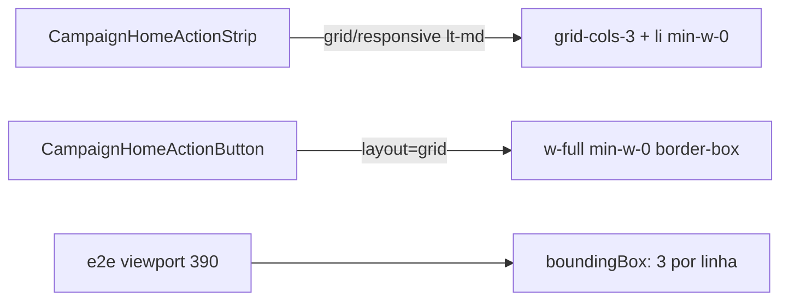

# Impl: Início / FAB — grade 3 colunas × 2 linhas (corrigir orientação)

Status: aprovado
Atualizado em: 2026-08-02
Issue: #302
Intenção: docs/plans/inicio-acoes-grade-3cols-2rows.md
Appetite restante: ~0,5d (causa real + testes de geometria)

## Leitura da intenção

- **Outcome:** Início mobile e overlay FAB mostram 6 ações staff em **3 colunas × 2 linhas** (verificável em viewport ~390), não 2×3; `md+` Início mantém strip.
- **O que NÃO negociar:** catálogo/lockdown; sem migration; não reabrir snap/peek; liderança sem layout paralelo.
- **O que reavaliar:** B132 já trocou `grid-cols-2` → `grid-cols-3`, mas testes só assertam `className` — a causa visual provável é **min-width dos itens da grade** (`min-width: auto` + `box-content` + `w-[5.5rem]` residual) comprimindo para 2 colunas percebidas ou clip pelo `overflow-hidden` do shell de retraction.

## Abordagem recomendada

**Opções consideradas:** A) só reafirmar `grid-cols-3` | B) `min-w-0` + `layout=grid` no botão | C) reduzir círculo/gap  
**Recomendação:** **B** — corrige sizing real sem redesign; gap-2 só se critique pedir.  
**Rejeitadas:** A (já feito em B132, insuficiente); C (fora do apetite salvo falha em 390).

### Componentes / mudanças

- **`CampaignHomeActionButton`:** `layout: 'grid'` — `w-full min-w-0 max-w-full`, `box-border` (sem `box-content` na grade).
- **`CampaignHomeActionStrip`:** `li` com `min-w-0`; `layout='grid'` quando `variant` é `grid` ou `responsive`; `gap-2` no mobile grid (mais folga horizontal em 390px); `data-layout="grid-3"` no `<ul>` para e2e.
- **`CampaignQuickActionsOverlay`:** sem mudança estrutural (já `variant="grid"`).
- **Testes:** helper de geometria em e2e (`campaignHomeActions.e2e.spec.ts` + overlay em `campaignMunicipalities.e2e.spec.ts`); unit para `layout=grid` e `min-w-0` no `li`.
- **Migration:** sem migration.

## Fases verificáveis

1. **Strip + button sizing** — `layout=grid`, `min-w-0`, gap ajustado.
2. **E2e geometria** — 3 botões na primeira linha, 3 na segunda (staff); overlay FAB idem.
3. **Gates** — `pnpm gate:fast`; `pnpm push`.

## Rabbit holes / Não escopo (engenharia)

- PWA cache bust (fora do repo); se persistir pós-deploy, runbook separado.
- Refatorar `HomeChromeRetractionShell` globalmente.
- Grade em `md+`.

## Riscos e mitigação

- **Leader 2 ações:** grade 3-col deixa 1 célula vazia — aceite da intenção.
- **Desktop overlay dialog:** `layout=grid` mantém `w-full` (sem `md:w-[5.5rem]`).

## Aceite de engenharia

- [ ] Aceite de produto da intenção ainda coberto
- [ ] Invariantes AGENTS/engineering-standards
- [ ] E2e viewport 390 com geometria 3×2 (não só className)

Self-score decision-quality: 5/5
