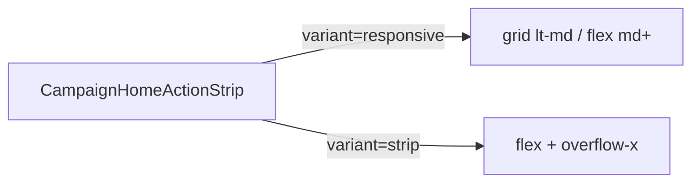

# Impl: Início mobile — ações em grade 2×3 (sem scroll)

Status: aprovado
Atualizado em: 2026-08-02
Issue: #249
Intenção: docs/plans/inicio-acoes-grid-2x3-mobile.md
Appetite restante: ~0,5d (layout + tests)

## Leitura da intenção

- **Outcome:** No Início mobile, as 6 ações staff aparecem numa grade 2×3 sem scroll horizontal; desktop mantém strip.
- **O que NÃO negociar:** drawer de outras rotas continua strip; catálogo/lockdown leader; long-press/tooltip.
- **O que reavaliar:** bleed `-mx-4` do B99 — removido no mobile porque a grade cabe no gutter.

## Abordagem recomendada

**Opções consideradas:** A) CSS só no strip (`grid md:flex`) | B) componente `CampaignHomeActionGrid` | C) duplicar markup no `CampaignHomeActions`  
**Recomendação:** **A** — edita o dono; `variant` explícito para o drawer.  
**Rejeitadas:** B (twin); C (duplica map de ações).

### Componentes / mudanças

- **`CampaignHomeActionStrip`** (`src/components/campaign/dashboard/CampaignHomeActionStrip.tsx`): prop `variant?: 'strip' | 'responsive'` (default `'responsive'`). Responsive: `grid grid-cols-2 gap-3` + sem overflow no mobile; `md:flex md:overflow-x-auto` + pan handlers. Strip: comportamento atual.
- **`CampaignHomeActionButton`** (`CampaignHomeActionButton.tsx`): `actionControlClassName` ganha `w-full md:w-[5.5rem]` quando pai é responsive (via prop `layout` ou classe compartilhada exportada).
- **`CampaignHomeActions`**: passa `variant="responsive"` (explícito).
- **`CampaignQuickActionsDrawer`**: passa `variant="strip"`.
- **`CampaignHomeLayout`**: `home-actions` perde `-mx-4 w-[calc(100%+2rem)]` no mobile; bleed só se strip voltar (não neste slice).
- **Migration:** sem migration.
- **UI:** Impeccable B — craft; sem novo token.

### Dados → forma

N/A — launcher estático.

## Fases verificáveis

1. **Strip + button** — `variant` + classes grid/strip; drawer `variant="strip"`.
2. **Layout + tests** — remover bleed mobile; unit layout/strip; e2e 6 ações visíveis em 390px.
3. **Gates** — `pnpm gate:fast`; `pnpm push`.

## Rabbit holes / Não escopo (engenharia)

- Extrair tile genérico wizard/home.
- Grid no drawer.
- Mudar tamanho do círculo sem pedido de produto.

## Riscos e mitigação

- **Pan handlers em grid mobile:** inofensivos (sem overflow); não montar scroller ref em grid se simplificar.
- **Teste bleed antigo:** atualizar spec `campaignHomeLayout` para refletir gutter no mobile.

## Aceite de engenharia

- [x] Aceite de produto da intenção ainda coberto
- [x] Invariantes AGENTS/engineering-standards
- [x] Testes de domínio previstos (unit/int) onde access/write paths mudam

Self-score decision-quality: 5/5
