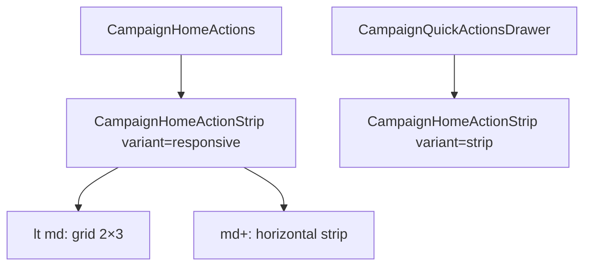

# Início mobile — ações em grade 2×3 (sem scroll)

Status: registrado
Atualizado em: 2026-08-02
Issue: #249
Priority: P1
Model: composer-2.5
Impeccable: B — `CampaignHomeActionStrip` / `CampaignHomeLayout` (Início staff/leader)
Appetite: ~0,5d eng; layout responsivo; sem migration
Responsável: —

## Design (Impeccable)

Âncoras: `PRODUCT.md` (Clarity under pressure; Feel the action) / `DESIGN.md` · B44/B45 strip · B63 grid 2×3 wizard · tema `campaign`.

Na implementação: craft compacto → critique → polish (iPhone 390px; 6 ações staff).

Brief:

- **Persona / contexto:** CG/assessor no celular — polegar na thumb zone; hoje precisa pan horizontal para ver as 6 ações.
- **Job principal:** ver **todas** as ações staff (6) de uma vez, sem scroll horizontal, em grade 2 colunas × 3 linhas.
- **Estratégia de cor:** herda B44 (círculo `bg-muted` + label).
- **Edit where you see:** não — launchers.
- **Anti-goals:** card com borda envolvendo a grade; scroll horizontal no mobile do Início; mudar o drawer de outras rotas (continua strip).

### Wireframe (texto)

```text
┌─ /campanha mobile (< md) ──────────────────────┐
│                                                │
│  ┌──────────┐  ┌──────────┐                    │
│  │ Ajustar  │  │Registrar │                    │
│  │  votos   │  │  sinal   │                    │
│  └──────────┘  └──────────┘                    │
│  ┌──────────┐  ┌──────────┐                    │
│  │  Mudar   │  │Atualizar │                    │
│  │tendência │  │liderança │                    │
│  └──────────┘  └──────────┘                    │
│  ┌──────────┐  ┌──────────┐                    │
│  │Registrar │  │   Ver    │                    │
│  │ pedido   │  │esquecidos│                    │
│  └──────────┘  └──────────┘                    │
│                                                │
│  ┌ Buscar na campanha ────────────────────────┐│
└────────────────────────────────────────────────┘

md+: strip horizontal atual (B44/B67) — inalterada.
```

## Dados → decisão → apresentação

Dados: N/A — chrome de launcher; catálogo B45 inalterado.

## Contexto

**B44–B74 / B99** iteraram na strip horizontal (gap, bleed, pan). Com 6 ações staff, o mobile ainda exige pan — produto pede **grade 2×3 sem scroll** no Início. Precedente visual: `WizardSignalTypeStep` (`grid-cols-2 gap-3`). O **drawer** de ações rápidas (B105) permanece strip horizontal no peek.

## Objetivos

- **&lt; `md` (Início):** `CampaignHomeActions` renderiza grade `grid-cols-2 gap-3`; 6 ações staff visíveis sem `overflow-x`; liderança (2 ações) em 1 linha.
- **`md+`:** strip horizontal atual (scroll, pan fine, tooltip).
- `CampaignQuickActionsDrawer`: continua `variant="strip"` (sem grade).
- Remover bleed `-mx-4` do slot `home-actions` no mobile (grade respeita gutter `p-4`).
- Long-press Drawer / Tooltip fine inalterados.
- Unit + e2e smoke: grade no mobile; strip no drawer; ações staff todas visíveis em viewport 390.
- Sem migration / collection / server action.

## Decisões travadas

- **Grade só no Início mobile; strip no drawer e no `md+`.** **Rejeitado:** grade global (drawer peek não cabe 3 linhas); manter strip no mobile “com gap menor” (B99/B74 esgotaram).
- **`variant` no dono `CampaignHomeActionStrip`.** `responsive` (default no Início) vs `strip` (drawer). **Rejeitado:** componente paralelo `CampaignHomeActionGrid`.
- **Botão com classes responsivas** (`w-full md:w-[5.5rem]`). **Rejeitado:** segundo primitivo de botão.
- **i18n:** ids/classes em inglês; copy B58 intacta.

## Questões em aberto

- **Círculo menor na grade?** **Opções:** A) manter `size-14` | B) `size-12` na grade. **Recomendação:** **A** — célula larga o suficiente; critique mede. _(assumido)_

## Abordagem proposta



Componentes:

- **`CampaignHomeActionStrip.tsx`:** prop `variant`; lista `grid grid-cols-2 gap-3` vs `flex` + overflow.
- **`CampaignHomeActionButton.tsx`:** `w-full` na grade / largura fixa na strip.
- **`CampaignHomeLayout.tsx`:** remover bleed mobile do slot `home-actions`.
- **Testes:** unit strip/grid classes; e2e 6 ações visíveis em 390px.

## Dependências

- Dura: B45 ✓ (catálogo), B44 ✓ (primitivo). Soft: B99 bleed (revertido no mobile para grade).

## Não escopo

- Catálogo / labels / wizards.
- Grade no drawer B105.
- Mudar ordem thumb-zone (B46).

## Rabbit holes

- **Unificar grade wizard + home num tile genérico.** Mitigação: classes Tailwind compartilhadas só; sem extrair até 3º call site.
- **CSS container queries.** Mitigação: breakpoint `md` como o resto do Início.

## Adiado com gatilho

- **Grade no drawer** se peek crescer. Revisitar com redesign B105.
- **3 colunas em tablet portrait.** Revisitar se `md` grid pedido.

## Referências

- Issue #249 · `WizardSignalTypeStep.tsx` (grid 2×3)
- `CampaignHomeActionStrip.tsx` · `CampaignHomeLayout.tsx` · `CampaignQuickActionsDrawer.tsx`
- [botao-acao-inicio-strip.md](botao-acao-inicio-strip.md) · [strip-acoes-edge-gap-inicio.md](strip-acoes-edge-gap-inicio.md)
- `PRODUCT.md` / `DESIGN.md`

Qualidade de decisão: 5/5
