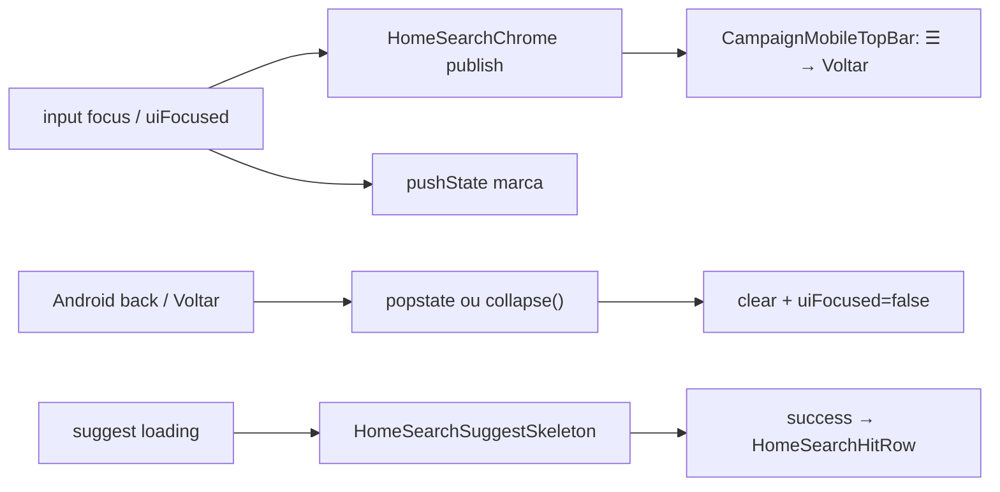

# Início mobile — Voltar no header + Android back + skeleton das sugestões

Status: done
Atualizado em: 2026-08-01 — as-built: `CampaignHomeSearchChromeContext` + publisher no Início; `CampaignMobileTopBar` troca `SidebarTrigger` por Voltar quando `uiFocused`; `useHomeSearchFocusHistory` com `pushState`/`popstate` (marca `teqoHomeSearchFocus`); `HomeSearchSuggestSkeleton` (3 rows) enquanto `isFetching` sem hits; unit `homeSearchFocusHistory`, `campaignMobileTopBar`, `campaignHomeSearch`. Sem migration.
Issue: #141
Priority: P1
Model: composer-2.5
Impeccable: B — encaixe em `CampaignMobileTopBar` + chrome da busca do Início (`uiFocused`)
Appetite: ~0,75–1d eng; contexto de chrome + history layer + skeleton; sem migration
Responsável: —

## Design (Impeccable)

Âncoras: `PRODUCT.md` (Clarity under pressure; Feel the action) / `DESIGN.md` · B66 modo focado · B68 sugestões · tema `data-theme='campaign'`.

Na implementação (`work-issue`): craft compacto → critique → polish (Android WebView / Chrome back + iOS Safari).

Brief compacto:

- **Persona / contexto:** assessor/CG no Início mobile toca a busca; chrome retraí (B66); hoje o hamburger do header ainda sugere “abrir menu”, não “sair da busca”.
- **Job principal:** no modo focado, o canto esquerdo do header vira **Voltar** (fecha a expansão); o botão Voltar do Android faz o mesmo — não navega para a rota anterior; enquanto as sugestões carregam, a região mostra skeleton shimmer.
- **Estratégia de cor:** Restrained — ícone/botão ghost no Mandate Red (paridade wizard B75); skeleton `bg-muted` / `animate-pulse` do kit.
- **Edit where you see:** não — chrome de descoberta.
- **Anti-goals:** teleportar o input para o header; Sheet full-screen; aplicar o mesmo history layer ao bottom drawer (B91/B105) neste item; redesenhar sugestões.

### Wireframe (texto)

```text
┌─ header app (Mandate Red) — busca NÃO focada ───────┐
│ [☰]  Jorge Solla / Campanha · Bahia           [🔔] │
└─────────────────────────────────────────────────────┘
┌─ header app — busca focada (uiFocused) ─────────────┐
│ [←]  Jorge Solla / Campanha · Bahia           [🔔] │
└─────────────────────────────────────────────────────┘
┌─ dock busca + região resultados ────────────────────┐
│ ┌─ Buscar… ──────────────────────────────────────┐  │
│ │ …                                              │  │
│ └────────────────────────────────────────────────┘  │
│ ░░░░░ skeleton row ░░░░░  (enquanto suggest load)   │
│ ░░░░░ skeleton row ░░░░░                            │
│ ░░░░░ skeleton row ░░░░░                            │
│ (depois) hits B68 / busca tipada                    │
└─────────────────────────────────────────────────────┘
  Fora do frame: strip/resumo retraídos (B66); drawer B91 N/A no Início.
```

## Dados → decisão → apresentação

Dados: N/A — chrome + pending visual; hits/sugestões já existem (B68). Sem métrica nova.

## Contexto

**B66 ✓** retrai strip/resumo ao `uiFocused` (`homeSearchUiFocused`), mas `CampaignMobileTopBar` em modo `app` continua com `SidebarTrigger`. **B68 ✓** carrega sugestões no empty; a região fica vazia até `success` — só `aria-busy`, sem skeleton.

O provider da busca no Início vive **dentro** da página (`CampaignHomeStaffChrome` → `CampaignGlobalSearchProvider`); o top bar está no layout `(app)` **acima** do scroll. Não há `pushState`/`popstate` no `src/` hoje — o Voltar do Android sai da rota.

Pedido de produto (2026-08-01): no modo expandido, Voltar à esquerda no header (no lugar do menu); Android back recolhe a busca; skeleton shimmer no empty enquanto sugestões carregam.

## Objetivos

- Com `uiFocused` no Início mobile: substituir `SidebarTrigger` por botão **Voltar** (`ArrowLeft` + aria “Fechar busca” / “Voltar”) que chama o mesmo collapse que blur+Escape (clear focus; se query vazia, sai do modo focado — alinhado B66).
- Ao entrar em `uiFocused`, empilhar um entry de history (`pushState` com marca estável); `popstate` / back do SO **só** recolhe a busca se o entry for nosso; não dispara navegação Next para a rota anterior.
- Enquanto suggest/search estiver `loading`/`isFetching` sem hits ainda renderizados: 3–5 rows skeleton (altura ~hit row), `aria-busy` mantido; sumir ao `success`/`error`.
- Desktop (`md+`): top bar já hidden — comportamento inalterado; history layer só mobile ou só quando top bar troca o trigger.
- Sem migration / Consent / mudança de contrato JSON de busca.
- Pins: unit no helper de history (push/pop/idempotência); unit/RTL do top bar app-mode com chrome “search-focused”; e2e leve opcional se estável.

## Decisões travadas

- **Contexto leve de chrome no layout (irmã do wizard chrome), não subir o `HomeSearchProvider` inteiro.** O top bar só precisa de `{ focused, collapse }`. Home (e só Início) publica; top bar consome. **Rejeitado:** prop-drill via layout RSC; ler DOM `data-home-focused`; duplicar estado de foco no top bar.
- **History = camada só do modo focado da busca do Início.** Marca tipo `teqo:home-search-focus` (nome final no craft). Collapse via back **não** limpa query tipada se produto preferir só blur focus — **recomendação:** igual Escape/`clear` do B66 (query some e chrome restaura) para um gesto único “sair da busca”. **Rejeitado:** history também no drawer B91 neste item; `beforeunload` hacks.
- **Skeleton reutiliza `Skeleton` shadcn + shape das hit rows; sem lib de shimmer.** Extrair helper/componente mínimo se **B107** (wizard) for o 2º call site no mesmo ciclo — gate 2026-08-01 pediu skeleton no wizard também. **Rejeitado:** spinner centrado; skeleton só no input.
- **Escopo de Voltar/history = Início (`/campanha`), não drawer global.** Drawer tem snap/peek próprios (B100/B105). **Rejeitado:** unificar “qualquer busca focada” neste PR.
- **i18n:** ids `homeSearchChrome` / `collapseHomeSearch`; copy pt-BR no aria do Voltar.

## Questões em aberto

- **Voltar com query tipada: limpa query ou só blur?** **Opções:** A limpa (paridade Escape) | B só tira foco e mantém texto (chrome pode continuar focado via `query.isActive`). **Recomendação:** **A** — um gesto = sair da busca. _(assumido — validar com produto)_
- **Quantas rows de skeleton?** **Opções:** A 3 | B 5. **Recomendação:** **A** (viewport curto com teclado). _(assumido)_

## Abordagem proposta



Componentes:

- **`CampaignHomeSearchChromeContext`** (ou nome alinhado ao wizard): provider no `(app)/layout` junto aos outros chromes; `useSetHomeSearchChrome` / `useHomeSearchChrome` espelhando o padrão B75.
- **`CampaignGlobalSearchMount` / `CampaignHomeSearch` / controller:** ao mudar `uiFocused`, publish + sync history (push ao true, replace/back ao false sem loop).
- **`CampaignMobileTopBar` (modo app):** se chrome.searchFocused → botão Voltar; senão `SidebarTrigger`.
- **`HomeSearchSuggestSkeleton`** (inline no grupo de resultados / results shell): rows quando `isFetching && !hits`; reuso em Início; wizard município **fora** deste item (pode citar como soft follow-up).
- **Helper puro** `homeSearchFocusHistory.ts` em `lib/`: serialize marca, `shouldHandlePopstate`, unit-pinned.
- **Migration:** Sem migration.

## Dependências

- Duras: nenhuma. Soft: B66 ✓, B68 ✓. Paralelo a B102/B103/B105 (drawer) — não serializa schema; evitar editar os mesmos arquivos do drawer no mesmo PR se outro agente estiver neles.

## Não escopo

- Bottom drawer busca (B91/B100/B105) — Voltar/history/skeleton do drawer.
- Remover título “Sugestões” → **B103**.
- Wizard município sticky/título/**skeleton do passo** → **B107** (pode reusar o bloco de rows deste item). Autofocus/votos → **B108**.

## Rabbit holes

- **“Já que o top bar lê foco, movo a busca para o header.”** **Mitigação:** só swap do trigger; input fica no dock (B65/B66).
- **History API × App Router (bfcache, soft nav).** **Mitigação:** marca + guard idempotente; testes unit do helper; não `router.back()` para collapse.
- **Skeleton shared com API inchada.** **Mitigação:** um componente de N rows pinado; sem tema/variant factory.

## Adiado com gatilho

- **Mesmo Voltar/history no drawer.** Revisitar quando B105 estiver estável e produto pedir paridade.

## Referências

- GitHub Issue #141
- `src/components/campaign/shell/CampaignMobileTopBar.tsx`
- `src/components/campaign/dashboard/CampaignHomeStaffChrome.tsx`
- `src/components/campaign/dashboard/CampaignGlobalSearchMount.tsx`
- `src/lib/campaignHomeSearchContract.ts`
- [modo-focado-busca-no-focus.md](modo-focado-busca-no-focus.md) (B66) · [sugestoes-busca-vazia-inicio.md](sugestoes-busca-vazia-inicio.md) (B68)
- `PRODUCT.md` / `DESIGN.md`

Qualidade de decisão: 5/5
