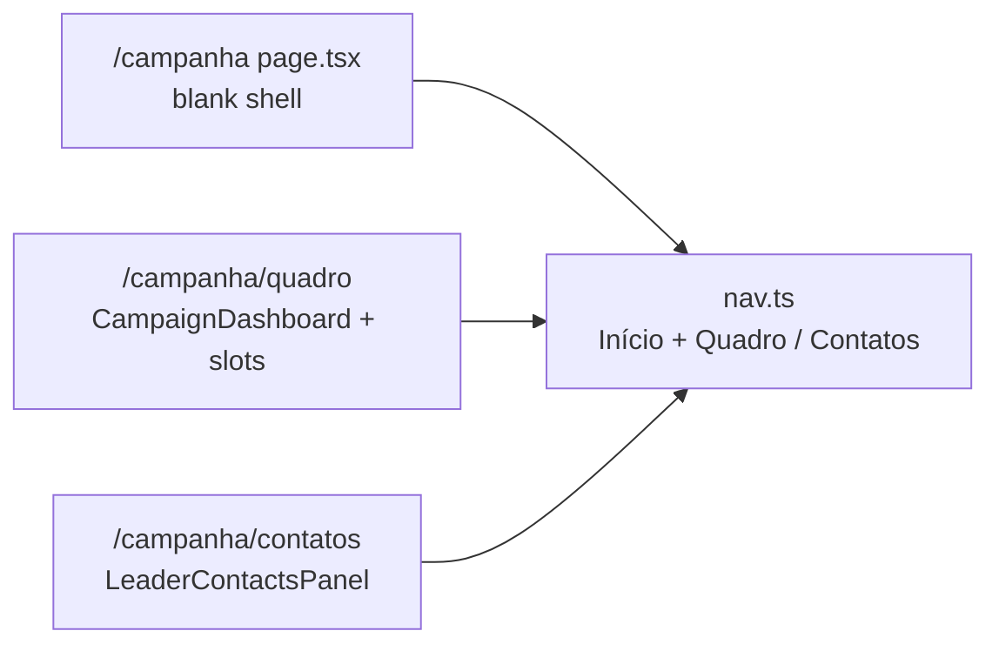

# Início em branco + Quadro (preservar dashboard)

Status: entregue (2026-07-29)
Atualizado em: 2026-07-29 — as-built: redirect de leader nos gates → `/campanha/contatos`; loading do quadro em `quadro/loading.tsx`; Início com `CampaignPageShell` vazio.
Item do roadmap: [docs/roadmap.md](../roadmap.md) (Trilha B, item B43 — chassis UX-1)
Impeccable: B — relocate do dashboard existente + Início intencionalmente vazio sob tema `campaign`
Appetite: ~0,5 dia eng; move de rota + nav + blank home; sem migration
Responsável: —

## Design (Impeccable)

Âncoras: `PRODUCT.md` (princípios 2 Clarity under pressure, 5 Depth/simplicity — leader path; anti-goals §5 dashboard SaaS) / `DESIGN.md` (register `product`, Field Desk) · tema `data-theme='campaign'` · shell `CampaignPageShell` / `nav.ts`.

Na implementação (`implement-roadmap-item`): craft compacto → critique → polish. `harden`/`optimize` só se Passo 8 acionar gatilho.

Brief compacto:

- **Persona / contexto:** CG (e demais papéis) abrem o app sob pressão de Zap; a tela atual começa por mapa/KPI e compete com o ritual Ação→Local→Quem.
- **Job principal:** `/campanha` vira superfície vazia pronta para o bloco de ações (B44/B45); o quadro operacional sobrevive intacto em URL própria.
- **Estratégia de cor:** Restrained.
- **Edit where you see:** não — só relocate / blank; sem edição nova.
- **Anti-goals:** redesign do dashboard nesta fatia; saudação/título no Início “só um pouquinho”; segundo home paralelo; quebrar o lockdown da liderança (contatos sem destino).

## Dados → decisão → apresentação

Dados: N/A — relocate e blank; nenhum número novo nesta entrega.

## Contexto

O Início staff (`src/app/(campaign)/campanha/(app)/page.tsx` → `CampaignDashboard`) monta mapa, KPIs, sugestões E11, prioritários, visitados, “Onde estou”. A liderança recebe `LeaderContactsPanel` no mesmo path. A sessão observada 2026-07-29 e o rascunho [fluxos-acao-primeiro-inicio.md](fluxos-acao-primeiro-inicio.md) (UX-1) pedem **ações first**; o quadro atual continua útil como **briefing / gestão**, não como porta de entrada.

Pedido de produto (2026-07-29): primeira tarefa do remodel — estruturar sem perder o que existe (exemplo vivo), com Início **completamente em branco** (só sidebar).

## Objetivos

- `/campanha` renderiza só o chrome do `(app)` (sidebar / bottom nav) — **zero** `h1`, subtítulo, mapa, KPI, slots.
- Dashboard staff atual move para **`/campanha/quadro`** com comportamento byte-equivalente (mesmos loaders/slots).
- Contatos da liderança move para **`/campanha/contatos`** (hoje vivem no Início).
- Sidebar / bottom nav: entrada **Quadro** (staff); liderança ganha **Início** + **Meus contatos** (hrefs distintos — sem React key duplicada).
- Sem migration, collection, Consent, server action nova.
- `isCampaignNavActive('/campanha')` continua match exato (não engole `/quadro` / `/contatos`).

## Decisões travadas

- **`/campanha/quadro` para o dashboard staff.** Copy da UI já fala “Quadro geral / dos municípios”. **Rejeitado:** `/visao-geral` (mais longo); `/inicio-antigo` (temporário no URL); deixar dashboard em `/campanha` e ações em subrota (contradiz o pedido de Início blank).
- **`/campanha/contatos` para `LeaderContactsPanel`.** O blank do Início **não** pode orphanar a única ferramenta da liderança. **Rejeitado:** manter contatos no Início “só para leader” (dois Inícios mentais); esconder contatos até B45 (lockdown quebrado por um dia).
- **Início literalmente vazio** — sem saudação. **Rejeitado:** “Olá, {nome}” residual (vira âncora visual que o bloco de ações depois displace).
- **i18n:** identificadores `quadro` / `contatos` nas pastas de rota; strings “Quadro” / “Meus contatos” / “Início” em pt-BR.

## Questões em aberto

- **Redirect de bookmarks `/campanha` que esperavam o mapa?** **Opções:** A nada | B redirect staff→`/quadro`. **Recomendação:** A — o Início novo é o destino; Quadro está a um clique na sidebar. _(assumido)_

## Abordagem proposta

Componentes:

- **`page.tsx` (Início)** — `requireCampaignPageActor()`; return `<CampaignPageShell />` vazio (ou fragmento sem filhos de conteúdo). Sem branch leader/staff de dados.
- **`quadro/page.tsx` (novo)** — corpo atual do home staff (dashboard + Suspense map/suggestions). Gate: staff only; leader → redirect `/campanha/contatos` ou `/campanha`.
- **`contatos/page.tsx` (novo)** — corpo atual do branch `isCampaignLeader` + `LeaderContactsPanel`. Staff que abrir → redirect `/campanha` ou 404 de rota (recomendação: redirect `/campanha`).
- **`nav.ts`:** staff: Início `/campanha`, Quadro `/campanha/quadro` (ícone ex. `LayoutDashboard`), demais intactos. Leader: Início `/campanha` + Meus contatos `/campanha/contatos`.
- **`getCampaignBottomNav`:** incluir Quadro ou não no cap de 5 — **recomendação:** manter Início + municípios…; Quadro só sidebar no mobile (mapa/KPI não é ritual de polegar). Documentar no PR.
- **Migration:** Sem migration, sem collection, sem server action.

## Dependências

- Nenhuma de outro plano duro. Soft: UX-1 / [fluxos-acao-primeiro-inicio.md](fluxos-acao-primeiro-inicio.md). Desbloqueia **B44** / **B45**.

## Não escopo

- Bloco de ações / botões → **B44** / **B45**.
- Wizards com escrita → fatias posteriores de UX-1.
- Redesign visual do `CampaignDashboard`.
- Mover mapa/KPIs de volta ao Início “abaixo das ações” (2ª dobra do rascunho UX-1 — gatilho pós-B45 + uso real).

## Rabbit holes

- **Reescrever `CampaignDashboard` “já que estamos mexendo”.** Explosão de polish. **Mitigação:** move mecânico; zero mudança de markup do quadro.
- **Unificar Quadro+Contatos numa rota com `?role=`.** Confunde URL e access. **Mitigação:** duas rotas explícitas.

## Adiado com gatilho

- **2ª dobra no Início** (mapa/KPI/sugestões sob as ações). Revisitar quando: B45 entregue **e** CG pedir briefing no mesmo viewport (soft 03/08).
- **Quadro no bottom nav mobile.** Revisitar se analytics/sessão mostrarem acesso frequente ao mapa no telefone.
- **`contatos/loading.tsx`** (paridade com `quadro/loading.tsx`). Revisitar se a navegação leader→contatos mostrar flash de layout em campo.
- **Auditoria de `revalidatePath('/campanha')` restantes** (sugestões/contatos já apontam para `/campanha/quadro` e `/campanha/contatos`). Revisitar se surgir helper central de revalidação de rotas `/campanha`.

## Já resolvido no simplify pós-entrega (não reabrir)

- Remoção de `isCampaignStaff` morto em `quadro/page.tsx` (gate `staff` já garante o ator).
- `LEADER_CONTACTS_HOME` / `CAMPAIGN_STAFF_QUADRO_PATH` + revalidação em `leaderSupporter` e `resolveSuggestion`.

## Explicitamente fora (triage simplify 2026-07-29)

- Constantes client-safe de href no estilo `MUNICIPALITY_NAV_HREF` (dois call sites; `nav.ts` não importa `server-only`).
- Helper e2e `gotoStaffQuadro` (três usos — DRY cosmético).
- Extrair seções compartilhadas do dashboard (um consumidor).
- Dedupar `loadMunicipalityScope` entre dashboard e sugestões (hot path pré-B43; gatilho: medição de dupla leitura em produção ou 3º consumidor).

## Referências

- `docs/roadmap.md` (UX-1; B43)
- [fluxos-acao-primeiro-inicio.md](fluxos-acao-primeiro-inicio.md) · [sessao-observada-coordenador-2026-07-29-snapshot.md](sessao-observada-coordenador-2026-07-29-snapshot.md)
- `src/app/(campaign)/campanha/(app)/page.tsx` · `CampaignDashboard.tsx` · `LeaderContactsPanel.tsx` · `shell/nav.ts`
- `PRODUCT.md` / `DESIGN.md` — Field Desk
- AGENTS.md — Campaign auth; naming (URL pt-BR / ids inglês)
