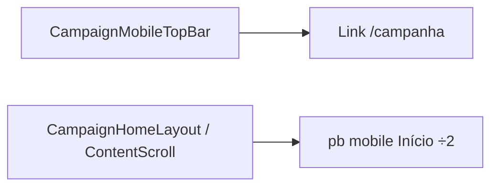

# Início mobile — gap busca↔fundo + header → home

Status: ready
Atualizado em: 2026-08-01
Issue: #203
Priority: P1
Model: composer-2.5
Impeccable: B — encaixe em `CampaignHomeLayout` + `CampaignMobileTopBar`
Appetite: ~0,5 dia eng; só CSS/layout + Link no título; sem migration / Consent
Responsável: —

## Design (Impeccable)

Âncoras: `PRODUCT.md` (Clarity under pressure; Feel the action) / `DESIGN.md` · tema `campaign`.

Na implementação (`work-issue`): craft compacto → critique → polish. Sem `harden`/`optimize` salvo a11y do link (foco visível).

Brief compacto:

- **Persona / contexto:** staff no celular no Início, polegar na thumb-zone; quer o dock colado ao fundo e um atalho óbvio de “voltar ao Início” de qualquer rota.
- **Job principal:** (1) menos ar morto abaixo da busca; (2) toque no título = `/campanha`.
- **Estratégia de cor:** Restrained.
- **Edit where you see:** não.
- **Anti-goals:** mexer no peek do bottom drawer (rotas não-Início); encolher o thumb-spacer acima do dock; redesenhar o header do wizard.

### Wireframe (texto)

```text
┌─ /campanha (mobile) ───────────────────────────────┐
│ [☰]  Jorge Solla          (bell)                   │
│      Campanha · Bahia  ← Link /campanha            │
│ … summary …                                        │
│                                                    │
│ [strip ações]                                      │
│ [busca……………………]                                    │
│ ← gap fundo ≈ ½ do atual (ex. pb-2 vs p-4)         │
└────────────────────────────────────────────────────┘
  Fora: drawer de ações NÃO monta no Início.
```

## Dados → decisão → apresentação

Dados: N/A — só chrome de navegação/espaçamento; nenhum KPI/série.

## Contexto

Pedido de produto (2026-08-01): no Início mobile, o espaço entre a barra de busca e a borda inferior da tela parece generoso demais; e o bloco central do header (“Jorge Solla” / “Campanha · Bahia”) não navega — em rotas profundas falta um tap-target de home sem abrir o sidebar.

Estado atual:

- Dock: `CampaignHomeLayout` (`home-dock` / `home-search`); Início **não** monta `CampaignQuickActionsDrawer` (`campaignQuickActionMount.ts`).
- Padding do scroll: `CampaignContentScroll` usa `p-4` no Início → ~1rem abaixo da busca (mais safe-area do device).
- Header: `CampaignMobileTopBar` modo app — título em `<span>`s, **sem** `Link` (linhas ~151–154).

## Objetivos

- No Início mobile (`md:hidden` scope), reduzir à **metade** o gap vertical entre a borda inferior da busca e o limite inferior da viewport (tipicamente o `padding-bottom` do scroller / safe-area consciente — medir no device antes de cravar o token).
- No header mobile modo app, tornar o bloco do título navegável para `/campanha` (mesmo quando já está no Início: noop ou refresh suave aceitável; preferir `Link` com aria-label “Início”).
- Desktop (`md+`) intocado no gap; título do top bar mobile-only já.
- Sem migration, Consent, server action.

## Decisões travadas

- **Só Início para o gap.** Padding/peek do drawer em outras rotas fica fora (B100/B105/B112). **Rejeitado:** alterar `--campaign-quick-actions-peek` “porque parece o mesmo”.
- **Metade do gap medida no eixo busca→fundo**, não do thumb-spacer acima do dock. **Rejeitado:** reduzir `home-thumb-spacer` / `mt-4` entre ações e busca como substituto.
- **Título = `Link` para `/campanha`**, hit area no bloco das duas linhas; sidebar trigger e “Voltar” (busca focada, B106) intactos. **Rejeitado:** logo separado; gesto double-tap; só a 1ª linha clicável.
- **i18n:** `aria-label` pt-BR (“Início” / “Ir para o início”); ids em inglês.

## Questões em aberto

- **Token exato do pb?** **Opções:** A) `pb-2` (8px) se hoje é `p-4` (16px) | B) `pb-[max(0.5rem,env(safe-area-inset-bottom))]` | C) metade do valor computado no browser. **Recomendação:** A se o gap for só o padding do scroller; B se safe-area já domina — validar num iPhone com home indicator _(assumido — validar no craft)_.

## Abordagem proposta



Componentes:

- **`CampaignMobileTopBar`**: wrap do bloco título em `Link href="/campanha"`; `rounded` + focus ring; não competir com SidebarTrigger.
- **`CampaignContentScroll` / home page shell**: classe condicional no Início (detectar via prop/`data-home` já existente se houver, senão passar `contentClassName` / variante home) para `pb` metade; manter `px-4`.
- **Migration:** Sem migration, sem collection, sem server action.

## Dependências

- Nenhuma dura. Soft: B65/B106/B111 (chrome Início já entregue).

## Não escopo

- Drawer peek / padding ⅓ em rotas não-Início → B112+.
- Header do wizard → B75/B96.
- Geo na busca → B117.
- Strip de ações → B99/B115.

## Rabbit holes

- **Unificar padding home × drawer com token global.** Explode B100+. **Mitigação:** só home.
- **`router.push` + preventDefault em vez de Link.** Piora a11y/middle-click. **Mitigação:** `Link`.

## Adiado com gatilho

- **Título desktop no sidebar como home.** Revisitar se produto pedir paridade `md+`.

## Referências

- GitHub Issue #203
- `CampaignHomeLayout.tsx`, `CampaignMobileTopBar.tsx`, `CampaignQuickActionsHost.tsx` / `CampaignContentScroll`
- `campaignQuickActionMount.ts` — Início sem drawer
- AGENTS.md — naming; PRODUCT.md — Clarity under pressure
