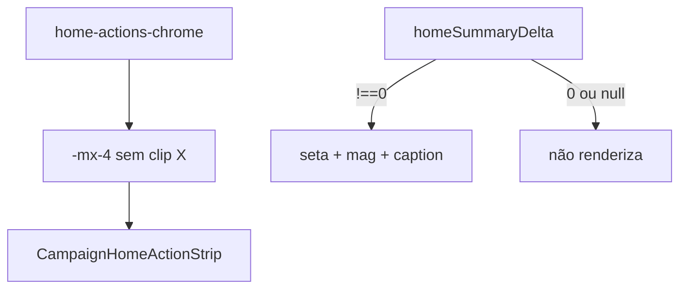

# Início — strip edge-to-edge de verdade + delta flat silencioso

Status: registrado
Atualizado em: 2026-08-01
Issue: #150
Priority: P1
Model: composer-2.5
Impeccable: B — `CampaignHomeLayout` / `CampaignHomeSummary`
Appetite: ~0,25–0,5d eng; CSS overflow + conditional delta; sem migration
Responsável: —

## Design (Impeccable)

Âncoras: `PRODUCT.md` / `DESIGN.md` · B57 delta · B99/B101 bleed · tema `campaign`.

Na implementação: craft compacto → critique → polish (iPhone estreito).

Brief:

- **Persona:** CG no Início mobile — strip deve nascer na borda; Δ só quando houve movimento.
- **Job principal:** (1) zero “trilho” branco nas laterais da strip; (2) sem traço/zero quando Δ = 0 nos últimos 7 dias.
- **Anti-goals:** mexer no drawer não-Início (**B109**); redesenhar o bloco de cobertura.

### Wireframe (texto)

```text
┌─ /campanha mobile ─────────────────────────────┐
│ Votos estimados                                │
│ 12.345                    ← sem “−” / “0” / —  │
│                         quando Δ flat          │
│ (se Δ≠0: ↑ 120  /  ↓ 80 + “nos últimos 7 dias”)│
│                                                │
│[●][●][●][●]… →→→        ← cola nas bordas L/R │
│ ▲ sem faixa branca lateral                     │
│ ┌ Buscar … ──────────────────────────────────┐ │
└────────────────────────────────────────────────┘
```

## Dados → decisão → apresentação

- **Vou apresentar dados?** Sim — o Δ 7d (**B57**) já existe; este item só muda a **forma no estado flat**.
- **Decisões desbloqueadas:** CG: “houve movimento na semana?” — se não, não ocupar o campo visual com ruído.
- **Forma escolhida:** seta + magnitude **somente** se `delta !== 0 && delta !== null`; flat e unavailable → **omitir** o chip inteiro (e a linha “nos últimos 7 dias”). **Rejeitado:** manter `MinusIcon` / “0” / em-dash como “sinal de estabilidade” (produto pediu vazio).
- **Profile:** escalar assinado já carregado em `homeSummaryDelta`.
- **Anti-goals de dado:** não inventar sparkline; não mudar a janela de 7 dias.

## Contexto

**Bleed (B99/B101):** `CampaignHomeLayout` já aplica `-mx-4 w-[calc(100%+2rem)]` em `home-actions`, mas o wrapper `HomeChromeRetractionShell` usa **`overflow-hidden`** no filho interno (necessário à animação de retraction). Isso **clipa** o bleed e deixa as faixas do `p-4` do `CampaignContentScroll` visíveis como “barras brancas” laterais. Diagnóstico preferido vs “margin na strip” ou `overflow: visible` solto no scroller.

**Delta (B57):** `HomeSummaryDelta` renderiza `MinusIcon` + magnitude `"0"` quando `delta === 0`, e `"—"` quando `null`. Produto (2026-08-01): no estado **sem mudança**, **não mostrar nada**.

## Objetivos

- Strip de ações no Início mobile **visualmente edge-to-edge** (primeiro/último círculo na borda ou com peek de pan, sem gutter branco do padding da página).
- Quando `homeSummaryDelta === 0` **ou** `null`: não renderizar o span do Δ nem o caption do período; manter só o total.
- Quando `delta > 0` / `< 0`: setas + magnitude + caption inalterados.
- Unit: pins em `campaignHomeSummaryDelta` / render helper; layout pin se existir spec de classes.
- Guardrails: sem migration; desktop `md:` pode manter gutter; pan B67 intacto.

## Decisões travadas

- **Corrigir o clip do bleed (overflow na shell de retraction), não remover `p-4` da página.** **Rejeitado:** `p-0` global; `overflow: visible` cego no `campaign-content-scroll` (risco de spill horizontal da página).
- **Técnica recomendada:** tirar `overflow-hidden` do wrapper interno **só** do slot `home-actions-chrome` (ou estrutura em duas camadas: clip só na animação de altura, não no eixo X do bleed); validar que a retraction `grid-rows` continua sem flash. **Rejeitado:** duplicar a strip fora do scroll.
- **Flat/unavailable = omitir UI do Δ** (não `Minus` / não `—` / não `0`). **Rejeitado:** traço como “estável”; sr-only com magnitude zero (desnecessário se não há chip).
- **Item novo (B111), continuação de B99/B57 — não reabrir Issues fechadas.**
- **i18n:** helpers existentes; copy do período só quando Δ ≠ 0.

## Questões em aberto

- **Unavailable (`null`, sem histórico 7d): também omite?** **Opções:** A) omitir igual ao flat | B) mostrar “—” só nesse caso. **Recomendação:** **A** — produto pediu vazio na ausência de mudança útil; buraco de histórico ≠ seta. _(assumido)_

## Abordagem proposta



Componentes:

- **`CampaignHomeLayout.tsx`**: ajustar `HomeChromeRetractionShell` / slot actions para permitir bleed horizontal.
- **`CampaignHomeSummary.tsx`**: early-return em `HomeSummaryDelta` quando flat/unavailable; condicionar caption.
- **`campaignHomeSummaryDelta.ts`**: opcional helper `shouldShowHomeSummaryDelta(delta)`; atualizar aria tests.
- **Migration:** Sem migration.

## Dependências

- Soft: B57 ✓, B99 ✓, B101 ✓. Nenhuma dura.

## Não escopo

- Drawer não-Início → **B109**.
- Wizard return → **B110**.
- Mudar fórmula do snapshot / janela 7d.

## Rabbit holes

- **Refatorar retraction para Framer/WAAPI.** Mitigação: CSS grid rows já funciona; só isolar overflow.
- **Recalcular Δ no client.** Mitigação: só apresentação.

## Adiado com gatilho

- **Caption “sem variação” em tooltip no total.** Revisitar se acessibilidade pedir explicação sem chip visível.

## Referências

- GitHub Issue #150 (spec + frontmatter `id/depends/priority/model`)
- `src/components/campaign/dashboard/CampaignHomeLayout.tsx` — `-mx-4` + `overflow-hidden`
- `src/components/campaign/dashboard/CampaignHomeSummary.tsx` — `MinusIcon` / `—`
- `src/lib/campaignHomeSummaryDelta.ts`
- `docs/plans/strip-acoes-edge-gap-inicio.md` (B99), `delta-7-dias-estimativa-inicio.md` (B57)
- AGENTS.md — naming
- `PRODUCT.md` / `DESIGN.md`
