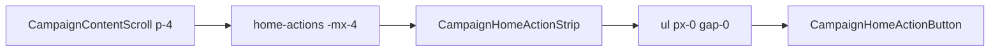

# Início — strip sem faixa branca lateral (botões na borda)

Status: registrado
Atualizado em: 2026-08-01
Issue: #198
Priority: P1
Model: kimi-k3-low
Impeccable: B — `CampaignHomeActionStrip` (encaixe no Início mobile)
Appetite: ~0,25d eng; 1 classe CSS + pin unit; sem migration
Responsável: —

## Design (Impeccable)

Âncoras: `PRODUCT.md` / `DESIGN.md` · tema `data-theme='campaign'` · precedentes B99/B101/B111.

Na implementação (`work-issue`): craft compacto → critique (iPhone estreito) → polish.

Brief:

- **Persona / contexto:** CG/assessor no celular — strip de ações no Início; polegar pan horizontal.
- **Job principal:** ações **nascem / entram da borda** do aparelho, sem “trilho” branco lateral que faz os botões aparecerem flutuando no meio.
- **Estratégia de cor:** Restrained.
- **Edit where you see:** não — só layout da strip.
- **Anti-goals:** mexer no `p-4` global do `CampaignContentScroll`; redesenhar círculos/labels; reabrir gap B72/B74; drawer não-Início salvo se o mesmo `ul` for compartilhado e o pin cobrir os dois.

### Wireframe (texto)

```text
┌─ /campanha mobile (Idle) ──────────────────────┐
│ Votos estimados …                              │
│                                                │
│[●Ação][●][●][●]… →→→                           │
│▲ sem faixa branca; 1º círculo na/na saída da   │
│  borda L (pan revela o resto à R)              │
│ ┌ Buscar na campanha ───────────────────────┐  │
└────────────────────────────────────────────────┘
  Fora do frame: top bar / sidebar Sheet.
```

## Dados → decisão → apresentação

Dados: N/A — só layout CSS da strip; sem KPI/série/mapa neste item.

## Contexto

Cadeia já entregue:

| Item | O que fez |
| ---- | --------- |
| **B99 ✓** | `-mx-4 w-[calc(100%+2rem)]` no slot `home-actions` (compensa `p-4` do scroll) |
| **B101 ✓** | `gap-0` + **`px-4` no `<ul>`** (inset interno deliberado “pra não colar na curved edge”) + pin unit |
| **B111 ✓** | `allowHorizontalBleed` → `overflow-y-hidden` (não clipar o bleed no eixo X) |

Feedback de produto (2026-08-01): **ainda há faixas brancas** laterais; os botões “aparecem do nada” em vez de **entrar da borda** do celular. Diagnóstico: o bleed do layout já leva o scroller à borda; o **`px-4` remanescente no `<ul>`** de `CampaignHomeActionStrip` recria 16 px de fundo da página de cada lado — exatamente o trilho branco. O pin em `campaignHomeActionButton.unit.spec.tsx` ainda exige `px-4`.

## Objetivos

- No mobile (`< md`), o primeiro (e, no scroll máximo, o último) controle da strip **não** fica atrás de um gutter branco de página: `padding-inline` do `<ul>` / scroller = `0` (ou só `env(safe-area-inset-*)` se device notch lateral reclamar no critique).
- Manter bleed B99/B111 (`-mx-4` + `overflow-y-hidden`) intacto.
- Atualizar pin unit: deixar de exigir `px-4`; exigir `px-0` (ou ausência de `px-4`) no mobile.
- `md+`: inalterado visualmente (já `md:px-0` no ul; gutter da página permanece via `md:mx-0` no slot).
- Guardrails: sem migration, sem Consent, sem server action; pan B67 e hit-area B101 (padding no botão se existir) não regredir.

## Decisões travadas

- **Item novo B115 — continuação pós-B111; não reabrir #107/#128/#150.** **Rejeitado:** comentar nas Issues fechadas pedindo reopen.
- **Causa alvo = `px-4` do `<ul>` (e só isso, salvo descoberta no craft de outro inset).** **Rejeitado:** zerar `p-4` do `CampaignContentScroll`; aumentar o `-mx-*` “no escuro”; `position: fixed` na strip.
- **Pedido explícito: botões na borda, não inset “seguro” de 16 px.** **Rejeitado:** manter `px-4` / `px-2` como “conforto de curved edge” (B101) — produto reverteu essa prioridade. Safe-area mínimo só se critique em device real exigir.
- **Modelo `kimi-k3-low`** por pedido do usuário nesta sessão (exec mecânica com plano fechado). **Rejeitado:** Composer só por default da tabela — escolha do usuário vence (model-selection).
- **i18n / naming:** sem strings novas; identificadores existentes.

## Questões em aberto

- **Aplicar o mesmo zero-inset no `CampaignQuickActionsDrawer`?** **Opções:** A) só Início (slot `home-actions`) | B) no componente compartilhado `CampaignHomeActionStrip` (afeta drawer se reusar o mesmo strip). **Recomendação:** **B** se o drawer monta o mesmo componente — um pin, um lugar; se o drawer tiver gutter próprio (`px-4` no `#quickActionContext`), não zerar o drawer inteiro neste item (B109). _(assumido — validar no craft)_

## Abordagem proposta



Componentes:

- **`CampaignHomeActionStrip.tsx`**: no `<ul>`, trocar `px-4 … md:px-0` → `px-0` (ou `px-0` + safe-area se critique pedir). Não tocar no scroller overflow/pan.
- **`campaignHomeActionButton.unit.spec.tsx`**: atualizar expectativa de classes do `<ul>` (`px-0` / sem `px-4`).
- **`CampaignHomeLayout.tsx`**: só se o craft provar que o bleed ainda é clipado — senão **não editar** (já pinado em B111).
- **Migration:** Sem migration, sem collection, sem server action.

## Dependências

- Soft: B99 ✓, B101 ✓, B111 ✓ (código já em `main`). Nenhuma dura.

## Não escopo

- Gap entre botões / largura do círculo → B72/B74 (fechados).
- Drawer geometry / peek → B100/B109/B112.
- Delta flat do summary → B111 (já entregue).
- Remover padding da página / redesign do dock.

## Rabbit holes

- **“Aproveitar e reescrever o pan / snap / fade edges.”** Mitigação: só padding-inline do ul + pin.
- **`p-0` no scrollport ou no `home-dock`.** Mitigação: busca e summary precisam do gutter; bleed já cobre a strip.
- **Safe-area + `max()` em todo o app.** Mitigação: só se critique no device com notch lateral.

## Adiado com gatilho

- **Fade edges nas pontas do pan.** Revisitar se, com `px-0`, o corte do último círculo mentir “acabou” (mesmo adiamento de B58/B101).

## Referências

- GitHub Issue #198 (spec + frontmatter `id/depends/serializes/priority/model`)
- `src/components/campaign/dashboard/CampaignHomeActionStrip.tsx` — `ul` com `px-4`
- `src/components/campaign/dashboard/CampaignHomeLayout.tsx` — bleed `-mx-4` + `allowHorizontalBleed`
- `tests/unit/campaignHomeActionButton.unit.spec.tsx` — pin `px-4`
- `docs/plans/strip-acoes-bleed-hit-area.md` (B101), `inicio-strip-bleed-delta-flat.md` (B111)
- AGENTS.md — naming
- `PRODUCT.md` / `DESIGN.md` — Field Desk / mobile thumb zone
