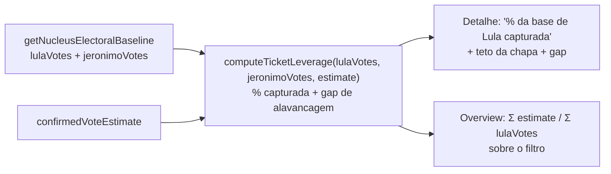

# Insight: alavancagem da chapa (Lula/Jerônimo)

Status: rascunho
Atualizado em: 2026-07-17
Item do roadmap: [docs/roadmap.md](../roadmap.md) (seção "Campanha → Próximos ciclos")
Responsável: —

## Contexto

Solla apoia a chapa principal do PT (Lula para presidente, Jerônimo para governador, ambos nº 13). Os votos que Lula e Jerônimo receberam em 2022 numa geografia são o **teto natural do PT** no local — um piso de simpatia partidária que a candidatura de Solla pode capturar como dobradinha. Com o baseline TSE 2022 (ver [baseline-eleitoral-tse.md](baseline-eleitoral-tse.md)), podemos medir quanto da base da chapa a estimativa do núcleo já captura e quanto ainda falta — meta implícita de alavancagem.

## Objetivos

- Computar `lulaVotes` (presidente, nº 13, 1º e 2º turno) e `jeronimoVotes` (governador, nº 13, 1º e 2º turno) por geografia do núcleo.
- Calcular `ticketLeverage = confirmedVoteEstimate / lulaVotes` (e `/ jeronimoVotes`) — % da base da chapa capturada.
- Exibir no detalhe do núcleo: "% da base de Lula capturada", "teto da chapa: X votos de Lula / Y de Jerônimo", e gap `lulaVotes − confirmedVoteEstimate` como potencial de alavancagem.
- No overview da lista: soma de `lulaVotes` e `jeronimoVotes` sobre o conjunto filtrado, e `Σ confirmedVoteEstimate / Σ lulaVotes`.

## Decisões travadas

- **Leitura derivada** — sem escrita, sem `Consent`, sem migration.
- **Reusa** `getNucleusElectoralBaseline` (já expõe `lulaVotes1t/2t`, `jeronimoVotes1t/2t` no view model).
- **Turno decisivo** como referência principal (presidente 2º turno; governador 2º turno), com 1º turno como secundário.

## Questões em aberto

- Usar Lula ou Jerônimo como teto principal? Recomendação: ambos, com Lula (presidente) como teto mais alto e Jerônimo (governador) como referência estadual.
- `lideranca` vê? Recomendação: sim.

## Abordagem proposta

- **Helper** `src/lib/electionInsights.ts`: `computeTicketLeverage(lulaVotes, jeronimoVotes, confirmedVoteEstimate)` → `{ lulaLeverage, jeronimoLeverage, lulaGap, jeronimoGap, status }`.
- **Componente** `src/components/campaign/NucleusTicketLeverage.tsx` (server). Overview: bloco agregado no `NucleusListOverview`.
- **Teste int** cenários: `lulaVotes=0`, `confirmedVoteEstimate=null`, `estimate > lulaVotes` (superou a chapa).

## Arquivos a criar/alterar

- Criar: `src/components/campaign/NucleusTicketLeverage.tsx`.
- Alterar: `src/lib/electionInsights.ts`, `nucleos/[slug]/page.tsx` + `nucleusDetailPageData.ts`, overview da lista.

## Dependências

- [baseline-eleitoral-tse.md](baseline-eleitoral-tse.md) (votos de presidente/governador no baseline).

## Não escopo

- Dobradinha efetiva (plano [insight-dobradinha-2026.md](insight-dobradinha-2026.md)) — aqui só medimos alavancagem contra a chapa, não sugerimos parceiros.

## Referências

- [baseline-eleitoral-tse.md](baseline-eleitoral-tse.md)
- AGENTS.md
